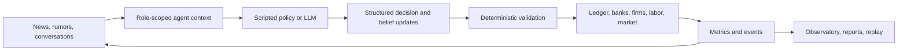

# Agent Economy

[](https://github.com/alinojoumi8/agent-economy/actions/workflows/ci.yml)

**A living miniature economy for studying how information changes beliefs,
decisions, institutions, and markets.**

Agent Economy runs a US-style world populated by persona-driven citizens,
founders, bankers, journalists, public officials, and an economic Oracle. Agents
can work, buy goods, borrow, lend, trade, publish, gossip, form companies, vote,
become ill, and panic. LLMs propose decisions; a deterministic engine validates
and settles every consequence through an exactly balanced double-entry ledger.

> Agent Economy is a research simulator, not a real-economy forecast or
> financial advice. The default offline profile is free and deterministic.

## Legal-Political Economy v2

The flagship `runs/v2.yaml` world makes institutions part of the economy rather
than background flavor:

- Executed contracts compile into enforceable obligations; claims, evidence,
  settlements, judgments, injunctions, cap tables, and ledgers share one action path.
- Startups move through formation, typed VC rounds, IP, disclosures, trading,
  merger review, remedies, litigation, and exit.
- Claims and articles spread through recorded asymmetric exposures before they
  can affect beliefs, trades, investments, or votes.
- A two-party legislature, elections, lobbying, agencies, and typed policy rules
  create endogenous economic-political feedback.
- 1,000 agents inhabit Northstar, Ironvale, and Suncoast. One hundred strategic
  agents may use an LLM; 900 peripheral agents remain deterministic and cheap.
- Multicurrency ledgers, inventory-backed FX books, cross-border contracts,
  trade, migration, and regional specialization remain exactly replayable.
- Maintained profiles run engine semantics 7: defaults recognize only net bank
  losses after collateral, retirees can draw their own savings, arrivals receive
  governed persona enrichment, and qualified trade and migration opportunities
  become autonomous actions. Stored semantics 1–6 retain their original rules.
- The observatory adds a living economic map, legal/political/startup surfaces,
  causal traces, God-mode actions through the normal validator, and static replay export.
- Pinned dataset manifests and paired-seed scenario packs support model-conditional
  counterfactual research without presenting the simulation as a forecast.

```powershell
# Free 1,000-agent flagship run
python run.py --config runs/v2.yaml --ticks 30

# Verify pinned data without network access
python run.py --verify-datasets config/data-manifest.yaml

# Explicit networked refresh (never runs implicitly)
python run.py --refresh-datasets config/data-manifest.yaml

# Paired policy lab; defaults to 20 seeds
python run.py --counterfactual scenarios/ai-competition-merger.yaml

# Self-contained replay artifact
python run.py --export-static RUN_ID --output static_exports/demo.html
```

See [the v2 architecture and research guide](docs/v2-guide.md) for schemas,
legal-model limits, provenance, scenario authoring, replay guarantees, and the
validity boundary.

## Why this project exists

Many multi-agent demos make interesting text but cannot explain where money
came from, reproduce a run, or separate a model's belief from a scripted engine
effect. Agent Economy is built around the opposite priorities:

- **Mechanically valid**: every dollar is conserved; markets, loans, payroll,
  taxes, insurance, and failures use deterministic rules.
- **Causally inspectable**: information exposure, belief change, proposed
  decision, validated action, and economic effect are persisted separately.
- **Reproducible**: seeded offline runs produce stable evidence; exact replay
  rebuilds a source run without contacting a provider.
- **Observable**: a local React dashboard shows the economy, agents, institutions,
  news, conversations, forecasts, costs, shocks, and acceptance gates live.
- **Provider-aware**: real-model profiles preflight routes, meter cost, survive
  rate limits, and pause visibly instead of silently changing models.

## What can you use it for?

| Use case | Example question |
|---|---|
| Misinformation research | Can a false bank rumor reduce trust and cause deposit flight? |
| Monetary policy | How does a rate shock move loan quotes, hiring, output, and markets? |
| Agent comparison | Do different model/provider mixes behave differently under identical mechanics? |
| Forecast calibration | Is the read-only Oracle well calibrated after predictions resolve? |
| Economics and AI education | How do beliefs become actions without violating accounting constraints? |
| Multi-agent systems engineering | Can a long, costly run be resumed, replayed, audited, and budgeted? |

## How it works



One tick is one simulated day. Nightly mechanics settle obligations and shocks;
agents then perceive, decide, trade, publish, converse, update memory, and
finalize a reconciled day. Maintained semantics-7 profiles preserve the
research-valid information boundary while adding net loan charge-offs,
retirement liquidity, deterministic arrivals, governed arrival personas, and
autonomous regional trade/migration. Markerless and stored semantics 1–6 runs
are never silently upgraded.

## Five-minute offline start

Requirements: Python 3.11 or 3.12. Node.js is not needed unless you change the
dashboard.

```powershell
git clone https://github.com/alinojoumi8/agent-economy.git
Set-Location agent-economy
python -m venv .venv
.\.venv\Scripts\Activate.ps1
python -m pip install --require-hashes -r requirements.lock

# Free core-engine smoke world, deterministic and provider-free
python run.py --config runs/base.yaml

# Free full Observatory world: regions, contracts, legal matters, and politics
python run.py --config runs/v2-institutional-rehearsal.yaml
```

Open <http://127.0.0.1:8000>. The world starts paused; press **Run** or **Step**.
Use the institutional rehearsal when validating the Living economy map or the
legal and political panels; the base profile is intentionally a smaller core
engine smoke world.

To play one citizen through the same validator and ledger used by autonomous
agents, start the provider-free participant sandbox instead:

```powershell
python run.py --config runs/participant.yaml
```

Open a living citizen in the observatory, choose **Take control**, queue one
action, and press **Step**. The citizen inspector retains a paginated audit of
queued, executed, rejected, and cancelled commands. Participant runs are clearly
marked and cannot be used as acceptance evidence.

macOS/Linux users can activate with `source .venv/bin/activate`. A headless smoke
run that writes a standalone report is:

```bash
python run.py --config runs/base.yaml --ticks 3
```

> **Important:** `python run.py` without `--config` selects the live production
> profile. Use the explicit `runs/base.yaml` command for offline work.

## A first experiment

Run five treatment seeds and five same-seed controls for the rumor scenario:

```powershell
python run.py --experiment runs/experiments/rumor_vs_control.yaml
```

Artifacts are written to `reports/out/` in JSON, Markdown, and HTML. Treatment
and control worlds are isolated and every arm is reconciled.

The rumor engine only adds an observation. It does **not** lower trust or move
money. The causal path must be produced by agents:

```text
exposure -> belief update -> decision -> deposit transfer -> reserve pressure
```

The evaluator measures trust relative to each exposed agent's real pre-rumor
baseline and fails closed when history is missing.

## What is in the observatory?

- **Run controls**: run, pause, step, speed, safe stop/report, phase-aware resume.
- **Macro view**: daily and rolling final-goods output, labor income, CPI,
  correctly windowed inflation, unemployment, money, inequality, and markets.
- **Agent inspector**: persona, accounts, loans, holdings, memories, bounded
  beliefs, provenance, prompts, model responses, and decision audit.
- **Institutions**: bank balance sheets, firms, government, VC, healthcare,
  newsroom, and exchange.
- **Information flow**: articles, conversations, shocks, and high-importance
  events.
- **Oracle**: evidence-bounded probability forecasts, automatic resolution,
  Brier scores, and run/pooled calibration.
- **Acceptance**: completed gates, actual/projected spend, Oracle sample count,
  shock traces, and rumor-window evidence.
- **Participant sandbox**: take control of one citizen, queue one validated
  action per day, and inspect the durable execution result.
- **Replay and export**: tick-by-tick historical viewer plus standalone reports.

## Run profiles

| Profile | Agents/purpose | Provider policy |
|---|---|---|
| `runs/base.yaml` | Fast local world | Scripted, free, deterministic |
| `runs/participant.yaml` | One-citizen participant sandbox | Scripted, free, step-only |
| `runs/v2-live-minimax.yaml` | Default 1,000-agent live world | MiniMax M3 for the 100-agent core/shared services; deterministic periphery; $150 cap |
| `runs/production.yaml` | Approx. 100-agent live world | MiniMax M3 for every model-eligible call |
| `runs/v2-spec-closure-rehearsal.yaml` | Five-tick semantics-7 closure fixture | Scripted, free, deterministic |
| `runs/v2-spec-closure-live.yaml` | Five-tick bounded semantics-7 pilot | MiniMax persona/strategic roles; scripted background; $1 cap |
| `runs/r21-real-us.yaml` | SCF/SUSB calibrated fictional genesis | Scripted, free, deterministic |
| `runs/acceptance/rehearsal.yaml` | Full acceptance mechanics | Scripted, free |
| `runs/acceptance/pilot.yaml` | 30-day rumor pilot | Live, explicit approval, $25 cap |
| `runs/acceptance/production.yaml` | 365-day release evidence | Live, explicit approval, $200 efficiency gate |

Production never silently falls back when a key, route, or provider fails.
Provider configs select `prompt_cache_mode` from `off`,
`provider_automatic`, `openai_key`, or `anthropic_ephemeral`; the legacy
`prompt_cache_key` option remains an alias for OpenAI-compatible keyed caching.

## Optional real-model setup

```powershell
Copy-Item .env.example .env
# Add MINIMAX_API_KEY locally; never commit .env.

python run.py --preflight
python run.py --preflight-live --approve-live-inference
python run.py --serve --approve-live-inference
```

The preflight commands validate configuration and provider model catalogs; they
do not request chat completions. Every live run requires the explicit
`--approve-live-inference` flag. Read the
[operator runbook](docs/operator-runbook.md) before starting it.

## Resume, replay, and reports

```powershell
python run.py --config runs/base.yaml --resume <RUN_ID>
python run.py --replay <RUN_ID>
python run.py --report <RUN_ID>
```

- **Resume** restores the stored phase cursor and reuses completed calls.
- **Replay** opens the recorded source read-only, creates a new database, uses
  stored LLM responses only, reconstructs persisted acceptance-checkpoint
  effects, and prints canonical table-hash equality proof.
- **Report** regenerates HTML/Markdown from a stored database.

Each run is a portable SQLite file under `data/runs/`. It contains the economic
state and the scientific audit trail: events, beliefs, memories, conversations,
predictions, metrics, shocks, ledger entries, and model-call evidence.

CI also restores the sanitized portable fixture for live run `fd0adc5dc1` and
replays its ten recorded ticks with networking disabled. The source database is
stored as semantics 5—not semantics 6—so the fixture preserves that historical
contract while canonicalizing physical LLM row IDs through logical call content.
Fixture format v2 strips raw provider envelopes, retains only the public text
and cached-token counter, converts repository paths to `repo://`, and restores
the source's recorded dataset/calibration/scenario rows rather than substituting
today's mutable manifests. Its artifact SHA-256 is
`af57eed59e47e9057d7645a65e1bb6f2b579a6a63a377fd6301f33af3955e2d7`; the
normalized reconstructed replay hash is
`2efcabedba51e4bff3ccfd36393db20d13b41cd5d3e9a3772df42015db4f9170`.

## Project structure

```text
run.py             CLI and local application entry point
runs/              offline, production, acceptance, and experiment profiles
engine/            deterministic ledger and economic mechanics
agents/            personas, role contexts, scheduling, memory, decisions
world/             genesis, phase loop, shocks, metrics, information layer
llm/               adapters, routing, readiness, retry, metering, governor
oracle/            evidence tools, prediction, resolution, calibration
experiments/       treatment/control harness
server/            FastAPI, WebSocket, replay API, committed dashboard bundle
hosted/            optional R22 catalog/auth/RLS, supervisor, artifacts, API, CLI
deploy/            Compose, Caddy, Prometheus, PostgreSQL role initialization
dashboard/         React/Vite/Tailwind/Recharts source
reports/           run reports and acceptance receipts
tests/             unit, invariant, integration, property, golden, acceptance
docs/              maintained user/operator/research/developer handbook
```

## Optional hosted multi-user mode

R22 adds a separately enabled hosted service while preserving the zero-ops
local workflow above. It provides invite-only tenants and roles, authenticated
shared-run observation/control, a PostgreSQL control plane with forced row-level
security, one deterministic SQLite v11 world per run, immutable local or
S3-compatible snapshots, and a hosted dashboard. The reference deployment in
`deploy/compose.yaml` includes PostgreSQL, MinIO, migrations, the application,
Caddy, and Prometheus. Start with
[configuration](docs/configuration.md), the
[operator runbook](docs/operator-runbook.md), and
[security policy](SECURITY.md); do not expose the local `run.py --serve` app.

## Documentation

| If you want to... | Read |
|---|---|
| Install and run the app | [Getting started](docs/getting-started.md) |
| Understand the research model and metrics | [Research guide](docs/research-guide.md) |
| Understand components and data flow | [Architecture](docs/architecture.md) |
| Customize a run or provider | [Configuration](docs/configuration.md) |
| Automate the local server | [API reference](docs/api-reference.md) |
| Operate, pause, resume, or accept a run | [Operator runbook](docs/operator-runbook.md) |
| Diagnose a failure | [Troubleshooting](docs/troubleshooting.md) |
| Develop or contribute | [Development](docs/development.md) and [Contributing](CONTRIBUTING.md) |
| Inspect product commitments | [PRD](PRD.md), [technical spec](TECH-SPEC.md), [status](docs/implementation-status.md) |

The [handbook index](docs/README.md) links all maintained and historical evidence
documents.

## Current status and limits

All PRD-v1 P0/P1 feature surfaces and the R18 participant, R19 1,000-agent,
R20 multi-region, R21 real-U.S. calibration, and R22 hosted multi-user code
surfaces are implemented. The semantics-7 code closure adds
the remaining bank, retirement, arrival/persona, autonomous trade/migration,
portable replay, and cache-policy contracts without changing schema v11.

The semantics-7 closure is locally verified. The free run `5a0d40d773` exercised
every target effect through tick 5 at zero spend and replayed exactly with hash
`fa190b0d…e8cffc34`. The live run `b4832032ba` completed five semantics-7 ticks
with 21 MiniMax plus 36 scripted calls, all 42 proposals accepted, `$0.01121124`
spend under the `$1` cap, zero provider/provenance/privacy defects, balanced
currencies, and exact replay hash `ec2b2409…c399ae2`. The focused gate passed 86
tests before the final hardening pass, a 93-test integrated adversarial gate
passed afterward, and the semantics-7 closure suite passed 280 in 165.73
seconds. The post-merge compatibility/replay cleanup gate passes 303 tests in
178.22 seconds.
Dashboard tests, notice validation, audit, two byte-identical
production builds, dependency audit, secret scan, and local hygiene are green.
PR #15 merged to `main` as `255555c2b24530c0bd39aed2f501277a468adc0a`
after its exact-head dashboard plus Ubuntu/Windows Python 3.11/3.12 matrix
passed. Post-merge CI run `29368193807` repeated all five jobs successfully.
Tagging and publication remain separate release decisions.

The 30-day rumor gate, Oracle latency/calibration campaign, and
365-day/$200 acceptance run remain separate and are not replaced by this pilot.

R21 is opt-in through `runs/r21-real-us.yaml`. Its pinned 2022 Federal Reserve
SCF fixture supplies income, liquid-financial-asset, and total-net-worth draws;
`LIQ` funds modeled deposits while `NETWORTH` is retained as an engine-owned
off-ledger calibration baseline. The pinned 2022 Census SUSB fixture supplies
employer-firm headcounts, and exact replay uses recorded targets without
reopening the manifest. Simulated identities remain fictional.

The recorded five-tick R21 gate `24d8dc242e` sampled 70 households and 12
realized firms, retired no under-age SCF category-3 respondent, had zero
reconciliation failures, and replayed offline as
`replay-24d8dc242e-a9ed4f2910` with identical hash
`95b4b8bd…0cee369a`. The integrated Python gate passes 328 tests. R21 merged
through PR #18 at `21bbf30051e3de8c9b5b7a50e48a0e342d94676a` after all five
PR jobs passed. Post-merge main run `29403186283` repeated all five jobs
successfully.

Local mode remains intentionally single-operator and unauthenticated: bind it
to `127.0.0.1` and never expose it directly. R22's optional hosted path adds
authentication, tenant/role isolation, CSRF/throttling/audit, a lease-based
single-writer supervisor, durable snapshots, and deployment assets without
changing engine semantics or schema. Exact local Compose evidence at
`53081f2` passed TLS readiness, tenant isolation, immutable S3 snapshots and
cold restore, atomic database-password rotation, Prometheus scraping, and a
200-request load probe with 80 enforced cross-tenant denials and zero failures.
PR #19 head `1cf1d0a` then passed the six-job dashboard, hosted PostgreSQL/S3,
and Ubuntu/Windows Python 3.11/3.12 matrix in run `29409250171`. No public
production deployment is claimed.

See [SECURITY.md](SECURITY.md) for data/credential boundaries and
[docs/implementation-status.md](docs/implementation-status.md) for the evidence
matrix.

## Licensing and attribution

The project source is licensed under Apache-2.0. Dataset-specific provenance,
terms, and citation guidance are recorded in [NOTICE](NOTICE) and the pinned
[data manifest](config/data-manifest.yaml). The dashboard's complete generated
dependency notices are available in
[dashboard/public/THIRD_PARTY_NOTICES.txt](dashboard/public/THIRD_PARTY_NOTICES.txt)
and are shipped with the server bundle at
[server/static/THIRD_PARTY_NOTICES.txt](server/static/THIRD_PARTY_NOTICES.txt).
Persona-generator provenance and the distinction between upstream inspiration
and locally authored code are documented in
[agents/personas/ATTRIBUTION.md](agents/personas/ATTRIBUTION.md).

## Development

Run the complete hash-locked local gate in
[docs/development.md](docs/development.md#test-layers). It covers compilation,
pinned datasets, Python/dashboard tests, dependency and notice audits, the
production bundle, and diff hygiene.

Dashboard builds write to `server/static/`; that bundle is committed so Python
users receive the full UI without Node.js. Contributions should preserve the
ledger, information-boundary, belief-provenance, determinism, and replay
invariants described in [CONTRIBUTING.md](CONTRIBUTING.md).
