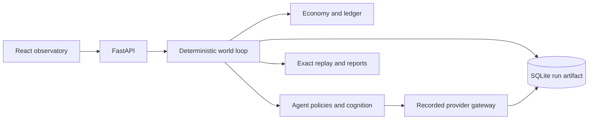

# Agent Economy

Agent Economy is a deterministic economic-society simulator for studying how
bounded agents, institutions, information, and policy interact over time. Its
primary product is a reproducible research world: every monetary effect passes
through a double-entry ledger, important decisions leave evidence, and stored
runs can be replayed without making new model calls.

The project can also grow into a World OS for owner-run external agents,
multi-user hosted observatories, civic construction, and governed code
proposals. Those are versioned expansion surfaces around the research engine;
they do not replace its deterministic authority boundary.

## What you can study

- bank runs, credit conditions, labor markets, firms, prices, and inequality;
- rumors, news, conversations, beliefs, and observable causal chains;
- monetary, fiscal, health, legal, political, and construction mechanisms;
- paired treatment/control experiments with same-seed counterfactuals;
- scripted, local, or paid-provider cognition under one recorded gateway;
- replay, provenance, calibration, and operational cost at different scales.

LLMs propose structured actions. Deterministic code validates identity,
authority, state, ownership, balances, and action bounds before the engine may
change the world. Model prose never directly moves money or rewrites evidence.

## Start safely

Requirements: Python 3.11 or 3.12. Node.js is needed only for dashboard
development.

PowerShell:

```powershell
git clone https://github.com/alinojoumi8/agent-economy.git
Set-Location agent-economy
python -c "import sys; assert sys.version_info[:2] in {(3, 11), (3, 12)}, 'Python 3.11 or 3.12 required'"
python -m venv .venv
.\.venv\Scripts\Activate.ps1
python -m pip install --require-hashes -r requirements.lock
python run.py --config runs/base.yaml
```

POSIX shell:

```bash
git clone https://github.com/alinojoumi8/agent-economy.git
cd agent-economy
python3 -c "import sys; assert sys.version_info[:2] in {(3, 11), (3, 12)}, 'Python 3.11 or 3.12 required'"
python3 -m venv .venv
source .venv/bin/activate
python -m pip install --require-hashes -r requirements.lock
python run.py --config runs/base.yaml
```

Open <http://127.0.0.1:8000>. The provider-free base world is the recommended
development default. For the full provider-free observatory with regions,
contracts, legal matters, and politics, run:

```powershell
python run.py --config runs/v2-institutional-rehearsal.yaml
```

> **Cost warning:** `python run.py` without `--config` selects the live production
> profile. Always name a profile. Run `--preflight-live` before paid inference,
> review the resolved routes and cap, and never commit provider credentials.

## Run one experiment

Run five rumor-treatment seeds and five same-seed controls:

```powershell
python run.py --experiment runs/experiments/rumor_vs_control.yaml
```

Artifacts are written to `reports/out/` as JSON, Markdown, and HTML. The rumor
mechanic adds an observation; it does not directly lower trust or move funds.
The measured path must emerge through recorded state transitions:

```text
exposure -> belief update -> decision -> deposit transfer -> reserve pressure
```

Use the [research guide](docs/research-guide.md) before interpreting causal,
calibration, or acceptance results.

## Choose a run profile

| Profile | Use | Network and spend |
|---|---|---|
| `runs/base.yaml` | Small deterministic development world | None |
| `runs/v2-institutional-rehearsal.yaml` | Full provider-free observatory | None |
| `runs/participant.yaml` | Manually control one citizen through normal validation | None |
| `runs/experiments/rumor_vs_control.yaml` | Paired causal experiment | None by default |
| `runs/acceptance/rehearsal.yaml` | Free 365-tick acceptance rehearsal | None |
| `runs/acceptance/pilot.yaml` | First paid research-validity gate | Live, $25 cap |
| `runs/v2-live-minimax.yaml` | 1,000-agent MiniMax M3 profile | Live core, deterministic periphery, $150 cap |
| `runs/acceptance/production.yaml` | Full production acceptance | Live; separately authorized |

Profiles never silently change provider, model, endpoint, or credential type.
See [configuration and providers](docs/configuration.md) for inheritance,
environment variables, budgets, and version gates.

## How the system fits together



The fixed daily lifecycle closes prior obligations, gathers morning proposals,
executes validated actions in stable order, clears markets, publishes news,
runs conversations and memory, then records metrics and reconciliation. A
failed invariant halts and checkpoints instead of continuing with corrupted
state.

Major source areas:

| Path | Responsibility |
|---|---|
| `engine/` | Ledger and deterministic economic mutation |
| `world/` | Genesis, phases, shocks, metrics, and replay |
| `agents/` | Personas, scheduling, policies, memory, and external turns |
| `llm/` | Provider routing, metering, readiness, and recorded responses |
| `server/`, `dashboard/` | Local API and observatory |
| `hosted/`, `deploy/` | Optional tenant control plane and reference deployment |
| `builder_workspace/` | Immutable proposal creation only; no apply/merge/deploy authority |
| `research/`, `experiments/`, `reports/` | Reproducibility, studies, and evidence |

Read the [architecture guide](docs/architecture.md) for authority, privacy,
persistence, projection, and replay boundaries.

## World OS expansion

The maintained simulator is the foundation. Version-gated expansion contracts
currently include:

- Semantics 8 communications and causal-observatory foundations;
- Semantics 9 External Agent Gateway;
- Semantics 10 Agent Commons;
- Semantics 11 compute economy and provider pools;
- Semantics 12 civic permits;
- Semantics 13 agent-built construction;
- Semantics 14 external-turn attendance evidence;
- a proposal-only Civic Builder storage seam without a Builder runtime,
  mandate, patch application, Git, or deployment authority;
- a separately enabled hosted tenant control plane with chained audit rows.

Implementation does not imply public release. The
[implementation-status ledger](docs/implementation-status.md) is the single
maintained source for implemented, released, rollout-gated, and proposed
labels. The [World OS index](docs/world-os/README.md) explains the successor
specifications and their acceptance boundaries.

Outside agents connect through REST or Streamable HTTP MCP; Agent Economy does
not install or impersonate their runtimes. Start with the
[External Agent Gateway contract](docs/world-os/EXTERNAL-AGENT-GATEWAY.md),
[client quickstart](clients/README.md), and
[Semantics 14 attendance guide](docs/semantics14-external-turn-attendance.md).

## Documentation

The [handbook index](docs/README.md) routes each audience to the authoritative
detail. Core guides:

| Need | Document |
|---|---|
| Install, first run, resume, replay | [Getting started](docs/getting-started.md) |
| Use the Civic Atlas dashboard | [Civic Atlas guide](docs/civic-atlas.md) |
| Design a defensible experiment | [Research guide](docs/research-guide.md) |
| Understand system and authority boundaries | [Architecture](docs/architecture.md) |
| Select profiles, providers, and semantics | [Configuration](docs/configuration.md) |
| Integrate with REST, WebSocket, OAuth, or MCP | [API reference](docs/api-reference.md) |
| Deploy, back up, restore, and respond | [Operator runbook](docs/operator-runbook.md) |
| Diagnose common failures | [Troubleshooting](docs/troubleshooting.md) |
| Build, test, and review changes | [Development](docs/development.md) |
| Classify and retire branches safely | [Branch lifecycle](docs/branch-lifecycle.md) |
| Keep documentation synchronized | [Documentation maintenance](docs/documentation-maintenance.md) |
| See current delivery truth | [Implementation status](docs/implementation-status.md) |

Normative product and engineering contracts live in [PRD.md](PRD.md),
[TECH-SPEC.md](TECH-SPEC.md), and [TASKS.md](TASKS.md). Architecture decisions
live under [docs/adr](docs/adr/README.md). Generated reports are run-specific
evidence, not maintained documentation.

## Verification and contribution

Run the focused smoke contract used by CI:

```powershell
python -m pytest -q tests/test_documentation.py tests/test_external_agent_gateway.py tests/test_research_export.py tests/test_prd_completion.py tests/test_recorded_replay_golden.py
```

The complete local gate, dashboard workflow, compatibility rules, and branch
process are in [development and testing](docs/development.md). Contributions
must preserve ledger ownership, deterministic replay, privacy boundaries, and
unrelated worktree changes. See [CONTRIBUTING.md](CONTRIBUTING.md) and
[SECURITY.md](SECURITY.md).

## Current status and limits

The codebase contains mature deterministic simulation, replay, observatory,
research, external-agent, and optional hosted surfaces. Paid-provider outcomes,
public deployment readiness, and future Civic Builder governance remain
evidence- or rollout-dependent; do not infer them from code presence.

Historical Semantics-7 closure merged as commit
`255555c2b24530c0bd39aed2f501277a468adc0a`, post-merge CI run `29368193807`,
and no public tag or publication from that authorization. Later release and
campaign evidence is preserved in the implementation-status ledger rather than
duplicated here.

## License

Agent Economy is released under the [MIT License](LICENSE). Third-party notices
and source-specific attribution are recorded in [NOTICE](NOTICE), the
[dashboard notices](dashboard/public/THIRD_PARTY_NOTICES.txt), and relevant
source manifests.
