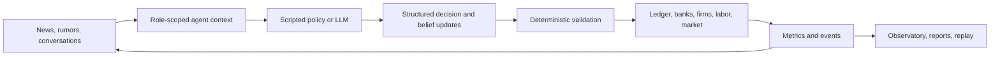

# Agent Economy

[](https://github.com/alinojoumi8/agent-economy/actions/workflows/ci.yml)

**A living miniature economy for studying how information changes beliefs,
decisions, institutions, and markets.**

Agent Economy runs a US-style world populated by persona-driven citizens,
founders, bankers, journalists, public officials, and an economic Oracle. Agents
can work, buy goods, borrow, lend, trade, publish, gossip, form companies, vote,
become ill, and panic. LLMs propose decisions; a deterministic engine validates
and settles every consequence through an exactly balanced double-entry ledger.

> Agent Economy is a research simulator, not a real-economy forecast or
> financial advice. The default offline profile is free and deterministic.

## Why this project exists

Many multi-agent demos make interesting text but cannot explain where money
came from, reproduce a run, or separate a model's belief from a scripted engine
effect. Agent Economy is built around the opposite priorities:

- **Mechanically valid**: every dollar is conserved; markets, loans, payroll,
  taxes, insurance, and failures use deterministic rules.
- **Causally inspectable**: information exposure, belief change, proposed
  decision, validated action, and economic effect are persisted separately.
- **Reproducible**: seeded offline runs produce stable evidence; exact replay
  rebuilds a source run without contacting a provider.
- **Observable**: a local React dashboard shows the economy, agents, institutions,
  news, conversations, forecasts, costs, shocks, and acceptance gates live.
- **Provider-aware**: real-model profiles preflight routes, meter cost, survive
  rate limits, and pause visibly instead of silently changing models.

## What can you use it for?

| Use case | Example question |
|---|---|
| Misinformation research | Can a false bank rumor reduce trust and cause deposit flight? |
| Monetary policy | How does a rate shock move loan quotes, hiring, output, and markets? |
| Agent comparison | Do different model/provider mixes behave differently under identical mechanics? |
| Forecast calibration | Is the read-only Oracle well calibrated after predictions resolve? |
| Economics and AI education | How do beliefs become actions without violating accounting constraints? |
| Multi-agent systems engineering | Can a long, costly run be resumed, replayed, audited, and budgeted? |

## How it works



One tick is one simulated day. Nightly mechanics settle obligations and shocks;
agents then perceive, decide, trade, publish, converse, update memory, and
finalize a reconciled day. New semantics-v3 runs hide private bank reserve ratios
from citizens and append bounded belief updates with raw/normalized provenance.

## Five-minute offline start

Requirements: Python 3.11 or 3.12. Node.js is not needed unless you change the
dashboard.

```powershell
git clone https://github.com/alinojoumi8/agent-economy.git
Set-Location agent-economy
python -m venv .venv
.\.venv\Scripts\Activate.ps1
python -m pip install -r requirements.txt

# Free, deterministic, no API key
python run.py --config runs/base.yaml
```

Open <http://127.0.0.1:8000>. The world starts paused; press **Run** or **Step**.

To play one citizen through the same validator and ledger used by autonomous
agents, start the provider-free participant sandbox instead:

```powershell
python run.py --config runs/participant.yaml
```

Open a living citizen in the observatory, choose **Take control**, queue one
action, and press **Step**. The citizen inspector retains a paginated audit of
queued, executed, rejected, and cancelled commands. Participant runs are clearly
marked and cannot be used as acceptance evidence.

macOS/Linux users can activate with `source .venv/bin/activate`. A headless smoke
run that writes a standalone report is:

```bash
python run.py --config runs/base.yaml --ticks 3
```

> **Important:** `python run.py` without `--config` selects the live production
> profile. Use the explicit `runs/base.yaml` command for offline work.

## A first experiment

Run five treatment seeds and five same-seed controls for the rumor scenario:

```powershell
python run.py --experiment runs/experiments/rumor_vs_control.yaml
```

Artifacts are written to `reports/out/` in JSON, Markdown, and HTML. Treatment
and control worlds are isolated and every arm is reconciled.

The rumor engine only adds an observation. It does **not** lower trust or move
money. The causal path must be produced by agents:

```text
exposure -> belief update -> decision -> deposit transfer -> reserve pressure
```

The evaluator measures trust relative to each exposed agent's real pre-rumor
baseline and fails closed when history is missing.

## What is in the observatory?

- **Run controls**: run, pause, step, speed, safe stop/report, phase-aware resume.
- **Macro view**: daily and rolling final-goods output, labor income, CPI,
  correctly windowed inflation, unemployment, money, inequality, and markets.
- **Agent inspector**: persona, accounts, loans, holdings, memories, bounded
  beliefs, provenance, prompts, model responses, and decision audit.
- **Institutions**: bank balance sheets, firms, government, VC, healthcare,
  newsroom, and exchange.
- **Information flow**: articles, conversations, shocks, and high-importance
  events.
- **Oracle**: evidence-bounded probability forecasts, automatic resolution,
  Brier scores, and run/pooled calibration.
- **Acceptance**: completed gates, actual/projected spend, Oracle sample count,
  shock traces, and rumor-window evidence.
- **Participant sandbox**: take control of one citizen, queue one validated
  action per day, and inspect the durable execution result.
- **Replay and export**: tick-by-tick historical viewer plus standalone reports.

## Run profiles

| Profile | Agents/purpose | Provider policy |
|---|---|---|
| `runs/base.yaml` | Fast local world | Scripted, free, deterministic |
| `runs/participant.yaml` | One-citizen participant sandbox | Scripted, free, step-only |
| `runs/production.yaml` | Approx. 100-agent live world | MiniMax citizens/founders; Kimi institutions/Oracle |
| `runs/acceptance/rehearsal.yaml` | Full acceptance mechanics | Scripted, free |
| `runs/acceptance/pilot.yaml` | 30-day rumor pilot | Live, explicit approval, $25 cap |
| `runs/acceptance/production.yaml` | 365-day release evidence | Live, explicit approval, $200 efficiency gate |

Production never silently falls back when a key, route, or provider fails.

## Optional real-model setup

```powershell
Copy-Item .env.example .env
# Add MINIMAX_API_KEY and KIMI_API_KEY locally; never commit .env.

python run.py --config runs/production.yaml --preflight
python run.py --config runs/production.yaml --preflight-live
python run.py --config runs/production.yaml
```

The preflight commands validate configuration and provider model catalogs; they
do not request chat completions. Paid acceptance requires the additional,
explicit `--approve-live-inference` flag. Read the
[operator runbook](docs/operator-runbook.md) before starting it.

## Resume, replay, and reports

```powershell
python run.py --config runs/base.yaml --resume <RUN_ID>
python run.py --replay <RUN_ID>
python run.py --report <RUN_ID>
```

- **Resume** restores the stored phase cursor and reuses completed calls.
- **Replay** creates a new database, uses stored LLM responses only, and prints
  canonical table-hash equality proof.
- **Report** regenerates HTML/Markdown from a stored database.

Each run is a portable SQLite file under `data/runs/`. It contains the economic
state and the scientific audit trail: events, beliefs, memories, conversations,
predictions, metrics, shocks, ledger entries, and model-call evidence.

## Project structure

```text
run.py             CLI and local application entry point
runs/              offline, production, acceptance, and experiment profiles
engine/            deterministic ledger and economic mechanics
agents/            personas, role contexts, scheduling, memory, decisions
world/             genesis, phase loop, shocks, metrics, information layer
llm/               adapters, routing, readiness, retry, metering, governor
oracle/            evidence tools, prediction, resolution, calibration
experiments/       treatment/control harness
server/            FastAPI, WebSocket, replay API, committed dashboard bundle
dashboard/         React/Vite/Tailwind/Recharts source
reports/           run reports and acceptance receipts
tests/             unit, invariant, integration, property, golden, acceptance
docs/              maintained user/operator/research/developer handbook
```

## Documentation

| If you want to... | Read |
|---|---|
| Install and run the app | [Getting started](docs/getting-started.md) |
| Understand the research model and metrics | [Research guide](docs/research-guide.md) |
| Understand components and data flow | [Architecture](docs/architecture.md) |
| Customize a run or provider | [Configuration](docs/configuration.md) |
| Automate the local server | [API reference](docs/api-reference.md) |
| Operate, pause, resume, or accept a run | [Operator runbook](docs/operator-runbook.md) |
| Diagnose a failure | [Troubleshooting](docs/troubleshooting.md) |
| Develop or contribute | [Development](docs/development.md) and [Contributing](CONTRIBUTING.md) |
| Inspect product commitments | [PRD](PRD.md), [technical spec](TECH-SPEC.md), [status](docs/implementation-status.md) |

The [handbook index](docs/README.md) links all maintained and historical evidence
documents.

## Current status and limits

All PRD-v1 P0/P1 feature surfaces are implemented and the automated backend and
dashboard suites exercise the system. Final live acceptance is still an
operational gate: the pre-fix paid run is preserved as diagnostic evidence, and
a fresh capped rumor pilot must pass before a new 365-day paid run is started.

V1 is intentionally local and single-operator. It has no authentication or
tenant isolation; bind to `127.0.0.1` and do not expose it directly to an
untrusted network. Participant mode, regions/FX, approximately 1,000 agents,
real-data calibration, and hosted multi-user operation remain deferred.

See [SECURITY.md](SECURITY.md) for data/credential boundaries and
[docs/implementation-status.md](docs/implementation-status.md) for the evidence
matrix.

## Development

```powershell
python -m compileall -q agents engine experiments llm oracle reports server world run.py
python -m pytest tests/ -q
npm --prefix dashboard ci
npm --prefix dashboard test
npm --prefix dashboard run build
git diff --check
```

Dashboard builds write to `server/static/`; that bundle is committed so Python
users receive the full UI without Node.js. Contributions should preserve the
ledger, information-boundary, belief-provenance, determinism, and replay
invariants described in [CONTRIBUTING.md](CONTRIBUTING.md).
