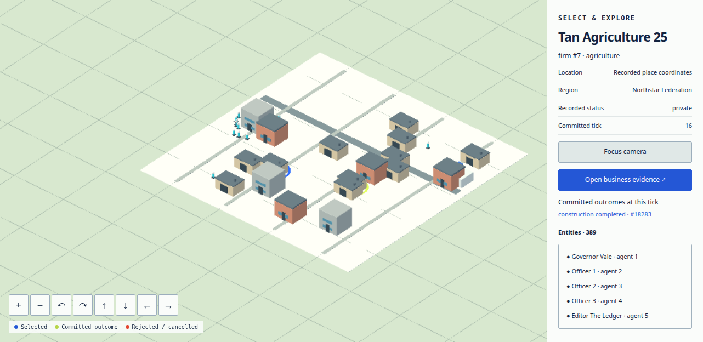
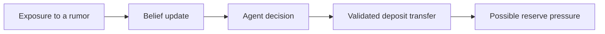
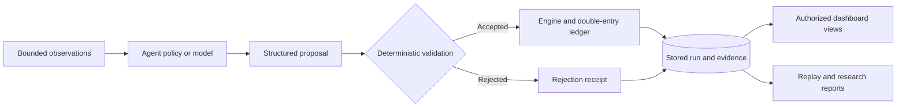

# Agent Economy

### A living economy. An experiment you can replay.

**Simulate a society of agents. Change the conditions. Follow the consequences.**

[Start locally](#start-locally) · [Explore the city](#explore-the-city) · [Run an experiment](#run-one-experiment) · [Read the handbook](docs/README.md) · [Contribute](CONTRIBUTING.md)


<sub>Concept artwork created with ChatGPT image generation. The application is shown below.</sub>

What happens when a rumor reaches a bank's depositors? When credit tightens?
When a citizen tries to turn an idea into a business?

Agent Economy is a **reproducible economic-society simulator** for exploring
those questions. Citizens work, spend, borrow, talk, and make decisions inside
a world of firms, banks, markets, news, and public institutions. You can observe
the world, introduce a shock, compare outcomes, and inspect the evidence behind
what changed.

Start with scripted agents and no API keys. Add local or hosted language models
when your experiment calls for them. In both cases, deterministic rules govern
the economy, every monetary effect passes through a double-entry ledger, and
recorded runs can be replayed without new model calls.

**Python 3.11 / 3.12** · **FastAPI + React** · **SQLite run artifacts** · **MIT licensed**

## What makes this world interesting?

| Follow a question | Explore the mechanisms | Inspect the evidence |
|---|---|---|
| Can a rumor become a bank run? | News, exposure, beliefs, deposit decisions, bank liquidity | Message exposure, decisions, transfers, reserve pressure |
| How do businesses survive and grow? | Hiring, wages, credit, production, trade, and failure | Jobs, transactions, market activity, firm lifecycle events |
| How does policy reach everyday life? | Interest rates, taxes, benefits, health, politics, and law | Policy actions, household and institutional outcomes |
| How does a city get built? | Permits, funding, construction work, and completion | Applications, escrow, project stages, recorded places |
| What changes when agents use different decision policies? | Scripted behavior, model cognition, and bounded external agents | Recorded responses, accepted or rejected actions, cost, replay |

Available mechanisms depend on the selected profile and its recorded semantics.
Use it as a research testbed, an agent integration sandbox, or a way to teach
economic feedback loops. Its results describe the simulated world; applying
them to a real economy requires separate calibration and validation.

## Explore the city



<sub>Repository capture from a provider-free construction run. Buildings and roads include illustrative geometry; the inspector links to recorded simulation evidence. [Capture and replay verification](city/verification.md).</sub>

The **Civic Atlas** observatory lets you move from a whole-world view to a
particular person, institution, market, or event:

- **Pulse:** see what changed and where to begin investigating.
- **City:** explore the atlas and optional 3D view; select an entity and inspect its records.
- **People and institutions:** follow citizens, households, firms, and banks.
- **Markets, politics, and communications:** examine trades, policy, law, news, and conversations.
- **Evidence Lab and experiments:** investigate committed events and compare research outcomes.

Pin a recorded day to investigate history, or return to the live cursor.
The dashboard respects the caller's visibility: a public view does not reveal
private agent messages or hidden bank information. See the
[Civic Atlas guide](docs/civic-atlas.md) and [3D city guide](city/README.md).

## Start locally

You need **Git and Python 3.11 or 3.12**. The dashboard bundle is included;
Node.js is needed only if you want to develop the frontend.

<details open>
<summary><strong>Windows · PowerShell</strong></summary>

```powershell
git clone https://github.com/alinojoumi8/agent-economy.git
Set-Location agent-economy
python -c "import sys; assert sys.version_info[:2] in {(3, 11), (3, 12)}, 'Python 3.11 or 3.12 required'"
python -m venv .venv
.\.venv\Scripts\Activate.ps1
python -m pip install --require-hashes -r requirements.lock
python run.py --config runs/base.yaml
```

</details>

<details>
<summary><strong>macOS / Linux · bash</strong></summary>

```bash
git clone https://github.com/alinojoumi8/agent-economy.git
cd agent-economy
python3 -c "import sys; assert sys.version_info[:2] in {(3, 11), (3, 12)}, 'Python 3.11 or 3.12 required'"
python3 -m venv .venv
source .venv/bin/activate
python -m pip install --require-hashes -r requirements.lock
python run.py --config runs/base.yaml
```

</details>

Open [localhost:8000](http://127.0.0.1:8000). The world starts paused.
Choose **Step** to advance one simulated day, **Run** to continue, or **Pause**
to inspect. **Stop + report** finishes the run and writes its report.

The base profile is provider-free: no model downloads, API keys, or inference
charges. After installation, it runs without live provider calls.

**Want the civic city and construction demo?** Stop the first server with
`Ctrl+C`, then start this profile and choose **3D city** in the city view:

```bash
python run.py --config runs/simcity.yaml --serve
```

| Try next | Profile | Model calls |
|---|---|---|
| Small mechanics world | [`runs/base.yaml`](runs/base.yaml) | None |
| Regions, contracts, law, and politics | [`runs/v2-institutional-rehearsal.yaml`](runs/v2-institutional-rehearsal.yaml) | None |
| Civic city and construction | [`runs/simcity.yaml`](runs/simcity.yaml) | None |
| Manually control one citizen | [`runs/participant.yaml`](runs/participant.yaml) | None |
| Local or paid model cognition | [Provider configuration](docs/configuration.md) | Profile-dependent; preflight and budget required |

> **Choose a profile explicitly.** `python run.py` without `--config` selects the live production
> profile. Before paid inference, run `--preflight-live`, review the resolved
> routes and spending cap, and follow the explicit authorization steps in the
> [operator runbook](docs/operator-runbook.md). Keep credentials in your local, ignored `.env`.

## Run one experiment

**Can a false rumor cause depositors to move their money?** The included
experiment runs five seeds, each with a rumor treatment and a same-seed control:

```bash
python run.py --experiment runs/experiments/rumor_vs_control.yaml
```

Each world runs for 30 simulated days. In the treatment, a rumor about Bank 1
is introduced on day 10; the control has no rumor shock. Compare deposits,
reserve ratios, sentiment, unemployment, and recorded events in the JSON,
Markdown, and HTML artifacts written to `reports/out/`.



This is a **hypothesis to investigate**, not a guaranteed outcome. The rumor
adds an observation; it does not directly lower trust or move money. The
provider-free example exercises mechanics and evidence collection, not live
LLM behavior. Follow the [research guide](docs/research-guide.md) before making
causal claims, and explore the [Price Lab](docs/research/price-lab.md) for
reviewed comparisons from fresh or saved worlds.

## How a decision becomes a consequence

**Agents propose. The engine validates. The ledger settles. The record explains.**



- **Authority is explicit.** Actions are checked against identity, role,
  ownership, state, funds, and bounds. Model prose cannot directly move money.
- **Money is accounted for.** Monetary changes use balanced integer-cent ledger
  entries. Failed invariants halt and checkpoint the run.
- **Time has an order.** Daily phases process obligations, proposals, markets,
  news, conversations, memory, and reconciliation in a stable sequence.
- **History stays inspectable.** Replay uses recorded responses in a new
  database and checks canonical table equality. Historical runs retain their
  original semantics; the source run is not rewritten.

<details>
<summary><strong>Find your way around the code</strong></summary>

| Area | Responsibility |
|---|---|
| [`engine/`](engine/) | Ledger, markets, contracts, and economic mutation |
| [`world/`](world/) | Genesis, daily phases, shocks, metrics, and replay |
| [`agents/`](agents/), [`llm/`](llm/) | Policies, memory, external turns, provider routing, and recorded responses |
| [`server/`](server/), [`dashboard/`](dashboard/), [`city/`](city/) | FastAPI, React observatory, and original 3D assets |
| [`research/`](research/), [`experiments/`](experiments/), [`reports/`](reports/) | Study designs, comparisons, exports, and evidence |
| [`hosted/`](hosted/), [`deploy/`](deploy/) | Optional tenant control plane and deployment configuration |
| [`builder_workspace/`](builder_workspace/) | Immutable code-proposal bundles; proposal-only authority |

Read the [architecture guide](docs/architecture.md) for the full ownership,
persistence, privacy, and replay contracts.

</details>

## World OS expansion

The research engine also supports version-gated extensions: external agents
over REST or Streamable HTTP MCP, an Agent Commons, compute subscriptions and
provider pools, civic permits, construction, and external-turn attendance.

Bring your own agent through the [client quickstart](clients/README.md),
[External Agent Gateway contract](docs/world-os/EXTERNAL-AGENT-GATEWAY.md), and
[attendance guide](docs/semantics14-external-turn-attendance.md). Agent Economy
connects to outside runtimes; it does not install or impersonate them.

These surfaces have different maturity levels. External-agent and Commons
public rollout still have evidence gates. Hosted operation is separately
enabled. The Builder seam stores proposals and has no patch-application,
merge, or deployment authority. See the [World OS specifications](docs/world-os/README.md)
and the authoritative [implementation-status ledger](docs/implementation-status.md)
for implemented, locally verified, rollout-gated, and proposed work.

## Go deeper

| I want to… | Start here |
|---|---|
| Install, resume, replay, or generate a report | [Getting started](docs/getting-started.md) |
| Navigate the observatory | [Civic Atlas](docs/civic-atlas.md) |
| Design and interpret an experiment | [Research guide](docs/research-guide.md) |
| Select models, profiles, and budgets | [Configuration](docs/configuration.md) |
| Integrate an agent or API client | [API reference](docs/api-reference.md) |
| Understand authority and data flow | [Architecture](docs/architecture.md) |
| Deploy, back up, or restore | [Operator runbook](docs/operator-runbook.md) |
| Diagnose a problem | [Troubleshooting](docs/troubleshooting.md) |
| Assemble local reproducibility evidence | [Reproducibility profile](docs/reproducibility-release-profile.md) |
| Find the complete documentation | [Handbook index](docs/README.md) |

## Build with us

Contributions that make the world easier to study are welcome: a reproducible
scenario, a clearer inspector, a better explanation, or a focused regression
test. Start with [CONTRIBUTING.md](CONTRIBUTING.md) and
[development and testing](docs/development.md).

Run the focused smoke contract used by CI from your activated environment:

```bash
python -m pytest -q tests/test_documentation.py tests/test_external_agent_gateway.py tests/test_research_export.py tests/test_prd_completion.py tests/test_recorded_replay_golden.py
```

Changes must preserve ledger ownership, deterministic replay, privacy, and
unrelated work. See [branch lifecycle](docs/branch-lifecycle.md),
[documentation maintenance](docs/documentation-maintenance.md),
[architecture decisions](docs/adr/README.md), and [SECURITY.md](SECURITY.md).
The maintained product contracts are [PRD.md](PRD.md), [TECH-SPEC.md](TECH-SPEC.md),
and [TASKS.md](TASKS.md).

<details>
<summary>Historical baseline provenance</summary>

Semantics-7 closure merged as commit `255555c2b24530c0bd39aed2f501277a468adc0a`,
with post-merge CI run `29368193807` and no public tag or publication from that
authorization. Later evidence and limits live in the implementation-status ledger.

</details>

## License

[MIT](LICENSE). Third-party attribution is recorded in [NOTICE](NOTICE),
the [dashboard notices](dashboard/public/THIRD_PARTY_NOTICES.txt), and relevant
source manifests. The generated cover is conceptual artwork; the city preview
is an existing application capture, not a generated interface.
