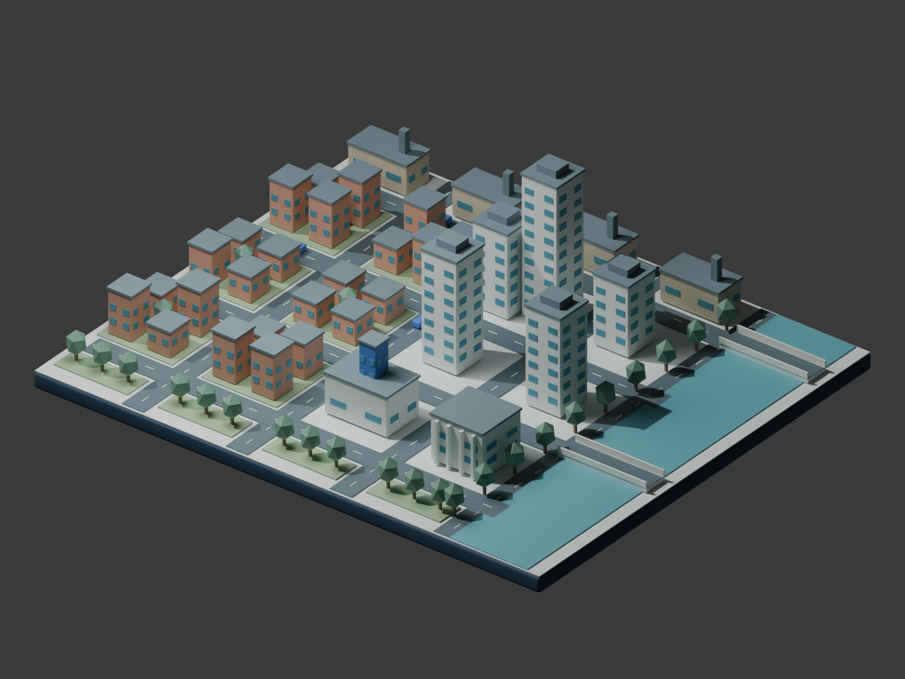

# Agent Economy — City concept

Original Blender city concept for the `simcity` branch. **Synthetic layout; no live simulation connection.** The integration plan is [here](../docs/superpowers/plans/2026-09-10-simcity.md).



## Generate and view

From the repository root, with Blender on PATH:

```bash
blender --background --python city/blender/build_city.py
blender city/output/agent-economy-city.blend
```

Outputs (generated locally, excluded from Git):

- `output/agent-economy-city.blend`: editable scene, camera and lighting.
- `output/agent-economy-city.glb`: portable scene geometry and materials.
- `output/city-preview.png`: rendered view.
- `output/manifest.json`: synthetic building identity, category and dimensions.

Optional output directory: `blender --background --python city/blender/build_city.py -- --output /absolute/output/path`.

The generator replaces the active Blender scene; use the background command or a new unsaved Blender session. It overwrites generated files in the selected output directory. Seed 42 makes geometry/layout repeatable; binary/render identity is not guaranteed between Blender versions. All objects are original procedural primitives. No game assets, external textures, credentials or simulation records are included.

The current GLB is a scene prototype, not an optimized production instancing kit. Building details must be grouped and modularized during Phase 1. Camera navigation, agent selection and economic controls are planned dashboard work, not implemented here.

## Verification

Verified locally with Blender 5.2.1 LTS:

- Background generation completed and the 1600×1200 PNG was visually inspected.
- Reopened `.blend`: 607 scene objects, camera present, all 36 building IDs match the manifest.
- Reimported `.glb`: 604 objects (camera/lights intentionally omitted), all 36 building IDs and synthetic provenance retained.
- Both scenes passed finite-transform, nonempty-mesh and material-presence checks.
- Exported GLB is approximately 935 KiB. Browser rendering/performance is not yet tested.

Repeat the round-trip checks after regeneration:

```bash
blender --background --python city/blender/verify_city.py
```

The verification script expects the default `city/output/` location. The committed `concept.png` is a review image; update it from the generated preview when intentionally changing the scene.
