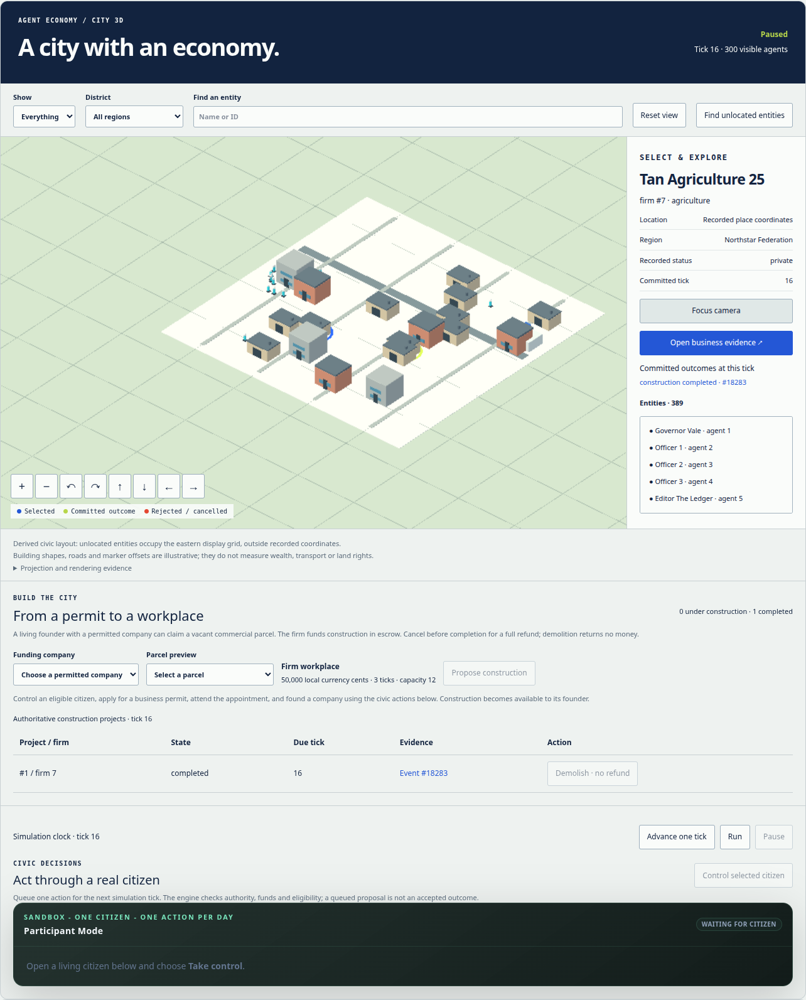
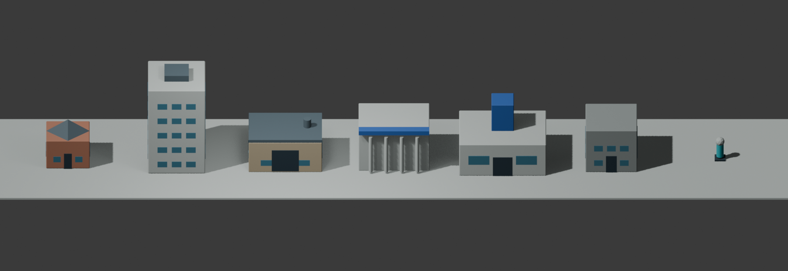

# Agent Economy — City 3D

A playable, original Blender city integrated into the existing Agent Economy dashboard on branch `simcity`. The Python economy owns all money, permits, firms and construction. The browser projects those records into selectable buildings and citizens.



## Run the city

From the repository root with dependencies installed:

```bash
.venv/bin/python run.py --config runs/simcity.yaml --serve
```

Use localhost or HTTPS so the browser can verify asset checksums. Open the dashboard shown by the server and choose **3D city** on Live City. The default remains the 2D atlas. The provider-free profile creates exactly 300 citizens (including three permit clerks), uses engine semantics 13, and starts paused. **Advance one tick**, **Run** and **Pause** operate the simulation independently of the camera. While controlling a citizen, queue one explicit action (including **Do nothing**) before each advance; release the citizen to resume continuous Run.

Select a citizen, company, place or bank with the entity list or canvas. Pan, rotate, zoom, choose a district, or use **Find unlocated entities** for records without authorized coordinates. Evidence links preserve the run, fork and historical tick.

Control an eligible citizen to apply for a business permit, attend the appointment and found a company through the existing civic action panel. The living founder of a permitted company can select a vacant commercial parcel and propose a workplace. The server fixes the cost at 50,000 local currency cents, capacity at 12, and duration at three ticks. Funds move through ledger escrow; cancellation before completion refunds in full, while demolition pays no salvage. A blue outline is only a proposal. See [construction rules](../docs/urban-development.md) for authority, lifecycle, rejection and replay details.

For dashboard development with a separate API port:

```bash
.venv/bin/python run.py --config runs/simcity.yaml --serve --host 127.0.0.1 --port 8813
AGENT_ECONOMY_API_URL=http://127.0.0.1:8813 npm --prefix dashboard run dev -- --host 127.0.0.1 --port 4174
```

## What the map means

Recorded place coordinates use the normalized `[0,1]` square, mapped once into glTF Y-up display coordinates: `[(x-.5)*160, 0, (y-.5)*160]`. Firms share their recorded workplace geometry; citizen markers use explicitly illustrative offsets around an authorized place. Missing and privacy-withheld locations use an eastern display grid outside that square. Layout version 1 assigns an injective integer slot from entity ID and type (agent, firm, place, bank); it does not consume engine randomness or repack earlier identities.

Building silhouettes distinguish recorded types. Their heights do not measure wealth. Roads, ground plates and grid lines are decorative and carry no transport or land rights. Banks have no recorded place and therefore use derived slots. The inspector exposes public identity and lifecycle status, with a link to the existing authorized bank workspace.

Historical views resolve place lifetime, effective presence, citizen arrival/death, bank failure and construction lifecycle at the requested tick. Names, roles, population tiers and some region/roster metadata may reflect current records; the viewer explicitly labels this limitation. Hidden appointment attendance and peripheral location details remain hidden. Events render only from a matching committed snapshot; missing, mismatched or unknown evidence produces no activity effect.

Graphics failure, unsupported WebGL, invalid assets and stale data have explicit states and a 2D fallback. HTML controls and inspectors remain accessible without raycasting. Reduced motion and pause suppress pulses; event highlights last at most 1.4 seconds. GPU resources and event caches are bounded and disposed when the view closes.

## Blender assets



Seven asset families—residence, office, workshop, bank, civic hall, neutral and citizen—each have low/high GLBs. Production exports total **223,924 bytes**. They contain original procedural geometry and material metadata, no simulation records, textures or baked text. The browser validates catalog version, byte counts and SHA-256 before loading low-detail variants, merges material groups and instances shared geometry. Diffuse lighting and a 0.75 render scale keep geometry inexpensive; HTML text remains at native resolution.

```bash
blender --background --python city/blender/export_assets.py
.venv/bin/python city/validate_assets.py
.venv/bin/python -m pytest -q tests/test_city_assets.py tests/test_city_projection.py
```

Validation pins Blender 5.2.1 LTS and the exporter source hash, reimports all 14 GLBs, and checks identity, hierarchy, grounding, finite bounds, dimensions, triangles and materials. See [asset contract](assets/IMPLEMENTATION.md).

## Original concept


The initial concept is a separate synthetic scene with 36 buildings, not a saved simulation. Regenerate or open its editable Blender file:

```bash
blender --background --python city/blender/build_city.py
blender city/output/agent-economy-city.blend
blender --background --python city/blender/verify_city.py
```

Outputs under ignored `city/output/` include `.blend`, `.glb`, PNG and manifest. The generator replaces the active Blender scene, so use the background command or a new unsaved session. Optional output directory: `-- --output /absolute/output/path`. Seed 42 makes geometry/layout repeatable; byte identity across Blender versions is not promised. Verified concept: 607 Blender objects, 604 GLB objects, 36 matching building IDs, finite transforms and materials; interchange file about 935 KiB.

## Verification

Implementation and acceptance evidence are maintained in [the integration plan](../docs/superpowers/plans/2026-09-10-simcity.md) and [verification results](verification.md). Renderer stress fixtures are synthetic; they validate browser behavior, not economic correctness. The separately tested construction path records commands, resumes from storage and verifies exact replay without rewriting the source database.

To repeat the 30-minute renderer test (Node 24+, dashboard running on port 4174):

```bash
CITY_TEST_SECONDS=1800 node dashboard/scripts/city-endurance.mjs
```

Traffic, utilities, pollution and disasters are outside this implementation and need separately versioned mechanics.
