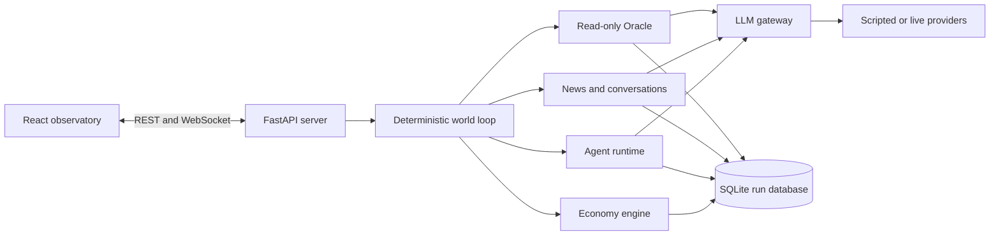
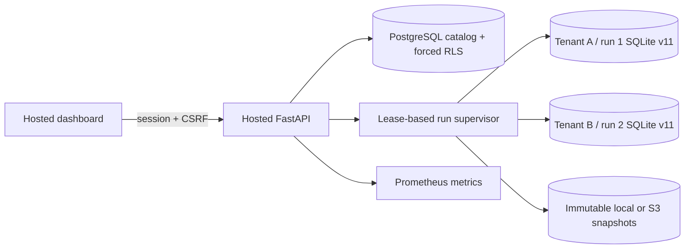

# Architecture

## System shape

`run.py` is the application entry point. It resolves inherited configuration,
performs provider readiness checks, opens or creates a run database, and starts
either a headless world or the local observatory.

Hosted R22 is an optional outer control plane:

PostgreSQL owns identity, tenancy, sessions, run metadata, leases, audit, and
snapshot pointers. It does not own economic state. Each supervised run still
uses the same single-writer deterministic world and SQLite schema as local mode.

## Ownership boundary

LLMs can only propose structured actions and belief updates. Deterministic code
validates identities, ownership, balances, market phase, institutional roles,
and action bounds before applying state. The gateway cannot directly mutate a
balance, loan, firm, job, order, or policy rate.

Every monetary effect uses integer-cent double-entry transactions whose legs
sum to zero. The world reconciles at tick boundaries; an invariant failure
halts and checkpoints instead of continuing with corrupted state.

## Tick lifecycle

One tick is one simulated day, executed in fixed phases:

1. **Night close**: interest, repayments, payroll, production, lifecycle,
   government/health/VC sweeps, and shocks.
2. **Morning**: scheduled agents perceive role-scoped state and request actions.
3. **Execution**: validated actions apply in stable order.
4. **Market**: order books match and close.
5. **Newsroom**: outlets select evidence, draft, and publish.
6. **Evening**: social pairs converse and transmit observations.
7. **Memory**: observations are captured, summaries/beliefs are updated, and
   weekly consolidation runs every seventh tick.
8. **Finalize**: metrics, reconciliation, durable phase state, and checkpoints.

Phase cursors make safe resume possible. Completed calls are durable and reused
if a provider interruption occurs mid-tick.

## Major packages

| Package | Responsibility |
|---|---|
| `engine/` | Ledger, credit, firms, labor, exchange, lifecycle, government, VC, healthcare, and action validation |
| `agents/` | Persona sampling, scheduling, role-scoped context, policies, memory, and decisions |
| `world/` | Genesis, phase loop, shocks, metrics, newsroom, conversations, and replay verification |
| `llm/` | Provider adapters, routing, readiness, retry/repair, caching, metering, and budget governor |
| `oracle/` | Read-only forecasting, resolution rules, Brier scoring, and calibration |
| `experiments/` | Multi-seed treatment/control harness |
| `reports/` | Run reports and production acceptance receipts |
| `server/` | REST/WebSocket API and committed production dashboard bundle |
| `dashboard/` | React/Vite/Tailwind/Recharts observatory source |
| `hosted/` | PostgreSQL catalog/RLS, auth, supervisor, artifact adapters, hosted API, operations, and CLI |
| `deploy/` | Compose reference stack, Caddy TLS, Prometheus, and PostgreSQL role initialization |

## Information and belief model

Semantics-v3 runs enforce epistemic boundaries:

- citizens and founders see their own accounts plus public bank name/status;
- credit officers see their own bank balance sheet;
- the central banker, Oracle, dashboard, and reports retain ground truth;
- `trust:bank:*`, `sentiment`, and `inflation_expectation` have reserved bounds;
- each belief update appends old/raw/normalized/new values and source-call
  provenance to the event spine.

This separation lets experiments distinguish information exposure from direct
mechanical intervention.

## Persistence and replay

Each run is one SQLite WAL database under `data/runs/`. It stores metadata,
agents, institutions, ledger state, markets, events, memories, beliefs,
conversations, predictions, metrics, shocks, checkpoints, and LLM calls.

Exact replay rebuilds genesis in a new database and re-executes recorded LLM
responses without a network fallback. Canonical table hashes prove equality.
Legacy semantics-v1/v2 configurations retain their original bank visibility,
belief-event, and macro-metric behavior so historical runs remain replayable.

## Runtime boundaries

- Local v1 is a single-process app with no authentication. Bind to localhost.
- SQLite, approximately 100 agents, one region, and one operator remain the
  intentional v1 acceptance baseline.
- R18 participant mode, R19 deterministic 1,000-agent core/periphery scale,
  R20 regions/FX/trade/migration, and opt-in R21 SCF/SUSB initialization are
  implemented extensions. R21 reuses schema-v10 provenance tables and the
  schema-v11 engine.
- R22 is an implemented optional hosted boundary: invite-only auth and roles,
  forced-RLS tenant catalog, one writer lease per run, multiple observers/runs,
  immutable snapshots, hosted dashboard, and deployment/operations assets. It
  leaves local APIs, simulation schema, and semantics unchanged.
- The reference hosted stack is PostgreSQL 17 + MinIO + application + Caddy +
  Prometheus. Public production deployment and recorded load evidence remain
  verification gates, not current claims.
- The Oracle is read-only and CLI-backed models are restricted to Oracle/dev
  purposes.

The normative contracts live in [TECH-SPEC.md](../TECH-SPEC.md); current proof
status lives in [implementation-status.md](implementation-status.md).
