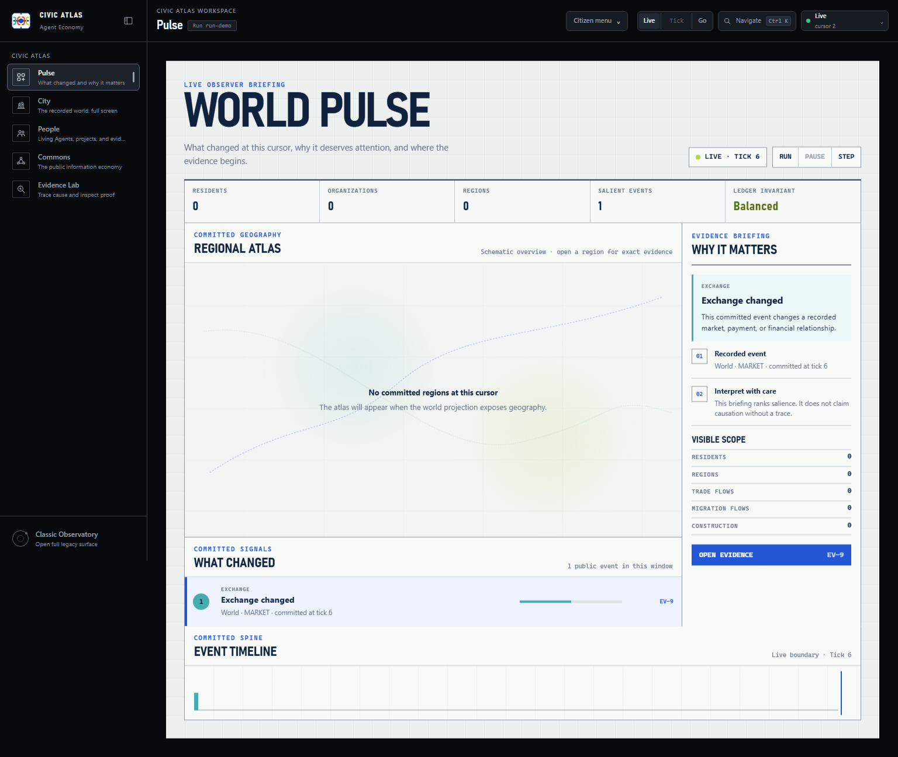

# Civic Atlas dashboard

Civic Atlas is the observer interface served at `http://127.0.0.1:8000` during
a local run. It reads authorized projections of a stored world; it does not own
economic mutation, bypass the ledger, or turn private provider/event payloads
into display data.



## Start with the safe profile

```powershell
python run.py --config runs/base.yaml
```

Open <http://127.0.0.1:8000>, select the run, and enter World OS. The base
profile is provider-free. Any live-provider profile can incur cost and requires
its own preflight and authorization; see [configuration](configuration.md).

## Choose the right surface

The **Citizen menu** switches between product-level surfaces. Its contents come
from the server, so unavailable hosted destinations are omitted instead of
linking to a page the caller cannot use.

| Product destination | Default location | Purpose |
|---|---|---|
| Observatory | `/` | Full classic operational and research dashboard |
| World OS | `/runs/:runId/overview` | Civic Atlas workspace shell for the selected run |
| Commons | `/runs/:runId/commons` | Public information-economy view for the selected run |
| Join | Server-advertised only | Hosted citizenship or invitation flow when enabled |
| My Agents | Server-advertised only | Hosted owner-agent management when enabled |

Do not construct Join or My Agents URLs manually. Their absence in the local
provider-free mode is an intentional capability boundary, not a broken menu.

## Workspace navigation

The World OS rail exposes every workspace. The first group is the daily Civic
Atlas flow; the second group contains deeper evidence surfaces.

| Destination | Route | Use |
|---|---|---|
| Pulse | `/runs/:runId/overview` | Read the briefing, regional atlas, ledger invariant, and ranked committed events |
| City | `/runs/:runId/live-city` | Explore **The recorded day** in the full-screen city renderer |
| People | `/runs/:runId/people` | Inspect Living Agents, journeys, projects, and evidence classes |
| Commons | `/runs/:runId/commons` | Read the public information economy |
| Evidence Lab | `/runs/:runId/investigations` | Trace committed events and maintain authorized investigation records |
| City evidence | `/runs/:runId/world` | Inspect agents, places, construction, and the embedded Atlas/2.5D evidence controls |
| Institutions | `/runs/:runId/organizations` | Filter firms and public organizations and inspect typed records |
| Markets | `/runs/:runId/markets` | Inspect orders, trades, FX, and circuit-breaker evidence |
| Politics & Law | `/runs/:runId/politics-law` | Inspect legislation, lobbying, legal records, and M&A |
| Communications | `/runs/:runId/news-communications` | Use ordinary, agent-scoped, or authorized truth views |
| Experiments | `/runs/:runId/experiments` | Inspect evidence, rehearsals, forecasts, campaigns, and inputs |

**City** and **City evidence** are deliberately different. City is a
full-screen recorded-world experience with its own chrome and a **Workspaces**
return link. City evidence stays inside the World OS shell and provides the
analytical Atlas/2.5D layers. Both read recorded projections.

The rail can collapse to icons and scrolls on narrow screens without removing
destinations. **Classic Observatory** at the bottom returns to `/`.

The **Experiments → Price studies** workspace supports reviewed scripted and
configured decision-policy studies from fresh or explicitly selected saved
worlds. Both price domains share the same comparison. Policy evidence retains
model draws and the original provider allowance; launch and resume require
deliberate operator actions. See the [price study workflow](research/price-lab.md)
and [policy operator contract](plans/2026-09-07-policy-operator-workflow.md).

## Navigate and search

Press `Ctrl+K` or, on macOS, `Command+K` to open **Navigate and inspect**. It
always searches workspace routes. With two or more characters it also searches
authorized people, institutions, committed events, and public communication
threads for the current run, fork, and tick.

- `Up`, `Down`, `Home`, and `End` move through results.
- `Enter` opens the selected result.
- `Escape` closes the dialog and returns focus to the invoking control.
- If entity search fails, route navigation remains available.
- Empty and capped result sets are stated explicitly.

The command menu never widens authorization. A missing private entity is not
proof that the entity does not exist.

## Shared cursor and shareable URLs

The route identifies the run. `fork` selects a lineage. A missing `tick` is the
canonical live cursor; a numeric `tick` pins every workspace to historical
state. The **Live** button removes the numeric tick. Workspace links preserve
the selected fork and tick while discarding parameters that belong only to the
workspace being left.

Supported selections are encoded in the URL so a copy, reload, Back, and
Forward restore the same authorized view. Canonical defaults omit their query
parameter. Unsupported IDs and view names are validated or replaced with the
safe default rather than trusted as display data.

View tabs and directory filters add a history entry. High-volume text edits and
secondary in-view filters may update the current entry. This keeps browser
history useful without adding one entry per keystroke.

## Workspace menu reference

| Workspace | Menus and selections | Canonical URL state |
|---|---|---|
| Pulse | Region and committed-event selection; Run, Pause, Step on a live authorized run | Shared `fork` and numeric `tick`; validated region/event focus |
| City | Full-screen recorded day and Workspaces return | Selected run plus shared observer context when supplied |
| People | Directory search, person selection, paging, project kind/status, project and evidence links | `q`, `project_kind`, `project_status`; `/people/:agentId`; optional `project` |
| Commons | Chronological or Hot feed; causal-trace links | Chronological is the default with no `feed`; Hot uses `feed=hot` |
| Evidence Lab | Investigation selection/create, graph/table selection, zoom, edit, pin, hypothesis, export, and navigation guards | Validated event/investigation focus plus shared cursor |
| City evidence | Atlas/2.5D; All, Work, Comms, Markets, Civic, Health; Core, Everyone, Clusters; search, active-only, region/place/evidence selection | Validated `region`, `place`, agent/project/view selections plus shared cursor |
| Institutions | Search; type, sector, region, status, active-only; typed detail; contracts and disclosures | `q`, `type`, `sector`, `region`, `status`, `active=1`; `/organizations/:type/:id` |
| Markets | Orders, Trades, FX, Circuit breakers; side and status filters | Default Orders omits `view`; other tabs use `view`; filters use `side` and `status` |
| Politics & Law | Legislation, Lobbying, Legal, M&A | The enabled default omits `view`; other tabs use `view` |
| Communications | Ordinary, Agent view, Truth inspector; agent ID, thread search, thread/message selection | Ordinary omits `view`; `view=agent` with optional `agent_id`; `view=truth`; `/news-communications/:threadId` |
| Experiments | Evidence, Rehearsals, Forecasts, Campaigns, Inputs; campaign selection | Evidence omits `view`; other tabs use `view`; `/experiments/:experimentId` |

Filters remain present while a projection refetches, so two consecutive filter
choices cannot collapse the menu between requests. Links from People and
Institutions preserve their active filters when opening a detail record.

## World Pulse

World Pulse is the default briefing. It combines two observer-scoped sources:

- `/api/v2/workspaces/world` for public regions, residents, organizations, and
  aggregate flows;
- `/api/v2/snapshot?domains=summary,alerts,events` for the ledger invariant,
  alerts, and the public committed-event envelope.

The briefing ranks salience; it does not claim causation. **Open evidence**
links to Evidence Lab only when the projection supplies a valid committed event
identifier. Event payloads are not read. Region links require valid region
identifiers, and the atlas plots only coordinates exposed by the projection.
Missing positions stay visibly unpositioned; the client does not invent them.

The ledger invariant is reported as balanced only when the projected balance
is exactly zero. Missing evidence is shown as not reported, never as a measured
zero.

## Live, historical, and authorization boundaries

A historical World Pulse is read-only. It does not request current run status,
show live run controls, or reconstruct current provider activity. Every other
historical workspace follows the same read-only boundary. Use **Live**
deliberately to leave the historical boundary.

On a live cursor, World Pulse offers Run, Pause, and Step. All controls remain
disabled until `/api/run/status` returns an authoritative state, while a
control request is in flight, and after a terminal status. A missing, stale, or
failed status therefore cannot enable mutation. Server-side validation remains
authoritative even when a button is enabled.

Communications has three explicit authorization views:

- **Ordinary** shows the caller's normal authorized projection.
- **Agent view** scopes delivery visibility to the numeric `agent_id`.
- **Truth inspector** requests the separately authorized audit projection and
  displays an explicit access warning.

These controls select a server-enforced projection; they do not grant access.
An unauthorized truth or thread request remains a server-side denial. The
browser does not persist private communication bodies or credentials.

## Evidence, privacy, and display states

- Canonical settlement comes from stored events, receipts, and the ledger.
- Read-time projections expose only caller-authorized public fields.
- Ephemeral runtime activity is live-only and never substitutes for committed
  settlement or appears on a historical cursor.
- Loading, empty, unavailable, historical, stale, and disabled states keep
  explicit wording. A blank panel is not treated as evidence of zero activity.
- Hosted access, tenant scoping, CSRF, and private-field filtering remain server
  responsibilities; Civic Atlas does not infer identifiers or credentials.

For the broader ownership model, read [architecture](architecture.md). For
field-level REST and WebSocket contracts, read the [API reference](api-reference.md).

## Evidence Lab and mutating tools

Evidence Lab reads the same committed evidence spine as the other workspaces.
Creating or editing an investigation, pinning evidence, changing a hypothesis,
or exporting a record requires the corresponding operator authority and CSRF
contract. Version conflicts and mutation failures keep the last canonical
record visible and provide a recovery path; the client must not pretend a
failed edit succeeded.

Classic Observatory contains additional participant, shock, Oracle, replay,
and report actions. They remain subject to their own server validation and
pending-request guards. World OS is the focused evidence interface; Classic
Observatory is the broader operational surface.

## Keyboard and narrow screens

Interactive regions, events, people, menu tabs, and command results are links,
buttons, or native form controls with visible focus and programmatic selected
state. The skip link moves directly to the active workspace. Modal dialogs trap
focus while open and return it when closed.

At 390 px, navigation scrolls without dropping destinations, evidence moves
below the primary field, and the reading order keeps the workspace content
before supporting evidence. Reduced-motion settings suppress nonessential
motion without hiding state.

## When a menu appears wrong

1. Confirm the URL contains the intended run, fork, numeric tick, and local
   selection.
2. Reload once. A supported selection should return with the same pressed or
   selected state.
3. Use Back and Forward. Discrete menu changes should move one state at a time.
4. Read the freshness badge. A stale or reconnecting projection is not an empty
   world.
5. If only entity results fail in the command menu, use its route results and
   inspect the API error separately.
6. If Join or My Agents is absent, check the server-reported mode before
   treating the omission as a defect.

See [troubleshooting](troubleshooting.md) for server, WebSocket, legacy database,
and dashboard-performance failures.

## Dashboard development verification

From `dashboard/`:

```powershell
npm ci
npm test
npm run typecheck
npm run licenses:check
npm audit --audit-level=high
npm run build
npm run test:e2e
```

The build writes the production bundle to `server/static/`. Commit source,
tests, documentation, and regenerated static assets together. The full local
gate and focused CI layers are documented in [development](development.md).

For the optional provider-free real-backend menu smoke, start a bounded run in
one terminal:

```powershell
python run.py --config runs/base.yaml --ticks 3 --serve --host 127.0.0.1 --port 8000
```

Copy the printed run ID. In a second terminal:

```powershell
$env:AE_REAL_RUN_ID = "<run-id>"
npm --prefix dashboard run test:e2e -- e2e/world-os-real-backend.spec.ts
```

This smoke operates every local workspace and internal view against canonical
projections and fails on browser console errors or request failures. It makes no
paid-provider calls and does not prove hosted Join/My Agents access, visual
approval, or production deployment readiness.

To refresh the maintained screenshot after an intentional World Pulse visual
change, set `CAPTURE_CIVIC_ATLAS_SCREENSHOT=1` while running the Playwright test
named `overview enters the exact causal chain`, then review the image before
committing it.
