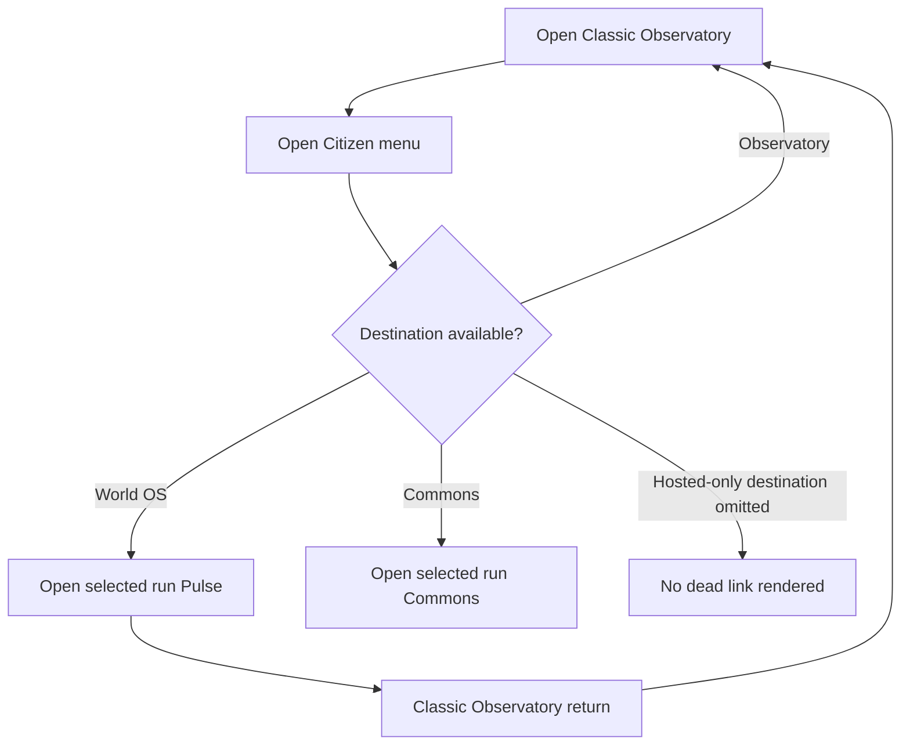
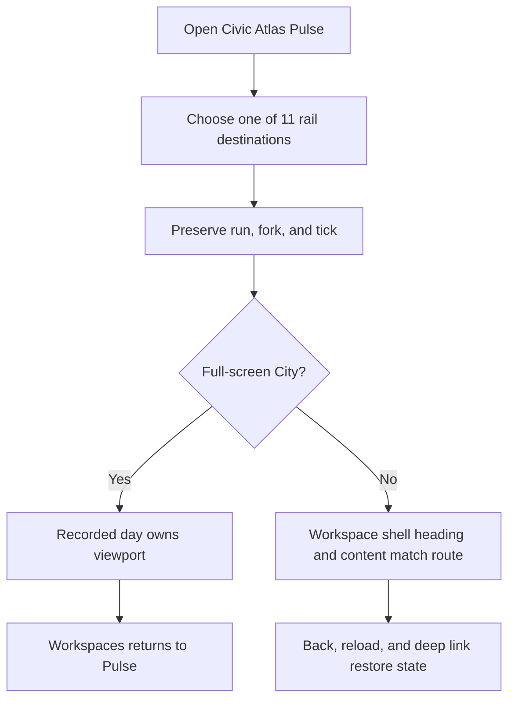
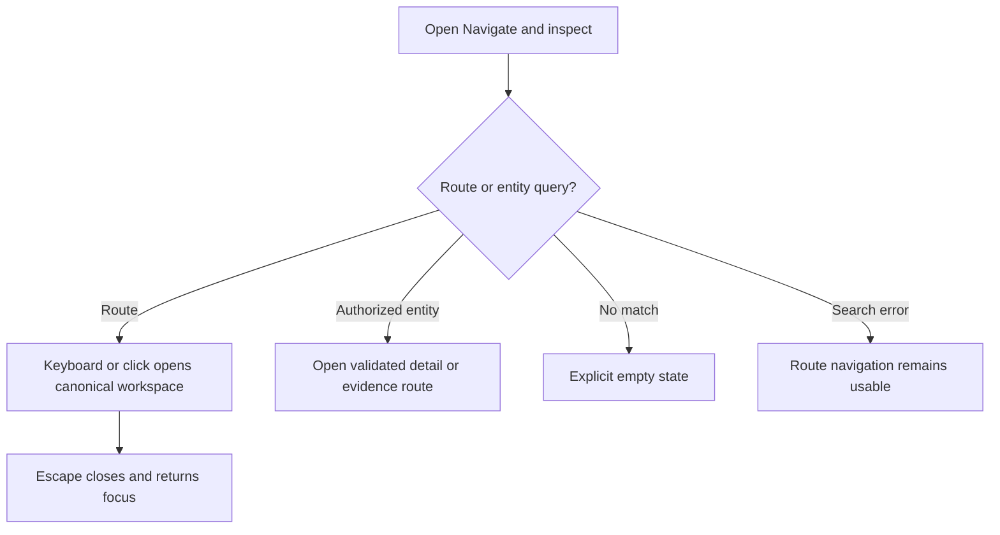
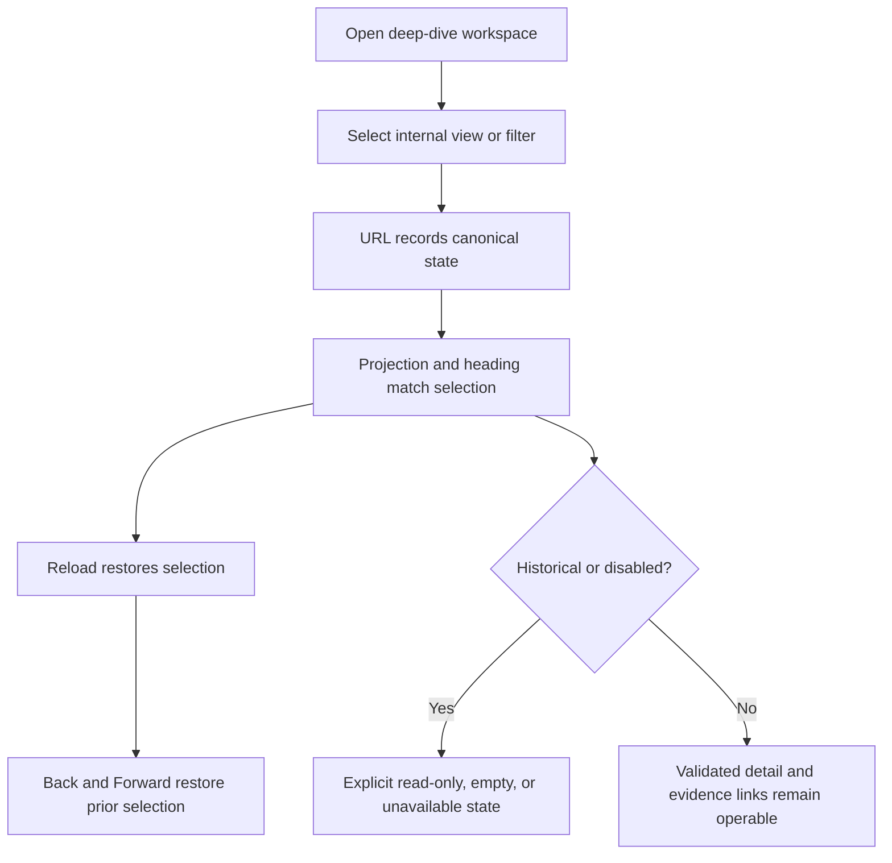
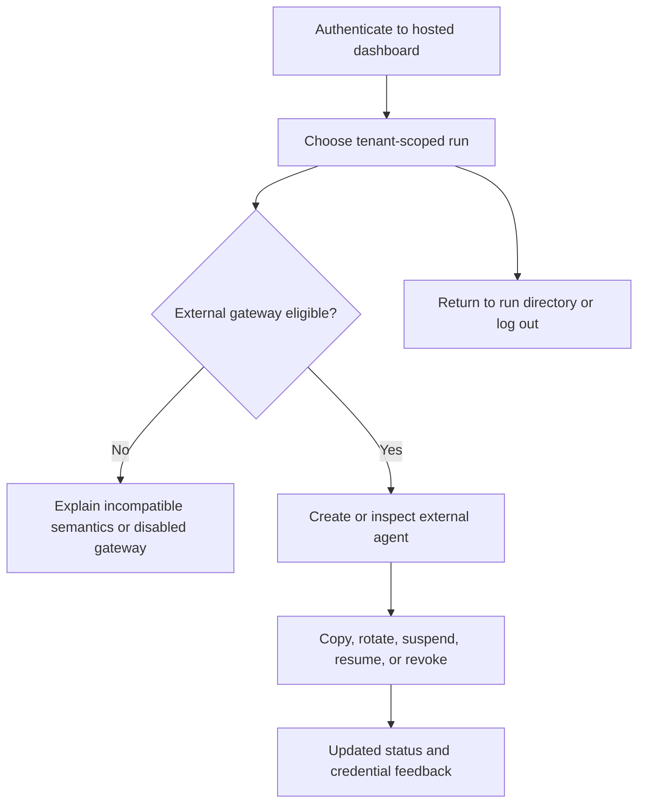
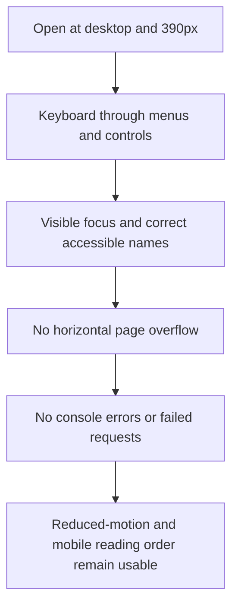

# Dogfood Report — codex/ui-menu-audit

> Whole-app browser QA of the current Agent Economy navigation surface. Generated on 2026-09-01. The `ce-dogfood` flow and reporting discipline is used with the repository's Playwright Chromium harness because the required `agent-browser` binary is unavailable.

## Diff Summary

- Audit the current product-level Citizen menu and the Classic Observatory return path.
- Exercise all eleven Civic Atlas workspace destinations while preserving run, fork, and tick context.
- Exercise command navigation, historical tick travel, internal view menus, filters, selectors, and browser history.
- Exercise hosted run-directory and external-agent controls with their authorization and eligibility boundaries.
- Validate desktop, 390-pixel mobile, keyboard, focus-return, console, and request-failure behavior.

## Personas

- **Research observer** — needs fast, truthful navigation among public projections, evidence, and historical state without private-data leakage. Inferred from `README.md`, `DESIGN.md`, and `docs/civic-atlas.md`.
- **Run operator** — needs live controls, explicit disabled/error states, and clear transitions between live and historical inspection. Inferred from `README.md` and `docs/civic-atlas.md`.
- **Hosted agent owner or administrator** — needs tenant-scoped run selection and safe external-agent credential controls with clear compatibility feedback. Inferred from `docs/civic-atlas.md` and the hosted dashboard contract.

## Flows Tested

## Test Matrix & Results

| # | Flow | Journey / Scenario | Status | Issue | Fix | Commit |
|---|------|--------------------|--------|-------|-----|--------|
| 1 | Product surfaces | Citizen menu links and Classic Observatory return use the selected run and omit unavailable hosted destinations | Pass | - | - | - |
| 2 | Workspace rail | All eleven canonical destinations render, preserve observer context, and show matching workspace state | Pass | - | - | - |
| 3 | Command menu | Mouse and keyboard navigation, route/entity search, empty/error states, Escape, and focus return | Pass | - | - | - |
| 4 | Time travel | Live and numeric tick controls preserve route/fork and enforce historical read-only behavior | Pass | - | - | - |
| 5 | Pulse | Briefing selections, evidence links, and authoritative run controls reach their true end states | Pass | - | - | - |
| 6 | City surfaces | Full-screen City return path and City evidence Atlas/2.5D, layers, population, and selection menus | Pass | - | - | - |
| 7 | People | Directory search, person selection, project browser filters, paging, and evidence links | Pass | - | - | - |
| 8 | Commons | Chronological/Hot menu, reload/history, and causal-trace destination | Pass | - | - | - |
| 9 | Evidence Lab | Investigation selection/create/edit, graph/table selection, navigation guard, and export | Pass | - | - | - |
| 10 | Institutions | Filters, typed details, validated legacy IDs, reload, and browser history | Pass | - | - | - |
| 11 | Markets | Orders/Trades/FX/Circuit breakers, side/status filters, reload, and history | Pass | - | - | - |
| 12 | Politics & Law | Legislation/Lobbying/Legal/M&A views and disabled/historical states | Pass | - | - | - |
| 13 | Communications | Ordinary/Agent/Truth views, thread deep links, history, and authorization failure | Pass | - | - | - |
| 14 | Experiments | Evidence/Rehearsals/Forecasts/Campaigns/Inputs, campaign detail, and historical omissions | Pass | - | - | - |
| 15 | Hosted controls | Run directory, role-specific menus, compatible/incompatible external-agent actions, and logout | Fixed | Return-to-directory and logout lacked an end-to-end regression journey | Extended the hosted browser scenario through run re-entry and logout | `06f875e` |
| 16 | Responsive and accessible | Desktop/mobile navigation, keyboard operation, focus, reduced motion, contrast, and overflow | Pass | - | - | - |
| 17 | Real backend | Every menu operates against a provider-free canonical run with no console or request failures | Pass | - | - | - |

Status values: `Pending`, `Pass`, `Fixed`, `Skipped`, `Blocked (needs human verify)`, `Blocked (human decision)`.

## What Was Fixed

- Extended `agent-connections.spec.ts` so the hosted administrator journey now proves return to the tenant run directory, re-entry into the selected run, logout, and restoration of the sign-in screen.
- No user-facing menu defect was reproduced across the audited product, workspace, internal-view, history, responsive, accessibility, or real-backend journeys.

## Paper Cuts (by persona)

- **Run operator / developer, low severity:** the Vite proxy can print an aborted WebSocket write while the real-backend browser test intentionally changes routes and closes its socket. The page console, requests, backend lifecycle, and assertions remain clean. Deferred as development-harness noise rather than a user-facing menu defect.

## Console Errors

None in the 12-scenario canonical-route run, the 43-scenario World OS/state run, the 11-scenario Evidence Lab/hosted/privacy/run-control/accessibility run, or the real-backend browser integration. The real-backend Vite process emitted the low-severity WebSocket proxy noise recorded above; no browser request failed.

## Automated Gate Evidence

- `npm test` — 194 passed.
- `npm run typecheck` — passed.
- `npm run licenses:check` — passed.
- `npm audit --audit-level=high` — passed; 0 vulnerabilities.
- `npm run test:e2e -- agent-connections.spec.ts` — 3 passed after the hosted lifecycle regression was added.
- `npm run test:e2e` — 67 passed, 1 expected skip for the opt-in real-backend case when `AE_REAL_RUN_ID` is absent.
- `$env:AE_REAL_RUN_ID='324187e869'; npm run test:e2e -- world-os-real-backend.spec.ts` — 1 passed against the provider-free FastAPI server.
- `.venv\\Scripts\\python.exe -m pytest -q tests/test_documentation.py tests/test_external_agent_gateway.py tests/test_research_export.py tests/test_prd_completion.py tests/test_recorded_replay_golden.py --basetemp C:\\tmp\\pytest-agent-economy-menu-audit` — 144 passed; one Starlette/httpx dependency deprecation warning.
- `.venv\\Scripts\\python.exe -m pytest -q tests/test_documentation.py --basetemp C:\\tmp\\pytest-agent-economy-menu-docs-final` — 22 passed after the final report edit.
- `npm run build` — passed; Vite retained its advisory for chunks larger than 500 kB.
- `git diff --check` — passed before commit; repeated after the final report edit.

## Human Verifications

No external OAuth, payment, email, or SMS leg is in scope. Hosted behavior is exercised with the repository's deterministic browser fixtures. Canonical observer menus were also exercised against provider-free run `324187e869`, which advanced from tick 0 to tick 3 at zero provider spend.

## Decisions for a Human

None.

## Learnings

- The navigation contract is broader than the permanent rail: product-level routing, command navigation, internal evidence menus, and historical cursor behavior must be tested as connected journeys.
- The repository already contains a provider-free real-backend menu smoke; it should remain the final integration gate rather than relying only on mocked projections.

## Final Status

Ready for review: every matrix row is `Pass` or `Fixed`, the full automated gates are recorded above, and the hosted lifecycle regression is committed as `06f875e`.
