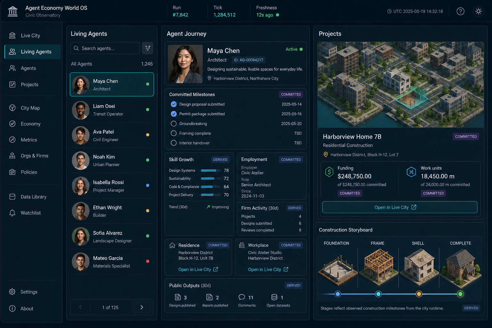

# Living Agents

Living Agents is the observer-only progression workspace at
`/runs/:runId/people`. Existing agent detail URLs remain valid at
`/runs/:runId/people/:agentId`; only the navigation label changed.



The review mockup above is documentation, not runtime artwork. It records the
approved composition: an agent list, selected journey, evidence-labelled
progress streams, and the four construction silhouettes. QTown informed this
layout only; no QTown source, assets, fixed-grid renderer, or PixiJS dependency
is used.

## Evidence contract

- **Committed** means stored actions, transactions, cases, skills, and outcomes.
- **Runtime** means ephemeral current work and appears only for a live view.
- **Derived** means a summary calculated from committed evidence.

The workspace reports exact stages, counts, ticks, cents, and evidence
references. It does not manufacture completion percentages. Historical views
reconstruct the selected tick and fork. Prompts, private reasoning, message
bodies, memory contents, and reversible peripheral-agent locations are omitted.
Peripheral residence and workplace activity is aggregated by region for the
ordinary workspace projection.

## Observer APIs

- `GET /api/v2/workspaces/living-agents` accepts `tick`, `fork_id`, `agent_id`,
  `project_kind`, `status`, `after`, and `limit`.
- `GET /api/v2/agents/{agent_id}/journey` accepts the same historical lineage
  parameters and returns the selected profile, state, milestones, public
  outputs, and evidence references.
- The compatibility `/api/agents` endpoints remain available, but Living Agents
  does not use them.

Links back to Live City preserve the observer fork and tick and use stable
`agent`, `place`, `project`, organization-layer, and `view=diorama` parameters so refresh
and browser history retain the same evidence focus.

With Semantics 13 enabled, construction is an additional progress stream.
Cards report the exact lifecycle state, physical stage, funding cents, work
units, milestone count, and privacy class. The workspace remains read-only; see
the [construction economy contract](semantics13-construction-economy.md).

## Visual runtime and zero-cost showcase

The runtime workspace uses deterministic decorative portraits and procedural
construction geometry. Neither surface adds identity claims or progress: agent
facts come from the journey projection, while foundation, frame, shell, and
completion are selected only from stored construction stages.

Start a new provider-free 300-agent Semantics-13 showcase with:

```powershell
python run.py --config runs/civic-city-300-construction.yaml --serve --host 127.0.0.1 --port 8000
```

Then open `/runs/<run-id>/people`. At tick zero the four-stage storyboard is a
labelled reference with no claimed current stage. It advances only after agents
commit proposal, permit, funding, and work evidence. Do not resume a stored
Semantics-12 run with this profile; stored runs keep their original semantics.
