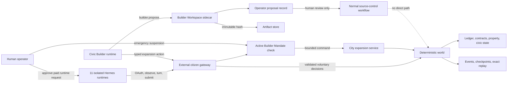

# Hermes Citizens and Civic Builder implementation plan

Status: accepted product direction; implementation-ready design
Target: Engine Semantics 13, run schema 18
Decision record: `CONTEXT.md` and ADRs `0001` through `0010`

## Outcome

Add ten persistent, first-class Owner-Run Citizens to every opted-in city. Each citizen is controlled by one isolated logical Hermes runtime through the existing external-agent gateway and begins as an ordinary resident. Add a separate eleventh citizen, the Civic Builder, whose revocable Builder Mandate permits bounded city expansion and the authorship of review-only code proposals.

The authoritative world remains deterministic. Hermes supplies voluntary decisions; it does not own identities, balances, property, contracts, civic standing, authorization, settlement, or replay. An offline runtime produces a visible Missed Turn and no substitute decision. Automatic obligations and consequences continue.

The builder may directly commission engine-validated in-world capacity. It may not provision paid runtimes, push code, merge code, deploy code, change a running engine, access secrets, or modify the settlement, replay, authentication, or authorization kernels.

## Locked product contract

1. There are ten launch Owner-Run Citizens and one separate Civic Builder.
2. The eleven citizens are persistent city identities, not model routes or reusable character templates.
3. Each citizen has one isolated logical runtime, credential set, memory, budget, and schedule. A shared process supervisor is allowed, but private runtime state is not shared.
4. The ten launch citizens receive no reserved office, special action catalog, or privileged economic starting state.
5. The Civic Builder has ordinary economic standing. Its extra authority comes only from an active Builder Mandate.
6. Each city gets a newly generated cohort. Identities persist and evolve inside that city but do not recur as a global cast.
7. The ten-member Launch Cohort satisfies a deterministic Cohort Diversity Contract before admission.
8. No platform policy, native model, or other citizen impersonates an Owner-Run Citizen during an outage.
9. Expansion is triggered by sustained recorded pressure, then bounded by affordability, capacity, cooldowns, and the City Health Envelope.
10. The first eleven are Strategic Citizens. Later scale combines a capped strategic core with persistent deterministic Peripheral Residents.
11. New paid Hermes capacity requires explicit human approval. Deterministic peripheral growth does not.
12. Code work occurs only in a disposable allowlisted Builder Workspace. The output is an immutable Proposal Bundle, never a deployment.
13. Every city has a separate builder identity, runtime, credential set, and memory. Only the versioned Builder Skill Pack may be reused.
14. Safety automation, a human emergency control, and normal civic governance may independently suspend the Builder Mandate.
15. Builder succession creates a new citizen and runtime. Public mandate history transfers; private memory, credentials, and authorship do not.

## Boundary model



The two builder paths are deliberately different:

- A City Expansion Action is an in-world command and may change future world state after deterministic validation and ledger settlement.
- A Code Proposal is an out-of-world artifact and cannot affect the running city. Even an approved proposal must pass the normal maintainer, CI, release, and new-run workflow.

## Existing seams and required changes

The repository already contains most of the substrate:

- `agents/passports.py` provides persistent passports, claim flows, OAuth authorization, per-owner limits, and run citizenship records.
- `agents/external.py` provides one-passport/one-actor connections, leases, turns, idempotent action submission, receipts, replay restoration, and immutable security audit.
- `world/loop.py` collects external turns before a tick and executes all accepted decisions through the normal phase loop.
- `agents/runtime.py` already separates externally controlled actors from native decisions.
- `engine/commands/` and `engine/actions.py` provide strict, semantics-versioned command validation and savepoint-protected execution.
- `engine/city.py` provides places, capacity, civic queues, appointments, staff succession, public projections, and civic metrics.
- `operator_workspace/store.py` provides versioned sidecar state and a hash-chained operator audit.
- `hosted/artifacts.py` provides immutable, checksum-verified filesystem and S3 artifacts.
- `server/v2_api.py` and the World OS dashboard already project civic state separately from authoritative settlement.

The current implementation has five gaps that must not be papered over:

1. `runs/hermes-local.yaml` currently allows five seats and three passports per owner. An eleven-runtime launch cannot pass admission.
2. A new external connection currently schedules an arrival for the following tick and can override only name and occupation. There is no deterministic city-level cohort manifest or diversity guarantee.
3. `ExternalAgentService.decisions_for_tick()` currently inserts `safe_do_nothing_v1` and emits `external_agent_fallback` when a runtime is absent. That conflicts with the Missed Turn decision.
4. Semantics 12 civic commands cover business-permit workflow, not builder mandates, health pressure, construction, cohort admission, or succession.
5. The operator workspace and artifact store can preserve a proposal, but there is no allowlisted code workspace, proposal schema, builder authorization check, or review UI.

## First-class citizen invariants

An Owner-Run Citizen is first class only if all of these are true:

- Its `agents` row exists even before its runtime claims a passport or comes online.
- Its identity, accounts, housing, employment, property, contracts, health, relationships, civic cases, and death use the same authoritative tables and services as other citizens.
- Provider and runtime details do not leak into the `agents` table or determine legal standing.
- The runtime binding is one-to-one and replaceable without replacing the citizen.
- An unbound or offline runtime cannot cause a native model to control the citizen.
- Every scheduled submission or Missed Turn is durable, public in privacy-safe form, and replayable.
- Cohort membership does not imply Builder Mandate membership.
- A builder losing its mandate remains a citizen unless a separate ordinary civic process changes that status.

## Versioning and compatibility

Implement this as opt-in Engine Semantics 13 with schema 18.

- Semantics 1 through 12 retain their current external `safe_do_nothing_v1` behavior and event payloads.
- Semantics 13 uses Missed Turns only for citizens recorded in the new runtime-binding tables. Existing public-join actors not in such a binding retain their existing policy unless migrated explicitly.
- Schema 18 is additive wherever possible. Do not rewrite old events or decisions.
- `engine/schema.py` moves `SCHEMA_VERSION` from 17 to 18.
- Add `engine/migrations/v018_hermes_citizens_builder.py` with an explicit `verify()` covering tables, indexes, triggers, foreign keys, and added columns.
- Add the migration to `engine/migrations/registry.py` using the existing ordered, checksummed migration mechanism.
- Update replay hashing and the checked-in hash contract only after the focused exact-replay gate passes.

## Run configuration

Add one new opt-in block. Defaults keep existing profiles unchanged.

```yaml
engine_semantics_version: 13

owner_run_city:
  enabled: true
  launch_citizens: 10
  civic_builders: 1
  cohort_generator_version: cohort-v1
  diversity_contract_version: diversity-v1
  owner_run_cap: 25
  strategic_population_cap: 100
  peripheral_population_cap: 900
  missed_turn_policy: visible_no_decision
  builder_skill_pack_version: civic-builder-v1

  health:
    pressure_ticks: 7
    cooldown_ticks: 30
    max_open_expansion_plans: 1

  construction:
    max_capacity_per_action: 50
    max_capacity_per_30_ticks: 150
    minimum_government_reserve_cents: 500000
    build_ticks: 7

external_gateway:
  enabled: true
  scope_sets:
    actor: [world.read, world.act, commons.read, commons.write]
    builder: [world.read, world.act, commons.read, commons.write, builder.propose]
  public_join:
    enabled: true
    seat_limit: 25
    launch_reserved_seats: 11
    max_passports_per_owner: 20
```

`launch_reserved_seats` prevents public admissions from consuming the eleven launch bindings. `max_passports_per_owner: 20` permits one supervisor owner to claim all eleven passports while one-to-one logical isolation is enforced separately. The owner limit is not evidence of runtime isolation; acceptance tests must verify distinct binding, credential, memory, budget, and schedule identifiers.

Add `runs/hermes-city.yaml` rather than changing existing live profiles. It should begin paused, use scripted or recorded providers by default, and require the repository's normal live-inference preflight and approval before paid calls.

## Cohort generation and admission

### Deterministic generation

Create `agents/cohorts.py` with a pure `CohortGenerator` and `CohortDiversityValidator`.

Derive a dedicated PRNG seed from the run seed, city identity, generator version, and cohort ordinal. Do not consume the existing general persona stream; otherwise adding a cohort would silently change unrelated genesis citizens and later arrival identities.

The ten-member launch manifest contains:

- stable cohort-local member key and ordinal;
- name, handle, biography, goals, values, personality, disposition, and preferred occupation;
- age band and dependent band;
- an engine-owned starting-circumstance slot, not an amount of money;
- the generator and diversity-contract versions;
- a canonical profile hash.

The Civic Builder gets a separately generated profile and is not counted toward the ten-member diversity guarantee.

The builder may later enrich only the bounded identity fields recorded in ADR 0010. It cannot edit the engine-owned circumstance slot, balances, region, housing, employer, rights, authority, or cohort admission state. Validate the complete manifest again after enrichment.

### Diversity contract v1

For a ten-member launch cohort, require at minimum:

- six distinct occupation families and no occupation family with more than three members;
- three life-stage bands;
- all three engine-owned starting-circumstance bands, with no band holding more than half the cohort;
- both sides of each configured values axis and a neutral/mixed member;
- four disposition clusters, including at least one cautious and one exploratory member;
- unique normalized handles and names;
- no institutional role, staff kind, pinned office, or mandate in any of the ten ordinary profiles.

The validator returns structured failures. Generation uses a bounded deterministic retry count and fails city initialization closed if the contract still cannot be satisfied. It must never silently relax the contract.

### Admission sequence

Extract the common economic materialization code from `World._spawn_due_arrivals()` into a shared `CitizenAdmissionService`. Both normal arrivals and the launch cohort must use it for:

- agent creation;
- checking and savings accounts with visible system inflow;
- ordinary housing charges and leases;
- region and bank selection;
- initial beliefs and social ties;
- cognition initialization;
- public arrival/genesis events.

For an opted-in fresh run:

1. `Genesis.build()` creates existing institutions and baseline state.
2. `CohortGenerator` creates and validates the ten-member manifest plus the separate builder profile.
3. `CitizenAdmissionService` materializes all eleven citizens at tick 0 before `cognition.seed_world(0)`.
4. The engine issues the Builder Mandate to the eleventh citizen in a separate transaction and event. It does not encode authority in the profile.
5. The run commits the manifest hash, actor bindings, ordinary accounting entries, and mandate.
6. The run stays paused while the control plane creates one-time claim registrations for the eleven profiles.
7. Each Hermes runtime claims exactly one passport. Claiming binds the connection to the already existing actor; it must not schedule or spawn a second actor.
8. If a runtime remains unclaimed at tick 1, its citizen records a Missed Turn.

Passport claim tokens and bootstrap tokens stay only in the control-plane database and one-time secure operator output. They must never enter the world database, events, logs, manifest JSON, proposal artifacts, or source tree.

### Binding before runtime claim

An Owner-Run Citizen must be excluded from native cognition even when there is no `external_agent_connections` row yet.

Add `ExternalAgentService.controlled_actor_ids(tick)` and have `AgentRuntime.decide_all()` exclude the union of:

- actors with active external connections; and
- living actors with active or awaiting-claim first-class runtime bindings.

Extend `LocalCitizenshipService._create_connection()` to look up a prebound cohort member by passport ID. For a prebound member it calls an extended `ExternalAgentService.create_connection(..., prebound_actor_id=...)`, which creates the one-to-one connection without creating an `external_actor_request` or arrival schedule. Public registrations keep their current arrival path.

## Schema 18

### Authoritative world tables

#### `city_cohort_manifests`

One immutable record per generated cohort.

| Column | Contract |
|---|---|
| `id` | integer primary key |
| `cohort_key` | unique deterministic key |
| `cohort_kind` | `launch`, `strategic_extension`, `peripheral_extension`, or `builder_succession` |
| `generator_version` | versioned generator |
| `diversity_contract_version` | versioned validator |
| `seed_hash` | hash, never the raw seed |
| `member_count` | validated count |
| `manifest_json` | canonical public manifest |
| `manifest_hash` | SHA-256 of canonical manifest |
| `status` | `draft`, `validated`, `admitted`, or `rejected` |
| `created_by_agent_id` | nullable for genesis; builder for later cohorts |
| `created_tick`, `validated_tick`, `admitted_tick` | deterministic lifecycle |

Add triggers that prevent identity material from changing after `validated` and prevent any update after `admitted` except a no-op.

#### `city_cohort_members`

One generated identity per manifest member.

| Column | Contract |
|---|---|
| `id` | integer primary key |
| `manifest_id`, `ordinal` | unique member position |
| `member_kind` | `owner_run`, `civic_builder`, or `peripheral` |
| `agent_id` | unique authoritative actor after admission |
| `public_profile_json` | bounded identity fields only |
| `profile_hash` | canonical hash |
| `starting_circumstance_slot` | engine-owned band, not model-editable |
| `admission_status` | `generated`, `admitted`, `ended` |

Do not put `has_builder_authority` in this table.

#### `citizen_runtime_bindings`

Separates persistent citizens from replaceable runtime credentials.

| Column | Contract |
|---|---|
| `id` | text identifier |
| `cohort_member_id`, `agent_id` | unique one-to-one citizen binding |
| `passport_id` | unique, nullable until registration |
| `connection_id` | unique, nullable until claim |
| `runtime_kind` | `hermes` initially |
| `logical_runtime_hash` | opaque public hash, never a secret or memory path |
| `status` | `awaiting_registration`, `awaiting_claim`, `bound`, `ended`, `revoked` |
| `created_tick`, `bound_tick`, `ended_tick` | deterministic or recorded external-input boundary |

Runtime online/offline lease state remains in the existing external gateway tables; do not duplicate wall-clock truth here.

#### `citizen_turn_attendance`

One row for every due first-class runtime wake.

| Column | Contract |
|---|---|
| `agent_id`, `target_tick` | unique due wake |
| `binding_id` | first-class runtime binding |
| `external_turn_id`, `submission_id` | nullable gateway references |
| `outcome` | `submitted` or `missed` |
| `reason_code` | `unclaimed`, `offline`, `window_expired`, `no_submission`, or null |
| `event_id` | privacy-safe public event |
| `recorded_tick` | authoritative boundary |

This table, not a missing decision row, is the proof that the citizen had a Missed Turn.

#### `builder_mandates`

| Column | Contract |
|---|---|
| `id` | integer primary key |
| `holder_agent_id` | living citizen |
| `predecessor_mandate_id` | nullable succession link |
| `skill_pack_version` | public version |
| `scope_json` | bounded expansion and proposal scopes |
| `status` | `active`, `suspended`, `ended` |
| `effective_tick`, `ended_tick` | authority interval |
| `reason_code` | suspension/end reason |
| `issued_event_id`, `ended_event_id` | public evidence |
| `version` | optimistic concurrency |

Enforce at most one active mandate per city with a partial unique index.

#### `builder_mandate_reviews`

Record independent safety, human emergency, and civic-governance decisions. Include source, decision, actor or external receipt, evidence event IDs, requested tick, effective tick, and public rationale. A suspension is idempotent and takes effect no later than the next command boundary.

#### `city_health_snapshots`

Store the complete tick-bound City Health Envelope projection, canonical hash, health state, and schema version. Expansion at tick N may use only a completed snapshot from tick N-1 or earlier.

#### `expansion_pressures`

Store dimension, observed value, accepted range, consecutive breach count, state, first/last breach tick, cooldown end, health snapshot ID, and event ID. A pressure becomes active only after the configured sustained period.

#### `expansion_plans` and `expansion_plan_pressures`

Store the builder, mandate, bounded requested outcome, affordability result, capacity limit, start/completion conditions, lifecycle status, and the exact pressures used as justification. Permit only one open plan by default.

#### `city_expansion_projects`

Store each accepted construction or admission project, its `action_proposals` row, plan, target, requested capacity, settled cost, ledger transaction, start/due/completed ticks, and status. The command commissions the project directly; deterministic nightly processing completes it after `build_ticks`.

#### `runtime_capacity_snapshots`

Runtime capacity is operational and may change with wall time, provider limits, or human approval. It must not be read live by deterministic threshold logic. Record an accepted, bounded snapshot as an external input with source receipt, seat usage/cap, strategic runtime cap, provider readiness state, validity tick, payload hash, and acceptance event. Replay copies the recorded snapshot and never polls the provider.

### Operator sidecar tables

Extend the operator workspace database, not the world database, with:

- `builder_proposals`: proposal identity, run, builder actor, mandate, pinned base, candidate commit, patch hash, bundle artifact key/hash, status, version, and timestamps;
- `builder_proposal_reviews`: reviewer, decision, expected proposal version, note, policy version, and timestamp.

All mutations append to the existing hash-chained `operator_audit`. Proposal approval means “approved for the normal source-control workflow,” not “approved to deploy.” There is no deploy state or deploy endpoint.

## Missed Turn semantics

For a due first-class runtime wake under Semantics 13:

1. Add the citizen to the controlled actor set before native tasks are created.
2. If a valid external submission exists, create `citizen_turn_attendance(outcome='submitted')` and execute it through the existing command path.
3. Otherwise, close the gateway turn, create `citizen_turn_attendance(outcome='missed')`, and emit `owner_run_turn_missed` with only actor ID, target tick, binding ID, and reason code.
4. Do not append `do_nothing`, `external_safe_policy`, belief updates, reasoning, or an LLM call.
5. Continue automatic rent, taxes, payroll, debt, contract obligations, health, death, appointments, and other deterministic phases normally.
6. Project the execution state as `missed_turn`, with the latest missed tick and consecutive-miss count. Do not label it `offline_fallback`.

Repeated misses do not automatically revoke citizenship. They may affect ordinary outcomes and may trigger an operator health alert. A Civic Builder's repeated misses may trigger a mandate review because continuity is a mandate requirement, but suspension remains a distinct recorded action.

Replay must reproduce the attendance row, event order, no-decision behavior, consequences, and final hashes exactly without contacting Hermes.

## City Health Envelope

Create `engine/city_health.py`. It computes a privacy-safe, tick-bound snapshot from authoritative state.

| Dimension | Initial measures | Expansion response |
|---|---|---|
| Housing | active residential capacity, occupied leases, headroom ratio, unhoused residents | commission or expand residential district |
| Employment | unemployment, open jobs, vacancy absorption, recent firm entry | admit only if jobs can absorb; otherwise no population growth |
| Civic services | queue depth, oldest age, approval latency, office utilization | expand licensing office or service capacity |
| Fiscal | government cash, committed projects, due obligations, reserve floor | reject unaffordable plan |
| Population | strategic/peripheral counts, recent admission rate, configured caps | admit bounded peripheral cohort or request strategic cohort |
| Runtime | accepted runtime-capacity snapshot, bound/awaiting/missed counts | create human approval request; never auto-provision paid capacity |

Each measure has `healthy`, `watch`, and `pressure` bands. Store raw measure, band, threshold version, and evidence references. A single spike cannot activate pressure. Missing or stale runtime capacity is `unknown`, never silently healthy.

Expansion priority is restorative:

1. relieve active housing or service pressure;
2. preserve the government reserve and existing obligations;
3. restore the complete envelope;
4. only then admit more residents.

Population is an outcome, not the optimizer.

## Builder authority and command catalog

Add strict Pydantic command models in `engine/commands/builder.py` and register them with `introduced_in_semantics=13`.

### Builder commands

#### `create_expansion_plan`

References active pressure IDs and proposes a bounded target. Validation requires an active mandate, current health snapshot, one open-plan limit, and explicit completion conditions.

#### `commission_civic_place`

Permitted kinds: `residential_district`, `public_commons`, and `licensing_office`. The engine chooses the deterministic place key, coordinates, owner, price, and completion tick. The builder supplies region, purpose, requested capacity, plan ID, and maximum acceptable cost.

#### `expand_civic_place`

Adds bounded capacity to an active government or agency place. It cannot modify private workplaces or ownership.

#### `admit_peripheral_cohort`

Directly creates a bounded deterministic peripheral cohort only when the plan, housing, employment, service, fiscal, cooldown, and peripheral-cap checks pass. Peripheral residents remain persistent and economically authoritative.

#### `propose_strategic_cohort`

Creates and validates a draft manifest plus a provisioning request. It does not admit citizens, create provider accounts, or incur paid runtime spend. Human approval and recorded runtime capacity are required before a later admission command becomes available.

#### `complete_expansion_plan`

Closes a plan only after every required project is complete and a later health snapshot verifies its completion condition.

### Governance commands

These are not in the builder's action catalog:

- `suspend_builder_mandate` for authorized civic governance;
- `end_builder_mandate`;
- `appoint_builder_successor` after a validated successor profile and runtime request exist.

The independent human emergency route records a control-plane receipt and causes the same authoritative suspension transition. It must not directly update the mandate table from an HTTP handler.

### Validation order

Every builder command must fail closed in this order:

1. Semantics 13 enabled.
2. Actor is living and the submitted connection is bound to that actor.
3. Exactly one active Builder Mandate covers the requested action.
4. No independent suspension is pending or effective.
5. Referenced health snapshot and pressures existed at or before the last completed tick.
6. Plan is active and belongs to the mandate.
7. Target kind, ownership, capacity, rate, cap, and cooldown are allowed.
8. Government funds cover cost while preserving the reserve and due obligations.
9. Command passes the normal `action_proposals`, savepoint, event, causal, ledger, and receipt path.

Do not add a privileged mutation endpoint that bypasses `ActionExecutor.execute_action()`.

## Strategic core and deterministic periphery

The launch ten and Civic Builder are pinned Strategic Citizens. Later human-approved Hermes cohorts are also strategic until the configured owner-run cap.

Peripheral Residents:

- have stable `agents` identities, accounts, property, jobs, contracts, civic cases, and lifecycle;
- use the existing deterministic policy path and Semantics 11 cadence controls;
- never masquerade as Hermes-controlled citizens;
- can be promoted to strategic only through a recorded capacity and governance decision;
- count fully in housing, employment, services, fiscal, and population health.

Initial acceptance targets are 100 strategic citizens and 900 peripheral residents, matching the repository's existing 1,000-resident scale shape. These are capacity gates, not a requirement to grow every city to 1,000.

## Builder Workspace and code proposals

Create a new sidecar package `builder_workspace/`. It is outside `engine/` and receives no writable world-store handle.

### Authorization

- Authenticate the same external actor identity used by the gateway.
- Require the explicit `builder.propose` OAuth scope.
- Re-read the active Builder Mandate from a read-only world projection for every request.
- Deny immediately if the mandate is suspended, ended, mismatched, or stale.
- Revoke or rotate builder-specific credentials on suspension, but keep ordinary citizen credentials separate where feasible.

### Workspace lifecycle

1. Resolve and record an exact base commit.
2. Create a disposable worktree beneath a configured builder-workspace root.
3. Materialize a versioned allowlist policy before accepting a patch or invoking a coding tool.
4. Disable network access by default.
5. Expose no arbitrary shell endpoint. Run only fixed command templates with bounded arguments, timeouts, output limits, and an explicit working directory.
6. Validate every changed path after each write and again from `git diff --name-only` before tests and bundling.
7. Create one local candidate commit with a service-controlled author identity.
8. Build the canonical Proposal Bundle and upload it to the immutable artifact store.
9. Record the artifact hash and append the operator audit entry.
10. Destroy the disposable worktree after successful bundle verification or bounded failure cleanup.

### Initial allowlist

Allowed:

- `agents/cohorts.py` and bounded persona/cohort generator modules;
- `engine/city_health.py`, `engine/city_expansion.py`, and strict builder command models;
- opted-in run profiles under `runs/`;
- projections and builder-specific dashboard components;
- focused tests, fixtures, documentation, and new migration proposals.

Denied regardless of requested task:

- `engine/ledger.py`, account settlement, reconciliation, and money creation;
- `world/loop.py` phase semantics, checkpoint/replay verification, hash contracts, and historical migrations;
- `agents/external.py`, passport/OAuth/authentication/authorization, credential, rate-limit, or security-audit code;
- `hosted/`, deployment, CI release credentials, package publication, and infrastructure;
- `.env*`, secret stores, data directories, live databases, tokens, logs containing credentials, and repository metadata outside the disposable worktree.

Some allowed features may require a human-authored kernel change first. The workspace must report that dependency; it may not expand its own allowlist.

### Fixed verification commands

Select commands from the changed-path policy, never from model output. Initial templates:

- targeted `python -m pytest` files named by the policy;
- `npm.cmd test --prefix dashboard` for dashboard unit tests;
- `npm.cmd run typecheck --prefix dashboard`;
- `npm.cmd run build --prefix dashboard`;
- a scripted exact-replay comparison for any deterministic engine proposal;
- `git diff --check` and forbidden-path revalidation.

Full-suite timeouts are inconclusive and must be reported as such. They are not a pass.

### Proposal Bundle v1

The immutable bundle contains:

- `manifest.json`: format version, run, builder actor, mandate, skill-pack version, base commit, candidate commit, changed paths, and artifact hashes;
- `change.patch`: canonical binary-safe Git patch;
- `rationale.md`: requested outcome and design explanation;
- `invariants.json`: declared affected invariants and authorization boundaries;
- `tests.json`: exact commands, exit status, duration, bounded logs, and environment metadata;
- `replay.json`: source run/checkpoint, comparison scope, hashes, and mismatches or `not_applicable` reason;
- `policy.json`: exact allowlist version and validation results.

The bundle hash covers the ordered file names and individual file hashes, not archive timestamps. Verify the uploaded artifact with `ArtifactStore.head()` and a checksum read before recording submission success.

## API contract

### External runtime API

Keep normal citizen interaction on the existing identity/observe/turn/submit/receipt flow.

- Extend the turn action catalog dynamically. Ordinary launch citizens see the normal citizen catalog. The active Civic Builder sees the six builder commands in addition to normal actions.
- On suspension, the next catalog omits builder commands even if an old token still exists.
- A stale submission prepared under an older mandate or health snapshot is rejected with a structured validator result.
- Update the generated external OpenAPI document and its contract tests whenever the catalog schema changes.

### Projection API

Add privacy-safe, time-travel-aware V2 projections:

- `GET /api/v2/cohorts/launch`
- `GET /api/v2/civic/health`
- `GET /api/v2/civic/expansion-pressures`
- `GET /api/v2/civic/expansion-plans`
- `GET /api/v2/civic/builder-mandate`
- `GET /api/v2/agents/{agent_id}/turn-attendance`

Use the existing projection envelope, authorization, tick, and fork rules. Do not expose private runtime memory, rationale, credentials, claim URLs, owner identity, filesystem paths, or proposal patch contents.

### Operator proposal API

Add CSRF-protected, versioned sidecar endpoints:

- `GET /api/v2/operator/builder-proposals`
- `GET /api/v2/operator/builder-proposals/{proposal_id}`
- `POST /api/v2/operator/builder-proposals/{proposal_id}/reviews`
- `GET /api/v2/operator/builder-proposals/{proposal_id}/bundle-metadata`

The review endpoint requires `expected_version`. There is no push, merge, release, or deploy endpoint.

Update the hosted safe-path allowlist only for read-only world projections. Operator and builder-workspace routes stay behind their dedicated authorization boundary.

## Dashboard

### Public/citizen surfaces

- Extend `dashboard/src/lib/agentExecution.js` with `missed_turn`; retain `offline_fallback` for legacy/public external actors.
- Show cohort membership and first-class runtime binding state on agent detail without showing owner or secret data.
- Extend the existing civic overview with City Health Envelope bands, active pressure duration, cooldown, expansion projects, and public mandate state.
- Add the builder's health/plan/mandate items to its existing attention projection.
- Mark facts as projected from a completed tick. Do not mix live operational provider status into time-travel views.

### Operator surface

Add `dashboard/src/workspaces/CivicBuilderWorkspace.tsx` and route it through `WorldOSApp.tsx` and `WorkspaceShell.tsx`.

The workspace shows:

- active/suspended mandate and the independent reason source;
- launch cohort diversity receipt and manifest hash;
- City Health Envelope and sustained-pressure evidence;
- expansion plans/projects with ledger and event references;
- proposal base/candidate/patch/bundle hashes;
- allowlist verdict, tests, replay evidence, and review history;
- review controls with optimistic concurrency and CSRF.

Never render raw claim tokens, OAuth tokens, private rationales, runtime memory, secret paths, or unrestricted artifact contents.

## Exact implementation map

### Phase 1: ten first-class Hermes citizens and Missed Turns

Primary files:

- add `agents/cohorts.py`;
- add `world/citizen_admission.py` and refactor `world/loop.py` to use it;
- add schema-18 cohort, binding, and attendance tables in `engine/migrations/v018_hermes_citizens_builder.py`;
- update `engine/schema.py` and `engine/migrations/registry.py`;
- update `agents/passports.py` for reserved launch registration and prebound claims;
- update `agents/external.py` for controlled unclaimed actors, prebound connection creation, and Missed Turns;
- update `agents/runtime.py` to exclude every first-class binding from native cognition;
- update `run.py` replay-input capture/restore for new external binding inputs;
- update `world/replay_verify.py` and state hashing;
- update `server/app.py` execution projections;
- update `dashboard/src/lib/agentExecution.js`;
- add `runs/hermes-city.yaml`.

Focused tests:

- add `tests/test_hermes_launch_cohort.py`;
- extend `tests/test_passport_citizenship.py`;
- extend `tests/test_external_agent_gateway.py`;
- extend arrival/persona tests for shared admission invariants;
- extend exact replay tests.

Exit gate:

- exactly ten ordinary cohort citizens exist before tick 1;
- all ten pass the diversity contract and ordinary accounting checks;
- one passport can bind only its pre-existing citizen and cannot create a duplicate;
- ten unclaimed/offline runtimes yield ten Missed Turns and zero substitute decisions;
- deterministic obligations continue;
- source and replay match in events, decisions, attendance, ledger, Commons, checkpoints, and API state.

### Phase 2: Civic Builder mandate, suspension, and succession

Primary files:

- add `engine/builder_mandates.py`;
- add `engine/commands/builder.py`;
- update `engine/commands/registry.py`;
- update `engine/actions.py` to delegate strict handlers;
- update `agents/citizen_actions.py` for mandate-filtered catalog entries;
- update `agents/prompts.py` with public mandate context only;
- update `engine/city.py` attention and public projections;
- update `server/v2_api.py` and API models;
- update external OpenAPI export and contract fixture.

Focused tests:

- add `tests/test_semantics13_builder_mandate.py`;
- test ordinary citizens cannot call builder commands;
- test role strings without a mandate grant nothing;
- test safety, emergency, and governance suspension independently;
- test suspension removes catalog entries and rejects stale actions;
- test succession creates a new identity/runtime binding and preserves only public mandate history;
- test the former builder remains an ordinary resident.

### Phase 3: health, expansion, and core/periphery scaling

Primary files:

- add `engine/city_health.py`;
- add `engine/city_expansion.py`;
- extend schema 18 tables if delivered in the same migration before release;
- update `engine/city.py` nightly processing and metrics;
- update `world/metrics.py` for envelope measures;
- update `agents/scheduler.py` only where existing core/periphery cadence needs the new cohort labels;
- update replay input capture for runtime-capacity snapshots;
- add V2 projections and dashboard civic views.

Focused tests:

- add `tests/test_semantics13_city_health.py`;
- add `tests/test_semantics13_city_expansion.py`;
- prove one-tick spikes do not trigger pressure;
- prove sustained pressure, affordability, cap, and cooldown gates;
- prove construction settles through the ledger and completes deterministically;
- prove no population admission while housing, jobs, services, or fiscal reserve fail;
- prove no paid runtime provisioning occurs without a recorded human approval;
- run deterministic 100- and 1,000-resident scale profiles and exact replay.

### Phase 4: Builder Workspace and Proposal Bundles

Primary files:

- add `builder_workspace/service.py`, `policy.py`, `git_workspace.py`, `bundle.py`, and `models.py`;
- extend `operator_workspace/store.py` with proposal/review tables and methods;
- reuse `hosted/artifacts.py` through its `ArtifactStore` protocol;
- add authenticated builder and operator routes without a deployment route;
- add `dashboard/src/workspaces/CivicBuilderWorkspace.tsx` and navigation;
- add policy and bundle documentation.

Focused tests:

- add `tests/test_builder_workspace_policy.py`;
- add `tests/test_builder_proposal_bundle.py`;
- extend `tests/test_operator_workspace.py`;
- extend `tests/test_hosted_artifacts.py`;
- test path traversal, symlinks, forbidden paths, command injection, oversized patch/output, timeout, network denial, stale mandate, and token redaction;
- prove the candidate commit is local, immutable bundle hashes verify, and no push/merge/deploy path exists.

### Phase 5: live Hermes and browser acceptance

Start with a fully scripted run. Only after deterministic gates pass:

1. Run the repository's live-provider preflight and obtain paid-call approval.
2. Provision or connect eleven isolated logical Hermes runtimes through the shared supervisor.
3. Verify unique passport, connection, credential, logical runtime, memory, budget, and schedule identifiers.
4. Run a bounded live city long enough to observe normal actions, at least one intentional Missed Turn, a builder plan, and a mandate suspension rehearsal.
5. Report provider/model catalog readiness, spend, rate limits, terminal logs, persistence, replay, and browser state.
6. Run exact replay without provider calls.
7. Run dashboard unit tests, typecheck, build, and focused Playwright flows with no console errors.

Do not silently fall back from a requested live Hermes validation to scripted inference.

## Security and failure rules

- Claim/bootstrap/OAuth tokens are secrets and appear once only.
- A shared supervisor is not a shared runtime: each logical agent must have independent storage and credentials.
- A runtime lease is operational presence, not citizenship or mandate authority.
- Runtime-capacity observations influence deterministic behavior only after acceptance as recorded external inputs.
- Every world mutation is a strict command, event, causal link, and, when economic, balanced ledger transaction.
- Every code-proposal mutation is sidecar-only and hash-audited.
- A forbidden builder workspace access creates a security violation and an independent suspension request; it never widens the policy.
- Emergency suspension is fail-closed and idempotent.
- Builder death, revoked citizenship, or invalid one-to-one binding suspends the mandate automatically.
- No successor inherits private memory, credentials, workspace, candidate commits, or authorship identity.
- Old runs, replays, and public external agents keep their versioned historical behavior.

## Release acceptance checklist

The feature is releasable only when all of the following are evidenced:

- [ ] Schema 18 migration and verification pass from every supported prior schema.
- [ ] Semantics 1-12 regression fixtures remain exact.
- [ ] Ten ordinary launch citizens plus one separate builder exist before the first decision cycle.
- [ ] Cohort manifest hashes reproduce from seed and diversity failures fail closed.
- [ ] One-to-one runtime bindings reject duplicates and do not create duplicate actors.
- [ ] Offline/unclaimed owner-run citizens record Missed Turns with no native or safe-policy decision.
- [ ] Ordinary obligations and consequences continue on missed ticks.
- [ ] Builder commands require an active mandate and sustained pressure.
- [ ] All construction/admission actions pass caps, cooldown, affordability, ledger, causal, and replay checks.
- [ ] Paid runtime provisioning remains human-approved.
- [ ] Safety, emergency, and governance suspension each work independently.
- [ ] Succession creates a new identity/runtime and does not transfer private state.
- [ ] Builder Workspace cannot access denied paths, secrets, network, arbitrary commands, push, merge, or deploy.
- [ ] Proposal Bundles verify from base commit and immutable artifact hash.
- [ ] V2 projections are authorization-safe, tick-scoped, fork-aware, and privacy-safe.
- [ ] Dashboard tests, typecheck, build, and focused E2E pass without console errors.
- [ ] Scripted source/replay state matches exactly.
- [ ] Approved live Hermes run reports real calls, spend, rate limits, persistence, and exact offline replay.
- [ ] Any full-suite timeout is reported as inconclusive, not passing.

## Recommended delivery slices

Keep the work reviewable in these commits:

1. Schema 18 plus pure cohort generation/diversity tests.
2. Shared citizen admission plus ten launch citizens.
3. Prebound passport/runtime bindings plus Missed Turn semantics and replay.
4. Civic Builder mandate, suspension, and succession.
5. City Health Envelope and pressure projections.
6. Typed construction and peripheral-admission actions with ledger settlement.
7. Strategic cohort approval request and runtime-capacity external input.
8. Builder Workspace policy and disposable worktree.
9. Proposal Bundle, immutable artifacts, operator review, and audit.
10. Dashboard, OpenAPI, scripted scale, live Hermes, and browser acceptance.

The first usable milestone is slice 3: ten genuinely first-class Hermes citizens who remain themselves when offline. The first safe builder milestone is slice 6: direct, bounded in-world construction without any code-deployment authority. Code authorship should ship only after both of those boundaries have exact replay evidence.
