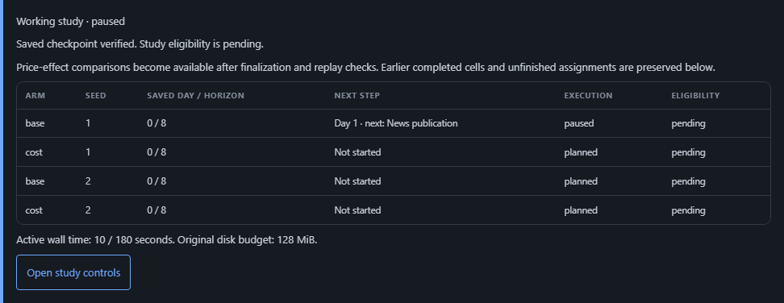

# Paused study recovery: implementation contract

Status: scripted committed-day and opt-in phase recovery, CLI/operator controls,
saved working studies and portable working evidence are implemented. Updated
2026-09-07; verification is recorded in the execution log. Hard-crash recovery
and live-provider research execution remain outside this contract.
Source checkpoints inspected: `0b454b1` and `88f1e89`. This closes the implementation-design
gap in [S1](2026-09-06-research-city-specs.md#s1-research-contract-and-experiment-integrity)
before further household, school, production or banking expansion. It does not
replace the [five-part roadmap](2026-09-06-research-city-roadmap.md).

## Current executor

`research/working_attempts.py::execute_working_attempt` advances one declared
scripted cell under a process-owned batch lock. The `preserve_and_resume` policy
uses `working-attempt-v2` for committed days; `preserve_and_resume_phases` uses
`working-attempt-v3` for saved phases. Both require semantics 7 or later with
persisted PRNG state. `prepare_study` binds the selected protocol and
its cumulative-active-time contract before execution. The ordinary study
runner dispatches both policies through `research/working_studies.py`. Local
operator pilots opt into version 3 when the reviewed request chooses a step
pause; ordinary saved-day requests retain version 2. Legacy finalized
version-1 studies retain their original read-only disposition.

An intact committed-day pause retains pending eligibility and append-only
segment receipts. It has no final source/replay/result receipt. Resume checks
the complete manifest, input snapshots, code/configuration, genesis, closed
source bytes, schema, phase, PRNG, references and ledger before opening a
writable Store. Source preflight uses an immutable SQLite reader only after
checking that the hash-bound source is closed and has no WAL/SHM/journal; it
does not apply that mode to live databases. Completed, failed, legacy finalized
or unreceipted attempts refuse in-place resume.

The cell executor accounts for accumulated active time across existing batch cells,
checks disk/time at committed days and before publication, and records
finalization time separately. These checks are cooperative: a single slow day
or evidence operation can exceed a sampled limit. The batch supervisor now
terminates its owned worker when a 200 ms poll detects time/disk exhaustion,
including during initialization and replay. A parent-process guard stops the
child if the supervisor dies. Sampling, the current write, process shutdown and
final diagnostic receipts can exceed a threshold; these are not filesystem quotas.
Operator idle time between calls is excluded by the new timing contract.
Closed results receive a hash seal before their timing can contribute to a
later cell's budget. A changed result or a missing finalization seal prevents
that continuation; failures retain their actual last completed day.

For a prepared 30-day scripted specification, the internal API is:

```python
from research.studies import prepare_study
from research.working_attempts import execute_working_attempt

batch = prepare_study(spec, config, input_root=".",
                      data_root="data/studies", out_dir="reports/out")
cell = dict(batch=batch, spec=spec, config=config, input_root=".",
            seed=spec.randomness.seeds[0], arm=spec.arms[0].key)
paused = execute_working_attempt(**cell, max_ticks=3)
completed = execute_working_attempt(**cell, resume=True)
```

Keep the checkout and declared inputs unchanged between these calls. The
working source is expected to advance; prior manifests and segment receipts
remain unchanged. Finalization reuses the existing independent replay and
receipt verifier, with added checks for working-segment lineage and PRNG state.
This cell API alone does not publish batch reports. Use the supervised runner
below for batch execution. Version 2 retains its committed-day requirement;
version 3 uses the explicit phase checks below.

## Version 3 phase recovery

Select `operations.pause_policy: preserve_and_resume_phases` before preparing
a new study. The phase position receipt (`working-phase-position-v1`) contains:

| Field | Evidence |
|---|---|
| `completed_tick`, `active_tick`, `next_phase` | The last completed day and the exact next phase of its successor, within the declared horizon |
| `phase_state_sha256` | Digest of queued decisions, the saved conversation plan and observation-capture marker |
| `prng_sha256` | Digest of the engine, persona and lifecycle random streams; all must be restorable |
| `recorded_inputs` | Count, last ID and SHA-256 of all admitted `llm_calls` through this position |

The input digest streams canonical JSON row digests in ID order, with a newline
after each digest. It includes the full private recorded-call row. Every earlier
prefix is checked against the current source in one scan. Each pause binds its
complete preceding segment history. A later receipt cannot omit an earlier
prefix to authorize changed inputs. These are consistency checks within the
bound artifact chain, not authentication of an unknown publisher.

Read-only validation requires a modern paused source, the correct active day,
a phase from the stored engine semantics and structurally valid phase state.
Decisions may appear only after morning; a completed conversation phase must
retain its plan; finalization must retain the observation-capture marker.
Closed days have empty phase state. A phase or recorded-input count cannot go
backward. A cooperative repeated outage may leave the same phase and input
prefix, but still consumes the original cumulative active-time budget. The
1,024-segment bound applies independently of the supervisor invocation bound.

`World.run(pause_after_phase=...)` pauses after the named phase and its next
position are committed. `--pause-after-phase` uses the engine phase names:
`NIGHT_CLOSE`, `MORNING`, `EXECUTION`, `MARKET`, `NEWSROOM`, `EVENING`, `MEMORY`,
`FINALIZE`, plus `INBOX_DELIVERY` for semantics 8+. It cannot be combined with
`--pause-after-ticks`. If resuming beyond the requested phase, execution reaches
its next occurrence, subject to the remaining horizon. Omitting both controls
finishes the remaining assignment. This changes operational stopping only;
economic semantics and historical default execution remain unchanged.

```powershell
# study.yaml must already declare preserve_and_resume_phases and match this config.
.\.venv\Scripts\python.exe -m research.study_runner study.yaml --config runs/price-lab-keyed.yaml --pause-after-phase MARKET
# Set this to the batch directory returned above; retain the original inputs and roots.
$batchDirectory = 'data/studies/<study-key>/<manifest-and-batch-id>'
.\.venv\Scripts\python.exe -m research.study_runner study.yaml --config runs/price-lab-keyed.yaml --resume-batch $batchDirectory --validate-only
.\.venv\Scripts\python.exe -m research.study_runner study.yaml --config runs/price-lab-keyed.yaml --resume-batch $batchDirectory
```

Version 3 also accepts the engine's cooperative provider/interrupt pause after
some inputs have been admitted. Research execution remains provider-free: tests
inject outages into the scripted adapter. This does not authorize paid/live
studies. A missing worker or segment receipt, unclosed SQLite state or exhausted
budget still refuses resume. No interrupted worker is relabeled as a clean pause.

An active day has null metrics, no measurement series and explicit
`partial_phase` observations with reason `unfinished_day_not_measured`.
Recorded inputs, reconciled partial state and completed-day count are recovery
evidence; they do not establish a completed price window. Finalization still
requires the full horizon, a closed day, integrity checks and an independently
executed exact recorded replay.

Private ZIP export/import retains the phase/input evidence and pending
eligibility. The public operator projection exposes only completed day, active
day and next phase, after verification. It does not expose queued decisions,
conversation pairs, private call data or their hashes. The library and job UI
show the next step separately from saved-day counts. The reviewed operator
step selector uses the fixed pilot's supported phases; existing resume authority,
idempotency, code/configuration checks and cumulative budgets are unchanged.



The desktop capture above and [mobile capture](../research/assets/study-phase-progress.png)
use mocked UI evidence. Real execution, recovery and replay are checked separately
by the backend acceptance suites.

## Supervised runner and CLI

Set `operations.pause_policy: preserve_and_resume` in the study specification
before preparing a new study. Its resolved configuration hash must match the
selected config. Changing an existing manifest to enable recovery is refused.
Both goods and equity outcomes use this same execution path.

```powershell
# Use your validated study.yaml and its matching configuration.
.\.venv\Scripts\python.exe -m research.study_runner study.yaml --config runs/household-rehearsal.yaml --pause-after-ticks 3
# Set this to the exact data directory printed in the first command's batch field.
$batchDirectory = 'data/studies/<study-key>/<manifest-and-batch-id>'
.\.venv\Scripts\python.exe -m research.study_runner study.yaml --config runs/household-rehearsal.yaml --resume-batch $batchDirectory --validate-only
.\.venv\Scripts\python.exe -m research.study_runner study.yaml --config runs/household-rehearsal.yaml --resume-batch $batchDirectory
```

Keep any custom `--input-root`, `--data-root` and `--out-dir` arguments identical
across commands. `--pause-after-ticks` caps additional days per cell and stops
the batch at its first clean pause. Without that flag, resume finishes the
paused cell and remaining planned cells. The same API arguments are available
on `run_study`. CLI exit codes are 0 for completed execution, 1 for an incomplete
or paused study, and 2 for rejected validation; eligibility and missing outcomes
still require inspecting the resulting evidence.

Each invocation owns a separate supervisor lock, while its child owns the
working-attempt writer lock. Resume validates the full batch twice, including
under ownership, before creating its invocation record. Completed cells retain
their original bytes. Paused progress keeps every assigned cell and pending
eligibility; it writes `progress-NNNNNN.json`, never `results.json` or a study
publication receipt. Finalization publishes the existing result/report format
once, with the supervision contract in its operations metadata.

Append-only invocation start, end and seal records bind each progress report,
worker receipt, prior invocation and cumulative active wall time. Successful
invocations include preparation/validation, worker startup, source execution,
replay and report publication. The final timing receipt/seal has small recording
overhead; operator idle time is excluded. Resume uses the cumulative supervisor
time, which must also cover the cell executor's recorded time. It cannot raise
or reset the original budget. Missing starts, ends or seals leave crash accounting
unresolved and refuse continuation. The history limit is 1,024 invocations.

Finalized result loading and private ZIP export/import verify both supervisor
and attempt lineage, including prior pauses and result timing seals. Working
progress is inspectable through JSON/CLI and the local saved-study library.
The existing UI job-slot release action still does not resume scientific execution.

## Saved working evidence and operator recovery

The library uses one stable batch ID from preparation through finalization.
Before the first closed checkpoint it shows assigned cells with unavailable
saved-day evidence. A verified pause shows each assignment, last saved day,
execution status and eligibility. Active or damaged checkpoints stay unverified.
Working studies never expose price-effect comparisons, even when some cells
have finished; the finalized comparison contract remains separate.

`research/working_evidence.py` verifies frozen inputs, supervisor/segment
lineage, closed source bytes and independently recorded observations without
requiring the current checkout to match. Private working export holds both
batch ownership locks while copying the exact evidence. On Windows the locked
control bytes are read through their owning handles. The explicit
`study-working-evidence-bundle-v1` format preserves pending study eligibility
after import, including after the original live source advances. It is an
evidence copy, not a grant of execution compatibility or a complete runtime.

In **Create a study**, an optional saved-day pause is part of the reviewed
request. After a receipted pause, **Resume saved study** appears only after
read-only compatibility checks against the original fixed pilot profile,
manifest, source/config/input identities, namespace and remaining cumulative
budget. The POST binds both the progress digest and a fresh resume-check digest.
It cannot change seeds, horizon, policy or resource limits. The same local
run/fork/Live cursor and CSRF authority are required.

Resume creates an immutable continuation job linked to its parent; the parent
claim, terminal record and scientific receipts remain unchanged. Repeating
the same request returns that continuation, while a different key conflicts.
The existing supervised runner rechecks ownership and compatibility before
scientific writes. Failed, finalized, legacy or interrupted unreceipted work
cannot be turned into a clean pause. Source incompatibility leaves the saved
checkpoint readable. The library links only jobs originating in that operator
workspace and context; arbitrary CLI or imported studies are not adopted.

## Existing behavior and compatibility boundary

`research/attempts.py::execute_attempt` exclusively creates a cell directory,
then publishes source and result receipts even when execution pauses. Those
version-1 attempts are finalized artifacts. `research/study_runner.py::run_study`
also publishes the enclosing results and publication receipt after a pause.
Neither artifact may become writable through a new resume command. Retrying a
legacy finalized attempt requires a new attempt identity.

`run.py::open_run` already restores persisted configuration, world status and
PRNG state for ordinary simulation resume. It opens a writable Store, which may
run additive migrations. Research compatibility checks must therefore finish
with a read-only Store before calling it. Do not use its ordinary operational
configuration overrides to alter a research contract.

`research/process_lock.py::process_lock` supplies a portable process-owned
lock. `research/artifacts.py::publish_json` and `publish_bytes` deliberately
refuse replacement. Reuse them for manifests, segment records and final
receipts. Do not weaken their immutable publication semantics to make progress
updates convenient.

## Delivery order

1. Introduce an explicit working-attempt protocol alongside version 1. Bind
   the claim to the study manifest, code identity, resolved arm configuration,
   input and model-description hashes, seed, horizon, behavior policy and
   schema/semantics. Persist operational progress separately from this claim.
2. Support a clean pause at a committed day boundary, with an append-only
   segment receipt binding the closed source database, canonical state, PRNG,
   phase, genesis and claim hashes. A paused working attempt has pending
   eligibility and no final source/replay/result receipt.
3. Add read-only resume validation and an exclusive writer lock held through
   execution and receipt publication. Recheck the bound database after taking
   the lock. Validate all declared inputs and current code before opening a
   writable Store. Refuse changed files, aliases outside the owned namespace,
   missing segment receipts, incompatible schema/semantics, invalid ledger or
   references, external-agent influence, terminal/finalized attempts and an
   already active owner. Rejections must preserve every scientific byte.
4. Resume from the remaining horizon using restored engine/persona PRNG state;
   never reinitialize genesis, reseed the world or replay settled actions.
   Add partial-phase recovery only after proving phase-specific idempotence and
   recorded-input handling. Until then, refuse an unfinished active tick with
   a named reason rather than treating it as a clean pause.
5. Integrate batch recovery into the study runner and CLI. A resume command
   selects an existing working batch and verifies the same specification and
   configuration. Already completed cells retain their original receipts;
   only the compatible paused cell and remaining planned cells execute.
   Preserve every segment and exclusion. Publish aggregate results once all
   assigned cells have reached their declared terminal disposition.
6. Extend evidence verification, portable exports, the saved-study library
   and local operator jobs together. Working studies must remain discoverable
   with their actual completed horizon and pending eligibility. UI recovery
   retains run/fork authorization, CSRF, path confinement, supervisor locks
   and orphan-worker termination. Show a Resume action only when its checked
   contract is compatible. Both goods and equity studies use the same path.

## Operational and publication rules

- Track cumulative active execution time, provider calls/tokens/spend and
  artifact bytes across segments. Resuming must not reset a study's declared
  limits. Exclude operator idle time only under an explicit versioned timing
  definition. Exhausting a fixed protocol budget cannot authorize a larger
  budget; a changed protocol requires a new study/attempt identity.
- Distinguish a cooperative, receipted pause from a killed or crashed worker.
  An unmatched segment-start record or unverifiable SQLite/WAL state is not
  resumable merely because its process disappeared. Preserve it as failed or
  pending evidence, with a named recovery disposition.
- Close the source before hashing and publish final evidence in the existing
  source -> independent recorded replay -> verified result order. A crash
  between stages stays pending/ineligible. The existence of a database or a
  `completed` label alone cannot authorize a complete-window comparison.
- A study result may refer only to frozen attempt receipts. Once published,
  source/replay/result artifacts remain immutable. New analyses create new
  artifacts with explicit lineage rather than replacing an earlier report.

## Required acceptance evidence

- A scripted three-day pause followed by resume to day 30 equals an
  uninterrupted source and its independent recorded replay across canonical
  tables, realized decisions, ledger, PRNG state and measurements.
- The day-three working state cannot enter a day-30 effect. A paused batch
  retains all assigned arms and seeds, including cells not yet started.
- Manifest, code, policy, config, input, source, PRNG, phase and schema changes
  each refuse resume before any scientific write. Legacy finalized paused
  attempts, completed attempts and failed attempts also refuse in-place resume.
- Concurrent resume calls admit exactly one writer. Supervisor termination
  cannot leave an unbudgeted worker or convert an interrupted segment into
  successful evidence. No resume path resets cumulative operational limits.
- Export/import verification retains segment provenance and detects altered
  ancestry. Historical results remain unchanged and visible after a later
  resume, rejection, failure or new attempt.
- Run bounded focused tests under a short Windows temporary root with a
  40 GiB free-space preflight. Use CI shards for the complete Python suite;
  record interrupted or disk-exhausted checks as inconclusive.
