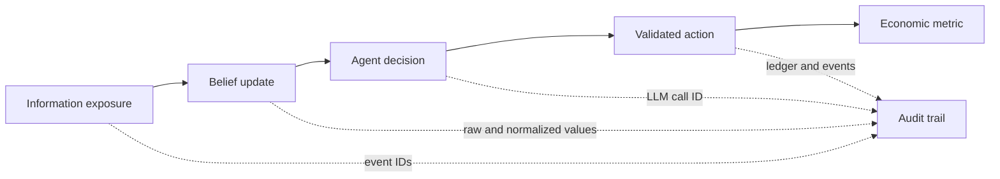

# Research guide and use cases

## What this app is for

Agent Economy is an instrument for studying how information, beliefs, and
institutional decisions interact inside a mechanically consistent miniature
economy. It is useful for:

- misinformation and bank-run experiments;
- monetary-policy transmission through banks, firms, and households;
- comparing agent/provider behaviors under the same deterministic mechanics;
- causal demonstrations for economics, AI-agent, and systems courses;
- testing forecast calibration and evidence-bounded Oracle designs;
- studying cost, replay, and auditability in large multi-agent workflows.

It is not a forecast of the real economy, financial advice, or a calibrated
policy model. Scripted runs prove mechanics; live-provider runs add behavioral
evidence but still do not establish external validity.

## Causal chain model

The main research chain is:



Rumor shocks only add observations. They never lower trust or move deposits
directly. The acceptance evaluator uses each exposed depositor's actual
pre-rumor trust and minimum ten-tick value, requires at least a 20% relative
decline from that individual baseline, then checks conversations and outflows.
Runs without belief history fail closed.

## Reproducible experiment workflow

1. State the hypothesis, treatment, outcome, window, and exclusion rules before
   running.
2. Choose a maintained profile and record commit, resolved config, seed(s), and
   semantics version.
3. Run a free scripted rehearsal to validate mechanics and evidence capture.
4. Use treatment/control arms with identical seeds when estimating an effect.
5. Check reconciliation and failure events for every arm.
6. Report distributions, effect size, uncertainty, and negative findings—not
   only a mean or a visually interesting trajectory.
7. Preserve databases and generated evidence with the exact code/config.

Reviewed phenomena YAML must carry the exact top-level `run_id`; acceptance
rejects missing or cross-run evidence even if the named metric moved in the same
direction by coincidence.

Example:

```powershell
python run.py --experiment runs/experiments/rumor_vs_control.yaml
```

## Reading macro metrics

- `gdp_proxy`: final-goods sales during one tick; it excludes wages.
- `gdp_proxy_30d`: rolling 30-tick sum of final-goods sales.
- `labor_income`: gross wages paid during one tick. Because payroll is periodic,
  the dashboard presents this flow as a rolling 30-day total so income remains
  visible between paydays.
- `cpi`: inventory-weighted goods price index, with genesis at tick 0.
- `inflation_30d`: CPI change versus 30 ticks earlier, available from tick 30.
- `cpi_yoy`: CPI change versus 365 ticks earlier, available from tick 365.

Before tick 30, policy agents use the configured inflation target. From tick 30
through 364 they use a bounded, linearly annualized 30-day signal. From tick 365
they use true year-over-year inflation.

These are simulation measures, not national-accounting statistics.

## R21 calibrated initialization

`runs/r21-real-us.yaml` replaces the synthetic starting distributions with
weighted draws from pinned public statistics while leaving the simulation's
people and firms fictional. The Federal Reserve 2022 SCF summary extract supplies
annual income, work status, and liquid financial assets; Census 2022 SUSB
supplies national employer-firm size classes. Every draw records its source
support and the run reports fixed-quantile distance against the same-seed
synthetic baseline.

This is an initialization calibration, not a forecast of the United States.
SCF `NETWORTH` is retained as an engine-owned, off-ledger calibration baseline
and exposed through agent provenance, but it is not posted to bank accounts
because it includes property, business assets, and debt. Use paired seeds to
compare synthetic and `real_us` arms and keep later endogenous outcomes separate
from the source-data fit at tick 0.

## Oracle evidence

Oracle questions are read-only. A prediction stores probability, drivers,
confidence, bounded tool evidence, a resolution rule, deadline, outcome, and
Brier score. Production acceptance schedules six questions and requires all
six prediction-bound end-to-end planning-and-answer latency samples before
enforcing p90. Unknown or malformed resolution rules fail as insufficient data
and never age into a scored negative outcome.

Calibration improves only after many resolved live predictions. One run can
prove wiring and scoring, not forecast quality.

The active release calibration design therefore preregisters ten fixed v6
profiles under `runs/oracle`, six forecasts per run, fresh seeds 7351–7360, and
alternating control/rumor arms. Only the `kimi-for-coding-highspeed` Oracle is
live; background behavior remains scripted so the campaign isolates the
forecast surface. Treatment windows publish a one-person rumor
precursor one tick before each forecast and apply the larger depositor-targeted
rumor one tick afterward; controls receive neither. This makes arm evidence
observable at forecast time while keeping the later scored response distinct,
and profile validation locks the schedule before any live run. The explicit manifest binds run IDs, seeds,
source/replay database paths, profile paths, and hashes. V6 also uses
occurrence-aware public-citation identity so payload-equivalent articles at
different source events remain distinct during replay. Each fixed profile is
executed with `--oracle-campaign-run`, which finalizes the source, creates and
finalizes its exact offline replay, and emits the manifest entry; a separately
invoked manual replay is not campaign evidence. Passing requires 10 eligible
runs, at least
60 resolved forecasts, both outcome classes, end-to-end p90 below 60 seconds,
and Brier below the naive p=0.5 score of 0.25. Every finalized source must also
replay exactly offline. This evidence says nothing by itself about the cost or
stability of the separate 365-day live-agent acceptance run.

The archived `oracle-calibration-v1-s7301` source is not part of that evidence.
It completed tick 335 with valid provider provenance, but replay diverged at the
first arrival because staged genesis reset an uncheckpointed persona RNG
stream; checkpoint inspection also retained SQLite sidecars. It is preserved as
diagnostic evidence only. The preceding replay-integrity revision persists and
validates both semantics-7 RNG streams, finalizes standalone checkpoints, and
enforces the replay target tick; its focused and full verification passed.

The immutable v2 seed-7311 source and generated replay both reached tick 335 and
crossed that arrival without divergence. Canonical verification returned
`exact: true` with `differences: []`. Its receipt failed for a different reason:
checkpoint integrity counted all stored agent rows rather than the
bounded living population after a deceased row was preserved and a replacement
arrival was added. V2 is diagnostic evidence and is never reused. The receipt
contract validates living/deceased census consistency; chronological
death/schedule/arrival linkage; `NIGHT_CLOSE` event and subject provenance;
one-time due-schedule consumption; and the fixed 5–20-tick replacement delay.
It uses conservative 3x metering and retains a $25 per-run cap.

V3 seed 7321 completed its source and exact companion replay, but its original
receipt admitted only four of six forecasts because authenticated rejected
planner attempts were incorrectly treated as invalid accepted plans. The
original receipt records the pre-inspection source hash. The local source
artifact was later write-opened during diagnosis, so v3 is excluded diagnostic
evidence and cannot enter the active corpus.

V4 seeds 7331 and 7332 produced eligible exact source/replay receipts. They are
preserved as diagnostic evidence and are not reused. Seed 7333 also completed
an exact source/replay pair, but the receipt correctly made its tick-125
forecast, run, and fixed campaign ineligible. Attempt 1 asked
`get_ledger_summary` for `entity_type: gov`; the runtime looked only for
`accounts.owner_type='gov'`, while the treasury is
`owner_type='system', label='sys:gov'`, and returned
`entity ledger accounts not found`. Runtime then mislabeled and retried that
post-preflight execution failure as `oracle_tool_plan_rejected`. Attempt 2 was
the independently reproducible `names must contain 1 to 10 valid metric names`
error, and attempt 3 succeeded. The receipt could not independently reproduce
or bind attempt 1 and therefore excluded the evidence. No v4 source, response,
claim, checkpoint, replay, or seed entered v5, and none enters v6.

V5 shared one state-aware plan preflight between live runtime and receipt audit.
The scheduled-tick catalog bounds historical entity IDs and tick ranges,
government ledger reads map to the system-owned `sys:gov` treasury, and a
failure after successful preflight is recorded as a tool execution failure
rather than a retryable planner rejection. Rejected plans still bind their full
independently reproduced error, persisted rejection event, and monotonic retry
ordinal; only the final accepted plan is validated as executed evidence.

V5 seeds 7341–7347 then produced eligible exact source/replay receipts, with
total campaign spend of $2.34616974 through that point. Seed 7348 completed its
source, but its offline replay was not exact: repeated public citation classes
at ticks 301 and 331 were resolved through ambiguous surrogate candidates. That
produced four replay-only newsroom-grounder fallbacks and differences across
nine information tables. LLM calls, actions, schedules, and the source artifact
remained exact, which isolated the defect to citation identity rather than live
provider behavior. Seeds 7349 and 7350 were never run. V5 is diagnostic only;
no v5 artifact enters v6. The seven receipt-bound replay databases and fourteen
Oracle source/replay receipts belong only to seeds 7341–7347; seed 7348 has no
eligible replay database or Oracle source/replay receipt. Final corrected
offline replay `replay-oracle-calibration-v5-s7348-5220b912ae` reached tick 335
with `exact: true`, identical logical hash `fee77b65…b378`, all 82 deterministic
tables exact, and `differences: []`; this post-source fix remains diagnostic and
creates no eligible v5 receipt. Completed cleanup removed 320 v5
source-checkpoint database bodies, 160 fixed-code replay checkpoint bodies,
four derived fixed-replay final databases, and the superseded partial seed-7343
replay: 485 database files and `111.945217 GiB` total. Retained artifacts are all
authoritative final sources; the seven eligible replay databases and fourteen
source/replay receipts for seeds 7341–7347; all source-checkpoint
manifests/hashes, claims, and reports; the 160 fixed-code replay checkpoint
manifests; and the ignored compact final exact receipt. Seed 7348 remains
excluded and has no eligible source/replay receipt or retained replay database.

## Evidence hierarchy

Strongest to weakest:

1. committed invariant/replay tests and a reconciled persisted database;
2. machine-readable acceptance receipt bound to an exact run/profile;
3. multi-seed treatment/control artifacts with uncertainty;
4. reviewed causal traces linked to event IDs and metrics;
5. dashboard screenshots or narrative observations.

The stopped live run `f7c6238bf5` is intentionally retained as diagnostic
evidence. It exposed invalid information boundaries and measurement gaps; it is
not acceptance proof. See [its diagnostic record](live-run-f7c6238bf5.md).

## Current next research steps

Completion of the v6 Oracle campaign, capped rumor pilot, 365-day/$200 acceptance
run, and final provenance audit are separate pending gates. The release pull
request stays draft; merging, tagging, publication, and public deployment need
separate authorization. After those gates:

- add a causal explorer from exposure to belief to action to metric;
- formalize experiment preregistration;
- report confidence intervals and standardized effect sizes;
- extend the predeclared Oracle corpus only through a new versioned campaign,
  never by adding post-hoc runs to a completed manifest;
- use the pinned R21 mode for preregistered initialization-sensitivity studies,
  keeping calibration provenance separate from endogenous mechanics.
