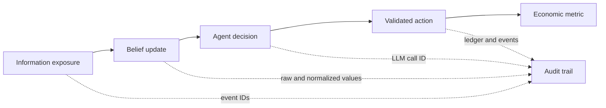

# Research guide and use cases

## What this app is for

Agent Economy is an instrument for studying how information, beliefs, and
institutional decisions interact inside a mechanically consistent miniature
economy. It is useful for:

- misinformation and bank-run experiments;
- monetary-policy transmission through banks, firms, and households;
- comparing agent/provider behaviors under the same deterministic mechanics;
- causal demonstrations for economics, AI-agent, and systems courses;
- testing forecast calibration and evidence-bounded Oracle designs;
- studying cost, replay, and auditability in large multi-agent workflows.

It is not a forecast of the real economy, financial advice, or a calibrated
policy model. Scripted runs prove mechanics; live-provider runs add behavioral
evidence but still do not establish external validity.

## Causal chain model

The main research chain is:



Rumor shocks only add observations. They never lower trust or move deposits
directly. The acceptance evaluator uses each exposed depositor's actual
pre-rumor trust and minimum ten-tick value, requires at least a 20% relative
decline from that individual baseline, then checks conversations and outflows.
Runs without belief history fail closed.

## Reproducible experiment workflow

1. State the hypothesis, treatment, outcome, window, and exclusion rules before
   running.
2. Choose a maintained profile and record commit, resolved config, seed(s), and
   semantics version.
3. Run a free scripted rehearsal to validate mechanics and evidence capture.
4. Use treatment/control arms with identical seeds when estimating an effect.
5. Check reconciliation and failure events for every arm.
6. Report distributions, effect size, uncertainty, and negative findings—not
   only a mean or a visually interesting trajectory.
7. Preserve databases and generated evidence with the exact code/config.

Reviewed phenomena YAML must carry the exact top-level `run_id`; acceptance
rejects missing or cross-run evidence even if the named metric moved in the same
direction by coincidence.

Example:

```powershell
python run.py --experiment runs/experiments/rumor_vs_control.yaml
```

## Reading macro metrics

- `gdp_proxy`: final-goods sales during one tick; it excludes wages.
- `gdp_proxy_30d`: rolling 30-tick sum of final-goods sales.
- `labor_income`: gross wages paid during one tick. Because payroll is periodic,
  the dashboard presents this flow as a rolling 30-day total so income remains
  visible between paydays.
- `cpi`: inventory-weighted goods price index, with genesis at tick 0.
- `inflation_30d`: CPI change versus 30 ticks earlier, available from tick 30.
- `cpi_yoy`: CPI change versus 365 ticks earlier, available from tick 365.

Before tick 30, policy agents use the configured inflation target. From tick 30
through 364 they use a bounded, linearly annualized 30-day signal. From tick 365
they use true year-over-year inflation.

These are simulation measures, not national-accounting statistics.

## R21 calibrated initialization

`runs/r21-real-us.yaml` replaces the synthetic starting distributions with
weighted draws from pinned public statistics while leaving the simulation's
people and firms fictional. The Federal Reserve 2022 SCF summary extract supplies
annual income, work status, and liquid financial assets; Census 2022 SUSB
supplies national employer-firm size classes. Every draw records its source
support and the run reports fixed-quantile distance against the same-seed
synthetic baseline.

This is an initialization calibration, not a forecast of the United States.
SCF `NETWORTH` is retained as an engine-owned, off-ledger calibration baseline
and exposed through agent provenance, but it is not posted to bank accounts
because it includes property, business assets, and debt. Use paired seeds to
compare synthetic and `real_us` arms and keep later endogenous outcomes separate
from the source-data fit at tick 0.

## Oracle evidence

Oracle questions are read-only. A prediction stores probability, drivers,
confidence, bounded tool evidence, a resolution rule, deadline, outcome, and
Brier score. Production acceptance schedules six questions and requires all
six prediction-bound end-to-end planning-and-answer latency samples before
enforcing p90. Unknown or malformed resolution rules fail as insufficient data
and never age into a scored negative outcome.

Calibration improves only after many resolved live predictions. One run can
prove wiring and scoring, not forecast quality.

The release calibration design therefore preregisters ten fixed profiles under
`runs/oracle`, six forecasts per run, and alternating control/rumor arms. Only
the Kimi Oracle is live; background behavior remains scripted so the campaign
isolates the forecast surface. Treatment windows publish a one-person rumor
precursor one tick before each forecast and apply the larger depositor-targeted
rumor one tick afterward; controls receive neither. This makes arm evidence
observable at forecast time while keeping the later scored response distinct,
and profile validation locks the schedule before any live run. The explicit manifest binds run IDs, seeds,
source/replay database paths, profile paths, and hashes. Each fixed profile is
executed with `--oracle-campaign-run`, which finalizes the source, creates and
finalizes its exact offline replay, and emits the manifest entry; a separately
invoked manual replay is not campaign evidence. Passing requires 10 eligible
runs, at least
60 resolved forecasts, both outcome classes, end-to-end p90 below 60 seconds,
and Brier below the naive p=0.5 score of 0.25. Every finalized source must also
replay exactly offline. This evidence says nothing by itself about the cost or
stability of the separate 365-day live-agent acceptance run.

## Evidence hierarchy

Strongest to weakest:

1. committed invariant/replay tests and a reconciled persisted database;
2. machine-readable acceptance receipt bound to an exact run/profile;
3. multi-seed treatment/control artifacts with uncertainty;
4. reviewed causal traces linked to event IDs and metrics;
5. dashboard screenshots or narrative observations.

The stopped live run `f7c6238bf5` is intentionally retained as diagnostic
evidence. It exposed invalid information boundaries and measurement gaps; it is
not acceptance proof. See [its diagnostic record](live-run-f7c6238bf5.md).

## Current next research steps

The capped rumor pilot, explicit Oracle campaign, and 365-day acceptance run
are separate pending gates. After those gates:

- add a causal explorer from exposure to belief to action to metric;
- formalize experiment preregistration;
- report confidence intervals and standardized effect sizes;
- extend the predeclared Oracle corpus only through a new versioned campaign,
  never by adding post-hoc runs to a completed manifest;
- use the pinned R21 mode for preregistered initialization-sensitivity studies,
  keeping calibration provenance separate from endogenous mechanics.
