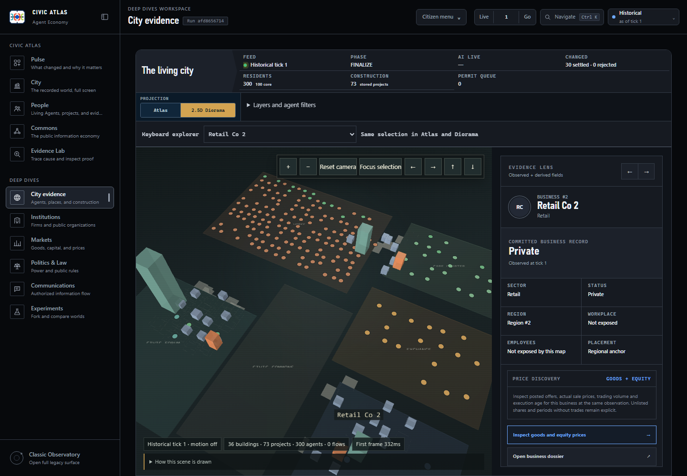

# City observation and price inspection

The City evidence workspace connects the existing Atlas and 2.5D Diorama to
the Price Discovery Lab. It is a read-only observer. The separate full-screen
recorded-day City route retains its existing animation clock; completing that
integration remains part of W4 in the [execution log](../plans/2026-09-06-research-city-execution.md).

## Inspect a business

1. Open City evidence at the desired run, fork and tick.
2. Click a business in Atlas, or select it in **Keyboard explorer**. The same
   selector reaches people, public places and construction records in both views.
3. Switch to **2.5D Diorama**. Selection remains in the URL. Use Focus selection,
   zoom, the four pan buttons or pointer panning to adjust the view.
4. Choose **Inspect goods and equity prices**. Both domains use the same business
   and observation window. The lab distinguishes offers, executions, quantities,
   no-trade periods and unlisted equity; a missing price stays missing.
5. **Explore the city** restores the city renderer, camera and filters. Changing
   the business in the lab selects that business on return. Browser Back also
   restores prior discrete selections and camera commands.

An employee's lens offers **Inspect employer** when its business is present in
the map projection. A projected business workplace and its owner link to each
other. Missing employee counts or workplaces are labelled unavailable; the map
does not read private balances or infer undisclosed employment.

On a narrow screen, **Open selected evidence** moves from Diorama to the
inspector. Optional agent search, activity filters and layers live under
**Layers and agent filters**. A URL with an active agent search/filter opens
that panel initially. Atlas remains available when WebGL cannot start.

## Observation context

The city loads its map first, then pins civic summary and event/summary reads
to that map's actual tick and fork. Run, tick, fork, projection name, semantics,
policy and visibility-key checks must pass before releasing the combined frame.
A failed or mismatched frame withholds the cached marks. The requested map
layers include construction projects and flows as well as agents and places.

Current provider activity has separate run/fork context and a `private, no-store`
response. Historical city views neither request it nor display cached activity.
Terminal runs and failed telemetry refreshes withhold cached active indicators.
Queued/thinking marks remain ephemeral telemetry, distinct from settled events.
The runtime read itself makes no scientific database writes.

## URL and renderer contracts

- `firm` is a positive integer, mutually exclusive with `agent`, `place` and
  `project`. Validation against the selected map precedes use. Existing agent,
  place and aggregate-project URLs remain supported.
- `camera=x,y,zoom` stores only bounded display coordinates: x/y 0–100 and zoom
  1.8–5.4. Default camera values are omitted. Diorama keeps its fixed orientation;
  numeric bookmarks cannot add arbitrary renderer properties.
- Camera buttons create history entries; continuous pointer changes replace the
  current entry. Switching to Atlas retains the bookmark for returning to Diorama.
  Atlas camera controls and a persistent follow mode remain pending.
- Evidence links carry a bounded `city` return hint for renderer, selection,
  filters and camera. Destination workspaces retain their own `view` parameter.
  Returning admits only known display fields; the destination's current run,
  fork and tick always take precedence over values inside the hint. It is never
  an external redirect or an economic command.

Building heights, district shapes and interpolated positions are visual
encodings, not canonical geometry. A firm's location distinguishes its recorded
workplace, a regional anchor and a derived district placement. Construction
geometry still uses stored work; dense projects show their text when selected
and retain their inspector and keyboard entries. The scene footer explains its
encodings without covering the frame-status labels.

## Verification scope

Browser regressions cover mismatched frames, historical request suppression,
foreign runtime, terminal cached activity, camera reload/history, workplace
links and the city → prices → city workflow. Unit checks cover bounded URL
parsing and rejection of cross-scope return hints. Production smoke inspection
uses an isolated 300-resident paused world and no provider calls.

These checks establish UI/data-contract behavior. They do not establish that
the economic model matches empirical markets or that the full city/society
roadmap is complete.
