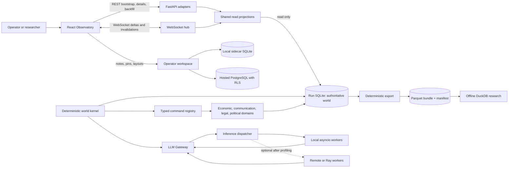
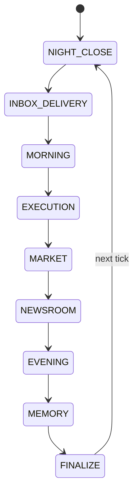

# World OS Technical Specification

**Version:** 1.0<br>
**Date:** 2026-07-18<br>
**Status:** Semantics 8 released; Semantics 9/10 implementation present; hosted rollout evidence pending<br>
**Product contract:** [World OS PRD](PRD.md)<br>
**Framework decision:** [Framework research](FRAMEWORK-RESEARCH.md)

## 1. Architecture decision

World OS is an extension of the current Agent Economy process, not a replacement
runtime. The authoritative topology remains:

- one semantics-versioned Python world kernel;
- one writer for one SQLite database per run;
- one provider-neutral Gateway for all inference;
- one FastAPI process serving local REST, WebSocket, and static React assets;
- an optional hosted PostgreSQL control plane and single-writer supervisor;
- separate derived projections, operator workspace data, and research exports.

The first implementation lake is communications plus causal investigation. It uses
engine semantics 8 and schema 12.

The next compatibility layers retain that topology. Schema 13 / semantics 9 adds
`agents.external.ExternalAgentService`, hash-only credentials, versioned turn envelopes,
recorded action receipts, REST adapters, and Streamable HTTP MCP. Schema 14 / semantics 10
adds `world.commons.CommonsService`, versioned deterministic feeds, immutable delivered/read
impressions, and explicit-read factual exposure. Hosted PostgreSQL remains the human tenant
control plane; each run's SQLite database remains authoritative for actor, turn, action,
Commons, and replay state.

## 2. System context



### 2.1 Trust boundaries

```text
UNTRUSTED / BOUNDED                         AUTHORITATIVE

LLM output ------> typed validation ------> domain operation ------> SQLite commit
browser input ---> API validation --------> run control -----------> kernel
WS delta --------> client cursor check ----> query invalidate ------> REST rebuild
remote worker ---> result validation ------> ordered collector -----> Gateway record

Operator notes ----------------------------------------------------X world truth
Research exports --------------------------------------------------X live mutation
```

An `X` means there is deliberately no write path.

## 3. State ownership

| State | Authoritative owner | Mutation path | Replay status |
|---|---|---|---|
| Money, contracts, agents, firms, messages, grants, events, causal links | Run SQLite | Kernel/domain transaction only | Required |
| LLM requests and responses | Run SQLite through Gateway | Gateway durable request key | Required |
| Live read projection payloads | Rebuildable projection builders and bounded cache | FINALIZE coordinator/read request | Derived |
| UI navigation | URL | React Router | Not world state |
| REST cache and connection health | Browser memory | TanStack Query/WS coordinator | Not world state |
| Investigations, notes, pins, layouts | Sidecar SQLite or hosted PostgreSQL | Workspace API | Explicitly outside replay |
| Cross-run analytical copy | Parquet bundle | Stop/explicit export | Immutable derivative |
| Remote inference work | Worker memory | Dispatcher | Ephemeral; result is persisted by Gateway |

No UI mutation may write to a run table unless it is an explicit run control or
domain command accepted by the kernel.

## 4. Version contracts

### 4.1 Versions

| Concern | Version for first lake | Rule |
|---|---:|---|
| Engine semantics | 8 | Changes world behavior and replay results |
| World database schema | 12 | Adds communication, causal, and migration-ledger persistence |
| Projection schema | 1 | May change independently; clients negotiate/refetch |
| Operator workspace schema | 1 | Never changes world semantics |
| Research bundle format | 1 | Content-addressed and self-describing |

### 4.2 Compatibility

- Semantics 1-7 preserve their existing phase list, commands, result payloads, and replay.
- Schema upgrades change storage compatibility, not the recorded semantics version.
- A run opened by a binary that does not support its semantics or schema fails before
  mutation.
- A binary that sees a future migration ID or a checksum mismatch fails closed.
- Upgrading a historical checkpoint to semantics 8 creates a fork with a new run ID and
  records the source checkpoint and requested semantics.

## 5. Deterministic phase runner

### 5.1 Static phase specification

Replace the long conditional phase body with a static, semantics-selected table:

```python
@dataclass(frozen=True)
class PhaseSpec:
    name: str
    handler_name: str
    transaction: Literal["none", "savepoint"]
    state_key: str | None
    failure_policy: Literal["pause", "halt", "retry_same_phase"]
```

This is not a plugin framework. The ordered list is declared in code and selected by the
run's engine semantics. Runtime phase injection is forbidden.

### 5.2 Semantics-8 order



| Phase | Transaction | Resume state | Failure behavior |
|---|---|---|---|
| `NIGHT_CLOSE` | savepoint | active tick and phase | Reconciliation error halts; recoverable provider work is not allowed here |
| `INBOX_DELIVERY` | savepoint | highest delivery key processed | Roll back batch and retry same phase |
| `MORNING` | durable Gateway calls | request keys and decision list | Provider/budget interruption pauses same phase |
| `EXECUTION` | savepoint per action plus phase savepoint | persisted decisions | Reject one action; unexpected domain error rolls back that action |
| `MARKET` | savepoint | domain state | Roll back and halt on invariant failure |
| `NEWSROOM` | durable Gateway calls | article request keys | Resume or deterministic grounded fallback under existing policy |
| `EVENING` | durable Gateway calls | planned pairs and request keys | Resume without new pair sampling |
| `MEMORY` | savepoint plus Gateway calls | capture/compression flags | Resume idempotently |
| `FINALIZE` | savepoint | projection/version marker | Reconciliation failure halts; projection cache failure is visible and rebuildable |

`INBOX_DELIVERY` occurs after lifecycle draws. A recipient who died during
`NIGHT_CLOSE` is therefore marked undeliverable and receives no memory or grant. A
message whose sender dies after the send commit still delivers.

### 5.3 Phase runner pseudocode

```text
load active_tick, next_phase, phase_state
for each PhaseSpec from next_phase:
    persist current phase cursor
    run handler under declared transaction policy
    persist next phase cursor
after FINALIZE:
    persist PRNG state
    clear active tick
    commit
    notify projections and WebSocket hub
```

Every phase boundary receives a crash-and-resume characterization test.

## 6. Typed command boundary

### 6.1 Compatibility facade

`ActionExecutor.execute_action(tick, actor_id, action, phase, seq)` remains the stable
entry point. Existing callers and stored dictionaries are not rewritten in one change.

The new flow is:

```text
historical/current action dict
        |
        v
LegacyHandlerAdapter.from_mapping()
        |
        v
CommandAdapter.validate(type discriminator)
        |
        +---- invalid -> stable rejected proposal/result
        |
        v
persist pending proposal
        |
        v
CommandRegistry.resolve(type, semantics)
        |
        v
savepoint -> domain handler -> unchanged legacy result -> proposal update
```

Validation occurs before proposal persistence for the typed command payload. A minimal
sanitized rejection record may still be logged for an invalid envelope, preserving the
current audit behavior without storing unbounded attacker-controlled text.

`LegacyHandlerAdapter` preserves the exact mapping input accepted by
`ActionExecutor.execute_action`, the existing per-action savepoint boundary, and the
existing result dictionary shape. Registry adoption is command-by-command; callers do not
need a coordinated rewrite and a typed handler may not subtly change a legacy success or
rejection result.

Communication commands receive one additional persistence rule. The validated body exists
only in the in-memory command and the authoritative `comm_messages.body` row. The pending
and completed action-proposal records contain a stable `content_ref`, body length/digest,
and bounded public metadata—not the subject or body. Logs, rejection/result payloads,
causal-link metadata, exceptions, and default exports use stable safe error codes and never
echo private command content. Tests inspect all of those persistence and exposure surfaces.

### 6.2 Model shape

```python
class CommandBase(BaseModel):
    model_config = ConfigDict(extra="forbid")
    type: str

class DirectAudience(BaseModel):
    kind: Literal["direct"]
    agent_ids: list[int] = Field(min_length=1, max_length=20)

class OrganizationAudience(BaseModel):
    kind: Literal["organization"]
    organization_kind: str
    organization_id: int

class PublicAudience(BaseModel):
    kind: Literal["public"]

class SendMessage(CommandBase):
    type: Literal["send_message"]
    audience: Annotated[
        DirectAudience | OrganizationAudience | PublicAudience,
        Field(discriminator="kind"),
    ]
    subject: str = Field(min_length=1, max_length=160)
    body: str = Field(min_length=1, max_length=2000)

class ReplyMessage(CommandBase):
    type: Literal["reply_message"]
    parent_message_id: int
    body: str = Field(min_length=1, max_length=2000)

class ForwardMessage(CommandBase):
    type: Literal["forward_message"]
    source_message_id: int
    audience: Annotated[
        DirectAudience | OrganizationAudience | PublicAudience,
        Field(discriminator="kind"),
    ]
    note: str = Field(default="", max_length=1000)
```

The actual union is declared with a Pydantic discriminator on `type`. Command models do
not contain store handles or perform writes.

### 6.3 Registry

```python
registry.register(
    command_type="send_message",
    model=SendMessage,
    handler=communication_handlers.send_message,
    introduced_in_semantics=8,
)
```

Registration is import-time static and duplicate types fail startup. A handler receives a
validated command plus a restricted domain context. It returns the historical result
dictionary shape and a list of emitted stable references.

## 7. Asynchronous communication domain

### 7.1 Why it is separate

The existing evening `conversations/messages` model represents public or socially sampled
dialogue. Private asynchronous communication has different audiences, delivery times,
authorization, read state, forwarding, discovery, and retention. Reusing conversation
rows would make privacy dependent on presentation code.

### 7.2 Schema

Names use a `comm_` prefix to avoid collision with the existing `messages` table.

```sql
CREATE TABLE comm_threads (
    id                    INTEGER PRIMARY KEY,
    created_tick          INTEGER NOT NULL,
    created_by_agent_id   INTEGER NOT NULL REFERENCES agents(id),
    subject               TEXT NOT NULL CHECK(length(subject) BETWEEN 1 AND 160),
    status                TEXT NOT NULL CHECK(status IN ('open','closed')),
    organization_kind     TEXT,
    organization_id       INTEGER,
    CHECK((organization_kind IS NULL) = (organization_id IS NULL)),
    root_event_id         INTEGER REFERENCES events(id)
);

CREATE TABLE comm_messages (
    id                    INTEGER PRIMARY KEY,
    thread_id             INTEGER NOT NULL REFERENCES comm_threads(id),
    parent_message_id     INTEGER REFERENCES comm_messages(id),
    forwarded_from_id     INTEGER REFERENCES comm_messages(id),
    sender_agent_id       INTEGER NOT NULL REFERENCES agents(id),
    created_tick          INTEGER NOT NULL,
    deliver_at_tick       INTEGER NOT NULL,
    visibility            TEXT NOT NULL CHECK(
                              visibility IN ('participants','organization','public')),
    body_text             TEXT NOT NULL CHECK(length(body_text) BETWEEN 1 AND 2000),
    model_call_id         INTEGER REFERENCES llm_calls(id),
    created_event_id      INTEGER NOT NULL REFERENCES events(id),
    publication_event_id  INTEGER REFERENCES events(id),
    status                TEXT NOT NULL CHECK(
                              status IN ('queued','delivered','partial','undeliverable','published'))
);

CREATE TABLE comm_audiences (
    id                    INTEGER PRIMARY KEY,
    message_id            INTEGER NOT NULL REFERENCES comm_messages(id),
    audience_key          TEXT NOT NULL,
    audience_kind         TEXT NOT NULL CHECK(
                              audience_kind IN ('agent','organization','public')),
    audience_agent_id     INTEGER REFERENCES agents(id),
    organization_kind     TEXT,
    organization_id       INTEGER,
    resolved_tick         INTEGER,
    resolution_status     TEXT NOT NULL DEFAULT 'queued' CHECK(
                              resolution_status IN
                              ('queued','delivered','partial','undeliverable','published')),
    resolved_recipient_count INTEGER NOT NULL DEFAULT 0 CHECK(resolved_recipient_count >= 0),
    membership_snapshot_hash TEXT,
    failure_reason        TEXT,
    CHECK(
      (audience_kind='agent' AND audience_agent_id IS NOT NULL
       AND organization_kind IS NULL AND organization_id IS NULL
       AND audience_key='agent:' || audience_agent_id)
      OR
      (audience_kind='organization' AND audience_agent_id IS NULL
       AND organization_kind IS NOT NULL AND organization_id IS NOT NULL
       AND audience_key='organization:' || organization_kind || ':' || organization_id)
      OR
      (audience_kind='public' AND audience_agent_id IS NULL
       AND organization_kind IS NULL AND organization_id IS NULL
       AND audience_key='public')
    ),
    CHECK((resolution_status='queued') = (resolved_tick IS NULL)),
    UNIQUE(message_id, audience_key)
);

CREATE TABLE comm_deliveries (
    id                    INTEGER PRIMARY KEY,
    dedupe_key            TEXT NOT NULL UNIQUE,
    message_id            INTEGER NOT NULL REFERENCES comm_messages(id),
    audience_id           INTEGER NOT NULL REFERENCES comm_audiences(id),
    recipient_agent_id    INTEGER NOT NULL REFERENCES agents(id),
    delivery_tick         INTEGER NOT NULL,
    grant_basis           TEXT NOT NULL CHECK(
                              grant_basis IN ('direct_delivery','organization_at_delivery')),
    membership_ref_json   TEXT,
    memory_id             INTEGER REFERENCES memories(id),
    read_tick             INTEGER,
    read_context_key      TEXT,
    delivery_status       TEXT NOT NULL CHECK(
                              delivery_status IN ('delivered','undeliverable')),
    failure_reason        TEXT,
    CHECK(
      (delivery_status='delivered' AND memory_id IS NOT NULL AND failure_reason IS NULL)
      OR
      (delivery_status='undeliverable' AND memory_id IS NULL
       AND read_tick IS NULL AND read_context_key IS NULL AND failure_reason IS NOT NULL)
    ),
    CHECK((read_tick IS NULL) = (read_context_key IS NULL)),
    UNIQUE(memory_id),
    UNIQUE(message_id, recipient_agent_id)
);

CREATE TABLE comm_disclosure_authorities (
    id                    INTEGER PRIMARY KEY,
    case_id               INTEGER NOT NULL,
    authority_kind        TEXT NOT NULL CHECK(authority_kind IN ('court_order','agreement')),
    authority_record_id   TEXT NOT NULL,
    authority_event_id    INTEGER NOT NULL REFERENCES events(id),
    authority_ref_json    TEXT NOT NULL,
    created_tick          INTEGER NOT NULL,
    UNIQUE(case_id, authority_kind, authority_record_id)
);

CREATE TABLE comm_disclosures (
    id                    INTEGER PRIMARY KEY,
    dedupe_key            TEXT NOT NULL UNIQUE,
    message_id            INTEGER NOT NULL REFERENCES comm_messages(id),
    case_id               INTEGER NOT NULL,
    grantee_agent_id      INTEGER NOT NULL REFERENCES agents(id),
    granted_tick          INTEGER NOT NULL,
    authority_id          INTEGER NOT NULL REFERENCES comm_disclosure_authorities(id),
    UNIQUE(message_id, case_id, grantee_agent_id)
);
```

`comm_disclosure_authorities` may be inserted only by the legal-domain handler in the same
transaction that verifies the referenced order/agreement belongs to `case_id`. The row
snapshots the typed legal reference and authority event; the disclosure handler additionally
requires its `case_id` to equal the authority row's `case_id`.

Schema-12 triggers and the migration verifier enforce cross-table invariants that SQLite
`CHECK` clauses cannot express: one audience shape per message, stored visibility matching
that shape, public messages having exactly one public audience, non-public messages never
reaching `published`, an audience resolving once, disclosure `case_id` matching its typed
authority, and every successful resolved recipient having exactly one
delivery/memory/observed-link outcome. `dedupe_key` values are SHA-256 over canonical
non-null identity fields; nullable SQL uniqueness is never relied on.

Required indexes:

- `comm_messages(deliver_at_tick, status, id)`;
- `comm_messages(thread_id, id)`;
- `comm_deliveries(recipient_agent_id, delivery_tick, id)`;
- `comm_deliveries(message_id, recipient_agent_id)`;
- `comm_audiences(message_id, resolution_status, id)`;
- `comm_disclosures(case_id, grantee_agent_id)`.

Body text is never copied into `events.payload_json`, causal links, audit logs, projection
metadata, or operator notes automatically.

### 7.3 Send rules

1. Sender must be alive and authorized to use the selected organization identity.
2. Exactly one audience shape is valid:
   - one or more explicit agents;
   - one typed organization stable reference;
   - public.
3. A reply requires sender access to the parent, stays in the same thread, inherits the
   thread subject, and addresses only the immediate parent sender. It grants no access to
   any older thread message. Public replies are private replies to the public author in
   semantics 8; public comment threads are outside this lake.
4. A forward requires sender access and creates a new thread/message. The engine derives
   `Fwd: <subject>` and the quoted source from authorized stored content plus the command's
   note. If the canonical rendered body exceeds 2,000 characters, the command is rejected;
   it is never silently truncated. A `cited` link points source message -> forwarded message.
5. Semantics 8 bans same-tick delivery for every agent and engine command:
   `deliver_at_tick >= created_tick + 1`. A later semantics version may design a separate
   system-notice phase; schema 12 does not hide a phase-order exception.
6. Direct recipients must exist at send time. Organization references are validated by the
   membership resolver. Recipient and message caps are enforced before persistence.
7. Stored `visibility` is derived from the audience shape and cannot be supplied by an
   agent command.

### 7.4 Delivery algorithm

```text
select queued messages due at or before active tick ordered by
    (deliver_at_tick, created_tick, message_id, audience_key)
for each message:
    for each unresolved audience in audience_key order:
        direct: resolve the validated explicit agent
        organization: snapshot active membership and hash the sorted member refs
        public: atomically mark published and append the public-release event
        sort private recipient IDs
        for each private recipient:
            derive the non-null delivery dedupe key
            if matching outcome exists: verify it, never apply again
            if recipient is dead: insert one undeliverable outcome, no grant/memory
            else atomically:
                insert immutable delivered grant/outcome
                create one observation memory containing the body
                create message -> memory `observed` engine causal link
        persist audience resolution count/status/hash
    derive aggregate message status from all audience resolutions
```

The whole resolution of one message is one savepoint. A crash rolls it back; retry selects
the same stable order. Public release creates no per-agent delivery or memory fan-out.
Agents observe the public event through the existing bounded public-information path during
scheduled cognition.

Organization membership is resolved through a single
`OrganizationMembershipResolver`. In semantics 8 it adapts current employment and
institution roles. Later organization unification changes the resolver implementation,
not delivery semantics.

### 7.5 Read semantics

`read_tick` means “the message was included in a persisted decision context,” not “a
human-like eye movement occurred.” Prompt assembly selects bounded unread deliveries,
writes a deterministic `read_context_key`, and marks them read in the same savepoint that
persists the decision request identity. If inference pauses, the same request and read set
are reused. Unscheduled agents retain unread mail.

### 7.6 Death, dissolution, and membership ordering

- Death before delivery: undeliverable; no memory and no access grant.
- Death after delivery: delivered history remains; mailbox is inactive.
- Sender death after send: committed messages still deliver.
- Join after delivery: no old organization mail.
- Leave after delivery: delivered mail remains.
- Organization dissolution before delivery: resolve members active at delivery; if none,
  mark the organization audience undeliverable.
- Membership changes in prior tick `EXECUTION` are visible. Same-tick membership changes
  happen after inbox delivery and affect the next tick.

## 8. Authorization and knowledge projections

### 8.1 Access decision

`CommunicationPolicy.can_read_field(principal, message_ref, field, as_of_tick)` is the only
message authorization entry point used by REST, WebSocket detail loading, Oracle,
newsroom, reports, exports, and hosted proxy code. `field` is one of `existence`,
`subject`, `body`, `participants`, `thread_entry`, or `message_url`.

The closed `AccessBasis` vocabulary is:

```text
sender | direct_delivery | organization_at_delivery |
public_release | legal_disclosure | operator_truth
```

Sender, public release, and operator truth are explicit policy bases, not fictional
delivery rows. Direct/organization grants are successful `comm_deliveries` rows. Legal
access is a `comm_disclosures` row joined to its typed, same-case authority. Operator truth
requires a capability and appends an inspection record outside replay-authoritative state.

Access is granted when one of these is true:

- the principal is the sender and the committed `created_tick <= as_of_tick`;
- a row with `delivery_status='delivered'` exists for the principal at or before
  `as_of_tick`;
- a same-case disclosure grant exists at or before `as_of_tick`;
- the public audience has `resolution_status='published'` at or before `as_of_tick`;
- the principal holds an operator-truth capability and the inspection audit append succeeds.

Organization membership alone is never evaluated at read time.

### 8.2 Consumer policy matrix

| Consumer | Private body | Participant identities | Metadata | Audit |
|---|---|---|---|---|
| Sender/recipient agent prompt | Own authorized mail | Own thread participants | Bounded | World provenance |
| Ordinary dashboard observer | No | Redacted for private threads | Counts/status only | Operational |
| Run owner/truth inspector | Yes | Yes | Yes | Required per body inspection/export |
| Newsroom | No | No | Public/reportable consequences only | Projection test |
| Oracle | No by default | No | Public and legally disclosed evidence only | Tool transcript |
| End report | No | No | Public consequences only | Report provenance |
| Replay verifier | Reads rows internally; never exposes body | Internal only | Verification | No user projection |
| Research export | Redacted by default | Pseudonymous or omitted | Manifested | Required for privileged profile |

Unauthorized lookups return the same 404-shaped response for missing and forbidden IDs.
No log field may contain a body, subject, or unredacted recipient list.

The normative as-of matrix lives in the
[30-tick protocol](30-TICK-RESEARCH-PROTOCOL.md#8-as-of-privacy-assertions) and is generated
as a test matrix. In particular, an intended recipient receives a uniform not-found before
delivery; private thread chronology is assembled per message and may contain gaps; an
organization recipient sees the sender plus organization audience label, not the full
expanded recipient set; public fields are invisible until publication; and an ordinary
observer may receive aggregate counts but never message-specific existence or a stable URL.
Denied-access and truth-inspection audits are operational/operator records and are excluded
from world replay hashes, so observation cannot perturb the simulation.

### 8.3 Prompt boundary

Context builders request `AgentKnowledgeProjection(agent_id, tick)`. They do not query
world tables ad hoc. The projection includes personal state, public facts, authorized
mail, observed events, and retrieved memories. Operator-ground-truth helpers are a
different interface and cannot be imported into agent prompt modules; an import-boundary
test enforces this.

Authorized message bodies are quoted as untrusted world data in a delimited prompt section.
They cannot override the system contract, tool schema, action allowlist, authorization
policy, or evidence rules. Scripted and live-provider adversarial tests include bodies that
attempt prompt injection, fake tool instructions, and requests for undisclosed facts; the
model may discuss the text in character but may only emit an otherwise authorized command.

## 9. Causal and provenance model

### 9.1 Schema

```sql
CREATE TABLE causal_links (
    id                 INTEGER PRIMARY KEY,
    dedupe_key         TEXT NOT NULL UNIQUE,
    created_tick       INTEGER NOT NULL,
    source_kind        TEXT NOT NULL CHECK(source_kind IN (
                           'message','memory','belief','decision','action_proposal','event',
                           'contract','case','article','ledger_transaction')),
    source_id          TEXT NOT NULL,
    source_tick        INTEGER NOT NULL,
    source_order_key   TEXT NOT NULL,
    target_kind        TEXT NOT NULL CHECK(target_kind IN (
                           'message','memory','belief','decision','action_proposal','event',
                           'contract','case','article','ledger_transaction')),
    target_id          TEXT NOT NULL,
    target_tick        INTEGER NOT NULL,
    target_order_key   TEXT NOT NULL,
    relation           TEXT NOT NULL CHECK(
                           relation IN ('observed','cited','motivated','triggered','settled','inferred')),
    authority          TEXT NOT NULL CHECK(
                           authority IN ('engine','actor_claim','model_inference')),
    actor_agent_id     INTEGER REFERENCES agents(id),
    confidence         REAL NOT NULL CHECK(confidence >= 0 AND confidence <= 1),
    method             TEXT,
    model_call_id      INTEGER REFERENCES llm_calls(id),
    provenance_json    TEXT NOT NULL,
    evidence_json      TEXT NOT NULL DEFAULT '{}',
    CHECK(NOT (source_kind=target_kind AND source_id=target_id)),
    CHECK(created_tick >= source_tick AND created_tick >= target_tick),
    CHECK(authority='model_inference' OR source_order_key < target_order_key),
    CHECK(
      (authority='engine' AND relation <> 'inferred' AND confidence=1.0
       AND actor_agent_id IS NULL AND model_call_id IS NULL)
      OR
      (authority='actor_claim' AND relation IN ('cited','motivated')
       AND actor_agent_id IS NOT NULL AND method IS NOT NULL)
      OR
      (authority='model_inference' AND relation='inferred'
       AND method IS NOT NULL AND model_call_id IS NOT NULL)
    )
);
```

`dedupe_key` is SHA-256 over the canonical non-null tuple of run/fork, endpoints,
relation, authority, actor/method/model provenance, and evidence identity. It replaces SQL
uniqueness over nullable columns. Endpoint creation tick/order is resolved by a closed
`StableReferenceRegistry`; `source_order_key` and `target_order_key` encode
`tick:phase-rank:commit-sequence:kind:id` in fixed-width canonical form.

Indexes cover `(source_kind, source_id)`, `(target_kind, target_id)`,
`(created_tick, id)`, and `(relation, authority)`.

### 9.2 Stable references

```json
{
  "run_id": "abc123",
  "fork_id": null,
  "kind": "message",
  "id": "481",
  "tick": 19,
  "event_cursor": 9012
}
```

Links stored inside one world database omit repeated run/fork fields. API and workspace
references add them at the boundary.

### 9.3 Relation semantics

| Relation | Allowed source -> target | Authority | Required provenance |
|---|---|---|---|
| `observed` | `{message,event,article} -> {memory}` | `engine` | delivery/observation stable reference |
| `cited` | `{message,memory,belief,event,contract,case,article} -> {message,article,decision,case}` | `engine` or `actor_claim` | citation location and actor/method for a claim |
| `motivated` | `{message,memory,belief} -> {decision,action_proposal}` | `actor_claim` | actor plus scripted-policy or model-call method |
| `triggered` | one of `memory -> belief`, `decision -> action_proposal`, `action_proposal -> event`, `event -> event` | `engine` | rule/action-result stable reference |
| `settled` | `{action_proposal,event,contract,case} -> {ledger_transaction}` | `engine` | transaction ID and its balanced entry IDs as evidence |
| `inferred` | `{message,memory,belief,decision,action_proposal,event,contract,case,article} -> {belief,decision,action_proposal,event,contract,case,article,ledger_transaction}` | `model_inference` | method, model call, confidence, and evidence set |

Engine and actor-claim links must move forward in the stable order and therefore form a
DAG. Same-tick direction is decided by phase rank and commit sequence, never integer ID
guessing. Model-inference links may form cycles; traversal uses a visited set, returns a
`cycle` marker, and never expands an already visited node. Self-links and dangling or
cross-run endpoints are rejected. Deletion does not cascade from immutable causal
endpoints; retention must archive a whole run or preserve tombstone references.

The API may return nearby events in temporal order, but labels them `temporal_neighbor` in
the response. It never persists or renders that relationship as causation.

### 9.4 Graph query limits

Defaults:

- depth: 3, maximum 6;
- nodes: 250, maximum 1,000 for privileged offline use;
- edges: 500, maximum 2,000;
- wall time: 250 ms live, 2 seconds offline;
- body hydration: none by default and authorization-filtered when requested.

The response contains truncation flags and frontier cursors.

Traversal order is stable by `(depth, source_order_key, relation, target_order_key,
dedupe_key)`. Live wall-time expiry returns `timed_out=true` and is not valid research
evidence; deterministic exports/rebuilds use depth/node/edge caps without a wall-time cut.
This prevents machine load from changing a claimed causal neighborhood.

## 10. Read projections and transport

### 10.1 Projection package

Create `server/projections/` with pure domain builders:

```text
server/projections/
  envelope.py
  summary.py
  events.py
  communications.py
  legal.py
  markets.py
  world_map.py
  causal.py
  policies.py
```

A builder accepts a read-only store context, principal policy, and `as_of_tick`. It returns
a typed result without committing. The same function serves live, historical, and replay
requests.

### 10.2 Envelope

```json
{
  "run_id": "abc123",
  "fork_id": null,
  "tick": 42,
  "semantics_version": 8,
  "projection_version": 1,
  "policy_version": 1,
  "view_key": "opaque-principal-view-hash",
  "snapshot_version": "s8-p1-t42-e9120",
  "event_cursor": 9120,
  "projection": "communications.inbox",
  "data": {}
}
```

`projection_version` identifies the response schema. `snapshot_version` is the
deterministic identity of one run/fork/tick/semantics/projection/policy/view/cursor result;
it is not a wall-clock sequence. `view_key` is opaque and prevents cache reuse across
different principal/grant scopes without exposing the principal.

### 10.3 REST

Initial endpoints:

```text
GET /api/v2/snapshot?fork_id=&tick=live|<n>&domains=summary,alerts,markets
GET /api/v2/events?fork_id=&after=<cursor>&limit=<n>&filters=...
GET /api/v2/communications/threads?fork_id=&agent_id=&after=&limit=
GET /api/v2/communications/messages/{id}?fork_id=&tick=
GET /api/v2/causal/{kind}/{id}?fork_id=&depth=&relations=&authority=
GET /api/v2/entities/{kind}/{id}?fork_id=&tick=
GET /api/v2/world-map?fork_id=&tick=&layers=
GET /api/v2/backfill?fork_id=&after=<cursor>&limit=<n>
```

The local process is already bound to one selected run, so its canonical handlers remain
run-local under `/api/v2`. Hosted mode first authorizes and selects the isolated run, then
proxies the same handler path under
`/api/v2/tenants/{tenant_id}/runs/{run_id}/world/...`. Authorization occurs before the
dispatcher opens a run or builds a projection. OpenAPI describes both the run-local table
and the hosted prefix without embedding a second run identifier inside the isolated app.

### 10.4 WebSocket protocol

```json
{
  "type": "projection_delta",
  "domain": "events",
  "run_id": "abc123",
  "fork_id": null,
  "tick": 42,
  "semantics_version": 8,
  "projection_version": 1,
  "policy_version": 1,
  "view_key": "opaque-principal-view-hash",
  "snapshot_version": "s8-p1-t42-e9120",
  "previous_event_cursor": 9112,
  "event_cursor": 9120,
  "payload": []
}
```

Allowed message types are `hello`, `run_state`, `projection_delta`,
`projection_invalidated`, `heartbeat`, and `error`.

`event_cursor` is one monotonically increasing commit cursor scoped to `(run_id,
fork_id)`, not one cursor per projection. A subscription receives an advance envelope for
every committed cursor in its selected domain set, even when a domain payload is empty, so
`previous_event_cursor` is unambiguous. A fork records its base lineage and starts its own
cursor sequence; cursors are never compared across forks.

Client rules:

1. Apply a delta only when run, projection schema, snapshot lineage, and cursor are
   contiguous.
2. If there is a gap, mark affected queries stale and request cursor backfill.
3. If backfill is unavailable or truncated, refetch the domain snapshot.
4. Never apply a live delta while the user is pinned to historical time.
5. Reconnect with the last applied cursor and a bounded exponential backoff.
6. Require the same run, fork, semantics, projection, policy, and view lineage before
   applying a delta. Any mismatch invalidates and refetches; the client never coerces it.

## 11. Frontend architecture

### 11.1 Incremental TypeScript

New routes, API contracts, projection hooks, and complex visualizations are TypeScript.
Existing JSX migrates when touched. A full dashboard rewrite is not required.

### 11.2 Responsibilities

| Concern | Owner |
|---|---|
| Shareable navigation and selected run/fork/tick/entity | React Router |
| REST server state, dedupe, cache, invalidation | TanStack Query |
| Live cursor and reconnect coordination | One typed WebSocket coordinator |
| API compile-time types | Generated `openapi-typescript` artifact |
| Pane widths, hover, temporary selection | Local React state |
| Simulation truth | Never a frontend store |

No Redux-style global authoritative world store is added.

### 11.3 Route map

```text
/runs/:runId/overview
/runs/:runId/world
/runs/:runId/people/:agentId?
/runs/:runId/organizations/:organizationId?
/runs/:runId/markets
/runs/:runId/politics-law
/runs/:runId/news-communications/:threadId?
/runs/:runId/investigations/:investigationId?
/runs/:runId/experiments/:experimentId?

Common search params:
  fork=<id>  tick=live|<n>  event=<id>  layer=<name>
  from=<tick>  to=<tick>  relation=<csv>  authority=<csv>
```

Semantics-8 gate depth is intentionally uneven:

| Route | Gate implementation |
|---|---|
| Overview | Full run/version/freshness/alert summary and entry into the scripted chain |
| News & Communications | Full thread/delivery/disclosure chronology with field-level policy |
| Investigations | Full causal graph plus synchronized semantic table and evidence inspector |
| People, Organizations, Markets, Politics & Law, Experiments | Route shell plus preserved/re-homed current panels; no new cross-domain redesign required |
| World | Route shell plus current summary/table; new deck.gl layers follow after the causal gate |

The complete route architecture is established now, but new synthetic-map layers and
full-depth non-causal workspaces do not block semantics 8.

### 11.4 Visual stack

- **World (post-gate):** deck.gl OrthographicView. Initial layers are regions, agents,
  organizations, migration, shipments, capital, trade, and information. External tiles
  are absent.
- **Graphs:** Sigma.js renders Graphology models for social, ownership, communication,
  legal, and causal networks.
- **Metrics:** Recharts remains the time-series layer.
- **Evidence:** virtualized semantic tables remain the precise and accessible view.

Visual layers share a selected stable reference and tick. Brushing a time series or
selecting a graph node updates the URL and evidence inspector.

### 11.5 Investigation wireframe

```text
+--------------------------------------------------------------------------------+
| Run/Fork | LIVE or Tick 42 | Search | Layers | Command palette | Health         |
+----------------------+--------------------------------------+------------------+
| Timeline + filters   | Map / causal graph / time series     | Evidence         |
|                      |                                      |                  |
| [pin] Tick 37        |      message ----observed----> memory| Authority: actor |
| Layoff announced     |          |                           | Visibility: 2     |
|                      |       motivated                      | Source links      |
| [pin] Tick 35        |          v                           |                  |
| Funding reply        |       decision ----settled----> txn  | [open entity]    |
|                      |                                      | [add note]       |
| Hypotheses           | [temporal neighbors shown faintly]   | [export ref]     |
+----------------------+--------------------------------------+------------------+
```

## 12. Operator workspace

### 12.1 Local storage

Default path: `data/operator-workspace.db`. It is not copied into run checkpoints and is
excluded from replay hashes.

```sql
CREATE TABLE investigations (
    id TEXT PRIMARY KEY,
    owner_id TEXT NOT NULL,
    title TEXT NOT NULL,
    run_id TEXT NOT NULL,
    fork_id TEXT,
    pinned_tick INTEGER,
    query_json TEXT NOT NULL,
    layout_json TEXT NOT NULL,
    version INTEGER NOT NULL,
    created_at TEXT NOT NULL,
    updated_at TEXT NOT NULL
);

CREATE TABLE investigation_items (
    id TEXT PRIMARY KEY,
    investigation_id TEXT NOT NULL REFERENCES investigations(id),
    item_kind TEXT NOT NULL,
    stable_ref_json TEXT NOT NULL,
    note TEXT NOT NULL DEFAULT '',
    label TEXT,
    color TEXT,
    sort_order INTEGER NOT NULL,
    version INTEGER NOT NULL
);

CREATE TABLE hypotheses (
    id TEXT PRIMARY KEY,
    investigation_id TEXT NOT NULL REFERENCES investigations(id),
    statement TEXT NOT NULL,
    status TEXT NOT NULL CHECK(status IN ('open','supported','refuted','inconclusive')),
    version INTEGER NOT NULL,
    created_at TEXT NOT NULL,
    updated_at TEXT NOT NULL
);

CREATE TABLE saved_views (
    id TEXT PRIMARY KEY,
    owner_id TEXT NOT NULL,
    name TEXT NOT NULL,
    route TEXT NOT NULL,
    state_json TEXT NOT NULL,
    version INTEGER NOT NULL,
    updated_at TEXT NOT NULL
);

CREATE TABLE operator_audit (
    id TEXT PRIMARY KEY,
    occurred_at TEXT NOT NULL,
    owner_id TEXT NOT NULL,
    action TEXT NOT NULL CHECK(action IN (
        'truth_inspect','privileged_export','access_denied','investigation_write')),
    run_id TEXT,
    fork_id TEXT,
    stable_ref_json TEXT,
    policy_version INTEGER NOT NULL,
    outcome TEXT NOT NULL,
    previous_hash TEXT,
    entry_hash TEXT NOT NULL UNIQUE
);
```

`operator_audit` is append-only and hash-chained where a previous entry exists. It records
identifiers, policy decisions, and redaction profiles, never private bodies. A successful
truth-body response or privileged export is conditional on committing its audit entry.
Because this database is a separate observer store, auditing cannot alter world replay.

### 12.2 Hosted storage

Equivalent tables live in the PostgreSQL catalog with `tenant_id`, owner membership,
forced RLS, optimistic version checks, and audit records. Sharing is a later workspace
capability; the first implementation supports tenant-private owner records.

### 12.3 Export

Investigation export is JSON plus readable Markdown. It contains stable references,
hypotheses, notes, selected public snippets, and a redaction manifest. It does not copy
private message bodies unless the caller has truth-inspector authority and explicitly
selects a privileged export profile.

## 13. Inference dispatcher

### 13.1 Interface

```python
class InferenceDispatcher(Protocol):
    async def dispatch(
        self, requests: Sequence[InferenceWork]
    ) -> Sequence[InferenceResult]: ...
```

`InferenceWork` contains a deterministic request key, provider route, immutable messages,
schema hint, token limit, and deadline. It contains no store or domain object.

### 13.2 Local default

Use the existing Gateway limits with structured `asyncio.TaskGroup` or equivalent task
collection. Results are collected by request key and returned in input order. Provider
rate limits remain Gateway-wide.

### 13.3 Optional remote implementation

Ray or remote HTTP workers may be added only behind the protocol. Requirements:

- at-least-once worker execution is safe because workers have no world write access;
- duplicate results collapse by request key;
- the Gateway persists one accepted logical response;
- missing, late, malformed, or route-wrong results follow existing failure policy;
- kernel execution order remains agent ID plus action sequence, never response arrival.

## 14. Migration design

### 14.1 Registry

Create an immutable `engine/migrations/` registry. Each migration declares:

```python
Migration(
    version=12,
    name="communications_and_causal_links",
    checksum="sha256:...",
    apply=apply,
    verify=verify,
)
```

The database records `version`, `name`, `checksum`, `applied_at`, and source schema in a
`schema_migrations` table. Existing migrations 6-11 are extracted from startup helpers
into numbered modules. Historical databases below the supported baseline pass through
the same ordered registry.

The storage/migration task owns the sole schema-12 migration module, aggregate verifier,
and immutable checksum. Communication and causal work contribute reviewed schema fragments
and fragment tests to that owner before the schema-12 checksum is frozen; they do not create
independent version-12 migrations. This prevents merge order from changing a released
schema boundary.

Legacy adoption is explicit. For a pre-registry database at schema 6-11, the runner:

1. detects the schema version without mutating;
2. runs the checked-in structural/data verifier for every claimed legacy boundary;
3. aborts on a partial or ambiguous state;
4. creates the ledger and records verified prior versions with
   `application_mode='adopted_legacy'`, their canonical registry checksums, detected source
   schema, and an adoption receipt hash;
5. applies pending migration 12 normally.

An adopted row means “this database was verified equivalent to the canonical boundary,”
not “this exact migration file historically ran.” New/fresh migrations use
`application_mode='applied'`. The distinction is retained in diagnostics and excluded only
from semantic replay hashes, never from migration-integrity checks.

### 14.2 Transactionality

- Acquire the existing single-writer lease before migration.
- Backup or snapshot before changing a non-empty run database.
- Apply one migration in one transaction.
- Run its structural/data verifier before commit.
- On failure, roll back and retain the prior schema/version.
- Reopening an up-to-date database performs no DDL.

### 14.3 Required fixtures

Keep real sanitized schema fixtures for versions 5 through 11. Tests cover:

- every sequential path to 12;
- direct fresh creation at 12;
- data preservation and foreign-key integrity;
- no-op reopen;
- interrupted/failed migration rollback;
- checksum mismatch and future-version rejection;
- checkpoint fork then upgrade;
- replay parity under stored semantics.

## 15. Research export

### 15.1 Bundle

```text
exports/<content-hash>/
  manifest.json
  agents.parquet
  firms.parquet
  events.parquet
  causal_links.parquet
  comm_threads.parquet
  comm_messages.redacted.parquet
  comm_deliveries.parquet
  beliefs.parquet
  action_proposals.parquet
  ledger_entries.parquet
  metrics.parquet
```

Default communication export excludes private bodies and replaces agent identities with
stable bundle pseudonyms where required. A privileged local export is separate and
audited.

### 15.2 Determinism

- Rows sort by primary key or a documented composite order.
- Column order and logical types are fixed by bundle version.
- Timestamps outside simulation time are excluded from content hashes.
- Zstandard compression settings are fixed.
- Manifest includes source run/fork, seed, code commit, semantics, schema, projection
  version, table counts, tick ranges, file SHA-256 values, redaction profile, and exporter
  version.

DuckDB opens these files for offline joins; it never writes back to the run.

### 15.3 Canonical replay hash contract

`research/hash-contract-v1.json` remains frozen for semantics 1–8 and classifies
the exact schema-12 surface as `authoritative`, `derived`, or `excluded`.
`research/hash-contract-v2.json` is selected for semantics 9 and later. It adds
the authoritative gateway turn/submission/actor records and Commons social,
feed-policy, impression, moderation, and appeal records introduced by schemas 13
and 14. Credential hashes, OAuth codes and client registrations, rate windows,
and security-audit rows remain operationally verified but excluded from semantic
state hashes. CI and replay verification fail on an unclassified addition.

Fresh schema-14 binaries may open a semantics-8 run, so v1 compatibility removes
only the extension tables and `run_meta.external_agent_influenced` column declared
by v2 before comparing the frozen schema inventory. It never silently ignores an
unknown table or column. The full normative algorithm and the semantics-8
scenario-specific table set remain defined in the
[30-tick protocol](30-TICK-RESEARCH-PROTOCOL.md#9-canonical-evidence-hashes).

In summary: tables and rows use declared stable order; values use typed canonical encoding;
JSON is parsed and key-sorted; UTF-8 text is NFC-normalized; floats use IEEE-754 hex; rows
are length-prefixed; and SHA-256 produces table then run digests. Wall-clock migration
times, logs, caches, network state, operator records, and exports are excluded. Migration
version/name/checksum/adoption receipts are verified separately. Projection hashes cover
the complete authorized envelope and canonical JSON data and are compared only for the same
view key.

The bundle directory content hash is computed from a canonical manifest that includes file
hashes but excludes its own directory name. The manifest is written and atomically published
last, so a partial directory is never accepted as a complete bundle.

## 16. Observability and security

### 16.1 Structured events

Add operational event names:

```text
communication.command.accepted|rejected
communication.delivery.completed|partial|undeliverable
communication.read_context.persisted
communication.access.denied
communication.truth_inspection
causal.link.created|rejected
projection.build.completed|failed
projection.cursor.gap
workspace.optimistic_conflict
migration.started|completed|rolled_back
export.started|completed|failed
```

Fields contain IDs, counts, durations, versions, and error classes. They do not contain
message bodies, subjects, notes, prompts, or recipient arrays. Externally visible failures
use a closed safe-code vocabulary; diagnostic correlation hashes are non-reversible and do
not encode private stable references.

### 16.2 Security controls

- Deny-by-default body policy used by every consumer.
- Constant-shape missing/forbidden responses.
- Bounded strings, recipients, graph traversal, pages, and exports.
- Hosted REST reuses the existing session, membership, tenant, and run authorization
  boundary; every state-changing request also requires the existing CSRF contract.
- WebSocket upgrades validate the configured Origin and the current session before accept,
  then recheck enabled membership plus tenant/run scope on subscribe and session change.
  Expired, revoked, disabled, and cross-tenant identities receive no projection or body.
- Truth inspection and privileged export write redacted audit records.
- HTML/text rendering escapes bodies and notes; Markdown exports sanitize links and HTML.
- No private data in URLs, query keys, browser persistence, exception strings, or metrics.

## 17. Performance contract

### 17.1 Budgets

| Operation | Budget |
|---|---:|
| 100-agent scripted interactive finalized tick | p95 < 2 seconds; p99 < 5 seconds |
| 365 offline ticks, 1,000 hybrid agents | < 15 minutes |
| Peak process memory | < 2 GB |
| Total run footprint after 365 ticks (SQLite + WAL + SHM + checkpoints + provider/script receipts; excludes operator workspace, exports, logs) | < 1.5 GB |
| FINALIZE commit to matching delta applied by local benchmark subscriber, 30 ticks after one warmup | p95 < 2 seconds |
| Local overview bootstrap p95 | < 750 ms |
| Inbox query p95 at 1,000 agents | < 100 ms |
| Causal query default budget | < 250 ms |
| WebSocket delta payload | < 256 KB; otherwise invalidate/refetch |

Provider time and price are reported separately.

### 17.2 Benchmark manifest

`benchmarks/world-os-v8-standard.json` is versioned with the code and freezes:

- exact host CPU/model/core allocation, RAM, storage class, OS/build, Python, SQLite,
  journal/synchronous/page/cache settings, and process-affinity/governor settings where
  available;
- commit, dependency lock hash, semantics/schema, fixture hash, seeds, 100/1,000-agent
  cohort split, starting balances/inventory, and 365-tick horizon;
- per-tick direct/organization/public message distribution, recipient and membership
  distribution, body-size buckets, causal edges per operation, event density, and periphery
  wake schedule;
- cold new-process kernel runs, one declared route-query warmup, 30 measured route/inbox/
  graph samples, at least five full-run repetitions, nearest-rank p95/p99, median full-run
  wall time, and failure/error counts;
- peak RSS for the authoritative process tree and storage measured as database + WAL + SHM
  + checkpoints + provider receipts, excluding operator workspace and exports.

Raw samples, query plans, manifest SHA-256, and machine receipt are retained. A timing made
with a different or incomplete manifest is diagnostic only and cannot pass the release
budget. A separate stress profile exercises maximum quotas but does not silently replace
the standard workload.

### 17.3 Retention

- World truth required for exact replay is retained with the run.
- Projection payload cache is bounded and disposable.
- Agent prompt inbox is bounded by unread age, salience, and count, without deleting the
  underlying message.
- Causal traversal is bounded at query time; links are not silently pruned.
- Research bundles can be moved to cheaper storage after checksum verification.

## 18. Failure-mode contract

| Code path | Realistic failure | Handling | Test | User-visible result |
|---|---|---|---|---|
| Command parsing | Extra or wrong-typed field, private body in proposal/error/result | Reject before handler; persist body-free proposal metadata and stable safe code | Invalid-command corpus/property plus persistence/log/export privacy test | Rejected action with safe reason |
| Delivery/publication | Crash after some recipients or public release | Message savepoint plus non-null dedupe/resolution reconciliation | Phase crash at every resolution boundary | Run resumes; no duplicate mail/publication |
| Reply/forward | Recipient gains older history or publication widens | Deterministic reply-to-sender/new-forward derivation | Direct/org/public derivation matrix | Inspector shows exact new-message provenance |
| Organization expansion | Membership changes near delivery | Snapshot at delivery in ordered phase | Join/leave/death state machine | Historical access remains consistent |
| Prompt read marking | Provider pauses after context persistence | Reuse request/read key | Gateway interruption test | Message is not repeatedly reintroduced |
| Field lookup | Caller probes existence/subject/body/identity/URL before grant | Uniform 404 plus non-authoritative safe audit | Full principal/field/as-of matrix | No existence or metadata leak |
| Legal disclosure | Authority is missing or from another case | Typed same-case authority transaction rejects | Court-order/agreement case fixtures | Clear legal-action rejection |
| Causal link | Dangling, duplicate-null tuple, backward recorded edge, or invalid relation/authority | Endpoint registry, hash key, temporal and matrix validator reject | Generated link corpus/reconciliation | Evidence panel shows safe structured rejection |
| Inference analysis | Model invents causality | Store as `inferred`, confidence/provenance required | Contract and UI label test | Dashed/non-authoritative edge |
| Projection build | Builder throws | Preserve prior version, publish invalidation/error | Fault injection per builder | Stale badge and retry, not silent freeze |
| WebSocket | Cursor gap or out-of-order delta | Backfill, then snapshot refetch | Playwright reconnect suite | Visible reconnect/stale state |
| Workspace save | Concurrent edit | Version conflict | API integration test | Conflict prompt; no lost note |
| Migration | Legacy boundary ambiguous or DDL/data verifier fails | Reject adoption or roll back migration and halt | Historical fixture/adoption failure injection | Startup diagnostic; run unchanged |
| Hash/export | New column unclassified or disk write interrupted | Hash contract fails; temp bundle publishes manifest last | Schema drift/fault-injected export | No false replay equality or partial bundle |
| Benchmark | Receipt lacks the versioned workload/machine manifest or sufficient samples | Mark diagnostic, never release-pass | Manifest-schema and receipt tests | Gate reports the missing evidence |
| Remote worker | Duplicate/late response | Deduplicate by key; local ordered commit | Dispatcher fake worker test | No duplicate effects |
| Visualization | Graph exceeds live node cap | Truncated result/frontier cursor | Browser large-graph test | Clear “showing N of M” notice |

No row in this matrix may have all three of: no test, no error handling, and silent user
impact.

## 19. Test architecture

### 19.1 Unit and characterization

- Historical action dictionaries and result payloads for semantics 1-7.
- Every semantics-8 command model and authorization rule.
- Communication ordering, forwarding, reply, audience expansion, read context, death,
  dissolution, and disclosure.
- Causal relation validation, deduplication, authority, and bounded traversal.
- Projection policies and stable envelopes.

### 19.2 Hypothesis reference model

A `RuleBasedStateMachine` maintains a small independent model of people, organization
membership, messages, grants, reads, deaths, pauses, checkpoints, and causal links.
Rules include:

```text
send_direct, send_org, send_public, deliver, publish, persist_read_context, reply, forward,
join_org, leave_org, die, disclose, deny_read, pause, resume,
checkpoint, fork_checkpoint, replay, rebuild_projection
```

Invariants:

- every `AccessBasis` and field/as-of combination equals the normative matrix, including
  pre-delivery, post-delivery, public release, URL/query/existence, and exception/log surfaces;
- `(message, recipient)` delivers at most once;
- every audience resolves once; public release creates no private delivery fan-out;
- delivered access never depends on current membership;
- every delivered memory has an authoritative `observed` link;
- reply/forward subject, audience, body, publication timing, and provenance follow their
  deterministic derivation rules;
- every accepted money action reconciles;
- same seed and stored model calls produce equal deterministic tables;
- pre-fork rows/hashes remain identical and the source checkpoint never upgrades in place;
- observers and projection reads do not alter world state;
- rebuilt projection equals live projection.

### 19.3 Scripted vertical slice

The normative [30-tick treatment/control protocol](30-TICK-RESEARCH-PROTOCOL.md) uses the
existing `buy_goods` domain action and predeclares exact quantities, ledger effects,
causal edges, alternative explanations, privacy assertions, cross-branch allowlist, and
canonical hash algorithm. The newsroom reports only the public consequence. Verification
compares all classified authoritative tables/columns and authorized projection hashes, not
only an event hash.

### 19.4 Browser suite

Playwright covers:

- overview to event to causal graph to private message to decision to ledger transaction;
- sender, pre/post-delivery recipient, non-recipient, public, newsroom/report, ordinary
  observer, disclosure grantee, replay verifier, and truth-inspector visibility for subject,
  body, participants, existence, URLs/query keys, browser persistence, errors, and traces;
- expired, revoked, disabled, and cross-tenant sessions; CSRF failure for workspace writes;
  invalid WebSocket Origin before accept and authorization changes after subscribe;
- live follow, historical tick selection, browser back/forward, and copied URL;
- cursor backfill, reconnect, stale projection, and server restart;
- checkpoint fork before/after delivery, source-run immutability, and fork cursor lineage;
- investigation create/edit/conflict/export;
- keyboard-only graph/table synchronization;
- reduced motion, desktop, and narrow viewport;
- bounded visual snapshots for the shell and Investigation workspace.

A scripted projection/WS server supplies deterministic UI states. One small real seeded
simulation verifies integration. Traces are recorded on first retry in CI.

### 19.5 Live-provider smoke

Ten ticks with a configured live provider verify persona consistency, natural replies,
command validity, and resistance to prompt-injection bodies. A completed passed smoke is
required before claiming provider readiness. Provider unavailability may be recorded as
`unavailable` or explicitly `waived` without invalidating the deterministic release receipt,
but either status blocks the provider-ready claim; the smoke must never replace the
deterministic gate.

## 20. Planned repository boundaries

```text
engine/
  commands/                 typed command models and registry
  migrations/               immutable numbered world migrations
  actions.py                stable compatibility facade
world/
  phases.py                 static PhaseSpec tables
  loop.py                   generic phase runner
communications/
  handlers.py               send/reply/forward domain handlers
  delivery.py               deterministic delivery and read semantics
  policy.py                 message authorization
  projections.py            agent knowledge and communication views
causal/
  links.py                  relation validation/write helpers
  traversal.py              bounded graph read service
server/
  projections/              shared live/replay read builders
  v2_api.py                 thin REST adapters
  controller.py             run state and WS publication
dashboard/src/
  app/                      TypeScript shell/router/query client
  workspaces/               route workspaces
  visualizations/           deck.gl, Sigma/Graphology, synchronized tables
  generated/                committed OpenAPI types
operator_workspace/
  store.py                  local sidecar contract
  hosted.py                 hosted catalog adapter
research/
  export_bundle.py          deterministic Parquet export
tests/
  fixtures/schemas/         historical databases
  stateful/                 Hypothesis reference model
dashboard/tests/e2e/        Playwright workflows
```

Names may be adjusted to match existing package conventions, but boundaries and ownership
must remain.

## 21. Definition of done

Semantics 8 is ready only when:

1. the treatment/control protocol is approved and frozen before T1;
2. schema 12 migrates every supported historical fixture and fresh database, with verified
   legacy adoption rather than invented historical ledger entries;
3. historical semantics replay remains unchanged and checkpoint forks never mutate source;
4. typed commands preserve current result contracts;
5. the field-by-consumer/as-of policy matrix finds zero subject, body, identity, existence,
   URL, persistence, error, log, trace, or default-export leaks;
6. the generated state machine and phase/fork fault injector are green;
7. the 30-tick treatment/control branches meet their exact outcomes, isolation allowlist,
   causal edges, and `hash-contract-v1` replay equality;
8. live and rebuilt projections match under the same full envelope/view lineage;
9. Playwright completes the investigator, privacy, fork, and reconnect cases;
10. the versioned 100/1,000-agent benchmark manifest and raw receipts meet every PRD budget;
11. the separate live-provider smoke is recorded with provider/build metadata and an
    explicit `passed`, `unavailable`, or approved `waived` status; only `passed` permits a
    provider-ready claim, while the deterministic-ready receipt remains independently
    reportable.
