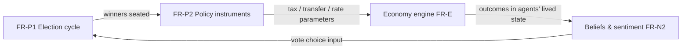

# 2. Product Requirements (PRD)

This chapter fixes the scope contract for POLIS: what the system must do (functional requirements, FR), how well it must do it (non-functional requirements, NFR), how success is measured, and what is deliberately deferred or excluded. Requirements are stated at the level of *what* the system does; the mechanisms that satisfy them (agent cognition, domain model, engine internals) are owned by Chapters 3–8. Each requirement is traceable to one of two grounds: a validated research precedent, cited inline, or an explicit **design decision**, marked as such with its rationale. This separation is itself a requirement of the document: the research phase demonstrated that every POLIS mechanic has at least one working precedent, but no existing system integrates them, so integration risk must be carried visibly rather than hidden behind unsupported claims.

## 2.1 Product Definition & User Personas

### 2.1.1 Product definition and three user personas

**Product definition.** POLIS is a persistent, event-sourced macroeconomy world simulator in which a population of large language model (LLM) agents lives a complete economic and civic life: agents are born, educated, employed, found companies, sign contracts, trade on an exchange, borrow, default, litigate, read and publish news, vote, retire, and die — and every fact of that world is stored as an append-only event stream, not as free-text narrative. The product occupies an intersection that the surveyed systems leave empty: Generative Agents demonstrated social believability at 25 agents for two game days [^355^]; OASIS demonstrated million-agent social-media behavior [^28^]; AgentSociety demonstrated urban daily life past 10,000 agents [^246^]; EconAgent demonstrated macroeconomic regularities at roughly 100–300 agents [^200^]; Concordia provides a game-master pattern for small-group worlds [^27^]. None combines birth-to-death lifecycles, a ledger-backed economy, firms, courts, elections, and markets in one persistent world. The product bet — stated as a design decision, per the Dimension-02 build-vs-reuse synthesis — is that integration, not invention, is the differentiator.

Three user personas govern prioritization:

1. **Builder/Founder (primary).** The solo engineer (and future technical co-founders) who ships scenarios and demos. Goals: spin up a seeded world in one command; configure scenarios as initial conditions and policy levers; observe emergent stories worth showing to investors; keep cost per simulated day predictable. Jobs-to-be-done: "prove the world is alive within a five-minute demo"; "answer any 'why did that happen?' question during diligence without hand-waving."
2. **Observer (secondary).** The watcher of the world — demo audiences, early users, prospective investors. Goals: follow stories, inspect any agent or company, travel backward in time. Job-to-be-done: "be convinced this is a living society, not a scripted animation."
3. **Researcher (tertiary).** The experiment runner. Goals: define an intervention (a tax change, a misinformation shock), run paired worlds, export aggregates with full provenance. Job-to-be-done: "trust that a difference between two runs is caused by the intervention, not by nondeterminism" — the exact failure mode documented for LLM societies, where persona-format perturbations alone shift outcomes by up to 76 percentage points [^627^].

The Builder persona's constraints dominate the NFRs (Section 2.3): with a team of one, every operational convenience is a product feature.

### 2.1.2 Product principles

Three principles govern all functional requirements. They are the executive summary's design creeds restated as enforceable acceptance criteria.

**P1 — Emergence over scripting.** Scenarios specify initial conditions and levers (population composition, seed capital, shock events, rule parameters); they never specify plot. Emergent coordination of this kind is demonstrated — Smallville's mayoral-candidacy awareness spreading from 4% to 22% of agents and party awareness from 4% to 52% within two game days [^355^] — but so is heterogeneity collapse, where unconstrained LLM populations converge to an "average persona" [^488^]. P1 therefore has a mechanical corollary: anti-collapse levers (archetype diversity, perception heterogeneity, visibility filtering) are engine configuration, not narrative patches.

**P2 — Narrative never invents state.** LLM text may describe the world but may mutate it only through typed, engine-validated actions. News articles, conversations, and judicial opinions are rendered *from* events; they never create money, ownership, or legal facts by assertion. This encodes the physics-first/cognition-second creed: every validated LLM-economy system places a rigid mechanistic substrate under LLM choices, and emergent macro regularities appear only through that pairing — EconAgent reproduced the Phillips curve and Okun's law with correct signs precisely because a deterministic engine enforced accounting and market clearing [^200^][^77^].

**P3 — Every number hyperlinks to its causal events.** Any figure the UI shows — gross domestic product (GDP), a firm's cash balance, a candidate's vote share — must resolve to the event sequence that produced it. The same append-only log powers agent memory, the newsroom, replay, and causal inspection, so the event envelope (provenance, causality links, visibility access-control lists) is specified before any view that consumes it. P3 converts observability from an operations concern into a user-facing product guarantee.

## 2.2 Functional Requirements Catalog

**Conventions.** Requirement identifiers carry a domain letter (A = agent, C = communication, L = lifecycle, E = economy, B = business/companies, M = markets, P = politics/professions, N = news, W = world engine) and a sequence number. Priority uses MoSCoW (Must/Should/Could). Phase refers to the delivery phases of Section 2.5. Every FR is written to be independently testable through the validation harness (Chapter 9) — a deliberate granularity decision, since LLM-society validity claims survive only at the level of continuously re-tested collective patterns [^488^]. The catalog also discharges the implicit requirements extracted from research: emergence (IR-1) via P1; hybrid cognition and cost control (IR-2, IR-3) via NFR-6; determinism/replay (IR-5) via FR-W3 and NFR-5; observability (IR-6) via P3 and NFR-7; anti-collapse levers (IR-8) via P1; extensibility (IR-9) via NFR-4; persistence/branching (IR-10) via NFR-9; narrative–ledger consistency (IR-11) via P2 and the FR-N1 acceptance criteria.

**Table 1 — Functional requirements catalog (FR-A…FR-W).**

| ID | Requirement | Priority | Phase |
|---|---|---|---|
| FR-A1 | Two-layer persona: structured state (demographics, traits, skills, balance sheet) plus narrative backstory; batch persona generation with quality audits | Must | 1 |
| FR-A2 | Persistent memory: episodic stream with salience-based retrieval, decay, and scheduled consolidation; beliefs carry provenance tags | Must | 1 |
| FR-A3 | Needs engine: a needs vector updated deterministically from grounded state drives goal and plan formation | Must | 1 |
| FR-C1 | In-world conversations: multi-party natural-language dialogue at world locations, logged as events | Must | 1 |
| FR-C2 | Asynchronous email: per-agent inbox/outbox, delivery latency, threading | Should | 2 |
| FR-C3 | Relationship graph: typed edges (kinship, friendship, colleague, trust, ownership) formed and decayed by interaction | Must | 1 |
| FR-L1 | Lifecycle state machine: birth, education, career, retirement, death, with age-gated action spaces | Should | 2 |
| FR-L2 | Estates and inheritance: heirs, wealth transfer, and firm succession on death | Should | 2 |
| FR-E1 | Typed goods and services: production recipes, perishable inventories, household consumption | Must | 1 |
| FR-E2 | Ledger-backed money: all balances are ledger projections; every transaction is a balanced multi-entry posting | Must | 1 |
| FR-E3 | Macro aggregates: GDP, inflation, unemployment, and wage/wealth distributions computed as ledger queries | Must | 1 |
| FR-B1 | Company founding: incorporation, initial capital, hiring, role assignment | Must | 1 |
| FR-B2 | Firm financials: engine-computed profit/loss, balance sheet, and cash flow; chief executive officers (CEOs) set strategy through typed decisions | Must | 1 |
| FR-B3 | Bankruptcy: distress detection, default triggers, liquidation (Phase 1); restructuring and creditor contagion (Phase 2) | Must | 1 |
| FR-B4 | Litigation: filing, settlement bargaining, trial, engine-computed damages, enforcement | Should | 2 |
| FR-M1 | Equity registry: share issuance, capitalization tables, transfers, ownership events | Must | 1 |
| FR-M2 | Public exchange: limit-order book with deterministic matching, tick history, index computation | Must | 1 |
| FR-M3 | Venture capital: private round ladder with term sheets and dilution, fund agents with portfolio logic, initial public offering (IPO) path | Could | 3 |
| FR-P1 | Elections: parties, candidacy, campaigns, vote computation, seat allocation | Should | 2 |
| FR-P2 | Policy instruments: election winners set tax, transfer, and rate parameters as versioned rules the engine enforces | Should | 2 |
| FR-P3 | Professions: career tracks (lawyer, teacher, journalist, politician) with profession-specific action spaces; teachers drive population skill growth | Should | 2 |
| FR-N1 | News generation: an editorial pipeline converts salient events into articles; multiple outlets with distinct editorial slant | Must | 1 |
| FR-N2 | News consumption: personalized feeds update agent beliefs and sentiment, feeding voting, trading, and consumption decisions | Must | 1 |
| FR-W1 | Tick loop: a discrete-time engine advances all deterministic reducers; tick-to-simulated-time mapping is configurable | Must | 1 |
| FR-W2 | Typed event bus: append-only log; envelopes carry causality links, provenance, and visibility ACLs; all state is a projection | Must | 1 |
| FR-W3 | Time controls: pause/resume/speed; snapshots, exact replay, and fork/branch | Must | 1 |

Fifteen of the twenty-six requirements are Must-priority, and they cluster exactly where the research says credibility is manufactured: the ledger (E2), the event bus (W2), and the agent's grounded state (A1–A3). The phasing is asymmetric by design. Communication splits — synchronous conversation is a Must because it is the cheapest channel that demonstrates information diffusion, while asynchronous email defers to Phase 2 because its main consumers (negotiation threads, legal notice, investor relations) arrive with litigation and venture capital. FR-B3 is the only requirement deliberately shipped in two depths: simple liquidation in Phase 1 keeps firm death economically real (without exits there is no firm demography to calibrate), while restructuring and trade-credit contagion wait for the court machinery of Phase 2. FR-M3 is the sole Could: venture outcomes follow a steep power law — 50–65% of financings return below 1× while 2–5% return above 10× (Dim04, Claim 4.2) — so a credible venture-capital mechanic needs a firm population large enough to exhibit that tail, which a 200-agent MVP cannot supply.

### 2.2.1 Agent core and persona (FR-A1–A3)

The two-layer persona is a research-mandated structure, not an aesthetic choice. Persona prompting alone explains under 10% of behavioral variance in human-annotation studies (Dim06, Claim C1.5 [^10^]), so FR-A1 anchors decisions in structured state — needs, ledgers, skills, balance sheet — and reserves the narrative backstory for conditioning language and values. Grounding data outperforms prompt length: agents conditioned on interview- and survey-grade self-reports recovered 83–86% of real participants' own two-week test-retest consistency, versus 74% for demographics-only conditioning [^524^]. FR-A2 adopts the Smallville memory stream (recency × importance × relevance retrieval, reflection, planning [^40^]), whose ablations collapse believability [^369^], and hardens it against the documented failure of memory hacking — convincing an agent of events that never occurred [^369^] — by requiring provenance tags on every belief. FR-A3 follows the AgentSociety pattern, validated at 10,000-agent scale, in which a Maslow-style needs hierarchy drives plans through a theory-of-planned-behavior chain rather than free-text improvisation [^626^].

### 2.2.2 Communication (FR-C1–C3)

Conversations are the sim's cheapest emergence generator: Smallville's information diffusion and relationship formation (network density rising from 0.167 to 0.74 in two days [^355^]) flowed entirely through dialogue. FR-C2 email is an asynchronous channel with mailbox semantics — per-agent inbox/outbox, delivery latency, threading — patterned on Concordia's game-master-embodied digital environments, which demonstrate that services such as email and search can be world-consistent applications adjudicated by the same authority that owns ground truth [^27^]. Latency is a feature: it creates negotiation windows, insider-information half-lives, and legal notice periods. FR-C3 requires a typed, weighted relationship graph (AgentSociety uses family/friend/colleague types with 0–100 strength [^626^]) because downstream requirements — hiring networks, deal sourcing, courtroom conflicts of interest, inheritance — all query relationship structure; a graph that exists only as conversation history cannot support them.

### 2.2.3 Lifecycle (FR-L1–L2)

The lifecycle requirements are the catalog's largest *design decision*. No cited LLM society implements a full birth-education-career-retirement-death arc with inheritance: AgentSociety models daily life [^626^], and Project Sid's civilization runs spanned hours to days [^370^]. POLIS requires it for two reasons. First, demography is an economic input: retirement creates pension liabilities and labor-force exit; death creates the wealth transfers that make the wealth distribution a multi-generational process rather than a one-shot lottery. Second, lifecycle gives Observer users narrative stakes — a founder's death forcing firm succession (FR-L2) is precisely the kind of unscripted event the Story Desk exists to surface. Education couples this domain to professions: FR-P3 makes teachers the mechanism by which population skill distributions shift across generations.

### 2.2.4 Economy (FR-E1–E3)

FR-E2 encodes the research's strongest consensus: LLM agents must never do arithmetic, and the economy must be a deterministic, stock-flow-consistent ledger in which every monetary stock is someone's asset and someone else's liability, with no "black holes" for money (Godley–Lavoie tradition; EURACE/Caiani lineage, Dim03 Claims 3.0–3.3). LLMs make judgments and expectations; the engine computes consequences. The payoff is FR-E3: because all money is ledger postings, GDP, inflation, unemployment, and distribution statistics are *queries*, not estimates — and the conservation invariant gives a zero-cost correctness check on every tick. The requirement to keep LLMs off the arithmetic is what let EconAgent's ~100–300-agent economy reproduce inflation within ±5% and correctly signed Phillips (−0.619) and Okun (−0.918) relationships where rule-based and reinforcement-learning baselines produced wrong-signed or unstable results [^200^][^77^].

### 2.2.5 Companies and capital (FR-B1–B4, FR-M1–M3)

Firm mechanics are calibrated to established demography: roughly 20% of firms exit in year one and about half by year five (U.S. Bureau of Labor Statistics data, Dim04 [^27^][^28^]), and the firm-size distribution has a power-law tail with exponent near 1 — Zipf's law (Dim04 [^2^]). FR-B3/B4 therefore treat distress, bankruptcy, and litigation as first-class mechanics rather than error states. On markets: FR-M2 requires a limit-order book with deterministic matching (the ABIDES lineage of reproducible exchange simulation, Dim03) so that price formation is auditable and replayable. Trader cognition couples to the news domain following TwinMarket, whose ablations show that disabling the social-information channel significantly degrades market realism — beliefs formed from news and social interaction must feed trading intentions [^1461^]. FR-M3's round ladder (pre-seed through IPO, ~15–25% dilution per round) and power-law outcome distribution are calibration targets from venture data (Dim04, Claims 4.1–4.2).

### 2.2.6 Politics, professions, and news (FR-P1–P3, FR-N1–N2)

The politics requirements close a loop, not a feature list: elections must matter economically, and the economy must matter electorally.

Election fidelity has a validated precedent: ElectionSim matched 47 of 51 state-level U.S. results for 2020 (Dim07 [^19^]), and grouped-agent forecasting reached 86.7% accuracy across 2024 swing states (Dim07 [^22^]). That validity is bounded — conflict C5 documents that LLM personas overestimate turnout and skew by country and language (Dim07 [^23^]) — so FR-P1 acceptance requires turnout to be computed in the engine rather than asserted by personas, and FR-P2 makes policy a versioned rule registry that the engine enforces deterministically. FR-N1/N2 treat news as an information market: editorial pipelines with declared slants (the Y Social twin annotates 600+ feeds by outlet political leaning (Dim07 [^53^])) generate articles from events, and consumption updates beliefs that drive voting and trading. Feed-ranking policy is the single most powerful lever over society outcomes identified in the research (cross-verification Tier 1, item 7), so FR-N2 acceptance includes a configurable ranking policy as a scenario knob.

### 2.2.7 World engine (FR-W1–W3)

FR-W1 specifies a barriered tick loop with activation sampling — OASIS's time engine activates agents by 24-dimension hourly activity probabilities rather than waking every agent every step [^28^] — because cost is a scheduling problem before it is a model problem. FR-W2 makes the append-only event log the single source of truth, following production event-sourcing discipline: optimistic concurrency on stream versions, atomic publish via transactional outbox, idempotent checkpointed projections (Dim05 [^28^]). FR-W3 then exploits what the log buys: replay in three modes — *exact* (recorded responses, deterministic), *regenerative* (same prompts, fresh samples), and *counterfactual* (perturb events from a snapshot) — with seeded random-number-generator streams logged per run so replays are an operational practice, not a hope (Dim05 [^29^]). Time controls are simultaneously a Builder demo tool, an Observer time machine, and the Researcher's experiment substrate.

## 2.3 Non-Functional Requirements

The NFR set is dominated by one fact: the initial team is one full-stack engineer with a React/Next.js background. Every NFR is therefore either a solo-operability constraint or a direct encoding of a research-derived engineering discipline. Where a numeric target derives from research rather than from a product judgment, the source is cited in the verification column.

**Table 2 — Non-functional requirements, targets, and verification methods.**

| ID | Requirement | Target | Verification |
|---|---|---|---|
| NFR-1 | Solo-builder operability | ≤3 core services in the development deployment; one engineer can run, modify, and debug the whole system | Operability drill; dependency audit |
| NFR-2 | Headless simulation service | A full scenario runs via command-line interface (CLI)/API with no UI process; the Next.js front end is a replaceable client | Headless golden run in continuous integration (CI) |
| NFR-3 | One-command local spin-up | `docker compose up` yields a seeded 200-agent world in ≤10 minutes on a laptop, using one API key or one local model | Clean-machine install test |
| NFR-4 | Model-abstraction layer | Provider swap (hosted APIs, local vLLM serving) by configuration; identical scenario passes under ≥2 providers | Per-provider conformance suite |
| NFR-5 | Determinism and replay | Exact-replay mode reproduces golden runs event-for-event; every LLM call journaled with prompt hash, model version, seed, response, cost | Seeded golden-run replay tests in CI (Dim05 [^29^]) |
| NFR-6 | Cost governance | Cost per sim-day is a managed service-level objective (SLO) enforced by a budget governor; the cost model is a parametric function `cost(t, N, mix)` re-baselined quarterly | Per-run cost report; governor trip test |
| NFR-7 | Observability | Every derived number is traceable to its causal event chain (principle P3) | Sampled metric-lineage audit |
| NFR-8 | LLM failure resilience | Schema-constrained decoding plus validate → retry → escalate → autopilot; post-retry structured-output failure <0.5%; a tick never blocks on an LLM | Fault-injection tests (M0 exit gate, Dim08) |
| NFR-9 | Persistence and branching | Durable snapshots at least once per sim-day; fork a new timeline from any snapshot | Branch-from-snapshot test |
| NFR-10 | UI rendering performance | God-map sustains 60 fps at 10,000 sprites via instanced rendering | Render benchmark (instancing achieves ~1 draw call per 100k sprites, Dim09) |

Three of these deserve comment. NFR-6 is the resolution of research conflict C1: quoted prices for Flash-Lite-class APIs disagree by roughly 6× across sources, and API prices for fixed capability deflate 5–10× per year, so the requirement forbids hardcoded prices anywhere in the system — cost targets live in the governor's configuration and are re-baselined quarterly. NFR-5 adopts an explicit stance of *auditability plus replayability, not bit-determinism*: provider-side nondeterminism and model-version drift make bitwise determinism unattainable for an LLM-in-the-loop system, so the guarantee is scoped to exact replay over recorded decisions, with regenerative and counterfactual modes available for experiments (Dim05). NFR-8 exists because unconstrained LLM JSON generation fails 10–30% of the time on schema-strict tasks while constrained decoding eliminates the syntactic failure class (Dim08, Claim F1; Dim05 [^18^]); the autopilot fallback — a canned policy that keeps a failed agent acting — converts an unbounded tail risk into a bounded quality degradation.

## 2.4 Success Metrics

POLIS is succeeding if the world is affordable, alive, checkable, and shippable. The metrics below are gates for phase exits, not aspirations; each has a measurement method and a research-grounded target.

**Table 3 — Success metrics with MVP and Phase-3 targets.**

| Metric | Definition / method | MVP target (Phase 1) | Phase-3 target | Basis |
|---|---|---|---|---|
| Cost per sim-day | All-in LLM + infrastructure spend per simulated day at reference population | ≤$2 at 200 agents | ≤$150/sim-day at 10,000 agents | Tiered-cognition cost model ≈$73/10k-agent sim-day LLM-only (Dim05), ~220× below the naive all-frontier baseline |
| Population | Concurrently simulated agents by cognition class | 50–200 agents, all Hero/Named | 10,000 agents, tiered Hero/Named/Background | AgentSociety sustained 10k agents at ~500 interactions/agent/day [^246^] |
| Macro stylized facts | Sign and tolerance on macro correlations and firm demography | Phillips and Okun correlations correctly signed; firm exits ≈20% year-1 and ≈50% year-5, ±10 pp | + firm-size tail exponent 1±0.2; business-cycle comovement suite | EconAgent benchmarks −0.619/−0.918 [^200^][^77^]; BLS exit hazards (Dim04 [^27^][^28^]); Zipf tail (Dim04 [^2^]) |
| Persona consistency | Decision-battery self-consistency under paraphrase; interview believability vs ablated architectures | ≥0.8 self-consistency; full architecture rated above ablations (Smallville protocol) | Robustness-audit deltas <10 pp across persona-format perturbations | Smallville evaluation method [^369^]; TRAILS-documented 76 pp butterfly effects [^627^]; human test-retest ceiling 83–86% [^524^] |
| Time-to-demo | Calendar time from project start to a demonstrable living world (economy + companies + news + map) | ≤12 weeks | — | Design decision (solo builder scope control) |
| Event-log integrity | Share of state mutations issued as typed events; accounting conservation violations per run | 100%; zero violations | 100%; zero violations | Stock-flow-consistent no-black-holes identity (Dim03, Claim 3.0) |

Two calibrations deserve note. The persona-consistency target is deliberately bounded by the human ceiling: agents grounded in rich self-report data recover 83–86% of participants' *own* two-week consistency [^524^], so demanding agreement above that band would demand superhuman stability from a model of humans — an incoherent target. The stylized-fact targets are sign-first, magnitude-second, mirroring the boundary finding that LLM societies reliably support collective-pattern claims but not individual-trajectory claims [^488^]. Cost targets inherit NFR-6's quarterly re-baselining: a fixed dollar target would silently tighten or loosen as API prices deflate 5–10× per year (resolution of conflict C1), so the metric is defined against the parametric cost model's current baseline, and the ~$73-per-10k-agent-day tiered figure is the Dim05 model output against which actuals are tracked.

## 2.5 Scope: MVP vs Phases vs Out-of-Scope

Phasing is risk-ordered, mirroring the research-derived milestone gates (Dim08 M0–M3): Phase 1 proves the kernel, ledger, and cognition loop at a population small enough to run at full fidelity; Phase 2 layers institutions and lifecycle on the proven kernel; Phase 3 buys scale and capital-market depth only after the validation harness gates the smaller world.

**Table 4 — Phase scope across capability areas.**

| Capability | Phase 1 — MVP (50–200 agents) | Phase 2 | Phase 3 |
|---|---|---|---|
| Agents and classes | Hero + Named only; two-layer persona, memory, needs engine | + lifecycle FSM, inheritance, education | + Background archetype class with promotion/demotion; 10,000 agents |
| Economy | Typed goods/services, ledger money, macro aggregates | + banking and credit | + stylized-fact calibration gate |
| Companies | Founding, engine financials, simple liquidation | + restructuring, litigation, creditor contagion | + firm-demography calibration (exit hazards, Zipf tail) |
| Capital | Equity registry, single limit-order-book exchange, index | + richer order types, investor profession | Venture round ladder, fund agents, IPO path |
| Society | Conversations, basic relationship graph | + email, elections → policy loop, professions | + multi-jurisdiction election validation |
| News | Newsroom pipeline; consumption updates beliefs | + multiple outlets with slant; misinformation knob | + feed-ranking policy laboratory |
| Engine | Tick loop, typed event bus, snapshots, exact replay | + fork/branch, counterfactual replay | + sharded batch runs; golden-run CI at 10k scale |

**Explicitly out of scope** (all phases unless re-opened by decision): (1) any integration with real money, real securities, or real identities — POLIS worlds are fully synthetic; (2) real-world forecasting claims for actual elections or markets, excluded on validity grounds — election fidelity is validated only for specific jurisdictions and warns of turnout overestimation (conflict C5); (3) human-playable avatars — users observe and intervene god-mode, they do not inhabit; (4) a 3D client — the interface is a 2.5D semantic-zoom map (Chapter 10); (5) million-agent national campaigns — the Phase-3 ceiling is 10,000, where full-fidelity precedent exists [^246^] and tiered cost is modeled at ≈$73 per sim-day (Dim05); (6) foundation-model training — at most, lightweight per-persona adapters later (Dim08); (7) multi-tenant software-as-a-service operation.

The phasing logic is dependency-driven. Elections wait for Phase 2 not because they are hard to build but because they are meaningless without stakes: a vote needs an economy to tax and a population with enough lifecycle variance to have political interests. Litigation similarly requires contracts worth breaching and firms worth suing. Venture capital waits for Phase 3 because its defining phenomenon — a power-law return distribution in which 2–5% of deals return above 10× (Dim04, Claim 4.2) — cannot manifest in a 200-company world. Conversely, anything that manufactures *credibility* (ledger integrity, replay, observability, cost governance) is front-loaded into Phase 1: the research is unambiguous that LLM societies fail by unowned state and unmeasured cost long before they fail by missing features [^369^][^627^].
