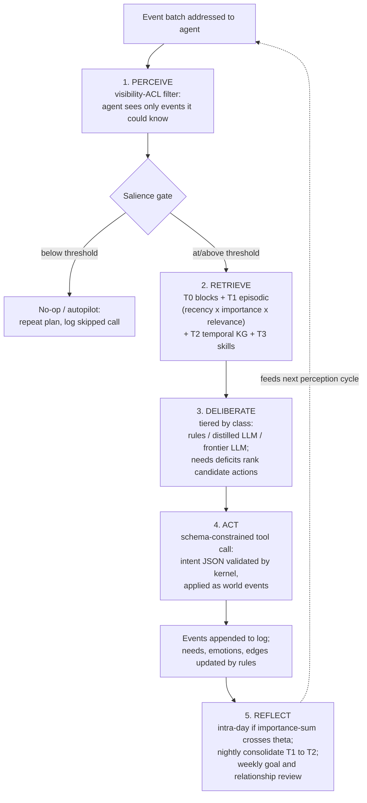

# 3. Agent & World Domain Model

This chapter specifies the citizen agent of POLIS: the two-layer persona, the four-tier memory system, the needs and emotion engine, the Hero/Named/Background class system, the lifecycle state machine, the relationship graph, and the agent cognition loop. It implements functional requirements FR-A1–A3 (persona, memory, needs and drives) and FR-L1–L2 (lifecycle and inheritance) defined in Chapter 2. Economy mechanics (market clearing, ledgers, firm dynamics) are owned by Chapter 6, institutions by Chapter 7, and the scheduling infrastructure that invokes the cognition loop — the Cognition Scheduler — by Chapter 4; this chapter defines only the agent-side contracts those systems consume.

One design creed governs everything below: **physics-first, cognition-second**. Persona variables alone explain less than 10% of behavioral variance in controlled annotation studies [^10^], and identity-style persona prompting measurably flattens within-group diversity [^11^]. POLIS therefore anchors every consequential decision in structured, kernel-owned state (balances, needs, memories, relationship edges) and reserves the narrative persona for tone, priors, and rhetorical style. The LLM decides; the world state constrains what can be decided.

## 3.1 Agent Anatomy

### 3.1.1 The two-layer persona

A POLIS agent is not a prompt; it is a versioned record of structured state plus a narrative document that conditions language-model behavior. **Layer 1, structured state**, is the machine-readable ground truth owned by the simulation kernel: demographics sampled from census joint distributions, psychometric traits, an economic ledger reference, a skill vector, needs and emotion vectors, attitudes, and relationship edges. **Layer 2, narrative persona**, is a one-to-two-page backstory plus a sequence of age-stamped formative memories, generated after the structured layer and used only to condition LLM tone, vocabulary, and priors. This ordering is deliberate: agents grounded in rich self-report-style narrative achieve 86% of human test-retest consistency on held-out attitudes versus 74% for demographics-only grounding [^9^], so narrative depth is worth real fidelity — but the evidence equally shows that depth must not drive decisions directly [^10^]. POLIS captures the benefit by generating Layer 2 from Layer 1 (never the reverse) and by forbidding decision prompts from citing narrative adjectives where a structured field exists.

Population-scale persona generation follows a five-step pipeline:

1. **Sample demographics** from the census joint distribution (age × sex × education × occupation × marital status × geography), following the census-grounded Nemotron-Personas-USA precedent of PII-free synthetic populations with structured demographic fields [^6^].
2. **Sample psychometrics and endowments** — Big Five traits, risk aversion, time preference, initial wealth — conditioned on demographics.
3. **Generate the narrative layer**: backstory plus formative memories at different ages, the Concordia initialization recipe [^29^]; current goals (3–5 per agent) are extracted back into structured fields.
4. **Quality-assure the batch**: embedding-duplicate and entropy audits, psychometric spot-checks, and a flattening check that measures within-group variance on a decision battery, because LLM personas are known to misportray and flatten identity groups [^11^].
5. **Population-align**: importance-sample the accepted pool so marginal trait distributions match reference psychometric targets, a technique shown to significantly reduce population-level bias [^13^].

**Table 3-1. Persona schema (structured state Layer 1; narrative Layer 2 summarized at bottom).**

| Block | Field | Type / domain | Update authority | Notes |
|---|---|---|---|---|
| Identity | `agent_id`, `cohort_id`, `class` | UUID; UUID; {Hero, Named, Background} | Kernel (class changes via §3.2 events) | `class` set at spawn, mutable |
| Demographics | `age`, `sex`, `education_level`, `occupation`, `marital_status`, `household_id`, `geo` | Census-coded enums + tract ref | Lifecycle FSM rules (§3.3) | Census joint distribution at spawn [^6^] |
| Psychometrics | `big5` {O, C, E, A, N}, `risk_aversion`, `time_discount` | [0,1]^5; [0,1]; (0,1) | Re-estimated in annual battery; drift-bounded | Importance-sampled to reference distributions [^13^] |
| Economic ledger | `cash`, `deposits`, `portfolio_ref`, `debts`, `employer_id`, `wage`, `credit_score` | Decimal minor units; refs | **Kernel only** (Ch6 economy engine) | Agents never edit balances; LLM never does arithmetic |
| Skills | `education_years`, `experience` {occupation→years}, `skill_refs[]` | Non-negative reals; refs to T3 library | Education/employment events (§3.3) | Mincer-style human-capital bookkeeping [^43^][^44^] |
| Needs | `needs` {physiological, safety, belonging, esteem, actualization} | [0,1]^5 satiation | Deterministic rule updates each tick (§3.1.3) | Maslow vector [^8^] |
| Emotions | `emotions` {joy, sadness, fear, anger, disgust, surprise}, `mood` | [0,10]^6; [−1,1] | OCC appraisal rules + contagion (§3.1.3) | Six-core-emotion template [^8^] |
| Attitudes | `attitudes` {topic→score} | [0,10] map | Experience + news + social exposure | Topic-keyed scores [^8^] |
| Relationships | `edges[]` {type, target, strength, trust, last_contact} | Typed edge list (§3.4) | Interaction outcomes + decay rules | Strength 0–100 [^8^]; Dunbar-capped [^45^] |
| Narrative (Layer 2) | `backstory`, `formative_memories[]`, `comm_style`, `goals[]` | Text; age-stamped text; style tags; 3–5 goal strings | Generated at spawn; revised at life-course transitions | LLM conditioning only [^29^][^9^] |

The schema's decisive column is *update authority*. Every field mutated by the passage of simulated time — balances, ages, employment, needs, emotion decay — is written by deterministic kernel rules, never by the LLM; the model may *request* a change (spend, quit, sue) which the kernel validates and applies as an event. This separation is what keeps a 10,000-agent economy auditable: hallucinated arithmetic cannot enter a ledger the agent cannot write to. Psychometrics are the exception that proves the rule: they are allowed to drift, but only through a bounded annual re-estimation battery (mini trust/ultimatum/risk games per cohort, per the behavioral Turing-test protocol [^54^]), so personality evolution is measured rather than improvised. Persona records are versioned together with the model versions that consumed them, so a behavioral diff between two simulation releases can be attributed to persona drift or model drift separately.

### 3.1.2 Four-tier memory

POLIS memory follows the CoALA taxonomy — working, episodic, semantic, procedural [^17^] — instantiated as four tiers with distinct storage, retrieval, and decay mechanics.

**T0, working/core memory.** The context window itself, organized as named memory blocks (persona summary, current needs/emotion state, day plan, scratchpad) in the Letta/MemGPT pattern [^18^][^19^]. T0 is rebuilt at every cognition call from the tiers below; nothing lives only in T0.

**T1, episodic stream.** An append-only log of everything the agent perceived or did, stored as structured event references plus short natural-language summaries. Retrieval scores each item as a weighted sum of recency, LLM-rated importance (1–10), and embedding relevance to the current context — the Generative Agents retrieval model [^1^][^2^]. Retention follows the Ebbinghaus curve $R = e^{-t/S}$: memory strength $S$ is incremented and $t$ reset whenever an item is recalled, reproducing human-like selective forgetting and the spacing effect [^20^].

**T2, semantic/consolidated memory.** Reflections, beliefs, attitudes, and relationship summaries, stored as a temporal knowledge graph whose edges carry validity intervals — an employer edge is true *from* a hiring date *until* a termination event. Temporal knowledge graphs outperform MemGPT-style flat stores on deep memory retrieval [^22^], and production memory layers in this class deliver 91% lower p95 latency and over 90% token savings versus full-context prompting [^21^]. Nightly consolidation compresses raw T1 logs into day summaries and updated T2 facts — a summarize-and-forget pass that is the documented route to 10–100× cost reduction in long-lived agents [^27^].

**T3, procedural memory.** An executable skill library — validated negotiation scripts, job-application templates, trading heuristics — acquired only through training and practice events, never invented at inference time, following Voyager's skill-library template for lifelong skill accumulation [^41^]. A teacher agent transmitting a T3 skill to a student is the micro-mechanism behind education-driven skill growth in §3.3.

Two calibrations bound the design. First, laboratory market experiments find that LLM agents with a memory of about three timesteps plus sampling noise replicate human market behavior *better* than long-context agents [^57^]; POLIS therefore defaults trading and routine-consumption retrieval to short windows rather than maximal recall. Second, cohort-level memory quality is benchmarked quarterly on LongMemEval/LOCOMO-style probes [^26^][^21^], because long-horizon memory coherence at population scale is an identified open problem, not a solved one.

### 3.1.3 Needs and emotion engine

The needs engine converts grounded state into motivation. Five Maslow tiers — physiological, safety, belonging, esteem/status, self-actualization — are maintained as satiation scores in $[0,1]$ and updated **deterministically** each tick from structured state: cash buffer and employment status feed safety, contact frequency with relationship edges feeds belonging, promotions and public recognition feed esteem. This is Concordia's "hunger component as a classic program" pattern [^29^], and it is the same Maslow-vector design AgentSociety validated at 10,000-agent scale with five million interactions [^8^]. Motivation becomes action through the Theory of Planned Behavior chain — the most-deprived need generates an intention, the intention a plan, the plan a behavior [^8^] — with the LLM selecting among candidate activities proposed by deficit ranking, the desire-driven-autonomy pattern that produces human-like variability in daily activity choice [^28^].

The emotion engine maintains six core emotion intensities in [0,10] — sadness, joy, fear, disgust, anger, surprise — plus a scalar mood [^8^]. Emotion deltas are computed by an OCC appraisal mapping: events are appraised for desirability with respect to the agent's needs and goals, other agents' actions for praiseworthiness with respect to norms, and objects for appealingness; compound emotions (anger = blame plus undesirable event) fall out of the appraisal logic [^30^]. Intensities decay exponentially with a half-life of hours to days (design decision; scenario-tunable). Mood propagates along relationship edges with distance decay truncated at three degrees of separation, matching the Framingham happiness-clustering result and experimental evidence of network-scale emotional contagion [^34^][^35^]. Finally, current mood is injected into decision prompts as an explicit state line — justified by evidence that emotional stimuli in prompts measurably shift LLM behavior [^31^] — which closes the loop from world events to feeling to choice.

## 3.2 Agent Classes

Full-LLM cognition for every citizen is cost-infeasible at population scale — simulating 8.4 million agents with individual LLM agency is explicitly judged infeasible, and the demonstrated escape is LLM-archetype pooling, where the model is queried per representative group and individuals sample from the archetype distribution [^449^]. At the same time, users only ever inspect a few hundred agents deeply. POLIS therefore runs a three-class population, with every agent carrying a `class` field (Table 3-1) and class membership managed by promotion and demotion events rather than fixed at spawn. A Background agent that founds a startup, files a lawsuit, or becomes the subject of a user-followed storyline is promoted to Hero — and the promotion is itself emitted as a world event, a story-generating moment by design. Class shares (1–2% / ~15% / ~85%) are design targets calibrated against the cognition budget SLO of Chapter 4, not fixed constants.

**Table 3-2. Agent classes: cognition stack, memory, and transition policy.**

| Attribute | Hero | Named | Background |
|---|---|---|---|
| Population share (design target) | 1–2% | ~15% | ~85% |
| Cognition engine | Frontier LLM, full chain-of-thought | Distilled small LLM (Centaur-style fine-tune [^58^]) | Deterministic rules + shared archetype LLM [^449^] |
| Memory tiers | Full T0–T3, individual | T0–T3 individual, compressed T2 | Individual T0/T1 ring buffer; archetype-shared T2/T3 |
| Reflection cadence | Intra-day + nightly + weekly | Nightly | Weekly batch, aggregate statistics only |
| Decisions routed here | All consequential + social + economic | Routine consumption/work/social; medium stakes | Aggregate-consistent sampling of routine decisions |
| Share of cognition budget (design target) | ~60–70% | ~25–35% | ~5% |
| Promotion triggers (→ higher class) | — | Founds company, enters litigation, candidacy, viral event, user follow, high salience score | Same set; any event requiring individual consequential choice |
| Demotion triggers (→ lower class) | Salience below threshold for $N$ consecutive days; storyline resolved | No consequential events for $N$ days | — |

The class system is where decision-fidelity evidence is converted into budget allocation. Hero agents justify frontier models because frontier models pass the behavioral Turing test against a 108,314-subject human benchmark, while weaker models are less human-like [^54^] — so the 1–2% of agents whose choices move markets, courts, and elections get the best available reasoning. Named agents run a distilled model in the Centaur mold — a foundation model fine-tuned on 10.7 million human choices that predicts held-out human decisions better than domain cognitive models [^58^] — which is a credible cheap human-decision engine for routine cognition; Lyfe Agents demonstrate that such low-cost agent designs preserve believability at 10–100× lower cost [^27^]. Background agents are not mindless: bounded-rationality rules with short memory windows and sampling noise reproduce human market behavior at least as well as long deliberation [^57^], so the class exists for fidelity reasons as much as cost reasons. The open risk is archetype fidelity at the aggregate level; per the cross-verification conflict register (C6), Background archetypes must be validated against full-LLM baselines on the macro stylized-fact suite before each release, and population shares re-tuned if distributions drift.

## 3.3 Lifecycle State Machine

Full demographic turnover — birth, aging, education, career, retirement, death — is a documented gap in LLM societies; no mainstream LLM simulator implements generational replacement, and the recommended path is hybrid integration: classical event-driven microsimulation bookkeeping for the transitions, LLMs only for the consequential choices within them [^69^][^76^]. POLIS adopts exactly that split. The lifecycle is a finite state machine over structured state; transitions fire on deterministic triggers (age thresholds, graduation, hiring, mortality tables) and mutate persona fields under kernel authority. LLM cognition is invoked only where the transition embeds a genuine choice: field of study, job offer acceptance, marriage partner, fertility preference, retirement timing within a legal window.

**Table 3-3. Lifecycle FSM: states, transitions, triggers, and mutations (FR-L1).**

| State | Entry trigger | Exit transition & trigger | State mutations | LLM involvement |
|---|---|---|---|---|
| `GESTATION` | Conception event in a household | Birth at $t+9$ months → `CHILDHOOD` | New agent record; genetics-free Big Five sampled correlated with parents; kinship edges created | None |
| `CHILDHOOD` | Birth | School entry at age 6 → `EDUCATION` | Formative memories generated [^29^]; needs vector initialized | None (NPC behavior scripted) |
| `EDUCATION` | Age 6 | Graduation/dropout at completion of chosen track → `CAREER` (or extended `EDUCATION` for tertiary) | `education_years` += ; T3 skills acquired from teacher agents; `education_level` updated [^43^][^44^] | Choice of track/field (Named-tier call) |
| `CAREER` | First employment contract | Job loss → `JOB_SEARCH`; promotion (in-state); labor-force exit at retirement window → `RETIREMENT` | `employer_id`, `wage`, `experience[occupation]` updated; esteem need re-anchored | Offer acceptance, career change, resignation (class-tiered) |
| `JOB_SEARCH` | Termination, resignation, graduation without offer | Offer accepted → `CAREER`; long unemployment → remain (skills decay) | Skill depreciation after threshold duration; safety need pressured | Application strategy, reservation wage (class-tiered) |
| `RETIREMENT` | Pension-eligible age/wealth or health event | Death (mortality hazard) → `DECEASED` | Income switches to pension/annuity; daily schedule freed; belonging need weight raised (design decision) | Retirement timing, post-retirement activity choice |
| `DECEASED` | Mortality hazard realization (age/health-conditioned) | Terminal; spawns estate process (FR-L2) | Cognition halted; event log finalized; relationships converted to bereavement deltas on survivors (OCC appraisal [^30^]) | None |

Estate settlement (FR-L2) executes as a deterministic probate process rather than a cognitive one: the decedent's ledger is frozen, debts and estate taxes are settled in statutory order, and the residual is distributed per the will if one exists — wills are themselves lifecycle artifacts a Hero or Named agent may draft during `CAREER`/`RETIREMENT` — or per intestacy defaults (spouse and issue shares; design decision, scenario-tunable per jurisdiction pack). Heirs receive assets as ledger mutations plus a bereavement appraisal and a windfall-driven revision of their safety and esteem needs; contested estates route to the court FSM of Chapter 7, at which point involved heirs are promoted in class per Table 3-2. Skill growth deserves emphasis because it is the lifecycle's compounding engine: `experience` accrues per occupation-year in the Mincer tradition that maps schooling and experience to earnings [^43^][^44^], T3 procedural skills transfer from teacher and mentor agents (making the teaching profession a load-bearing part of the economy's human-capital production function), and skills depreciate during long unemployment — so the FSM alone generates realistic earnings-age profiles without any LLM involvement.

Agents who enter the simulation as adults (initial population, immigrants) bypass early states: the spawn procedure samples their age, then runs the §3.1.1 pipeline to synthesize age-appropriate structured state and formative memories up to that age [^29^], so a 45-year-old immigrant arrives with a plausible earnings history, skill vector, and relationship seed graph rather than a blank record.

## 3.4 Relationships & Social Fabric

The social fabric is a typed, directed, weighted graph stored as part of structured persona state (Table 3-1). Edge types are `kinship`, `friendship`, `colleague`, `employment` (agent→firm), `ownership` (agent→asset/firm), and `acquaintance`; every social edge carries `strength` in [0,100], a `trust` scalar, and `last_contact` — the AgentSociety relationship template in which strength drives contact frequency and communication tone, and interaction outcomes update both strength and emotional state [^8^]. Trust is updated from reciprocation history, supported by evidence that LLM agents reproduce human-like trust behavior in trust-game settings [^51^], and bond formation follows reward history consistent with social exchange theory, which has been validated in small LLM-agent societies [^50^].

Edge formation is homophily-driven: candidate encounters are sampled from shared contexts (workplace, neighborhood, school, feed), and tie-formation probability rises with demographic and attitudinal similarity, per the canonical homophily result [^46^]; weak ties are preserved as a distinct low-strength class because of their brokerage value in information diffusion [^47^]. Critically, POLIS does not need machinery to *create* polarization: 1,000–2,000 free-friending LLM agents self-organize homophilic clustered networks and human-like polarization spontaneously [^48^], and larger populations intensify group dynamics [^49^]. The design problem is the opposite — countering runaway segregation — so the newsfeed and civic-exposure mechanisms of Chapter 7 own the cross-cutting-exposure levers, while this layer merely guarantees the graph remains traversable across clusters.

Maintenance is Dunbar-bounded. Human personal networks are layered at roughly 5/15/50/150 alters with scaling ratio ≈3, and layer size correlates with memory-task performance — relationship capacity is cognitively bounded [^45^]. POLIS enforces these layers as contact budgets (design decision): the inner 5 and 15 decay if not contacted weekly, the 50 monthly, the 150 quarterly; edges that fall below a strength floor are archived to the temporal KG with a validity end-interval rather than deleted, preserving the agent's history for later retrieval. This bound is also a compute control: it caps the per-agent social decision space before the cognition loop ever runs.

## 3.5 The Agent Cognition Loop

All cognition — for every class, every tick — executes one five-stage loop. The Cognition Scheduler of Chapter 4 owns the routing infrastructure (activation sampling, budget governor, model endpoints); this section defines the agent-side contract it invokes.

**Perceive.** The agent receives only the event batch its visibility ACLs entitle it to — public market data, its own ledger notifications, messages addressed to it, news it actually consumed. Information asymmetry is a feature, not a leak: who saw what and when is recorded on every event, which is what makes insider trading, rumors, and courtroom evidence discoverable in-simulation.

**Retrieve.** Context assembly pulls T0 blocks plus a scored T1 window and the valid-as-of-now slice of the T2 temporal KG, with retrieval windows defaulted short for routine economic decisions per the bounded-memory evidence [^57^].

**Deliberate.** The needs engine ranks deficits (§3.1.3), the current plan and mood condition the prompt, and the tiered model produces a decision. Deliberation is bounded-rational by construction: agents follow a logic of appropriateness — what does a person like me, in my situation, do — rather than utility maximization, because there is deliberately no utility function under the hood [^29^].

**Act.** The decision is emitted as a schema-constrained tool call — an intent object validated against the action's schema, then applied by the kernel as events. Agents propose; institutions dispose. The agent never writes state directly.

**Reflect.** Three cadences. Intra-day reflection fires when the importance-sum of new memories crosses a threshold, synthesizing higher-level beliefs stored back as T2 facts [^1^]. Nightly reflection consolidates the day's T1 stream, updates needs/emotion baselines, and revises tomorrow's hierarchical plan [^1^][^27^]. Weekly reflection reviews goals, career and savings trajectories, and applies Dunbar contact-budget decay (§3.4). Reflection and planning are not garnish: ablations show each independently increases the believability of agent behavior [^1^].

Two robustness requirements ride on the loop. First, all decision prompts are canonized — versioned templates with recorded sampling settings — and subject to randomized paraphrase and option-order audits, because LLM decisions are sensitive to prompt form at a magnitude that can reverse population-level conclusions [^64^][^65^][^67^]. Second, heterogeneity is injected deliberately (persona-conditioned temperature jitter, short retrieval windows) because LLM agents are systematically less heterogeneous than human subjects by default [^55^][^57^]; a POLIS population that thinks in unison fails the validation harness of Chapter 2 regardless of how reasonable its averages look.
