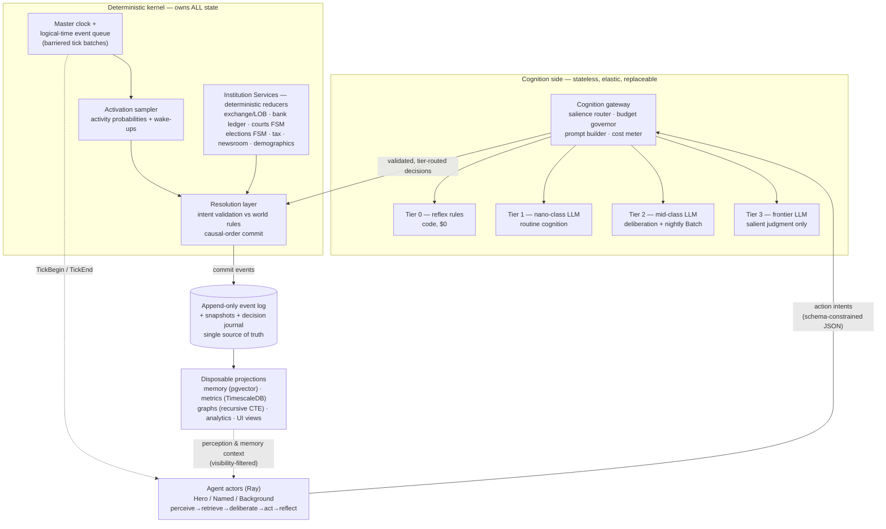
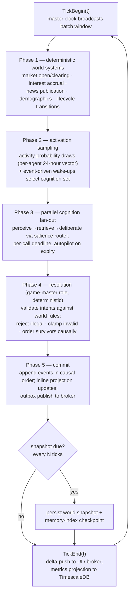

# 4. System Architecture — The Harness

Chapter 3 specified what a POLIS agent *is* — the two-layer persona, four-tier memory, the Hero/Named/Background class system, and the perceive→retrieve→deliberate→act→reflect loop. This chapter specifies the machine that runs ten thousand of them: the harness. Its premise, defended in Chapter 5, is that POLIS owns its runtime: every major LLM-agent society of 2023–2026 — Concordia, OASIS, AgentSociety, Project Sid, AI Town — built a custom kernel rather than adopting a general framework, and each independently converged on the same handful of patterns [^4^][^6^][^8^][^9^][^51^]. POLIS's design is that convergence, engineered for a persistent macroeconomy: an event-sourced deterministic kernel, institutions implemented as reducers, LLMs demoted to a stateless decision service, and cognition spend governed as a scheduling problem.

## 4.1 Architectural Creed

Two creeds govern every component below. They are stated first because they are the criteria by which later design tradeoffs were resolved.

### 4.1.1 Physics-first, cognition-second

The deterministic simulation kernel owns **all** world state — every balance, position, contract, relationship edge, legal status, and need score. No LLM output ever mutates state directly; a model's output is a *proposal* (a typed action intent) that the kernel validates and either commits as events or rejects. This inverts the naive architecture in which the agent "is" the LLM and the world is whatever the model remembers — the "LLM as state machine" anti-pattern, whose documented fix is exactly the POLIS split: external state persistence, with the LLM receiving current state and returning only a decision [^22^]. Published dual-process agents formalize the same boundary: a deterministic System 1 (finite state machine plus code-as-policy) owns state and pipeline mechanics while the LLM System 2 supplies judgment [^21^].

The creed exists because the failure modes of LLM societies all trace to letting the model own state: arithmetic hallucination entering ledgers, persona drift rewriting identity, memory contamination rewriting history. POLIS's credibility lives in deterministic market clearing, quadruple-entry accounting, and rule-driven lifecycle transitions — the model only *decides*, and even its decisions are constrained to a schema the kernel can check. The practical consequence is a hard interface rule: **LLM calls are pure functions** of (prompt, model identifier, sampling parameters) — stateless, elastic, replaceable, and, because every call is journaled (§4.2.1), replayable. The cognition side can be rebuilt quarterly against falling model prices [^27^]; the physics side changes only through versioned schema migrations.

### 4.1.2 Institutions are reducers, not agents

Markets, courts, elections, the central bank, the tax authority, the probate office — the world's *institutions* are implemented as deterministic finite-state machines and reducers over the event stream, never as LLM agents. The participants *within* institutions — litigants, candidates, chief executives, journalists, central-bank governors — are LLM agents. The seam is absolute: **agents propose, institutions dispose**. A candidate's campaign speech is LLM-generated; the vote count is arithmetic. A CEO's pricing strategy is LLM-generated; the limit-order book match is deterministic. A plaintiff's complaint is LLM-drafted; the court's docket, deadlines, and judgment enforcement are a state machine.

The rationale is threefold. First, auditability: institutions are exactly where fairness must be demonstrable — an election decided by an LLM's mood is not a product, it is a liability. Second, replay: deterministic reducers make world state a pure fold of the event log, enabling the machinery of §4.2. Third, concurrency hygiene: actor-model platforms explicitly warn that global coordination does not belong inside per-entity actors [^41^], and market clearing, elections, and news publication are precisely global coordinators — so they live in the deterministic batch phase, not in the actor tier. Institution rules themselves (tax schedules, procedural deadlines, eligibility criteria) sit in a versioned rule registry: politics mutates parameters through typed policy events, and the engine enforces whatever version is in force at that tick. Chapters 6 and 7 specify these Institution Services; this chapter builds the rack they plug into.



The diagram encodes the two creeds spatially: everything below the agent tier is deterministic and replayable; everything in the cognition box is a swappable commodity. The only edge crossing from cognition to physics carries validated intents; the only edge back carries visibility-filtered context. Table 4-1 inventories the components this architecture requires.

**Table 4-1. Component inventory: the POLIS harness, build/use disposition, and governing pattern.**

| # | Component | Responsibility | Build / use | Governing pattern & source |
|---|---|---|---|---|
| 1 | Sim kernel | Logical clock, priority event queue, barriered batches, causal-order commit, snapshotter | Custom (Python); SimPy/salabim as conceptual model only [^2^] | Hybrid DES; seeded RNG per entity/domain [^29^] |
| 2 | Agent runtime | Actor-per-agent, activation sampling, idle deactivation | Ray actors (Python stack) [^45^]; Orleans/Akka are the .NET/JVM equivalents [^41^][^44^] | Per-actor sequential processing = per-agent consistency [^41^] |
| 3 | Cognition gateway | Salience scoring, tier routing, budget governor, prompt builder, cost meter | Custom; Instructor/Pydantic validation [^19^] | Rules-based routing, never an LLM router [^20^] |
| 4 | Batch cognition scheduler | Nightly reflection, plans, news digestion | Provider Batch APIs | Flat 50% discount, 24 h window [^16^] |
| 5 | Memory service | Episodic stream, retrieval scoring, reflection jobs | Custom + pgvector (→ Qdrant at scale) [^38^][^39^] | Generative-Agents memory stream [^53^][^54^] |
| 6 | Institution Services | Exchange/LOB, bank ledger, labor market, courts, elections, tax, newsroom, demographics | Custom deterministic reducers (Ch6/Ch7) | No LLM in the commit path; global coordination kept out of actors [^41^] |
| 7 | Event store + read models | Append-only log, optimistic concurrency, projections | Postgres (Marten-style schema) [^32^][^33^]; EventStoreDB only if throughput forces it [^34^] | Transactional outbox, checkpointed projections [^28^] |
| 8 | Metrics store | Macro indicators (GDP, CPI, employment) | TimescaleDB hypertables + continuous aggregates [^35^][^36^] | Projections fed from the log |
| 9 | Graph analytics | Ownership, kinship, control chains | Postgres recursive CTEs → Neo4j (phase 2) [^37^] | Relationships' source of truth stays in the log |
| 10 | Durable sagas | Multi-tick processes: lawsuits, foundings, funding rounds, elections | Journaled saga records (Temporal-style) [^46^] | Idempotency keys on every side effect [^47^] |
| 11 | Observability & replay | Decision journal, tracing, replay/branch/counterfactual tooling | Custom + Langfuse-class tracing | Three replay modes (§4.2.1) |
| 12 | In-agent cognition graphs (optional) | Checkpointed deliberation graphs *inside* Hero agents | LangGraph-style [^48^] | Never as the world runtime [^48^] |

The inventory's striking feature is how little is bought. The bought components are commodities — a database, an actor runtime, batch inference windows, a tracing tool — while every component that touches simulation semantics is custom, because simulation semantics *is* the product. Two dispositions deserve defense. First, the kernel is custom but deliberately small — queue, clock, commit order, snapshotter — with SimPy and salabim as conceptual model (event queue, resources, monitors) rather than runtime, since their single-threaded synchronous process model cannot host 10,000 agents whose "processes" are asynchronous LLM I/O [^2^]. Second, LangGraph-class orchestration is confined to Hero agents' deliberation, where its checkpointed graphs are genuinely useful; it has no per-entity actor concept and no sim clock, so it cannot be the world runtime [^48^]. The row-6 rule — no LLM in the commit path — is the architectural expression of Insight 4, enforced as a code-review invariant: Institution Services import no cognition client.

## 4.2 The Event-Sourced Kernel

### 4.2.1 One log, six products

The kernel's core is an append-only event log: every world mutation — a birth, a trade, a verdict, a vote, an email, a promotion to Hero class — is an immutable, typed, timestamped event. World state at tick $T$ is a pure left-fold of the event stream up to $T$, with versioned snapshots every $N$ ticks so that reaching $T$ costs one snapshot load plus a short suffix replay [^28^][^30^]. The discipline is production-standard event sourcing — optimistic concurrency on `(stream_id, stream_version)`, atomic publish through a transactional outbox, idempotent checkpointed projections, replay as worst-case recovery [^28^] — and its live precedent in an LLM-agent product is AI Town, whose backend keeps "a journal of all events" as its continuity substrate [^51^][^52^]. POLIS generalizes that journal from a sync mechanism into the system's primary asset, because one stream powers six products:

1. **Agent memory.** Perception and the episodic stream (§3.1.2) are filtered views over events observable by an agent.
2. **The newsroom.** Articles are rendered *from* salient events; narrative never invents state (Ch2, principle P2).
3. **The time-machine UI.** Scrubbing to any moment is snapshot-plus-suffix replay — the Redux-DevTools model.
4. **The Causal Inspector.** "Why did this firm die?" is a backward causality-link traversal from an event to its ancestors.
5. **Counterfactual branching.** Any snapshot can fork into a child timeline with perturbed inputs — the researcher's experiment primitive.
6. **In-world legal discovery.** A subpoena is a visibility-scoped log query over the same data the UI time-travels through.

Alongside the domain log sits the **decision journal**: every LLM call recorded as an event with `{prompt_hash, model_id + version, seed (if offered), temperature, full response, token counts, cost}`. The journal converts an inherently nondeterministic dependency into an auditable one. Bitwise determinism is unattainable — providers are nondeterministic even at temperature zero, and model versions drift — so POLIS pursues auditability and replayability instead, through three replay modes: **exact** (recorded responses replayed; free, deterministic; used for golden-run regression tests), **regenerative** (same prompts, fresh samples; measures behavioral sensitivity), and **counterfactual** (perturbed events from a snapshot; the experiment mode). All non-LLM stochasticity — activation draws, market noise, births and deaths — comes from seeded, counter-based random number generator (RNG) streams keyed `rng = H(master_seed, entity_id, domain, tick)`, so parallel execution cannot change the draw sequence, and every run logs its seed, PRNG library, and version manifest [^29^]. Event sourcing's documented weaknesses — long-stream replay cost and schema evolution — are handled by the snapshot cadence and by additive, schema-versioned events with upcasters at read time [^30^][^31^].

### 4.2.2 Event envelope schema

Every event, from a market tick to a whispered rumor, conforms to one envelope. The schema is specified before any consumer because every downstream feature is a view over it.

**Table 4-2. Event envelope schema (kernel-owned; payloads schema-versioned per event type).**

| Field | Type | Function |
|---|---|---|
| `event_id` | UUIDv7 | Globally unique, roughly time-ordered identifier |
| `tick`, `sim_time` | int64; interval | Logical batch index and in-world timestamp; wall-clock `recorded_at` kept separately |
| `stream_id`, `stream_version` | UUID; int64 | Owning aggregate stream + optimistic-concurrency sequence [^28^] |
| `caused_by[]` | event_id list | Causal parents; the edge set the Causal Inspector traverses |
| `decision_trace_id` | UUID, nullable | Links to the decision-journal record of the LLM call that proposed this event |
| `actor` | {entity_id, role, class} | Who acted (or `SYSTEM` for reducer-originated events) |
| `type`, `schema_version` | enum; semver | Typed domain event; version enables upcasting [^30^] |
| `payload` | JSON (validated) | Typed body; monetary amounts in decimal minor units — never floats |
| `visibility_acl` | scope list | Who may perceive this: `public`, named entities, relationship scopes, institution roles |
| `provenance` | {`rng_draw_id`, `prompt_hash`, `model_id+version`, `reducer_version`} | Reproduction manifest for every stochastic or cognitive input |
| `idempotency_key` | hash | Deduplicates retries of side-effecting actions [^47^] |

Three fields carry disproportionate design weight. `visibility_acl` is first-class because information asymmetry is the engine of realism (Insight 5): who saw what, when, is recorded on the event itself, following Concordia's `partial_state` precedent, in which each component exposes a per-player projection of state and decides per event which other players observe it [^1429^] — this makes insider trading, rumor propagation, and courtroom evidence *discoverable in-simulation* rather than scripted. `caused_by[]` converts the log from a history into a graph: without explicit causal parents, "why" questions degenerate into timestamp correlation and the Causal Inspector becomes impossible. `decision_trace_id` is the seam between the physics and cognition sides: an LLM-proposed event forever points to the exact prompt hash, model version, and response that produced it, so a behavioral diff between two runs can be attributed to model drift or world dynamics separately. The envelope is deliberately additive — new optional fields may appear, existing fields never change meaning — because the log is permanent while consumers evolve.

## 4.3 Scheduling & Concurrency

### 4.3.1 Hybrid time: event queue, barriered batches, sampled activation

The scheduler is where classic simulation theory and LLM-era practice must be reconciled. Classic theory favors discrete-event simulation (DES): when events are sparse and irregular, jumping from event to event beats advancing fixed time steps through empty intervals [^1^]. But the process-oriented DES runtime — a generator function per agent, as in SimPy — assumes an agent's "process" is cheap CPU work that suspends and resumes synchronously [^2^]. A POLIS agent's process is asynchronous LLM I/O costing real money, so the generator-per-agent model breaks; what survives is the event queue itself. POLIS therefore runs a **hybrid**: a logical-time priority queue drives the world, and time advances in *barriered batches* — one sim-hour per batch in the default pacing — inside which all due work executes concurrently. This is the synchronization point every record-holder occupies: OASIS advances in fixed three-minute steps, AgentSociety in rounds, each trading strict within-tick causality for embarrassingly parallel throughput [^6^][^8^].

One batch proceeds in five phases:



Phase 1 runs institutions first, on the prior tick's committed state, so agents always perceive a consistent world. Phase 2 is the OASIS time-engine pattern: a per-agent activity-probability vector decides routine activation by seeded draw, and any event addressing the agent (a margin call, a subpoena, a message) forces a wake-up — only a fraction of the population reasons in any batch, the first structural cost lever [^6^][^7^]. Phase 3 fans the activated set across the cognition gateway (§4.4) with a hard deadline per call; AgentSociety's 458.8-second rounds at 10,000 agents are straggler-bound [^8^], so a tick never waits on its slowest model call — the autopilot fires instead (§4.6). Phase 4 is Concordia's game-master idea executed deterministically: rather than an LLM GM translating natural-language intents into outcomes [^4^][^5^], the resolution layer validates typed intents against world rules (solvency, eligibility, jurisdiction, capacity), rejects the illegal, clamps the invalid, and sequences the survivors into a canonical causal order. Phase 5 commits; the fold advances; the tick closes.

Concurrency follows the actor model's division of labor. Agents are **actor-per-agent** — Ray actors in the reference Python stack [^45^], with Orleans grains or Akka cluster sharding as proven .NET/JVM equivalents [^41^][^44^]: one stateful actor per agent, processing one decision at a time so per-agent consistency is free, deactivating when idle so only the active population costs memory. The master clock is **not** an actor; it is a single-leader coordination service broadcasting `TickBegin`/`TickEnd` barriers. The division mirrors the platforms' own guidance: millions of loosely coupled entities belong in actors, but global coordination — market clearing, elections, news publication — does not [^41^]. Those coordinators are the deterministic reducers of Phase 1, reading and committing through the event log. The only shared mutable state in the system is the log itself, and the only writer discipline needed is the causal-order commit in Phase 5.

## 4.4 The Cognition Scheduler

### 4.4.1 Salience scoring, budget governance, and the two discount clocks

The research verdict on economics is blunt: cost is a scheduling problem, not a model problem. At 10,000 agents, routing every decision to a frontier model costs roughly $16,000 per sim-day, while tiered cognition with activation sampling, caching, and batch windows lands near $73 per sim-day on a light API-first workload — two orders of magnitude produced entirely by *when* and *which* agents think (derived planning estimate, Medium confidence, mid-2026 prices). The Cognition Scheduler is therefore the single most cost-critical service in POLIS, and cost per sim-day is its managed service-level objective (SLO).

Its first component is the **salience scorer**, a deterministic function — never an LLM, per the production rule that routing logic must be rules or a cheap classifier, not an expensive model [^20^] — scoring every potential cognition event on three factors: *stakes* (wealth, legal, or relationship exposure of the candidate actions), *novelty* (dissimilarity to situations the agent's class already handles by rule), and *irreversibility* (can the outcome be undone). The score, combined with the agent's class, selects a cognition tier, mapping onto the Ch3 class system: Background agents live in Tier 0 by default, Named in Tier 1, Hero in Tier 2, and any agent whose situation clears the Tier-3 threshold gets frontier judgment — a promotion itself emitted as a world event.

```pseudo
function route_cognition(agent, trigger, ctx) -> CognitionPlan:
    // Deterministic salience: stakes x novelty x irreversibility
    stakes  := max_exposure(trigger.candidate_actions)      // wealth/legal/relational units, normalized
    novelty := 1 - max_similarity(trigger, agent.recent_situations(window = 30d))
    irrev   := action_schema.reversibility_score(trigger)   // static metadata, 0..1
    salience := w1*stakes + w2*novelty + w3*irrev + class_bias(agent.class)

    if budget.projected_spend(today) > budget.daily_cap:
        salience := salience * budget.throttle_factor()     // degrade gracefully, never silently

    if salience < theta_promote and agent.class == BACKGROUND:
        return Plan(tier = T0_RULES, model = none)          // archetype/utility rules, $0
    elif salience < theta_1:
        return Plan(tier = T0_RULES, model = none)
    elif salience < theta_2:
        return Plan(tier = T1_ROUTINE, model = nano_class,
                    prompt = stable_prefix(agent.class) + dynamic_window(agent),
                    deadline = tick.deadline, autopilot = last_plan_repeat)
    elif salience < theta_3:
        return Plan(tier = T2_DELIBERATION, model = mid_class,
                    deadline = tick.deadline, autopilot = archetype_policy(agent))
    else:
        emit event(PROMOTION_CANDIDATE, agent, salience)    // world event; story hook
        return Plan(tier = T3_FRONTIER, model = frontier_class,
                    deadline = tick.deadline, autopilot = archetype_policy(agent))
```

The second component is the **budget governor**. It maintains a rolling projection of end-of-day spend from the realized call mix and, on breach trajectory, tightens in a fixed order: demote borderline Tier-2 calls to Tier-1, tighten activation probabilities, defer reflection jobs into the nightly batch window, and only then raise the autopilot rate. Because token prices deflate 5–10× per year at fixed capability [^27^], all price inputs are configuration, re-baselined quarterly; the governor's thresholds, not hardcoded prices, encode the budget (Chapter 8 specifies the parametric cost function).

The third component exploits the two discount clocks. **Stable-prefix caching**: every prompt is laid out with the invariant portion first — world rules, persona block, tool schemas — and the dynamic observation window last, because any byte change in the prefix invalidates everything after it; cached reads cost roughly 10–50% of base input price, with Anthropic-class explicit caching at a 90% discount on shared prefixes of at least 1,024 tokens [^14^][^15^]. Cache discipline is hit-rate economics: a cache *write* carries a 1.25× premium, so low-traffic agents are excluded rather than taxed by it [^14^]. **Nightly Batch API**: all non-interactive cognition — nightly reflection, memory consolidation, plan generation, news digestion — is deferred to provider batch windows at a flat 50% discount on input and output [^16^], and where batch and cache discounts stack, the shared prefix of a nightly job can reach 95% off list [^17^]. Interactive cognition (trades, conversations) stays on synchronous APIs; the two clocks never mix.

**Table 4-3. Cognition tiers: routing, model class, and planning costs (mid-2026 list prices; effective costs assume ~70% prefix-cache hit).**

| Tier | Decisions handled | Route trigger | Model class (examples) | Effective $/call | Latency/cadence |
|---|---|---|---|---|---|
| T0 — reflex | Hunger, sleep, commute, routine consumption, habit reorders (~60–80% of decisions) | Salience < $\theta_1$; Background default | None — utility/FSM rules | $0 | Instant, in-kernel |
| T1 — routine | Dialogue, everyday purchases, job search, email replies, news reactions | $\theta_1$ ≤ salience < $\theta_2$; Named default | Gemini 2.5 Flash-Lite, GPT-5 nano class ($0.05–0.10/M in) [^23^][^25^][^26^] | ≈ $0.0002 (≈ $0.0001 batched) | Interactive, per-tick |
| T2 — deliberation | Negotiation, investment, voting reasoning, hiring/firing, plans, nightly reflection | $\theta_2$ ≤ salience < $\theta_3$; Hero default | GPT-5 mini, Gemini 2.5 Flash class ($0.25–0.30/M in) [^23^] | ≈ $0.001 (≈ $0.0005 batched) | Interactive + nightly Batch [^16^] |
| T3 — frontier | Founding companies, litigation strategy, crises, novel situations | Salience ≥ $\theta_3$; any class on escalation | Claude Sonnet 4.6, GPT-5 class ($1.25–3/M in) [^23^][^24^] | ≈ $0.016 (≈ $0.008 batched) | Interactive, deadline-bounded |

The table's economics rest on workload shape, not model choice. A structured action call runs about 2,500 input tokens — roughly 1,800 of them the cacheable shared prefix — and 200 output tokens, which is why the 90% cache discount [^14^] dominates the effective column. Tier 0 carrying 60–80% of all decisions is what makes the structure affordable, and it is a fidelity choice as much as a cost choice: bounded-rational rules with short memory windows reproduce human market behavior at least as well as deliberation (Ch3, §3.2). Every call that leaves the router is journaled per the §4.2.1 decision-journal record, so the governor's SLO reporting, the exact-replay mode, and quarterly model-swap validation all read the same table. The escalation path doubles as the class-promotion mechanism: a Background agent whose salience repeatedly clears $\theta_3$ is promoted to Hero, converting a cost event into a narrative one.

## 4.5 Persistence & Data Stack

### 4.5.1 Postgres-first, graduate on evidence

The persistence stance is deliberate minimalism: one transactional technology, Postgres, holds the event store and its read models until measured load forces specialization. The event store itself is a hand-rolled append-only `events` table with projection workers — the Marten pattern of Postgres-native event sourcing with inline and asynchronous projections, optimistic concurrency, and snapshotting, without introducing a second database technology [^32^][^33^]; a dedicated engine such as EventStoreDB enters only if event throughput exceeds what the Postgres cluster absorbs [^34^]. Around the log sit four projection families:

- **Metrics.** A TimescaleDB hypertable fed by a projection records macro indicators (GDP, CPI, employment, market ticks); continuous aggregates incrementally maintain dashboard rollups, and columnar compression reclaims 90–95% on cold chunks — worthwhile past ~50–100M metric rows [^35^][^36^].
- **Memory vectors.** pgvector (HNSW indexing) serves memory retrieval while total entries stay under ~5M vectors — about 10,000 agents × 500 active memories — where it matches dedicated engines at ~5 ms p50 at 1M scale and lives inside the same transaction boundary as the events that produced the memories [^38^][^39^]. Past that volume, or when per-agent metadata filtering dominates, POLIS graduates to Qdrant with payload-indexed pre-filtering and on-disk indexes, escaping the 60–70 GB RAM wall an in-memory HNSW index hits at 10M vectors [^38^][^40^].
- **Graphs.** Ownership, kinship, employment, and corporate-control chains start as adjacency tables traversed with recursive common table expressions (CTEs), which handle attribute-first queries well; Neo4j enters only when deep multi-hop analytics — supply-chain contagion, beneficial-ownership chains — become hot paths, since index-free adjacency turns 6+-hop traversals into pointer hops that Postgres answers in seconds [^37^]. The log remains the relationship source of truth either way.
- **Analytics.** ClickHouse (or a Parquet/Iceberg lake) is the hot shared analytical store, DuckDB the per-analyst scratch layer over exports; at 10,000 agents the raw stream runs ~45 GB/day (~0.5–1 TB compressed per sim-year), with LLM traces sampled at ~10% because they run ten times event volume (§8.3).

The unifying rule: **everything except the log is a disposable projection**. The vector index, the metrics rollups, the graph tables, the analytics cluster — all are rebuildable from the event stream after any schema migration or corruption event. This is what makes Postgres-first safe rather than merely cheap: no graduation decision is irreversible, because no derived store holds anything the log cannot regenerate [^28^].

## 4.6 Reliability Engineering

### 4.6.1 Constrain, validate, retry, escalate, autopilot — and journal the sagas

At 10,000 agents POLIS issues on the order of 5M LLM calls per sim-day, so a 0.1% failure rate is 5,000 failures a day: reliability is a policy, not a hope. The first line of defense is **schema-constrained decoding** on every machine-consumed output — XGrammar on the self-hosted fleet, strict structured-output modes on provider APIs — which eliminates the 10–30% parse-failure class of unconstrained JSON at the protocol level, at zero marginal latency [^18^]. Schemas are kept flat with `additionalProperties: false`; refusals and truncation bypass schemas, so `finish_reason` and refusal flags are still checked, and Pydantic validation with error-feedback retries guards the boundary [^19^].

Every cognition call then traverses a fixed failure cascade: **validate → retry** (one to two retries with the validation error fed back recover most failures) → **escalate** to the next model tier → **autopilot**, a canned policy (last-plan repeat, or the agent's archetype policy) so that no failed agent ever blocks a tick — the deadline mechanism that bounds tick p99 by construction. Agents with repeated failures are **quarantined**: flagged for post-hoc memory and state repair rather than allowed to degrade the world. Every side-effecting action carries an idempotency key, because naive retries after lost acknowledgments are the classic route to duplicated writes and corrupted state [^47^].

Finally, multi-tick processes — a lawsuit moving through filing, discovery, settlement, trial; a funding round across negotiation, term sheet, close; an election campaign — are modeled as **journaled sagas** in the Temporal durable-execution pattern: every step's intent is journaled to the event store before execution, so a crashed worker replays the journal and resumes at the exact failed step, never double-filing, never double-paying [^46^]. POLIS implements this as saga records in the event store rather than adopting a workflow engine wholesale — the log already provides the journal; the saga runner adds only the replay discipline. Together with the three replay modes of §4.2.1, this closes the reliability loop: the world keeps advancing under failure, never double-commits, remains auditable call-by-call, and can be rewound to any tick to prove it.
