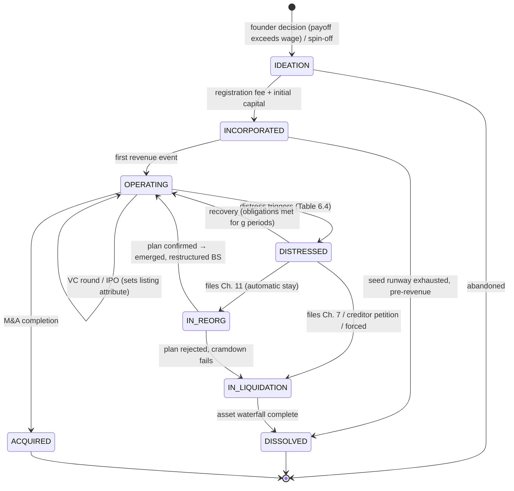

# 6. Economy & Markets Engine

The Economy & Markets Engine is the first and largest of POLIS's Institution Service families (Ch. 4): deterministic reducers that own all economic state and expose narrow, schema-validated decision interfaces to agents. The golden rule applies here in its strictest form — LLM agents make judgments, form expectations, and choose strategies; they **never** perform arithmetic, market clearing, or balance-sheet updates. Every validated precedent converges on this split: EconAgent's LLM households reproduced the Phillips curve (Pearson $-0.619$) and Okun's law ($-0.918$) with correct sign only because a rigid engine enforced accounting and a Taylor-rule central bank [^3^], and TwinMarket's BDI-framed investors produced emergent bubbles, crashes, and volatility clustering only inside a deterministic exchange [^4^]. The alternative — end-to-end reinforcement learning over the whole economy (AI Economist) — needed $\sim$$10^9$ samples for 4–10 agents with oscillating two-level training; RL is reserved for offline policy search, never the live engine [^1^]. The six subsystems below span the accounting spine (§6.1), production (§6.2), the firm lifecycle (§6.3), capital markets (§6.4), banking and money (§6.5), and bankruptcy and litigation (§6.6). The seam throughout is uniform: agents propose, institutions dispose.

## 6.1 The Accounting Spine

### 6.1.1 Stock-flow-consistent quadruple-entry ledger

The economy engine is built on the stock-flow-consistent (SFC) discipline: every monetary stock is simultaneously one agent's asset and another's liability, and every flow is booked so that stocks and flows remain mutually consistent — no "black holes" for money [^9^][^10^]. Mechanically this is a **quadruple-entry ledger**: every transaction executes as an atomic bundle of four or more postings — a debit and a credit on each counterparty's balance sheet. Every loan on the liability side of a firm's balance sheet appears on the asset side of a bank's [^21^]; household deposits are mirrored as bank liabilities, bank reserves as central-bank liabilities. Each posting carries the `event_id` of its causing decision, so the ledger is fully reconstructible from the event log (Ch. 4) and every number traces to an agent's choice.

Account types are fixed and typed: **assets** {deposits, inventory lots, trade receivables, capital stock, intangibles, securities}, **liabilities** {trade payables, loans, bonds, wages payable, taxes payable}, **equity** {shares outstanding, retained earnings}. Four invariants checked at every settlement tick form the hard correctness gate: (i) per entity, $\sum \text{assets} - \sum \text{liabilities} = \text{net worth}$; (ii) each row of the sectoral matrix sums to zero economy-wide; (iii) per-good inventory conservation (produced = sold + held + perished); (iv) money stock = $\sum$ deposits created $-$ $\sum$ destroyed. An invariant failure halts the tick and raises an engine fault — the single most valuable correctness property in POLIS, and cheap to enforce.

**Macro aggregates are pure queries, not model outputs.** GDP is an expenditure sum over final-goods postings, CPI a Laspeyres index over recorded transaction prices, unemployment and wage distributions views over the labor ledger, and the firm-size and wealth distributions views over balance sheets. No aggregate is ever generated or narrated by an LLM — this scaffolding is precisely what let the EconAgent pattern reproduce *signed* macro regularities: emergence comes from heterogeneous decisions interacting with a rigid ledger, not from a model computing the economy in free text [^3^].

Table 6.1 shows the master transaction matrix; each row is one deterministic reducer, each cell that sector's postings. Legend: D = deposits, R = central-bank reserves, L = loans, B = government bonds, NW = net worth, AR/AP = trade receivables/payables, Sh = shares, Inv = inventory, G = government account at the central bank; "+"/"−" denote increase/decrease.

**Table 6.1 — SFC transaction matrix (quadruple-entry postings by sector)**

| # | Transaction (reducer) | Households | Firms | Banks | Government | Central bank |
|---|---|---|---|---|---|---|
| 1 | Wage payment | +D | −D; −NW (wage expense) | ±R if cross-bank | | |
| 2 | Consumption purchase | −D; +goods | +D; −Inv; +NW (margin) | ±R if cross-bank | | |
| 3 | Loan issuance (money creation) | | +D; +L | +L (asset); +D (liability) | | |
| 4 | Loan repayment (money destruction) | | −D; −L | −L (asset); −D (liability) | | |
| 5 | Interest payment | −D; −NW | −D; −NW | −D (liability); +NW | | |
| 6 | Tax payment | −D | −D | −R | +G | −R (liab.); +G (liab.) |
| 7 | Trade-credit sale | | seller: +AR, −Inv, +NW; buyer: +AP, +Inv | | | |
| 8 | Equity issuance (VC/IPO) | −D; +Sh | +D; +NW (share capital) | ±R if cross-bank | | |
| 9 | Open-market purchase | | | +R; −B | | +B (asset); +R (liability) |

Read row-wise, the matrix makes the "no black hole" property visible: every "−" in one sector has a matching "+" in another, and only rows 3, 4, and 9 change the economy-wide sum of balance sheets — row 3 is the sole endogenous money-creation channel, row 4 its destruction counterpart, which is why credit dynamics drive the money supply (§6.5); rows 1, 2, 5, and 8 are pure transfers. Row 6 routes taxes through the banking system into the government's central-bank account, so fiscal policy has automatic monetary footprints with no extra code. Row 7 is the contagion surface: trade credit creates the inter-firm balance-sheet links along which bankruptcy cascades propagate (§6.6). Because each row is a pure function of validated inputs, the matrix doubles as the engine's test oracle: a randomized property test can assert all four invariants after any sequence of reducer invocations.

## 6.2 Goods, Firms & Production

POLIS models a closed, typed catalog of goods and services (food, housing, energy, manufactures, business and consumer services). The catalog is deliberately small — ~60 SKUs at launch — because rich price dynamics do not require large good sets (Offworld Trading Company sustains a fully player-driven market on 13 resources [^35^]); depth comes from inventories, recipes, and geography, not SKU proliferation. Every good carries physical attributes: perishability (shelf life in ticks), storability, and unit.

**Production is recipe-template input–output with factor substitution at the margin.** Firms are instantiated from templates specifying a single output good, a Leontief input vector, a labor-occupation mix, and a Cobb–Douglas aggregator with firm-specific total factor productivity, $Y_i = A_i L_i^{1-\alpha} K_i^{\alpha}$ — the hybrid design proven by SimCity, the closest existing analog to an LLM-deliberation economy [^13^]. Templates expose a small discrete set of named **production methods** (Victoria 3's pattern: each a named vector of inputs, outputs, and occupation mix [^14^]), so technology choice is a legible discrete decision an LLM can reason about. Inventories are discrete lots with unit cost and perish dates; procurement has lead times; unfilled orders queue or lapse. Stockouts, rationing, and delivery lags are first-class outcomes — the short-run phenomena market-clearing models rule out by construction, and the drivers of endogenous shortage cascades [^7^].

The decision seam is explicit. An LLM CEO (salient firms) chooses from a structured menu — output price band, production method, vacancies and wage offers, input orders, borrowing, capacity investment, dividends — while the engine computes unit economics, transforms inventories, and accrues wages, interest, and depreciation. Three guard-rails come from Project Vend, where a frontier LLM running a real micro-business failed mainly on unit economics [^36^]: every CEO prompt embeds the balance sheet, per-SKU margins, and a cash-flow projection; the engine refuses below-cost pricing unless flagged as a promotion; payment references are validated against the account registry. Firms without an LLM CEO run an autopilot of adaptive markup rules (raise price when inventories fall, wages when vacancies go unfilled), which alone yields plausible aggregate dynamics [^15^][^18^].

The firm population is tiered (design decision, the composite recommended by the firm-lifecycle research): stochastic Gibrat clones fill the micro-firm long tail (~98% of firms), hundreds to thousands of salient firms receive LLM CEOs with model tier scaled to stakes (CEO-Bench shows structural competence is largely solved while strategic calibration varies — competence is a parameter, not an assumption [^37^]), and a sector-level aggregate closes the goods market. All three tiers post to the same SFC ledger under the same invariants.

## 6.3 Firm Lifecycle State Machine

Firm demography is decision-driven. A household agent founds a firm when expected entrepreneurial payoff exceeds wage work — Axtell's firm-formation model shows purposive, payoff-comparing entry is what generates the empirical power-law (Zipf) firm-size distribution, while random entry produces nothing like it [^1^]. Two further entry channels run in parallel: a Poisson background flow of clone-firm creation whose intensity is tuned against growth volatility to hold the size tail at exponent $\approx 1$ [^2^], and spin-offs from existing firms' strategies. Exit occurs through bankruptcy (§6.6), acquisition, voluntary dissolution, or owner death without succession.

The lifecycle is an 8-state finite-state machine. (Design decision: the firm research's 9-state minimal set treats VC-backed and listed as full states; POLIS instead folds listing status — `private | vc_backed | public` — into an attribute of OPERATING, since listing changes disclosure obligations and funding rails, not existential phase.)



**Table 6.2 — Firm lifecycle states, entry guards, and engine actions**

| State | Role | Entry guards (engine-tested) | Permitted engine actions | Exit transitions |
|---|---|---|---|---|
| IDEATION | Pre-entity; business plan object | Founder savings ≥ registration fee; idea draw | None (no ledger presence) | INCORPORATED, abandoned |
| INCORPORATED | Legal entity, pre-revenue | Registration posting; initial capital deposited | Equity issuance (pre-seed/seed), hiring, input orders | OPERATING, DISSOLVED |
| OPERATING | Revenue-generating | First revenue event | Full menu: produce, price, hire/fire, borrow, invest, VC rounds, IPO, dividends | DISTRESSED, ACQUIRED, DISSOLVED (voluntary) |
| DISTRESSED | Triggered but not yet filed | Any bankruptcy trigger (Table 6.4); grace period | Restricted menu: no dividends, no new unsecured debt; asset sales allowed | OPERATING (recovery), IN_REORG, IN_LIQUIDATION |
| IN_REORG | Chapter 11 debtor-in-possession | CEO filing; going-concern value > liquidation value | Operate under automatic stay; propose plan (haircut, extension, debt-for-equity); reject executory contracts | OPERATING (emerged), IN_LIQUIDATION |
| IN_LIQUIDATION | Chapter 7 trustee-controlled | Ch. 7 filing, creditor petition, or reorg failure | None (trustee auctions assets; waterfall payout) | DISSOLVED |
| DISSOLVED | Terminal; entity deleted | Waterfall complete / voluntary wind-down | None | — |
| ACQUIRED | Terminal; absorbed by acquirer | M&A agreement + preference-stack payout | None (assets/liabilities transfer to acquirer) | — |

Two properties deserve emphasis. First, DISTRESSED is a real, observable state rather than an instant transition to death: it opens the window in which CEOs renegotiate, creditors petition, rivals poach staff, and news accumulates — the drama of decline happens *inside* the simulation rather than between ticks. Second, every guard is engine-tested against ledger state; the CEO's only free choices are the bankruptcy track and the recovery actions taken while distressed (§6.6). Calibration targets are fixed from U.S. firm demography: exit hazard decreasing in age and size (12.3%/yr for 1–4-employee firms vs 2.9% at 5–9, ~88% of exits among the smallest firms [^5^]); cohort survival of ~79.6% at year 1, ~50.6% at year 5, ~34.7% at year 10 [^27^]; and a Zipf tail (exponent ≈ 1) from Gibrat growth plus the tuned entry flow [^2^]. A correct tail is not cosmetic: with granular firm sizes, aggregate volatility decays far more slowly than $1/\sqrt{N}$, so believable business-cycle amplitude emerges without injected aggregate shocks [^6^]. These targets are enforced as Validation Harness gates, with micro-level distributions checked alongside macro aggregates against equifinality — structurally wrong mechanisms can match the same low-order statistics [^29^].

## 6.4 Capital Markets

### 6.4.1 The exchange: deterministic limit order book

The exchange follows the ABIDES pattern: a message-based, discrete-event, continuous double auction with strict price/time priority, modeled on NASDAQ's ITCH/OUCH protocols and validated at tens of thousands of interacting agents [^25^]. POLIS runs one exchange service hosting one book per symbol — listed firm equities plus government bonds — on a millisecond logical clock. Agents interact through a simplified OUCH-like message set (`NEW_ORDER`, `CANCEL`, `REPLACE`); every accepted message, trade print, and book snapshot is written to the event log, so candlesticks, a cap-weighted index, and realized-volatility series are pure derived views.

```pseudo
function ON_MESSAGE(msg, agent):                    # exchange reducer
    require VALID(msg)                              # schema check; malformed → reject
    if msg == NEW_ORDER:
        order ← msg.order
        require FEASIBLE(order, agent)              # ZI-C guardrail: cash ≥ qty×limit (buy);
                                                    # shares ≥ qty (sell); else → no-op
        book ← BOOKS[order.symbol]
        while order.qty > 0:                        # aggressive matching loop
            best ← book.peek(opposite_of(order.side))
            if best == ∅ or not CROSSES(order.price, best.price): break
            px   ← best.price                       # resting order sets trade price
            q    ← min(order.qty, best.qty)
            LEDGER.SETTLE_TRADE(order.owner, best.owner, order.symbol, q, px)
                                                    # 4 postings: cash ↔ shares
            book.decrement(best, q); order.qty −= q
            EMIT TICK(order.symbol, px, q, t)       # → event log / tick history
        if order.qty > 0 and order.type == LIMIT:
            book.insert(order)                      # price level, FIFO time priority
    if msg == CANCEL/REPLACE: book.apply(msg)       # deterministic, logged
```

Trader cognition sits strictly above this reducer. LLM investors form beliefs from the news stream and social interaction (the TwinMarket coupling: BDI-framed agents whose news-conditioned beliefs yield emergent bubbles, crashes, and volatility clustering [^4^]) and translate beliefs into order intents; the engine wraps every intent in the budget/share feasibility check drawn from the zero-intelligence-trader lesson — budget-constrained random traders already achieve near-maximal allocative efficiency (Gode and Sunder), so a malformed order degrades to a harmless no-op, never an accounting violation [^23^]. Heterogeneous strategies are a *requirement*: zero-intelligence flow alone cannot generate fat tails or volatility clustering, and the exchange is validated against the Cont (2001) stylized facts — tail index 2–5, no raw-return autocorrelation, volatility clustering, long memory in volatility, volume/volatility correlation [^28^]. Ch. 7 owns the news→belief pipeline; the engine owns the belief→trade boundary at order submission.

### 6.4.2 Venture capital and IPO mechanics

VC firms are **organizational agents**: fund entities with limited-partner capital, a 20–40-position portfolio mandate, follow-on reserves, and power-law-aware selection logic rather than per-deal NPV maximization — portfolio logic dictated by the empirical return distribution, in which 50–65% of financings return less than 1× while 2–5% return more than 10× and generate 60–90% of fund returns [^23^][^24^]. Deal sourcing draws from the INCORPORATED pipeline (§6.3): founder quality draw, sector heat, and traction signals form the screen. Rounds follow the standard ladder, with dilution computed deterministically as

$$\text{dilution} = \frac{R}{V_{\text{pre}} + R} \approx 15\text{–}25\% \text{ per round}$$

where $R$ is the raise and $V_{\text{pre}}$ the pre-money valuation; industry norms anchor ~20% equity sold per round [^16^][^17^]. Valuation is $V = \text{multiple}_{\text{sector}} \times \text{traction} \times f(\text{growth}, \text{sentiment}) + \varepsilon$: the CEO *proposes* an ask and a narrative, the VC agent accepts, negotiates, or passes, and the engine posts cap-table and cash changes through Table 6.1 row 8. Startup outcomes are fat-tailed **by construction** — outcome = quality draw × execution × market lottery — calibrated so ~75% of VC-backed firms never return investor capital [^28^]. The runway clock is the binding constraint: any payroll or interest date at which cash plus committed tranches goes negative fires the liquidity-default trigger (§6.6).

**Table 6.3 — VC round ladder mechanics**

| Round | Eligibility gate (engine-tested) | Typical raise (sim-$) | Dilution | Instrument & control terms |
|---|---|---|---|---|
| Pre-seed | Idea draw + founder savings ≥ fee | 10k–1M | 10–20% | Common / SAFE-like note; no board seat |
| Seed | Working prototype (first production run completed) | 0.5M–5M | 15–25% | Preferred shares; observer seat |
| Series A | Product-market-fit signal: revenue growth > threshold ∧ retention floor | 2M–20M | ~20% | Preferred; board seat (control flag) |
| Series B | Scale metrics: revenue base ∧ hiring plan | 15M–50M | 15–20% | Preferred; protective provisions |
| Series C+ | Sustained growth; pre-IPO hygiene (audited reports) | >100M | 10–20% | Preferred; IPO or M&A path required |

The ladder is a state attribute, not a script: gates are tested against ledger-measured traction, so a firm can skip rungs, stall between rounds, or down-round (lower $V_{\text{pre}}$ than the prior post-money, triggering anti-dilution terms and a news event). Down-rounds and runway deaths are where the power law is manufactured — most portfolio firms stall at the seed/A boundary, matching the empirical 50–65% sub-1× mass, while a small right tail compounds through B/C+ into the 10× outcomes that dominate fund returns [^23^][^24^]. Because VC agents hold follow-on reserves, a portfolio firm's DISTRESSED transition becomes an investment-committee decision — bridge, recapitalize, or let die — coupling the VC subsystem directly into the bankruptcy machinery. Round sizes are calibrated at world-gen from the scenario's economy scale, never hardcoded into reducer logic.

**IPO** exits the ladder onto the exchange via a deterministic bookbuild: the firm offers a float percentage within a price band, investor agents submit demand, the clearing price is set where the book fills, and allocation follows institutional/retail tranche conventions; first-day performance follows pricing relative to the sentiment-adjusted demand curve, calibrated to the empirical underpricing band of ~8% (large issuers) to ~29% (small technology issuers) [^26^]. Post-IPO, the firm must publish periodic earnings reports derived from its true ledger; these feed the news system, move the stock, and — if they deviate from the books beyond tolerance — arm the shareholder-suit trigger (§6.6).

## 6.5 Banking & Money

Money in POLIS is **endogenous**: commercial banks create deposits when they issue loans and destroy them on repayment — the EURACE/Caiani mechanism (Table 6.1, rows 3–4) through which credit-money dynamics generate macroeconomic instability rather than merely reflect it [^12^][^21^]. Banks hold reserves at the central bank, and any payment between customers of different banks triggers an equal reserve transfer between them [^13^], so interbank settlement emerges from the ledger rather than being scripted.

Credit supply is priced and rationed deterministically. The loan rate is $r_{\text{loan}} = r_{\text{policy}} + \rho(\text{leverage}, \text{rating}, \text{sector})$; supply is capped by each bank's regulatory leverage ratio, producing endogenous credit rationing and crunches when bank balance sheets deteriorate — defaults tighten lending, higher rates induce further defaults, and the spiral closes [^15^]. Collateral spans inventory, capital stock, and securities (stock-as-collateral enables leverage spirals); covenant breach makes a loan callable, feeding §6.6's triggers. Credit scores are engine-computed from ledger history (default events, leverage trajectory, cash-flow volatility), never LLM-narrated.

Because banks issue liquid demand deposits against illiquid loans, they are structurally exposed to Diamond–Dybvig runs: maturity transformation is valuable and simultaneously creates a self-fulfilling run equilibrium [^26^]. POLIS splits a run along the golden rule. Withdrawal *decisions* are LLM belief judgments driven by news and social signals — the SVB LLM simulator reproduced the correct partial-run ordering (uninsured depositors withdrawing at 81.3% vs 34.5% insured), including contagion and flight-to-safety [^8^] — while solvency and liquidity *arithmetic* (fire-sale losses, reserve depletion, failure) stays in the engine. Deposit-insurance coverage is a scenario knob: higher coverage suppresses runs but carries a moral-hazard cost in bank risk-taking (design decision: expose both parameters and let the trade-off be observable).

The central bank is a parameterized rule-based agent by default, setting the policy rate by a Taylor-type rule on inflation and unemployment — the configuration under which the EconAgent stack reproduced signed Phillips/Okun regularities [^3^]:

$$r_t = r^* + \pi_t + \phi_\pi(\pi_t - \pi^*) - \phi_u(u_t - u^*)$$

Rule parameters ($r^*$, $\pi^*$, $\phi_\pi$, $\phi_u$) are policy levers exposed to scenario authors and, in-world, to electoral outcomes (Ch. 7). Two cautions are design constraints. First, Mark-0's phase analysis shows economies sit near tipping points ("dark corners") where aggressive feedback rules destabilize rather than stabilize — policy works only far from phase boundaries [^14^][^15^] — so the Validation Harness includes policy-shock replays. Second, no RL planner runs in the live loop: the AI Economist's two-level RL improved the equality–productivity trade-off by 16%, but at $\sim$$10^9$ samples and 4–10 agents [^1^]; such optimization is an offline tool that *recommends* parameters the deterministic engine executes.

## 6.6 Bankruptcy & Litigation Mechanics

### 6.6.1 Dual-track triggers and contagion cascades

Bankruptcy detection is fully deterministic and runs at every settlement tick. Two primary tracks fire the DISTRESSED transition — **liquidity default** (due obligations unmet at settlement) and **equity-deficit insolvency** (net worth below zero for $k$ consecutive periods, the Ikeda-style capital-deficit criterion [^30^]) — with covenant acceleration and contagion re-tests as secondary triggers. Empirically, liquidity is the binding constraint: firms with cash-flow gaps exceeding 90 days are ~3× more likely to seek bankruptcy protection within 18 months [^27^], so cash-gap duration enters the clone-firm hazard model as a multiplier. On any default, each creditor's receivable is haircut by $(1 - \text{recovery rate})$ and distress tests re-run for every affected creditor — the Battiston/Delli Gatti chain-bankruptcy mechanism propagating along trade-credit and supply-chain links, producing avalanches without scripting [^30^][^32^]. Cascades are balanced by the competitive effect: a bankrupt firm's rivals can *gain* share, so contagion is localized rather than uniformly destructive [^30b^]. Propagation posts to other subsystems: layoffs shock household incomes, supplier defaults cause customer stockouts (§6.2), and a news item is emitted for the belief layer.

**Table 6.4 — Bankruptcy triggers (all engine-detected)**

| Trigger | Deterministic condition | Detector | Initiator | First consequence |
|---|---|---|---|---|
| Liquidity default | Cash + undrawn credit < due obligations (payroll, interest, payables, taxes) at settlement; grace period exhausted | Settlement reducer | Firm self-file or creditor petition | DISTRESSED; dividends/new unsecured debt blocked |
| Equity-deficit insolvency | Net worth < 0 for $k$ consecutive periods ($k=4$) | Tick invariant job | Automatic | Forced filing evaluation |
| Covenant acceleration | Loan covenant breached (leverage/coverage) | Loan reducer | Bank calls loan | Principal becomes due → liquidity re-test |
| Contagion re-test | Receivable haircut $(1-\text{recovery})$ from counterparty default | Cascade job | Automatic | Re-run liquidity + insolvency tests |
| Voluntary exit / owner death | Owner decision; owner dies without succession | Lifecycle reducer | Owner / demographics | Orderly wind-down outside Ch. 7/11 |

The trigger table is deliberately small and every row is a pure function of ledger state — this makes distress *auditable*: the Causal Inspector can answer "why did this firm die?" by replaying the exact obligation queue that failed. The grace period and the $k$-period insolvency window separate noise from failure: one unlucky settlement wounds a firm (DISTRESSED is observable to creditors, rivals, and news) without killing it, mirroring the empirical dominance of liquidity over profitability as the exit predictor [^27^]. Track choice is the CEO's one free decision, bounded by an engine guard-rail: reorganization requires going-concern value above liquidation value. Chapter 11 keeps management as debtor-in-possession under an automatic stay freezing debt service and pending suits, proposes a plan (haircut %, maturity extension, debt-to-equity swap), and puts impaired creditor classes to a recovery-comparison vote; failure converts the case to Chapter 7 [^31^]. Chapter 7 appoints a trustee who auctions assets at a fire-sale discount and pays out by absolute priority — secured, then administrative/tax/wage claims, then unsecured, with equity receiving approximately nothing [^31^].

```pseudo
function CHECK_DISTRESS(firm):                   # every settlement tick
    if firm.cash + firm.undrawn_credit < DUE_OBLIGATIONS(firm):
        firm.grace −= 1
        if firm.grace == 0: ENTER_DISTRESSED(firm, LIQUIDITY_DEFAULT)
    if NET_WORTH(firm) < 0: firm.insolvent_periods += 1
    else: firm.insolvent_periods = 0
    if firm.insolvent_periods >= K: ENTER_DISTRESSED(firm, EQUITY_DEFICIT)

function RESOLVE_BANKRUPTCY(firm, cause):
    AUTOMATIC_STAY(firm)                         # freeze debt service & lawsuits
    track ← CEO_CHOOSE(firm) if GOING_CONCERN_VALUE(firm) > LIQUIDATION_VALUE(firm)
            else CHAPTER_7                       # engine guard-rail
    if track == CHAPTER_11:
        plan ← PROPOSE_PLAN(haircut, extension, debt_for_equity)
        if CREDITOR_CLASSES_VOTE(plan):          # recovery-comparison rule
            EMERGE(firm, RESTRUCTURED_BS(plan)); return
        track ← CHAPTER_7                        # cramdown/plan failure
    proceeds ← AUCTION(firm.assets, FIRE_SALE_DISCOUNT)
    for class in [SECURED, ADMIN_TAX_WAGE, UNSECURED, EQUITY]:
        proceeds −= PAY_IN_PRIORITY_ORDER(class, proceeds)
    for each creditor with recovery < 1:
        HAIRCUT(creditor.receivables[firm], 1 − recovery)
        CHECK_DISTRESS(creditor)                 # cascade re-test
    LAYOFF_ALL(firm); EMIT NEWS_ITEM(firm, cause); DELETE(firm)
```

### 6.6.2 Litigation triggers and engine-computed damages

Ch. 7 of this specification owns court *procedure* (the litigation FSM); the economy engine owns what creates cases and what they are worth. Contracts are first-class ledger objects — supply, employment (with non-competes), loan covenants, IP licenses — each with obligations, due dates, and penalty clauses, so breach is mechanically detectable. Four grievance triggers arm suits: (i) **breach**, auto-detected from the ledger (missed delivery or payment); (ii) **tort**, including sabotage and defamation propagated through the news system; (iii) **IP overlap**, detected by a patent-scope collision check; (iv) **shareholder suits**, armed when a listed firm's published earnings deviate from its true books beyond tolerance. Resolution follows the canonical two-stage bargaining framework under asymmetric information: a demand/offer exchange between the party agents, then — absent settlement within $n$ rounds — adjudication as a noisy function of an engine-computed merit score, with costs and delay making settlement the rational default [^29^]. Damage *magnitudes* are always engine formulas (expectation damages = contract value − cover price + capped consequentials; IP = reasonable royalty × overlap; shareholder = price impact × shares harmed), never LLM-generated numbers — LLM-run dispute resolution degrades to 3–7% success on small models, so language models argue while the engine counts [^29b^]. An `enforcement_quality ∈ [0,1]` institutional dial scales the probability and delay of punishment; weak enforcement endogenously shrinks trade credit and localizes supply networks [^32^]. Filing for bankruptcy suspends all pending suits under the automatic stay and converts claims to pre-petition unsecured status, coupling litigation back into the waterfall [^31^].
