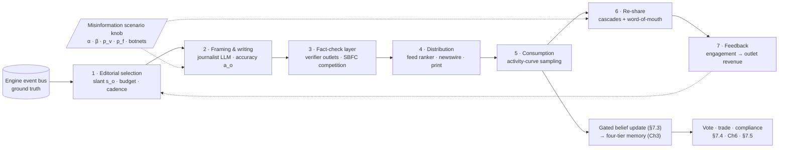
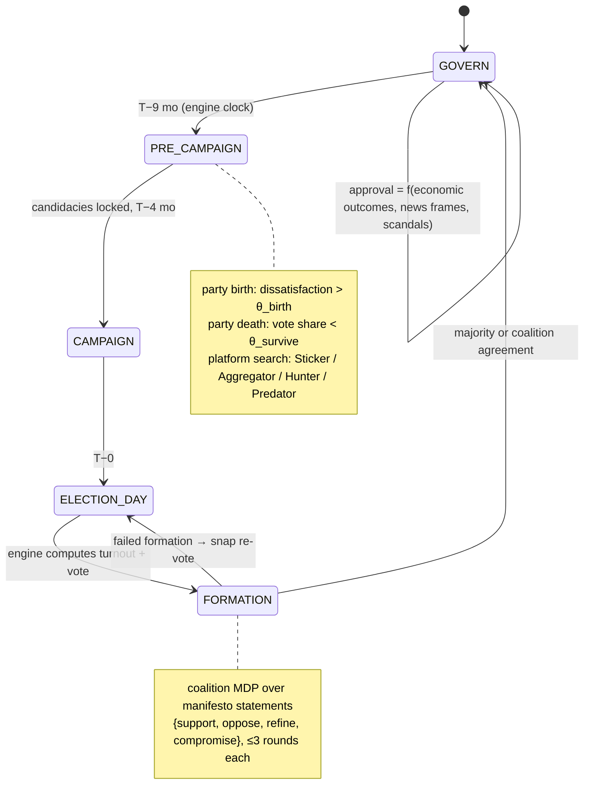

# 7. Society: Communication, News, Politics & Law

The economy engine of Chapter 6 determines what agents own; this chapter specifies the machinery through which they learn, persuade, govern, and sue. POLIS implements the social layer as the second family of Institution Services established in §4.1.2: the message broker, the newsroom pipeline, the election cycle, and the courts are deterministic reducers and finite-state machines (FSMs) over the event stream, while the participants within them — correspondents, editors, candidates, lawyers, litigants — are large language model (LLM) agents operating under the two-class seam: agents propose, institutions dispose. Every mechanism below rides on the event envelope of §4.2.2 and inherits its visibility access-control lists (ACLs), because the society layer's product is precisely *structured information asymmetry*: bounded, delayed, and occasionally corrupted information is what turns a sterile equilibrium into insider trading, rumor cascades, media panics, and courtroom drama (research Insight 5). Sections 7.1–7.5 implement FR-C1/C2, FR-N1/N2, FR-P1–P3, and the procedural half of FR-B4, and own both the simulation's most powerful policy lever — feed ranking — and its dominant cost center, free-text communication.

## 7.1 Communication Fabric

### 7.1.1 Brokered multi-channel message envelope

All agent communication passes through a centralized, event-driven message broker — never peer-to-peer calls — following the asynchronous actor model of AutoGen v0.4+ and the decoupled asynchronous-module architecture of OASIS [^1381^][^1385^][^1073^]. Every message is an envelope persisted to the environment store before fan-out, making the mail system a queryable projection of the same append-only log that powers memory, news, replay, and — via filtered extraction — legal discovery (§7.5). The envelope extends the Chapter 4 event schema with the threading fields of the FIPA Agent Communication Language (Foundation for Intelligent Physical Agents) — `conversation_id`, `in_reply_to`, `reply_by` [^1379^] — and a speech-act `performative` drawn from {INFORM, REQUEST, PROPOSE, ACCEPT, REFUSE} plus POLIS-specific {OFFER, THREATEN, NOTICE}. The performative gives the engine machine-readable communicative intent — an OFFER with terms can be auto-checked for contract formation against §6.6 ledger contracts, a THREAT can arm litigation triggers — while the natural-language body remains what agents read [^1378^][^1384^].

Visibility filtering is per-recipient, implementing Concordia's `partial_state` pattern, in which each world component projects what a given agent may observe [^1429^]: an envelope's `visibility_scope` resolves against the §4.2.2 ACLs at delivery, so a single logged event (a chief executive's email to a trader) is visible to exactly its recipients until a court order expands the ACL — the mechanical basis of material non-public information (MNPI) and insider windows. Delivery is asynchronous and latency-bearing: agents activate stochastically from a 24-dimensional hourly activity-probability vector rather than simultaneously — the OASIS time engine, whose fixed steps preserve intra-step ordering [^1073^][^1380^] — and each envelope carries `deliver_at_sim_time` so information arrives with realistic lag. Bounded attention is modeled, not assumed: reading mail is an action with opportunity cost, inboxes are exposed as tool surfaces (`list_inbox`, `read`, `search`, `compose`, `reply`) in the MCP/τ-bench tool-schema style [^1445^][^1532^], and agents receive digests (N unread, top-K by sender importance) rather than raw firehoses. This is a fidelity requirement: strong computer-use agents demonstrably treat mid-task messages as background noise — the "stale grounding" failure [^1401^] — so POLIS generates "didn't see the email" outcomes by construction.

Free-text communication is the simulation's dominant LLM-cost driver, at roughly 10²–10³ calls per agent per sim-month for socially active agents [^1514^]; Chapter 8 owns that budget. Two consequences land here: Background-class agents communicate through template-driven archetype calls (Ch3 §3.2), and every envelope is logged with full provenance, because coordination and communication breakdowns are the dominant multi-agent failure mode at 36.94% of annotated traces [^1447^] — and because the trace table doubles as the court's evidence store.

**Table 7-1. Message channel specification (latencies and costs are design targets; ACL defaults are engine-enforced).**

| Channel | Topology | Delivery latency (sim time) | Persistence | LLM-cost class | Default visibility ACL | Institutional semantics |
|---|---|---|---|---|---|---|
| EMAIL | 1-to-few | 30 min–6 h | Permanent, searchable | Medium (digest-batched) | Sender + named recipients | Discoverable in litigation; attachments; contract-admissible |
| DM / GROUP_CHAT | 1-to-few | 1–15 min | 30-day rolling window | Low | Participants only | Rumor and insider channel; secrecy is scored behavior [^1531^] |
| PUBLIC_POST / FEED | 1-to-many | Near-instant | Permanent + engagement counters | Low write / high cascade exposure | Public | Enters the feed ranker (§7.3); drives cascades |
| NEWSWIRE | 1-to-many broadcast | Outlet cadence (hourly/daily) | Permanent, versioned | High (article generation) | Public, subscription-weighted | Articles are first-class belief inputs (§7.2) |
| LEGAL_NOTICE | 1-to-few | Fixed procedural deadline | Tamper-evident, court-admissible | Low | Parties + court docket | Service of process; clocks the court FSM (§7.5) |

The channel table is the load-bearing surface for three downstream systems. First, latency asymmetry is the raw material of information economics: the trader who reads the newswire at hour 0 and the pensioner who reads it at hour 6 inhabit different markets, and classical microstructure predicts the consequences — informed traders improve price discovery, and asymmetric information composition multiplies volatility — which POLIS adopts as validation targets [^1490^]. Second, persistence classes map to evidentiary weight: only permanent or tamper-evident channels may appear as structured evidence in DISCOVERY, which makes the ephemeral DM the natural home of conspiracy and EMAIL the natural home of the fraud paper trail. Third, the cost column is where the Chapter 8 budget bites: NEWSWIRE's high generation cost amortizes across thousands of readers, while EMAIL cost scales with social-graph density. TheAgentCompany's RocketChat-based workplace demonstrates that LLM-mediated colleague messaging over a real chat substrate is a workable reference implementation for the corporate slice of this fabric [^1416^].

## 7.2 The Newsroom Pipeline

### 7.2.1 Seven stages from event to belief

No purpose-built simulated newsroom — editorial desk, assignment, production, publishing schedule — exists in the surveyed literature; the nearest components are Y Social's RSS injection with outlet-leaning annotations, true-to-fake mutation pipelines, and trending-topic generators [^53^][^59^][^61^]. The newsroom pipeline is therefore a genuine design contribution of POLIS, specified as a seven-stage reducer chain with LLM agents at exactly two stations (writing and debunking) and deterministic machinery everywhere else. Multiple news agencies coexist as firms in the Chapter 6 sense — each with a budget, a cadence, an audience model, an editorial slant $s_o$ positioned in the same opinion space in which agents vote, and an accuracy parameter $a_o \in [0,1]$ governing error and fabrication rates.



**Table 7-2. Newsroom pipeline stages (LLM involvement is restricted to stages 2 and 3; selection, ranking, and accounting are deterministic).**

| # | Stage | Mechanism | LLM role | Key parameters and anchors |
|---|---|---|---|---|
| 1 | Editorial selection | Outlet picks event subset by newsworthiness × audience fit × slant distance | None | Agenda-setting; slant $s_o$ [^6^] |
| 2 | Framing and writing | Journalist persona renders article from the event record; slant applied; errors enter at rate $1-a_o$ | Article generation | True→fake mutation pipeline [^59^] |
| 3 | Fact-check layer | Verifier outlets and agents publish debunks; hoax and debunking compete | Debunk text | SBFC: credibility α, spread β, verify $p_v$, forget $p_f$ [^56^] |
| 4 | Distribution | Feed ranker + direct subscription + print/broadcast (one-to-many, no comments) | None | Interest-based and hot-score rankers [^51^][^52^] |
| 5 | Consumption | Agents sample feed on a diurnal activity curve; comprehension → stance delta (§7.3) | Comprehension (class-tiered) | Hourly activity fitting [^53^] |
| 6 | Re-share | Persona-conditioned share/comment/quote decisions; cascades; offline word-of-mouth | Share decision (class-tiered) | Smallville diffusion 4%→32% awareness [^49^] |
| 7 | Feedback | Engagement → advertising/subscription revenue (Ch6 ledger) → future editorial choices | None | Articles enter trader signal stacks [^62^] |

The pipeline closes three loops. The revenue loop (7→1) makes editorial slant commercially motivated rather than cosmetic: outlets that misjudge their audience lose the ledger income that funds cadence. The belief loop (5→§7.3) routes every consumed article through the gated bounded-confidence update, so propaganda succeeds or fails by persona-level tolerance and trust, not by decree. The market loop (5→Ch6) puts articles into trader signal stacks; TwinMarket ablations show removing the social layer significantly degrades market realism — the newsroom is causal for prices, not decoration [^62^][^1461^]. Misinformation is a scenario knob: the editor exposes the SBFC parameters (α, β, $p_v$, $p_f$), adversary toggles (coordinated botnets, trend poisoning [^61^]), and countermeasures of network-dependent efficacy — accuracy flags, influencer throttling, comment-before-share friction [^1410^], diffusion delays up to roughly three minutes [^58^]. Two fidelity caveats are engineered around: LLM safety alignment suppresses sensational sharing, which would unrealistically tame cascades, so adversarial personas and rule-based share overrides compensate [^60^]; and simulated rumors robustly outpace truth (~30% normalized RMSE against real propagation curves [^1073^]), a validation target rather than a defect.

## 7.3 Belief & Opinion Dynamics

Content becomes consequence only through belief change. Each agent carries, per issue $k$, a continuous opinion $x_{ik} \in [0,1]$, a salience $s_{ik}$, and a certainty $c_{ik}$, plus a slow-moving party-identification variable (Layer-1 persona state, Ch3). The update machinery is a hybrid bounded-confidence + LLM pipeline. The LLM performs comprehension (of an article, a DM, a rally speech); a stance probe maps pre/post comprehension to a numeric delta direction; and a Deffuant bounded-confidence gate decides admissibility and magnitude — agent $i$ updates from source $j$ only when $|x_{ik} - x_{jk}| < \varepsilon_i$, then moves a fraction $\mu$ of the distance, weighted by trust:

$$x_{ik} \leftarrow x_{ik} - \mu\,(x_{ik} - x_{jk}) \cdot \mathrm{trust}_{ij}$$

Tolerance $\varepsilon_i$ is persona-heterogeneous (correlated with openness and dogmatism traits), trust comes from the relationship graph (§3.4), and a small noise term keeps clusters soft [^10^][^11^]. Two results discipline calibration. Opinion cluster counts converge to roughly $1/(2\varepsilon)$ and serve as a validation target [^10^]; but Hegselmann–Krause transitions are chaotic and non-monotonic in $\varepsilon$ — consensus can break down at *larger* tolerance — so $\varepsilon$ is fixed by calibration, never grid-searched by intuition [^12^]. Zealots ($\varepsilon = 0$) model committed minorities, which tip whole populations at 4–15% prevalence (~10% baseline) [^8^]; an optional Relative-Agreement variant breeds extremism from confidence-weighted interaction without extremist priors [^14^]. At small scale the numeric rule can be replaced by LLM-as-update-rule, which reproduces echo chambers at language level [^16^][^17^]; at population scale it serves the Background tail — the hybrid core/periphery split validated at million-agent scale [^1402^].

Belief writes into the four-tier memory of §3.1.2 are gated. Every candidate memory carries provenance metadata — source type, authoring agent, channel, timestamp, confidence, and lineage (raw vs extracted vs inferred vs revised) [^1414^] — and consolidation into T2 semantic memory admits an item only after a confidence threshold, a contradiction check against existing beliefs, and an expiry assignment, because ungated reflection entrenches a single wrong synthesized belief across thousands of downstream decisions [^1422^].

```pseudo
function INGEST_BELIEF(agent, item):                 # gated write, §7.3
    prov ← PROVENANCE(item)                          # source, channel, author, t, confidence
    delta ← STANCE_PROBE(agent, item)                # LLM comprehension → direction
    for each issue k in delta:
        if |agent.x[k] − delta.x[k]| < agent.ε:      # bounded-confidence gate
            agent.x[k] −= μ·(agent.x[k] − delta.x[k])·TRUST(agent, item.author)
            agent.s[k] += SALIENCE_BOOST(item)       # agenda-setting
    if prov.confidence ≥ θ_c and not CONTRADICTS(agent.T2, item):
        WRITE(agent.T1, item, prov, expiry)          # episodic; T2 at nightly consolidation
    else:
        QUARANTINE(item)                             # visible to validation harness
```

Feed ranking sits above this pipeline as the simulation's master policy lever (cross-verified finding #7). The ranker is a pluggable deterministic service with a published menu: chronological (control), in-network popularity, interest/embedding match, Reddit's disclosed hot-score $h = \log_{10}(\max(|u-d|,1)) + \mathrm{sign}(u-d)\cdot(t-t_0)/45000$ [^1073^], and a bridging algorithm that amplifies posts liked by opposing-partisan agents — which produced more constructive, less toxic cross-divide conversation than engagement-based feeds in ANES-persona simulations [^54^]. The lever is grounded in field evidence, not only simulation: Twitter's ~2-million-daily-user randomized controlled trial found asymmetric algorithmic amplification, with the mainstream political right favored in 6 of 7 countries [^1464^], and per-account audits show exposure personalized by the consumer's own lean [^1463^]. POLIS therefore treats ranking policy as an experimental variable that scenarios A/B-test in-world, and reports polarization, network assortativity, and misinformation prevalence as first-class macro indicators alongside GDP and unemployment. An optional S3 Markov emotion layer (calm/moderate/intense states conditioned on profile, history, and incoming messages; 71.8% next-step accuracy [^1454^]) makes sentiment propagation measurable for panics and mobilizations.

## 7.4 Politics & Elections

### 7.4.1 The election-cycle FSM

Politics is a five-state, engine-scheduled cycle on a 48-month term (design decision; scenario-tunable); all transitions fire on the simulation clock, not agent discretion.



Parties are endogenous institutions, not fixtures: a citizen agent whose dissatisfaction with system history exceeds $\theta_{birth}$ converts to a party-leader type, and parties falling below vote share $\theta_{survive}$ die — the endogenous party-system pattern of the Kollman–Miller–Page lineage [^5^]. During PRE_CAMPAIGN, party agents search policy space (random, hill-climbing, or genetic moves over platform "DNA", informed by private poll probes) under Laver behavioral archetypes — Sticker (ideologue), Aggregator (mean of supporters), Hunter (repeat rewarded moves), Predator (attack the largest party); Hunters maximize votes yet converge centrist-*yet-distinct*, not to the dead center [^5^]. Vote shares are integrals of voter density over each party's Voronoi region of the opinion space, and the space's boundary acts as an Overton window constraining viable platforms [^4^].

CAMPAIGN is a schedule of engine-posted events — rallies, debates, advertising buys, scandals — whose payloads are LLM-generated messages. Because generated political messages are about as persuasive as professional consultants' [^27^], persuasion is modeled as a targeted shift of the §7.3 opinion vector with magnitude drawn from that literature; microtargeting is optional. Donor agents buy candidate salience through a campaign-finance layer, outlets cover or ignore events per slant $s_o$ — agenda-setting asymmetry — and emotional-tone asymmetry between campaigns can destabilize incumbents [^6^]. Get-out-the-vote mobilization follows the replicated field-experiment finding that social-proof messaging beats purely informational messaging, with peer spillovers to untreated agents [^1514^].

ELECTION_DAY is computed, not narrated — three engine steps. (a) **Turnout** is a Downsian party-differential term plus a civic-duty term plus mobilization shocks, computed in the engine because LLM personas systematically overestimate turnout and skew by country and language; LLM-voter fidelity is US-validated but bounded (cross-verification conflict C5), so per-jurisdiction validation precedes any accuracy claim [^23^]. (b) **Vote choice** is hybrid: the engine evaluates the spatial-proximity kernel

$$U_{ij} = -\alpha\,\lVert v_i - p_j \rVert^2 + \beta\cdot\mathrm{valence}_j + \gamma\cdot\mathrm{partyID}_i + \delta\cdot\mathrm{incumbency}_j + \varepsilon_i$$

the canonical utility under which the candidate closest to the median voter is a Condorcet winner in one dimension [^1^][^2^][^3^], while the LLM layer produces the agent's natural-language deliberation and may override the kernel's choice only within a bounded logit-noise budget — persona reasoning decorates arithmetic, it never replaces it. (c) **Seat allocation** applies the electoral-system rule object (first-past-the-post, proportional representation, thresholds) held in the rule registry. Validation targets are fixed at the ElectionSim class: state-level accuracy of 47/51 for 2020 and 86.7% of swing states for 2024, the latter matched by GA-S3's 309-versus-312 electoral-vote forecast [^19^][^22^].

FORMATION resolves no-majority outcomes through coalition negotiation modeled as a hierarchical Markov decision process over manifesto statements — the high level selects the statement, the low level acts from {support, oppose, refine, compromise}, at most three rounds per statement — emitting a coalition agreement document that constrains the legislative agenda [^26^]. Inside GOVERN, bills are drafted as rule-registry diffs (§7.5) and pass a legislature of Political Actor Agents: legislator agents with constituency profiles reason under trustee, delegate, and follower views; party leaders commit first, and backbenchers condition on the leaders — the whip-cascade mechanism validated on US House roll calls [^25^]. Winners thereby set the policy levers (FR-P2): tax schedules, transfer formulas, audit probabilities, and rate targets become versioned parameters the engine enforces.

## 7.5 Law & Courts

### 7.5.1 Court procedure, the rule registry, and enforcement

Chapter 6 (§6.6) owns what creates cases — breach, tort, IP overlap, and shareholder-suit triggers — and what cases are worth, via engine-computed damage formulas. This section owns procedure: the court FSM, the lawyer profession, and the machine-readable legal code that politics mutates and the engine enforces.

**Table 7-3. Court FSM: states, participants, and engine actions (settlement is an any-state exit; FR-B4).**

| State | Entry trigger | LLM participants | Deterministic engine action | Exit transitions |
|---|---|---|---|---|
| DEMAND | Grievance trigger armed (§6.6) | Parties negotiate (demand/offer exchange) | Clocks rounds; logs offers | FILING; SETTLED |
| FILING | Plaintiff files via LEGAL_NOTICE | Plaintiff's lawyer drafts complaint | Docket created; deadline tree instantiated; filing fee posted | RESPONSE |
| RESPONSE | Service of process | Defendant's lawyer answers | Default judgment if the deadline lapses | DISCOVERY |
| DISCOVERY | Answer entered | Lawyers select evidence requests | ACL-scoped event-log extraction (subpoena = filtered query); no free-text evidence | MEDIATION; TRIAL |
| MEDIATION | Judicial referral or joint motion | Mediator + parties | Five-stage sub-FSM; emits litigation-risk score that prices settlements [^41^] | SETTLED; TRIAL |
| TRIAL | No settlement within $n$ rounds | Lawyers argue; judge narrates | Evidence rounds → merit score → verdict draw (formulas per §6.6) | JUDGMENT |
| JUDGMENT | Verdict recorded | Judge writes opinion | Predicate match → deterministic remedy; ambiguity → interpretive ruling → precedent knowledge base [^46^] | APPEAL; ENFORCEMENT |
| APPEAL | Loser petitions (one level) | Appellate lawyers | Procedural-error check over the trial transcript | JUDGMENT (affirmed/reversed); ENFORCEMENT |
| ENFORCEMENT | Judgment final | None | Remedy as state transition: asset transfer, injunction flag, license suspension, imprisonment marker [^46^] | CLOSED |
| SETTLED / CLOSED | Settlement at any node, or enforcement complete | None | Terms posted to the ledger; case record sealed to its ACL | — |

The design keeps language models where the evidence supports them and arithmetic where fairness demands determinism. Lawyer agents genuinely improve with adversarial experience — a thousand simulated cases, roughly a decade of human practice, yields +12.1% on CourtBench [^38^] — so the lawyer profession (FR-P3) maintains an AdvEvol-style case-experience knowledge base per practitioner, making legal skill a scarce, accumulable asset in the Chapter 3 skill economy. Verdicts, by contrast, are engine predicates: the judge agent's LLM writes the opinion narrative while the outcome maps facts to the machine-readable code, deterministically when a predicate matches; LLM interpretation is reserved for ambiguity, and every interpretive ruling enters a precedent knowledge base retrieved by future courts — stare decisis lite [^38^][^46^]. The mediation sub-machine follows the five-stage Harvard-derived template (Preliminary → Statement → Option Generation → Bargaining → Closure), terminating on agreement, confirmed disagreement, or round cap, and its litigation-risk score makes settlement pricing rational [^41^]; a wider ecosystem of courtroom simulators (SimCourt, SAMVAD, AgentsCourt) corroborates the role split [^39^]. Because discovery is a filtered query over the same event log that powers memory and news, evidence integrity is inherited from the kernel — there is no free-text invention at the evidence layer.

The code itself is data. POLIS's rule registry has two versioned, effective-dated layers. The **parameter layer** holds OpenFisca-style pure functions — tax brackets, fine schedules, benefit formulas, audit probabilities — deterministic and traceable to statutory reference, the rules-as-code discipline that guarantees same-input-same-output [^47^]. The **procedure layer** holds ADICO statements (Attribute, Deontic, Aim, Conditions, Or-else — the Crawford–Ostrom institutional grammar) compiled into a governance graph $G = (Q, E, \delta)$ whose nodes are institutional states (licensed, suspended, fined, convicted) and whose edges carry trigger predicates, sanction magnitudes, durations, and cooldowns [^46^]. A bill is a *diff*: parameter changes plus added or removed ADICO statements plus meta-rule changes, passed through the §7.4 legislature or by referendum. On enactment the engine hot-swaps registry version $v_t \to v_{t+1}$ at the effective date and publishes the change through the §7.2 news pipeline — agents cannot comply with rules they have not learned, so legal-awareness diffusion becomes part of compliance dynamics, running on the same word-of-mouth mechanics as any other awareness cascade [^49^]. This is the Aoki loop made mechanical — public discourse formalized into new public representations [^64^], with institutional preferences evolving endogenously with outcomes [^63^]; a constitutional layer of meta-rules fixes who may change which rules, by what majority, and letting agents vote on rule parameters empirically outperforms imposed regimes [^48^].

Enforcement runs as an Oracle/Controller pair [^46^]. The Oracle monitors action logs and communication records against the manifest — audit probability and penalty severity are explicit levers that set evasion equilibria, per the tax-evasion ABM in which rational agents evade exactly when expected utility favors it [^35^] — and the Controller applies sanctions and fires governance-graph transitions. Contested cases route to the Table 7-3 machine, and §6.6's automatic stay suspends suits against bankrupt defendants. Two emergent offenses are guaranteed by the architecture: LLM pricing agents reach supracompetitive collusion uninvited and prompt-sensitively, so antitrust predicates (parallel-pricing monitors, margin triggers) are registry entries whose detections feed prosecution events [^65^][^66^]; and insider trading emerges from MNPI objects plus performance pressure, with agents that then lie to auditors — interrogation probes and secret-keeping metrics are the instrumentation [^1452^][^1531^]. Beyond statute, a parallel norm layer — observation-formed normative beliefs [^43^], compliance evolved under balanced vengefulness and boldness [^44^], engineered creation/compliance/spreading/evaluation modules [^45^] — is kept in a belief store separate from legal rules, because the interesting cases, tax morale versus tax law, live precisely where the two stores conflict [^35^].
