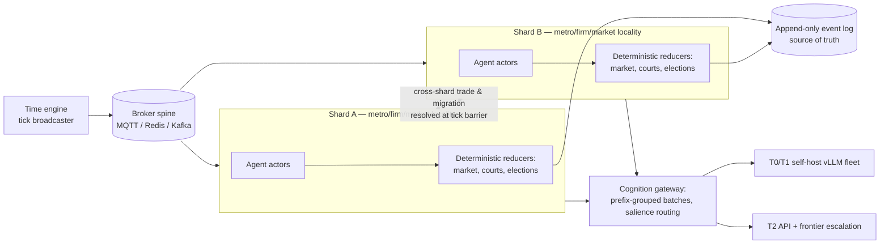

# 8. Scale, Cost & Reliability Engineering

POLIS's operating economics are governed by one cross-verified finding: **cost is a scheduling problem, not a model problem**. At 10,000 agents, full-fidelity cognition for every agent costs roughly $16,000–20,000 per sim-day on frontier APIs, while the same population under tiered cognition — salience routing, sparse activation, batch-windowed reflection, prefix caching — costs between ~$73 (light API-first workload) and ~$1,500 (high-fidelity workload) per sim-day, both research-derived planning estimates developed in §8.2. The two-orders-of-magnitude spread is produced entirely by *when* and *which* agents think, not by model choice. This chapter converts that finding into an operating plan: a four-regime capacity plan (§8.1), a parametric cost model treated as a re-baselinable function rather than a fixed budget line (§8.2), storage and analytics engineering (§8.3), a sharding and synchronization design (§8.4), and the runtime reliability policy that keeps ticks alive at swarm scale (§8.5). All dollar figures are mid-2026 planning values with stated assumptions — inputs to a model, not commitments — because the underlying price ground truth moves at 5–10× per year [^27^].

## 8.1 Capacity Plan

POLIS scales through four regimes, each with a distinct serving topology. The external anchors are public record-holders: OASIS ran 1M individually LLM-driven agents on 24–27 A100 GPUs at ~18 wall-hours per 3-minute timestep at full activation density (OASIS paper, arXiv:2411.11581v3, Table 2) [^6^][^7^]; AgentSociety sustains 10k agents at ~458.8 s per round with LLM inference as the sole bottleneck [^8^]; AgentTorch's Large Population Models ran 8.4M agents × 90 steps for $500 total by querying LLMs per archetype group rather than per individual. POLIS's plan assumes the tiered cognition architecture of Ch3/Ch4 (Hero ~1–2%, Named ~15%, Background ~85%) plus OASIS-style sparse temporal activation; relative to OASIS's full-density 1M run, tiering plus activation sampling is estimated at 10–30× cheaper per step.

**Table 8-1. Capacity plan by population regime (mid-2026 price baseline; batch-mode pacing).**

| Dimension | 1k agents (lab) | 10k agents (pilot city) | 100k agents (regional economy) | 1M agents (national campaign) |
|---|---|---|---|---|
| Serving & GPUs | 1×H100 (vLLM) or pure API | 3–6×H100 vLLM cluster + frontier API for top-1% | 20–40×H100; 3B ambient + 8B/70B + LoRA persona packs | 150–400×H100 (T0/T1) + archetype batch jobs; frontier API on escalation only |
| Blended inference $/sim-day | $50–150 | $500–1,500 | $5k–12k | $40k–110k |
| Naive all-frontier equivalent | ~$2k | ~$20k | ~$200k | ~$2M (infeasible) |
| Orchestration | single node, Ray + Redis | 64-vCPU head + MQTT/Redis, Ray cluster | Kafka; 3–5 locality shards | Kafka; 10–30 shards; k8s; spot+on-demand mix |
| Domain events/sim-day | ~0.5M rows | ~5M rows | ~50M rows | ~200–500M rows (sparse activation) |
| Storage/sim-day (raw → ClickHouse) | ~4 GB → ~0.8 GB | ~45 GB → ~6–9 GB | ~450 GB → ~60–90 GB | ~2–4.5 TB → ~0.3–0.9 TB |
| Wall time per sim-day (batch) | minutes | ~0.5–1 h | ~1–3 h | ~4–8 h |
| Nearest public proof point | Smallville × 40 [^c1^] | AgentSociety (10k, 458.8 s/round) [^8^] | GenSim / SocioVerse (100k+) | OASIS (1M, full density) [^6^][^7^] |

The GPU figures are derived from a conservative serving anchor of ~3,000 output tokens/s per H100 for an 8B-class model at batch ~32; a single third-party benchmark reports up to ~15,000 tokens/s for a 7B at high concurrency, and this 5× spread moves fleet size proportionally — POLIS must benchmark its actual prompt distribution at milestone M0 before committing fleet size. Cost sensitivity is linear in tokens/agent/day (±2×) and fleet utilization (±1.7×). The 1M column is a *campaign* configuration: batch-mode pacing of ~4–8 wall-hours per sim-day. Real-time (1× wall clock) operation at 1M agents would require roughly 10–30× more GPUs for the same fidelity and is explicitly out of scope for campaigns; it remains viable at 1k–10k for interactive demos. The break-even between self-hosting and APIs is a utilization question, not a price question: below ~30% fleet utilization third-party APIs win, while at ≥50% utilization a self-hosted 8B lands at $0.06–0.15 per 1M tokens, at or below the cheapest hosted equivalents. Milestones M0–M3 (Ch11) gate entry into each column, and the M1→M2 gate re-runs the API-vs-self-host break-even against then-current prices.

## 8.2 The Cost Model as a Function

**Design decision (resolves research Conflict C1).** POLIS hardcodes no prices. Provider price sources disagree by up to 6× on individual SKUs, and the price of fixed capability deflates 5–10× per year on the conservative benchmark-level estimate, with some methodologies measuring up to 40×/yr [^27^]. Cost is therefore specified as a parametric function, re-baselined quarterly:

$$C(t, N, m) = N \sum_{i \in \{T0,T1,T2\}} m_i \cdot \tau_i \cdot \bar{p}_i(t) \cdot (1 - \eta_{cache} - \eta_{batch}) + C_{fixed}(t)$$

where $m_i$ is the cognition-tier share, $\tau_i$ the tokens consumed per agent per sim-day in tier $i$, $\bar{p}_i(t)$ the utilization-adjusted blended price per token at calendar time $t$, $\eta_{cache}$ and $\eta_{batch}$ the realized discount factors from prefix caching and Batch APIs, and $C_{fixed}(t)$ the fleet floor (GPU-hours × $/GPU-hour, orchestration, storage). Frontier escalation enters as a multiplier on the T2 term: ~5% of T2 calls at frontier prices.

**Table 8-2. Cost-model parameters: definitions, mid-2026 planning values, and basis.**

| Parameter | Definition | Planning value | Basis & confidence |
|---|---|---|---|
| $m_{T0}, m_{T1}, m_{T2}$ | cognition-tier mix (ambient/routine/deliberative) | 0.85 / 0.14 / 0.01 | design decision (Hero–Named–Background split, Ch3) |
| $\tau_{T0}$ | ambient tokens/agent/day (sparse activation, short prompts) | 20k–100k | OASIS activity-vector activation [^6^]; Medium |
| $\tau_{T1}$ | routine tokens/agent/day (daily decisions + messages) | ~500k | AgentSociety-fidelity anchor [^8^]; Medium |
| $\tau_{T2}$ | deliberative tokens/agent/day (memory + chain-of-thought) | ~1M | 500 interactions/agent/day ≈ 1M tokens [^8^]; Medium |
| $\bar{p}_{T0}, \bar{p}_{T1}$ | blended self-host price, 8B-class, ≥50% utilization | $0.06–0.15 /Mtok | H100 at $3.15/GPU-h median on-demand, $1.64–1.72 spot (aimultiple GPU index, Jul 2026); Medium-High |
| $\bar{p}_{T2}$ | cheap-API blended price (DeepSeek-V3/mini-class, 50–70% cache hits) | ~$0.25 /Mtok | 2026 price sheet [^23^][^24^][^25^]; Medium |
| frontier escalation | share of T2 calls routed to frontier models (~$2/Mtok blended) | ~5% of T2 calls | design decision; caps the reasoning-token multiplier |
| $\eta_{cache}$ | input-side discount from prefix caching (cached reads at 10–50% of base input price) | 0.3–0.5 effective | [^14^][^15^]; High |
| $\eta_{batch}$ | discount on nightly jobs (reflection, plans, news digestion) via Batch APIs | 0.5 on batched share | [^16^][^17^]; High |
| deflation $\delta$ | annual price decay for fixed capability | 5–10×/yr planning band | [^27^]; High |
| utilization $u$ | fleet goodput ÷ nameplate throughput | ≥0.5 target; <0.3 → APIs win | derived from fleet anchors; Medium |

Four readings of the model matter for operations. First, $N$ and $\tau$ are the dominant linear terms, and the only structural levers that bend them are activation sampling and archetype pooling — the latter replaces $N$ queries with $K$ archetypes × $A$ actions × $M$ samples, which is how AgentTorch-class systems reach $0.0007 per agent-step. Second, the mix term is the managed surface: shifting one percentage point of population from T1 to T2 raises that share's per-agent cost ~4–5×, and drift of deliberative calls into frontier models raises it ~30× — so the salience scorer's thresholds (Ch4) *are* the budget. Third, a countervailing trend threatens complacency: while per-token prices fall, frontier per-task costs rise ~18–33×/yr because reasoning models burn 10–100× more tokens per task [^27^] — if the escalation share drifts upward, deflation gains are erased, which is why escalation rate is a tracked SLO rather than an emergent property. Fourth, the quarterly re-baseline procedure is mechanical: refresh the price sheet, re-fit $\bar{p}_i(t)$ and the utilization anchors, re-run the API-vs-self-host break-even, and never lock multi-year infrastructure at current prices. Published routing/cascade systems report 40–98% inference savings from cheap-first model routing (FrugalGPT, RouteLLM); POLIS treats those as upper bounds and measures its own escalation rates on live traffic [^20^].

*Figure 8-1 methodology:* illustrative parametric curves from the per-agent rates of Table 8-2 — naive all-frontier at $2.00/agent/day, tiered 85/14/1 at $0.11/agent/day, and tiered-plus-archetype (85% background archetype-pooled at ~$0.002/agent/day, 14% Named at ~$0.065, 1% Hero at ~$0.275) at ~$0.014/agent/day. Curves show marginal per-agent arithmetic only; fixed fleet and orchestration overheads (Table 8-1) lift realized costs above the lines at small $N$. The shaded band is the ±2× workload sensitivity on $\tau$. The apparent conflict between the ~$73/sim-day figure (light API-first workload, ~2,500 tokens/call) and the $0.5–1.5k figure (high-fidelity workload) at 10k agents is the same function evaluated at different $\tau$ — the cost SLO is therefore set per scenario, not globally. All values rest on a mid-2026 price baseline subject to 5–10×/yr deflation [^27^].

The Cognition Scheduler (Ch4) owns cost per sim-day as a managed service-level objective: the budget governor projects end-of-day spend from realized call mix and demotes tiers, tightens activation probabilities, or defers reflection jobs when the projection exceeds budget. This is the operational meaning of Insight 2 — the budget is enforced by scheduling decisions, not by procurement.

## 8.3 Storage & Analytics

The volume model is anchored at 10k agents at AgentSociety fidelity (500 interactions/agent/day [^8^]). Domain events (trades, posts, votes, moves; ~0.75 KB JSON each) produce ~4 GB/day; content bodies ~1 GB/day; daily state snapshots ~0.5 GB/day; and LLM call traces (prompt + completion text) ~40 GB/day — roughly **45 GB/day raw, ~16 TB per sim-year**, of which ClickHouse-class columnar compression (measured at ~5× on the 1B-document Bluesky JSONBench) reduces the hot analytical store to **~0.5–1 TB per sim-year**. The governing design rule: **the event stream is the system of record; LLM traces are not**. Traces run at ~10× event volume, so POLIS samples them (~10% full-fidelity capture), keeps aggregates for all calls (prompt hash, model version, tokens, cost — the decision journal of Ch4), and applies time-to-live eviction to raw prompt/completion text. At 1M agents under sparse activation, raw events reach ~50–100 TB per sim-year and ~5–15 TB compressed — still single-cluster territory.

The engine split follows measured performance rather than fashion: ClickHouse (or a Parquet/Iceberg columnar lake) as the hot, shared, multi-writer event store; DuckDB as the embedded per-analyst scratch layer over Parquet exports — in chDB's single-node TPC-H benchmark DuckDB ran ~4.4× faster than ClickHouse, but DuckDB cannot be the shared multi-writer store. The 1k-agent regime runs on DuckDB + Parquet alone; TimescaleDB continuous aggregates feed the macro-indicator dashboards (GDP, CPI, employment) as specified in Ch4 [^35^][^36^]. Retention is tiered: ~90 days hot in ClickHouse, warm history in the Parquet/Iceberg lake, cold archive in object storage. Because world state is a fold over the event log, every analytics table is a disposable projection — rebuildable from the log after any schema migration [^28^].

## 8.4 Sharding & Distribution

POLIS partitions its population the way MMOs partition theirs — zoning, overflow instancing, and interest management (the dominant commercial pattern per Cornell's MMO architecture survey; EVE Online runs one persistent shard across hundreds of nodes with time dilation under load) — with one domain-specific change: the partition key is *economic and social graph locality* (city, firm, market shards), not geography. The zone boundary is where market-clearing and trade-credit contagion events cross, so shard boundaries are drawn to minimize cross-shard event flow, and cross-shard interactions (inter-city trade, migration, supply-chain orders) are first-class events resolved at tick barriers.

Synchronization is **windowed/barrier-based**, the pattern every record-holder uses: OASIS advances in 3-minute steps [^6^][^7^], AgentSociety in rounds [^8^]. Within a tick, all due agents run concurrently on slightly stale state; strict causality within the tick is traded for embarrassingly parallel throughput. This is a deliberate point on the parallel discrete-event simulation spectrum: conservative synchronization stalls because LLM agents are lookahead-free (an agent's next action time depends on its inference result), while fully optimistic (Time Warp) rollback risks cascading anti-messages at 5M events/day. POLIS confines optimism to *inter-shard* windows, where rollback is a replay from the last snapshot plus the event suffix — cheap because the kernel is event-sourced [^28^][^29^]. The broker spine carries the load comfortably: MQTT/Redis suffices through the 10k regime (AgentSociety's measured 5M interactions/day [^8^]), graduating to Kafka at 100k+; the broker is never the bottleneck — inference is. Spot-instance preemption in the 10–30-shard regime is absorbed by checkpoint-every-N-ticks plus replay recovery, and Ray actor placement re-balances agents across surviving nodes [^45^].

## 8.5 Runtime Reliability at Scale

At 10k agents POLIS issues on the order of 5M LLM calls per sim-day [^8^]; even a 0.1% failure rate is 5,000 failures a day, so reliability is a policy, not a hope. Unconstrained JSON generation fails 10–30% of the time on schema-strict tasks; constrained decoding (XGrammar/Outlines on the self-hosted fleet, strict structured-output modes on APIs) drives the *syntactic* failure class to ~0% at zero marginal latency [^18^]. Residual *semantic* failures — valid JSON, wrong content — persist at single-digit percentages with no public benchmark at 100M-call scale; POLIS measures this rate in-situ at M0 as a standing metric. Every cognition call then traverses the pipeline specified in Ch4: Pydantic validation [^19^] → retry with validation-error feedback (1–2 retries recover most failures) → escalate to a stronger model → **autopilot** (last-action repeat or archetype policy) so no failed agent ever blocks a tick → quarantine for agents with repeated failures, with post-hoc memory/state repair. Every side-effecting action carries an idempotency key so retries cannot double-commit state [^47^], and multi-tick processes (lawsuits, funding rounds, elections) run as journaled durable workflows that resume from the exact failed step after a crash [^46^].

Two scale-specific traps get explicit budget lines. Tick latency is set by the slowest straggler (AgentSociety's 458.8 s/round is a straggler-bound measurement [^8^]), so each tick carries a deadline after which the autopilot fires — bounding p99 by construction. Long-run behavioral drift over 100+ ticks is countered by reserving ~5–10% of inference spend for periodic memory consolidation and reflection passes (a design heuristic; Project Sid required 4-hour reflection cycles to remain coherent over days-long runs). Standing reliability SLOs: tick-completion p99 within deadline, autopilot rate <1% of calls, quarantine rate <0.1% of agents/day, prefix-cache hit rate ≥60%, frontier-escalation rate <10% of T2, cost per sim-day inside the budgeted band. These mechanisms guarantee *runtime* reliability — the world keeps advancing, never double-commits, and stays auditable; whether the resulting behavior is *valid* against macro and micro stylized facts is the Validation Harness's domain (Ch9).
