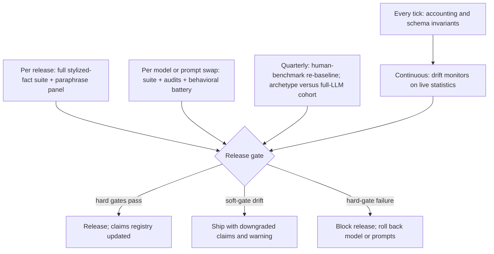

## 9. Validation & Evaluation Harness

POLIS is a persistent macroeconomy world simulator whose observable outputs — prices, business cycles, firm births and deaths, crashes, elections — are produced by large language model (LLM) agents acting inside a deterministic economic engine. This chapter specifies the Validation & Evaluation Harness (VEH): the subsystem that decides whether those outputs are believable, and the gating rules that decide what the product may claim. Chapter 8 owns runtime reliability — whether POLIS stays up, recovers, and reconciles state after failure; this chapter owns behavioral and economic validity — whether the running world matches how real economies and populations behave. The two are independent properties: a perfectly reliable engine can simulate a perfectly implausible economy, so uptime metrics are never accepted as evidence of realism.

### 9.1 Why Validation Is a Subsystem, Not a Phase

Three empirical findings about LLM societies rule out the conventional "validate once before launch" model.

First, simulation outcomes are fragile to implementation details that appear scientifically irrelevant. In robustness audits of LLM social simulations, minor perturbations of persona formatting and game-instruction framing shifted cooperation rates by up to 76 percentage points — and the perturbation that moved one frontier model by 76 points moved another by only 1 point.[^627^] Two consequences follow: any behavioral result POLIS produces is conditional on exact prompt text, sampling settings, and model version; and swapping the underlying model is a breaking change for validity even when the new model scores higher on general capability benchmarks. Because POLIS will rotate models as the vendor market moves, validation must re-execute automatically on every swap.

Second, the obvious calibration lever barely works. Persona variables account for less than 10% of the variance in human annotations on subjective tasks,[^10^] and LLM-simulated respondents exhibit social-desirability response bias relative to human populations.[^500^] Tuning persona prose until aggregate output "looks right" is therefore a low-leverage, overfitting-prone calibration strategy; POLIS calibrates against behavioral distributions, not persona text.

Third, passing aggregate tests is only weak evidence of a correct internal mechanism — the equifinality problem. Validation methodology for agent-based economic models shows that structurally unrelated generative mechanisms (rational expectations plus noise, zero-intelligence auctions, heterogeneous-agent switching, LLM agents) can all reproduce the same low-order aggregate statistics; the prescribed remedy is validation at finer grain — micro-level distributions and agent-level behavior — not macro aggregates alone.[^29^] A POLIS build could therefore pass its headline macro targets for the wrong reasons, for example because the accounting engine mechanically generates cycles while agent decisions are effectively noise. The test architecture in §9.2 is designed specifically to catch this.

The evaluation toolbox itself is also compromised. LLM-as-judge scoring is circular when the judged agents and the judge share a model family,[^151^] and most published LLM simulations report lower behavioral variance than the human populations they imitate, so means can look correct while heterogeneity collapses.[^488^] Nor can agent self-report substitute for measurement: on hard social-interaction benchmarks, frontier models complete goals at significantly lower rates than humans and struggle with social commonsense and strategic communication,[^673^] so the harness scores in-world task outcomes as measured behavior, never as self-assessed quality. The design response is that the VEH ships as an always-on subsystem — versioned test artifacts, a fixed execution cadence, release gates — and all external claims are scoped to collective patterns rather than individual trajectories, the level at which LLM social simulation is most reliable.[^487^]

### 9.2 The Stylized-Fact Test Suite

A *stylized fact* is a statistical regularity that holds robustly enough across datasets and periods to serve as a pass/fail target. The VEH organizes its targets into three tiers: Tier A (macro comovement), Tier B (micro distributions), and Tier C (market and electoral statistics). The tier structure is the operational equifinality guard: a build that passes Tier A but fails Tier B is rejected, because macro regularities must emerge from realistic micro structure rather than from accounting mechanics alone.[^29^] Calibration anchors come from the strongest published precedent: EconAgent, in which LLM agents embedded in a rigid economic engine reproduced the Phillips curve at Pearson correlation −0.619 and Okun's law at −0.918 with correct signs, with unemployment in a 2–12% range and inflation within ±5% after a settling period.[^200^][^77^]

| ID | Tier | Stylized fact (metric) | Target value / sign | Source |
|---|---|---|---|---|
| SF-01 | A | Phillips curve: corr(inflation, unemployment) | Negative sign; reference magnitude −0.619 | [^200^][^77^] |
| SF-02 | A | Okun's law: corr(output growth, unemployment change) | Negative sign; reference magnitude −0.918 | [^200^][^77^] |
| SF-03 | A | Unemployment rate across the cycle | Within 2–12% envelope | [^200^][^77^] |
| SF-04 | A | Inflation in steady state | Within ±5% band | [^77^] |
| SF-05 | A | Business-cycle comovement | Investment more volatile than GDP, consumption less; unemployment countercyclical; inflation procyclical and lagging | [^30^] |
| SF-06 | B | Firm-size distribution | Right-skewed power law; Zipf tail exponent ≈ 1 | [^2^] |
| SF-07 | B | Firm survival / exit hazard | Exit ≈ 20% in year 1, ≈ 50% by year 5 | [^27^] |
| SF-08 | B | Firm growth-rate distribution | Laplace (tent-shaped); mean growth independent of size (Gibrat's law) | [^8^] |
| SF-09 | B | Wealth distribution | Right-skewed; Gini coefficient within 0.3–0.5 band | [^22^] |
| SF-10 | C | Asset-return tail index | Power-law tail index in (2, 5) | [^28^] |
| SF-11 | C | Return dependence structure | Raw-return autocorrelation ≈ 0; positive volatility clustering; absolute-return autocorrelation decay exponent in [0.2, 0.4] | [^28^] |
| SF-12 | C | Electoral aggregates | Turnout within observed per-jurisdiction bounds; state-level accuracy ≥ 47/51 benchmark | [^23^][^19^] |

The table mixes two gate types deliberately. Sign gates (SF-01, SF-02, SF-05) are hard: a build in which inflation and unemployment correlate positively has failed regardless of magnitude, because the sign is the qualitative content of the regularity — rule-based baselines in the EconAgent study failed precisely this way.[^77^] Magnitude rows are band gates: the EconAgent correlations are calibration anchors, not pass marks, since a small LLM economy should not be expected to hit them exactly (design decision: correlation within ±0.2 of the reference passes; the band is reviewed quarterly as evidence accumulates). Tier B rows force mechanism realism against equifinality — a Zipf firm-size tail and Laplace growth distribution cannot be produced by an aggregate accounting trick, so passing them is evidence that firm-level entry, growth, and exit dynamics are doing real work.[^2^][^8^] SF-12 is a bounds test rather than a point target because LLM electorates are documented to overestimate turnout and to skew by country and language;[^23^] the engine computes turnout deterministically within observed jurisdiction bounds rather than letting personas vote on participation. Estimation protocol (design decision): every test runs over at least 20 seeded worlds of 10 simulated years with a 2-year burn-in discarded; the reported statistic is the median across seeds, and a test fails if the interquartile range straddles a tolerance boundary. Financial-tier rows (SF-10, SF-11) apply only to builds where the limit-order-book market is enabled; the Cont (2001) fact set is the accepted realism bar for any artificial market.[^28^]

### 9.3 Robustness & Fidelity Audits

The stylized-fact suite certifies *what* the world produces; three audit families certify that the results are *robust* and *human-faithful*.

**Paraphrase and perturbation audits (TRAILS-style).** For every canonical decision-prompt template, the VEH generates a perturbation panel — paraphrases, option-order permutations, and persona-serialization variants (design decision: 8 paraphrases per template) — and replays perturbed cohorts, measuring the effect on each gated statistic. The gate: no perturbation may push a gated statistic outside its tolerance band, and a per-decision prompt-sensitivity index is tracked as a trend metric across releases.[^66^][^65^] This audit is mandatory because the 76-point butterfly effect is an empirical finding, not a hypothetical, and because its model-dependence — 76 points on one frontier model, 1 point on another — means the panel must re-run in full on every model swap even when prompt text is unchanged.[^627^]

**Behavioral-fidelity spot checks.** Quarterly, a stratified agent sample (design decision: at least 300 agents per cohort) plays a battery of economic games and preference instruments — dictator, ultimatum, trust, prisoner's dilemma, public goods, risk and time preference items — and the VEH compares full response distributions, not just means, against human benchmark data. The comparison is calibrated to known offsets rather than naive equality: frontier models are statistically indistinguishable from a random human on average play against a 108,314-subject benchmark, but are reliably more cooperative (prisoner's-dilemma cooperation 91.7% versus 45.1% for humans) and less heterogeneous.[^54^][^55^] Laboratory market experiments further show that bounded memory of roughly three timesteps plus sampling variability reproduces human market trends better than long-context deliberation,[^57^] so the battery also verifies that POLIS's bounded-cognition configurations remain inside the human-plausible envelope. Signed offsets from human baselines are tracked as drift metrics; variance ratios against human data are first-class pass/fail statistics, because validating means alone misses heterogeneity collapse.[^488^]

**Tier-fidelity and jurisdiction checks.** Two cross-verification conflict zones (C5, C6) are converted into standing gates. For C6: the archetype-driven background population must reproduce the full stylized-fact suite against a full-LLM baseline cohort before it may carry production traffic, and the comparison re-runs on any archetype change, because archetype pooling is documented to risk losing individual heterogeneity.[^449^] For C5: the election module is validated per jurisdiction before any electoral output is published, with turnout computed by the deterministic engine within observed bounds and accuracy benchmarked against ElectionSim's 47-of-51 state-level result for 2020.[^23^][^19^]

Release gating distinguishes hard from soft failures (gate composition is a design decision, set to make the cheapest-to-fake evidence mandatory). Hard gates: engine accounting invariants; sign gates SF-01, SF-02, SF-05; Tier B distribution gates; and the paraphrase-spread gate. A hard failure blocks the release and triggers rollback of the model or prompt change. Soft gates cover magnitude drift within twice the tolerance band: the release may ship, but the claims registry — the versioned record of every externally published statistic, keyed to a passing suite run, model version, and prompt hash — is downgraded accordingly. All published claims are restricted to collective patterns; individual-trajectory predictions are never claimable output, per the reliability boundary of LLM social simulation.[^487^] Gate status, drift metrics, and audit history are operator-facing surfaces and are presented in the validation dashboards specified in Chapter 10.
