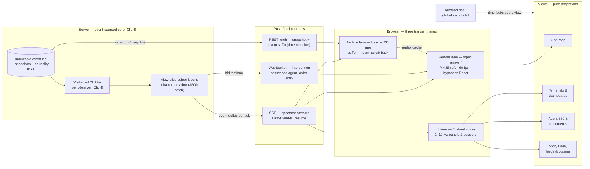

## 10. Interactive UI Specification

Chapters 4–9 specified a server-side machine whose primary asset is an append-only, causality-linked, visibility-scoped event log with periodic snapshots (Ch. 4, §4.2). This chapter specifies the machine's face. The governing constraint is NFR-2: the simulation service is headless and the front end is a *replaceable client* — no simulation state is ever born in the browser, and every pixel on screen is a disposable projection of the log. Two product inputs shape everything below. First, principle P3 from Chapter 2 — every number hyperlinks to its causal events — is elevated from an observability requirement into the organizing interaction metaphor. Second, the product directive of a dark, motion-rich interface is treated as an engineering requirement, not decoration: motion is budgeted, purposeful, and specified per view. The chapter proceeds from the creed that resolves the user experience (UX) problem (§10.1), to the inventory of views (§10.2), to the three signature interactions that differentiate POLIS (§10.3), to the front-end architecture that carries them (§10.4).

### 10.1 UI Creed: Attention Is the Scarce Resource

#### 10.1.1 Rendering 10k lives is solved; watching them is not

The rendering problem for a 10,000-agent world is closed. GPU instancing collapses 100,000 entities — one geometry, one shader, roughly 32 bytes of per-instance attributes (position, velocity, packed flags) — into a single draw call, against a practical browser budget of roughly 1,000–2,000 draw calls per second [^21^][^22^]. PixiJS renders thousands of sprites at 60 frames per second (fps) over WebGL, with `ParticleContainer` up to 10× faster for static sprite batches and per-sprite culling for off-screen entities [^26^][^25^]; Chapter 2 commits the product to exactly this in NFR-10 (60 fps at 10,000 sprites). Where densities grow further, GPU aggregation is the escalation path — measured ~1,144% faster than CPU aggregation at one million points [^23^].

The unsolved problem is on the other side of the screen. OASIS simulates up to one million agents — and scale demonstrably improves the product, with perceived helpfulness of agent responses rising 76.5% when the population grew from 196 to 10,196 — yet ships no live god-view at all; its visualization story is post-hoc matplotlib scripts and a Neo4j follow-network explorer with a timestamp slicer [^14^][^15^][^16^]. AgentSociety ships real-time monitoring and an interview/survey/intervention console, demonstrating that the UI of a living world is an *instrument panel*, not merely a diorama [^19^][^20^]. What made Smallville beloved was never its architecture — it was the feeling of watching living people, strong enough that Stanford's own evaluation protocol had crowdworkers watch the replay of a specific agent's life before role-playing it [^4^][^5^][^3^]. Nobody, in short, has solved *watching* ten thousand lives.

The POLIS creed inverts consumption to match that reality: the observer does not hunt the firehose; the firehose is curated for the observer. Three mechanisms, each a pure view over the event log, do the curating — an LLM Story Desk that compresses the event stream into followable narrative threads (§10.3.1), a Causal Inspector that makes every number a hyperlink into replayable moments (§10.3.2), and a Time Machine that time-locks every view to one global clock (§10.3.3). The counter-principle is Football Manager 26's documented failure: reviewers panned its streamlined redesign for "death by a thousand dropdowns," because the genre's joy is *living in the data* [^47^]. POLIS therefore streamlines the surface — one curated rail, one transport bar — while keeping one-click entity jumps, dense tooltip-rich dossiers, and deep-linking between every entity sacrosanct. Depth is never more than one click away; it is simply never dumped on the screen uninvited.

### 10.2 View Inventory

Each view is a lens over the same event log, addressable by entity, place, and timestamp; a uniform resource locator (URL) like `/worlds/:id/agents/4271?t=18144` is a first-class object, continuing Smallville's URL-addressable replay precedent (`/replay/<simulation-name>/<starting-time-step>`) but as a productized default rather than a debugging afterthought [^2^]. Every view implements one shared state machine — `empty → loading → live ⇄ paused ⇄ time-locked(t)` (plus `error`) — so that transport semantics, once learned, apply everywhere (design decision: the five states and their transitions are specified once, in §10.3.3, and referenced per view). Table 10-1 inventories the views in ship order.

**Table 10-1. View inventory: each view is a deep-linkable lens over the same event log.**

| View | Primary content (domain source) | Rendering tech | Signature interaction | Pattern precedent |
|---|---|---|---|---|
| God-Map | Districts, agents, flows; data layers over Ch. 6 metrics | PixiJS v8 instanced sprites + DOM text overlay | Semantic zoom: economic-weather glyphs → individual agent | Smallville emoji compression [^1^]; SimCity data layers [^51^] |
| Agent 360 | Persona, needs, memory, portfolio, relationships (Ch. 3) | React/DOM tabbed dossier | "Why?" causal history on every number | RimWorld inspect pane [^48^][^49^] |
| Markets Terminal | Limit-order book, tickers, depth, sector heat (Ch. 6) | Apache ECharts (Canvas) | Crosshair time-locked across all panes | Bloomberg-pane layout; ECharts LTTB sampling [^29^][^30^] |
| Company Dashboards | Profit & loss, org chart, cap table, lawsuits (Ch. 6) | React tiles expanding to cards | Tile → card drill-down; ranked company ledger | FM26 tiles/cards [^46^]; Victoria 3 ledger [^45^] |
| Elections HQ | Race cards, polling, district vote-intention heat (Ch. 7) | ECharts + map layer | Election-night projection mode | Victoria 3 lenses + outliner [^45^] |
| Courtroom | Docket, evidence artifacts, transcripts, verdicts (Ch. 7) | React/DOM document frames | Evidence links to subpoenaed events | Genre-matched chat/document anatomy [^52^] |
| News Feed & Broadsheet | In-world media + filterable god feed (Ch. 7 newsroom) | React/DOM | Validate-then-linkify every claim | Chirper hallucinated-mention lesson [^54^]; Butterflies provenance badges [^55^] |
| Cross-cutting chrome | Transport bar, outliner, inbox/portal, universal search | React/DOM | Global time-lock; auto-pinned situations | Victoria 3 outliner/message settings [^45^]; FM26 Portal [^46^] |

The inventory is deliberately a kit of parts, not eight bespoke applications: Elections HQ is composed from the same charts, feed, and map-layer components as the Markets Terminal, and Company Dashboards reuse the dossier's document frames — composability that keeps the surface buildable by the solo-builder team of Chapter 2 while each domain gets a purpose-shaped frame. Two structural commitments deserve emphasis. First, every row is read-only with respect to the world: interventions (an interview, a trade order, a whispered rumor) travel on the separate channels of §10.4, so the view layer can be rewritten — or replaced wholesale per NFR-2 — without touching simulation semantics. Second, the ordering encodes the phase plan: God-Map, Agent 360, and News Feed carry the Phase-1 demo ("prove the world is alive in five minutes"), while Elections HQ and the Courtroom arrive with the Ch. 7 institutions in Phase 2. God views are also observer-only surfaces: a possessed agent's UI is visibility-filtered by the same access-control lists (ACLs) that govern agent perception (Ch. 4), so "what you can see" is a simulation variable, not a rendering option.

#### 10.2.1 God-Map — the living world

The God-Map is the emotional centerpiece and the hardest engineering surface. Three technology decisions are fixed. First, **PixiJS v8 over Phaser**: both lineages are proven — Smallville built on Phaser, AI Town on PixiJS — but AI Town started on a Phaser 3 proof-of-concept and rewrote on PixiJS, a pure renderer that is easier to drive from an external sim clock and to embed in a React shell; Phaser's batteries (physics, arcade input) are wasted on a spectator sim [^8^]. Second, **2D over 3D in v1**: the genre's hook is the readable diorama — Smallville's Sims-like look drove its reception [^4^] — while React Three Fiber discipline (draw calls held to a few hundred, instancing, level-of-detail) buys immersion at an order of magnitude more engineering and worse text legibility [^27^]; 3D remains a later "wow mode" that the hackathon lineage shows bolts on as an optional view [^13^]. Third, **entities in WebGL, all text in the DOM**: sprites live in instanced buffers mutated directly per tick (the render lane of §10.4), while speech, tags, and inspectors are DOM — for accessibility, selection, and the linkification P3 demands [^52^].

Legibility at altitude is achieved by **semantic zoom** — four tiers driven by camera zoom plus viewport culling, where altitude changes *meaning*, not just resolution. Tier 1 renders agents as instanced dots colored by wealth or employment status, a 100k-capable configuration [^21^]; Tier 2 resolves sprites with Smallville's emoji-above-the-head compression, where an LLM translates each action into a glanceable glyph cluster and the full natural-language action is one click away [^1^]; Tier 3 adds culled, pooled name tags and speech bubbles; Tier 4 is street level with full animation and click-through to Agent 360. The Smallville compression is extended from agents to *systems* as **economic weather**: districts display live glyph clusters — 🏭🔥 for a factory boom, 🏦😰 for bank stress, 🗳📣 for a campaign rally — so the god-view reads as a living infographic at populations where names are noise, and clicking any glyph expands the underlying figures with links to the events driving them. SimCity-style data layers (wealth, prices, unemployment, sentiment, turnout) toggle as map modes over the same geometry, giving instant visual answers the moment a layer is clicked [^51^].

The five-state contract is exercised fully here: `empty` prompts scenario selection; `loading` shows snapshot fetch plus suffix-replay progress; `live` streams deltas at head; `paused` holds the frame while permitting pan/zoom; `time-locked` renders the nearest snapshot at $t$ with motion interpolated from surrounding events. Motion craft is specified, not improvised: **(1)** sprite movement is dead-reckoned between one-hertz sim ticks with exponential smoothing, so motion stays fluid at 60 fps without fabricating state — positions are interpolations of logged events, never inventions; **(2)** zoom-tier transitions use staggered fade-and-scale crossfades (dots dissolve into sprites over ~200 ms) to eliminate pop; **(3)** DOM speech bubbles are pooled, anchored to sprite positions, and auto-fade five seconds after a conversation ends, with click-to-pan camera — the Claudeville pattern that community forks converged on immediately [^6^]. Building tints ease toward live economic health rather than snapping, so the city appears to breathe with the economy.

#### 10.2.2 Agent 360 — the character dossier

One click from map, feed, or ledger opens the Agent 360: a RimWorld-style tabbed dossier, the pattern of *one click from map → dense 360° inspector where everything is data and tabs separate concerns* [^48^][^49^][^50^]. Six tabs map onto the Chapter 3 domain model: **Identity** (two-layer persona: structured ledger of demographics, Big Five, skills, plus narrative backstory), **State** (needs vector, mood, gauges), **Relationships** (trust/kinship/employment graph), **Assets** (portfolio, property, equity), **Memory/Diary** (an LLM-summarized life story with drill-down to the raw events beneath each summary), and **Actions** (interview, whisper, follow — the AgentSociety talk-to-any-agent console, productized [^19^]). Every number on every tab carries the "Why?" affordance of §10.3.2; the Diary tab is where the time machine feels most personal, since a life can be replayed forward from any entry. The state machine gains one domain nuance: for a dead agent the dossier's `live` state becomes a memorial framing — positions frozen at the death event, Diary complete — while remaining fully time-travelable. Genre-matching governs text frames throughout: theatrical dialogue renders as bubbles, while contracts, ledgers, and filings render as flat full-width columns, per mature AI-chat anatomy (65–80-character measure, streaming caret, per-message states) [^52^]. Motion details: the map sprite expands into the dossier portrait via a shared-element transition, preserving the user's sense of *who* was clicked; gauges animate with spring physics when new tick data arrives, making state changes perceptible without polling the user's eyes; tab switches crossfade at ~150 ms with no layout shift.

#### 10.2.3 Terminals, dashboards, and civic views

The remaining views apply the kit of parts to the Chapter 6/7 institutions. The **Markets Terminal** uses Apache ECharts on a Canvas backend — researched thresholds place SVG at roughly 5–10k nodes, Canvas at 100k+ points, WebGL at 1M+, and ECharts ships `sampling: 'lttb'` with progressive rendering for streaming series [^29^][^30^] — in a Bloomberg-pane layout (watchlist, chart, order-book depth, news pane) crosshair-locked to the global clock, so scrubbing re-renders every series strictly $\leq t$. Executed trades flash the depth ladder; charts append live in `live` state and sweep a rewind transition when time-locked. **Company Dashboards** follow the FM26 tiles-to-cards pattern — snapshot tiles (cash, headcount, morale, market share) expand into detail cards (P&L ledger, org chart, cap table, lawsuit list) [^46^] — plus a Victoria-3-style ranked ledger of all companies sortable by any metric [^45^]; the same inbox pattern (filters All/New/Tasks/Unread with an explicit action panel) serves decisions awaiting a player who has taken a role [^46^]. **Elections HQ** composes race cards, live polling charts, and a district vote-intention heat layer, with an election-night mode whose projections update as sim votes are counted — built entirely from the terminal's charts plus the map's layers, the proof of the kit-of-parts claim. The **Courtroom** renders the docket, case views with evidence artifacts (contracts, emails, transaction records — each deep-linked to the subpoenaed events behind it), argument transcripts in bubble mode, and verdicts that auto-generate news items. The **News Feed** has two layers: in-world media — a micro-feed plus a daily broadsheet auto-composed from the day's most salient events, every claim grounded in the log — and the god feed, a filterable firehose of all agent posts and emails. Provenance badges (agent, player, or system) are mandatory on everything — the Butterflies legibility rule for mixed human/AI worlds [^55^][^56^] — and every mention, ticker, or cashtag is linkified **only after validation against the world database**: on Chirper.ai, 99.83% of agent-generated mentions pointed at non-existent accounts, so the UI pipeline treats LLM text as untrusted markup — validate, then linkify; never linkify raw text [^54^].

### 10.3 The Three Signature Interactions

#### 10.3.1 Story Desk — "Follow the Story"

The Story Desk is the direct answer to the creed of §10.1: an LLM-curated narrative outliner over the event firehose, occupying the right rail Victoria 3 proved out — auto-pinned *situations* (laws passing, revolutions brewing) with user-pinnable entities and per-category message settings [^45^]. A deterministic salience pass over the event stream (the same scoring family as the cognition router, Ch. 4) nominates candidate arcs — a fledgling union drive, a chief executive's insider-trading spiral, an election upset brewing — and an LLM story-tracker promotes them into **story threads**. Each thread is a running brief plus its cast (deep links into Agent 360) plus its key events (time-machine links); one click jumps the camera to the action, and "Follow" subscribes the observer like a beat reporter. Two discipline rules keep the Desk honest. First, its prose is treated with the same suspicion as any LLM text: claims are validated against the log before linkification, per the Chirper lesson [^54^], so a thread can never reference an entity that does not exist. Second, the brief *regenerates* as salient events arrive, with updates diff-highlighted rather than silently rewritten, because the Desk is a reading of the log, not an author over it — narrative never invents state (principle P2). The mechanism is flagged explicitly as a design decision and a bet: live sense-making over 100k-agent streams is the documented gap — researchers tolerate offline matplotlib; a product cannot [^16^] — and no shipped system validates the pattern yet, so the risk register (Ch. 11) carries it. Motion craft: new threads slide into the rail with a single 400 ms salience pulse, then calm — attention is budgeted, not farmed; briefs stream token-by-token with the blinking caret that is the cheapest "alive" signal [^52^]; camera jumps are eased fly-tos with a short zoom-out → zoom-in arc so the observer keeps spatial orientation.

#### 10.3.2 Causal Inspector — every number is a hyperlink

The Causal Inspector makes principle P3 tactile. It borrows citation UX from AI-chat interfaces — inline superscripts expanding into source cards, the single most important trust mechanism for AI-generated claims [^53^] — and applies it to simulation state: any figure, statement, or news claim carries a "Why?" affordance that opens the exact chain of events that produced it. "Why is this firm's cash −$41,200?" unfolds as a card stack: this balance ← these payroll postings ← this lost contract ← this lawsuit ← this rumor ← this agent's email — a backward traversal of the `caused_by[]` edges on the event envelope (Ch. 4, §4.2.2), which is why the schema specified causal parents before any view. Each card in the stack is a rendered event with a "replay from here" control that sets the global transport bar to that moment (§10.3.3), converting an explanation into a *replayable moment* rather than a citation of one. LLM-generated text (articles, testimony, speeches) renders with its grounding events cited inline; an interviewed agent's answer can cite its own memories as replayable moments, giving the AgentSociety-style interview console evidentiary weight [^19^]. And because the inspector only ever renders validated references, the Chirper failure mode — 99.83% hallucinated mentions [^54^] — is structurally impossible: an unresolvable reference renders as plain text flagged *unverified*, never as a link. Motion detail: activating "Why?" emits a small ripple from the number that morphs into the inspector panel docked right — the spatial metaphor that causality *unfolds out of the figure* — and the panel can be torn off into a floating window for side-by-side comparison of two causal chains (e.g., two bankruptcies).

#### 10.3.3 Time Machine — one clock, every view

The Time Machine is a global transport bar, always visible, that time-locks every view to one sim-clock $t$: play/pause/step, 1–10× speed (the Claudeville community standard [^6^]), and a scrub handle on a zoomable timeline ribbon rendered as data visualization — an event-density sparkline with filterable markers (elections 🗳, crashes 📉, trials ⚖, births/deaths) where clicking a marker jumps. A "LIVE" indicator glows when pinned to head and snaps back on click. The semantics are uniform: scrubbing re-anchors the map (nearest snapshot + interpolated motion), terminals (series truncated at $t$), dossiers (state as of $t$), and feeds (items "as of" $t$) simultaneously. This is the Redux-DevTools model — state as a deterministic pure function of an action log, so reaching $t$ costs one snapshot load plus a short suffix replay [^35^][^36^] — resting directly on the Ch. 4 guarantees (immutable log, snapshots, exact-replay mode per NFR-5) and productizing what Smallville shipped as a URL replay "for debugging purposes": POLIS treats the time machine as a first-class citizen from day one [^2^]. Playback engineering is specified: the server buffers two to three ticks ahead (smart buffering, the Claudeville fix for smooth playback [^6^]); event batches stream with `Last-Event-ID` resume [^32^]; and the archive lane (§10.4) caches recent history in IndexedDB so scrub-back feels instant without re-fetching. Finally, because the log is immutable, any $t$ can **fork into a named child timeline** — the what-if primitive of Ch. 4 exposed as a spectator feature: timelines display as named branches in a switcher, and the transport bar carries the branch name, making "same world, different shock" a one-gesture operation for the Researcher persona.

### 10.4 Front-End Architecture

#### 10.4.1 The client contract: declare a slice, receive deltas

POLIS copies the sync contract that AI Town obtains from Convex without adopting Convex itself: **the client declares what slice of world-state it views; the server computes the difference and pushes minimal deltas** — a JSON patch per change set — over a persistent channel, so there is no polling, no hand-rolled cache invalidation, and one consistent snapshot across clients [^37^][^38^][^39^]. The contract sits naturally on the Ch. 4 kernel, whose journal-of-all-events backbone AI Town already operates in production [^8^][^9^][^10^]: the view-slice subscription is a filtered, visibility-ACL-scoped query over the event stream, and the delta is simply the batch of committed events that intersect the slice, projected into the shape the view declared. Figure 10-1 shows the resulting data flow; Tables 10-2 and 10-3 fix the layers and channels.

**Figure 10-1.** Front-end data flow: the event log feeds ACL-filtered view-slice subscriptions; deltas push over server-sent events (SSE) into three client lanes with disjoint update frequencies; every view renders from the lanes and is time-locked by one transport bar.

The three-lane split is the load-bearing client decision, because React's render cycle is the scarce resource inside the browser exactly as attention is outside it. The **render lane** writes sim entities into typed arrays and PixiJS sprite refs each tick, bypassing React entirely — the documented Zustand doctrine of transient, outside-the-render-cycle updates, since streaming data through React Context re-renders the tree on every update [^42^][^44^]; in a 10,000-updates-per-second benchmark, naive Context collapsed to 15 fps while Zustand with selector subscriptions held 59 fps [^43^]. The **UI lane** holds panel, dossier, and terminal state in Zustand stores refreshed at 1–10 Hz — humans cannot read faster, and charts sample anyway [^29^]. The **archive lane** appends received event batches to an IndexedDB ring buffer sized to the demo horizon (design decision: the last 24 sim-hours at Phase-1 scale), so Time Machine scrub-back is a local read. All text renders in the DOM with `aria-live="polite"` regions and debounced announcements during streaming [^53^].

**Table 10-2. Front-end layers and technology selection (feeds the Ch. 11 stack table).**

| Layer | Technology | Role | Rationale / precedent |
|---|---|---|---|
| Application shell | Next.js (React) | Routing, SSR deep links, window manager | Builder's stack (Ch. 2); NFR-2 replaceable client |
| Map renderer | PixiJS v8 (WebGL2/WebGPU) | God-Map instanced sprites, tiers T1–T4 | AI Town's Phaser→PixiJS rewrite [^8^]; ParticleContainer + culling [^25^][^26^] |
| Text & panels | React/DOM overlay | Bubbles, dossiers, documents, feeds | Accessibility, selection, linkification [^52^] |
| Charts | Apache ECharts (Canvas) | Markets, elections, timelines | Canvas 100k+ points; LTTB sampling, progressive rendering [^29^][^30^] |
| Client store | Zustand | UI-lane state, selector subscriptions | 59 fps at 10k updates/s vs 15 fps naive Context [^42^][^43^] |
| Render buffers | Typed arrays / PixiJS refs | Render-lane entity state | Transient updates outside React [^44^] |
| Local archive | IndexedDB ring buffer | Scrub-back cache for Time Machine | Archive-lane pattern [^42^] |
| Spectator transport | SSE (HTTP/2) | Event, chart, story, feed streams | Auto-reconnect + `Last-Event-ID`; Shopify-scale precedent [^32^][^33^] |
| Intervention transport | WebSocket + REST POST | Possessed agent, order entry, commands | Bidirectional only where needed [^32^] |
| Deferred: geo mode | deck.gl + MapLibre | Real-geography map variant | Interleaved mode, camera sync [^24^] |
| Deferred: 3D mode | React Three Fiber | Optional immersive view | Instancing/LOD discipline [^27^]; bolt-on precedent [^13^] |

Two dispositions carry the argument. ECharts is confined to surfaces where data exceeds a few thousand points or streams live; lightweight widgets elsewhere use simple DOM/SVG sparklines, because ECharts costs ~120 KB gzipped and its sampling machinery is wasted on a dossier gauge [^30^]. And the two deferred rows are commitments about what v1 *refuses*: deck.gl plus MapLibre enters only if a real-geography scenario mode is commissioned (its interleaved WebGL2 integration is the researched path [^24^]), and 3D enters only as an optional view, because diorama legibility — not immersion — is the proven emotional hook [^4^]. The through-line is that every bought component is a commodity renderer or store, while every component touching simulation semantics (the subscription declaration, the delta projector, the archive replay) is custom — the front-end mirror of Chapter 4's build-vs-buy creed.

**Table 10-3. Sync model: channels, transports, payloads, and resume semantics.**

| Channel | Direction | Transport | Payload | Cadence | Resume semantics |
|---|---|---|---|---|---|
| Event-delta stream | Server → client | SSE | Causally ordered event batches (ACL-filtered) | 1 per tick (≈1 Hz) | `Last-Event-ID` reconnect [^32^] |
| Entity-state deltas | Server → client | SSE | JSON patch per subscribed view slice | On change, ≤ tick rate | Re-issue slice + patch [^37^] |
| Chart/metrics stream | Server → client | SSE | Downsampled series points (LTTB) | 1–10 Hz | Gap = re-fetch window |
| Story Desk briefs | Server → client | SSE | LLM token stream + grounding refs | On salient events | Brief ID + regeneration |
| Intervention commands | Client → server | REST POST (WS upgrade) | Typed action intents, idempotency keys | User-paced | Ack + event echo on delta stream |
| Possessed-agent channel | Bidirectional | WebSocket | Perception deltas down; intents up | Perceived tick rate | Snapshot re-sync [^32^] |
| Time-machine fetch | Request/response | REST | Snapshot + event suffix for $t$ | On scrub/jump | Deterministic re-fetch [^35^] |
| Archive backfill | Server → client | REST (bulk) | Event batches for IndexedDB priming | On load/resume gap | Checkpoint cursor |

The model is deliberately asymmetric: spectator traffic — the 95% case — is one-way server-to-client, where SSE is the simpler, more robust default (plain HTTP, browser-managed auto-reconnect, HTTP/2 multiplexing, proxy-friendly), with production precedent at millions of concurrent connections on Shopify's Black Friday live map [^32^][^33^]. WebSocket is reserved for the one genuinely bidirectional surface — possessing an agent, where perception deltas flow down and intents flow up on a single channel — plus optional order entry on the Markets Terminal; paying for bidirectionality never used is the documented anti-pattern [^32^]. Interventions are otherwise plain REST POSTs carrying the same schema-validated action intents agents submit (Ch. 4), with idempotency keys; their effects return on the ordinary delta stream, so the client needs exactly one write path and one read path. Every channel lists its resume semantics because a persistent world outlives any connection: the spectator resumes from `Last-Event-ID`, the time-traveler re-fetches deterministically, and the archive lane heals gaps from its checkpoint cursor — disconnects degrade the demo gracefully rather than corrupting it.

Two closing disciplines bind the chapter to its creed. The aesthetic directive — dark, motion-rich — is implemented as a token system, not a vibe: a dark-first color scale with restrained saturation (charts and glyphs must read against near-black without halation), motion capped at 400 ms with easing everywhere, and a `prefers-reduced-motion` fallback that swaps every flight and crossfade for an instant cut — motion carries information (salience pulses, rewind sweeps, causal ripples) or it does not ship. And the budget is attention itself: the outliner's per-category message settings [^45^], the Story Desk's single-rail curation, and the rule that nothing auto-expands without a click ensure the observer of ten thousand lives is never asked to watch more than one story at a time — while remaining one click from any of the rest. Chapter 11 picks up from Table 10-2 to assemble the full stack and roadmap.
