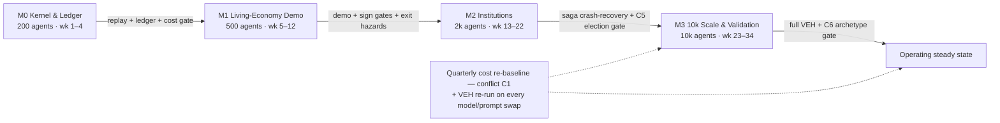

# 11. Tech Stack, Roadmap & Risks

This closing chapter converts the preceding ten into a build order. Section 11.1 consolidates every technology selection made in Chapters 4, 8, and 10 into a single stack table, pinning versions where they are load-bearing and placing abstraction seams where the economic ground moves. Section 11.2 sequences construction into four milestone gates, M0–M3, each with scope, exit criteria, an approximate solo-builder duration, and the Chapter-9 validation gates that apply. Section 11.3 closes with an honest risk register: the eight risks most likely to kill or cripple POLIS, each carrying an observable early signal and a mitigation that is already specified elsewhere in this document — the register manages mechanisms, not aspirations. Everything is calibrated to one builder who starts coding tomorrow.

## 11.1 Recommended Tech Stack

Two constraints from Chapter 2 govern every row of the stack table. NFR-1 caps the solo-operable development deployment at three core services, which forces Postgres-first polyglot persistence: the event store, metrics hypertables, vector memory, and graph queries all live inside one PostgreSQL process rather than in four dedicated systems. NFR-6 forbids hardcoded economics: every component whose price or performance ground truth moves at 5–10× per year (Dim05 [^27^]) — models, serving engines, GPU fleets — sits behind an abstraction seam so it can be swapped at a quarterly re-baseline without touching the kernel. The front-end rows pick up directly from Table 10-2.

**Table 11-1. POLIS recommended stack by layer. Version pins are design decisions unless a citation supplies the basis.**

| Layer | Selection (version) | Rationale and alternatives |
|---|---|---|
| Sim kernel | Custom event-sourced kernel, Python 3.12 + asyncio | Build-vs-reuse verdict (Ch5): no framework is a world runtime; borrow Concordia's entity/component + Game-Master pattern, Apache-2.0 (Dim02 [^27^]), and OASIS's activation sampling (Dim02 [^28^]) |
| Concurrency | Ray 2.x actors, actor-per-agent | Python-native stateful actors [^45^]; Orleans [^41^] and Akka sharding [^44^] are the proven .NET/JVM equivalents, rejected as off-stack; AgentSociety proves Ray + MQTT at 10k agents [^626^][^239^] |
| Broker spine | Redis Streams + MQTT in dev and at 10k | Carries AgentSociety's measured 5M interactions/day comfortably; the broker is never the bottleneck — inference is (Dim08, Claim D4). Kafka is the documented escalation beyond POLIS's 10k product ceiling, not a commitment |
| Event store | PostgreSQL 16: append-only `events` table, transactional outbox, projection workers | Production event-sourcing discipline: optimistic concurrency on stream versions, idempotent checkpointed projections (Dim05 [^28^]); Marten-style schema is the reference (Dim05 [^32^]); EventStoreDB only if Postgres saturates (Dim05 [^34^]) |
| Metrics store | TimescaleDB 2.x hypertables + continuous aggregates | Incrementally refreshed macro-indicator rollups, 90–95% columnar compression on cold chunks [^35^][^36^] |
| Vector memory | pgvector ≥0.5 (HNSW) → Qdrant past ~5M vectors | Matches dedicated engines at 1M-vector scale inside the same transaction boundary [^38^][^39^]; Qdrant's payload-indexed pre-filtering escapes the 60–70 GB RAM wall at 10M vectors [^40^] |
| Analytics | ClickHouse hot store + DuckDB scratch + Parquet lake | ClickHouse leads billion-row JSON analytics; DuckDB is ~4.4× faster single-node but cannot be the shared multi-writer store (Dim08, Claim E2). The 1k-agent regime runs DuckDB-only (Ch8 §8.3) |
| LLM serving | vLLM (benchmarked at v0.6.1) + XGrammar constrained decoding | vLLM is the default high-throughput engine; TGI entered maintenance mode (Dim08, Claims B1–B2). SGLang is the prefix-heavy alternative (RadixAttention; Dim08, Claim B3); EAGLE-3 speculative decoding for hero agents only — it *costs* throughput above batch ~32 (Dim08, Claim B5) |
| Model abstraction | LiteLLM-style proxy + Pydantic boundary validation | Provider swap by configuration with ≥2-provider conformance (NFR-4); Pydantic validation with error-feedback retries guards every LLM boundary [^19^]; routing/cascade savings of 40–98% treated as upper bounds, measured on live traffic [^20^] |
| Structured output | XGrammar on self-host; strict structured-output modes on APIs | Eliminates the 10–30% unconstrained-JSON parse-failure class at zero marginal latency [^18^] |
| Durable sagas | Journaled saga runner over the event store (Temporal durable-execution pattern) | Every step journaled before execution; crashed workers resume at the exact failed step [^46^]; idempotency keys on every side effect [^47^]. The Temporal engine itself is the designated upgrade path if saga complexity outgrows the runner |
| LLM observability | Decision journal (custom, over the log) + Langfuse-class tracing | Per-call journal: prompt hash, model version, seed, response, tokens, cost (Ch4); Concordia-style HTML episode logs for audit (Dim02 [^26^]) |
| Front end | Next.js shell; PixiJS v8 God-Map; Apache ECharts ≥5; Zustand lanes | PixiJS v8 instanced sprites (AI Town's Phaser→PixiJS rewrite; Dim09 [^8^][^25^]); ECharts Canvas with LTTB sampling for 100k+ points (Dim09 [^29^][^30^]); Zustand transient lanes hold 59 fps at 10k updates/s where naive Context collapses to 15 fps (Dim09 [^42^][^43^]); SSE spectator + WebSocket intervention (Ch10) |
| Local ops & CI | docker compose one-command spin-up; seeded golden-run replay tests | NFR-3: seeded 200-agent world in ≤10 minutes; reproducibility is operational practice — seed manifests, pinned dependencies, replay alerts (Dim05 [^29^]) |

Three structural properties matter more than any individual row. First, the development deployment is exactly three processes — Postgres, the broker, one LLM endpoint — and every other store is a Postgres extension or an embedded library, which is what makes the system solo-debuggable at 2 a.m. Second, every component with volatile economics sits behind a seam: models behind the abstraction proxy, engines behind the OpenAI-compatible serving API, stores behind disposable projections rebuildable from the event log. TGI's maintenance-mode demise (Dim08, Claim B1) is the cautionary tale for marrying an engine. Third, version pinning is deliberate only where APIs are load-bearing — PixiJS v8, pgvector ≥0.5 for HNSW — while everything else floats at current stable and is re-pinned at each quarterly re-baseline. The stack contains nothing exotic before M3; the riskiest component is the custom kernel itself, which is precisely why M0 exists.

## 11.2 Phased Roadmap

The roadmap is risk-ordered (Ch2 §2.5): M0–M1 deliver Phase 1, M2 delivers Phase 2, M3 delivers Phase 3. Durations are design decisions calibrated so that M0 + M1 equals the ≤12-week time-to-demo success metric (Ch2 Table 3); they assume one full-time builder and no parallelization. POLIS adopts the exit-criteria discipline of the research-derived scaling-gate method — measured cost, failure rates, and cache hit rates as gate conditions rather than calendar dates — but caps the product at 10,000 agents (Ch2 §2.5), so the 100k/1M scale gates remain research backlog, not commitments. Every exit criterion is executable: a CI job, a Validation & Evaluation Harness (VEH) run, or a timed drill.

**Table 11-2. Milestone roadmap M0–M3: scope, exit criteria, solo-builder duration, and applicable validation gates.**

| Milestone (duration, population) | Scope | Exit criteria (gate to pass) | Ch9 gates applied |
|---|---|---|---|
| **M0 — Kernel & Ledger** (weeks 1–4; 50→200 agents, Hero/Named only) | Event-sourced kernel: barriered ticks, event envelope with causality links and visibility ACLs, snapshots, exact replay; SFC ledger with per-tick conservation invariant; typed goods; macro aggregates as ledger queries; cognition gateway with constrained decoding and validate→retry→escalate→autopilot; decision journal; docker-compose spin-up; golden-run CI | NFR-3: clean-machine spin-up ≤10 min; NFR-5: exact replay reproduces the golden run event-for-event; zero conservation violations over a 30-sim-day soak; NFR-8: post-retry structured-output failure <0.5%; in-situ semantic-failure baseline measured and logged (Dim08 §4 open uncertainty); cost ≤$2/sim-day at 200 agents | Engine accounting invariants (hard gate). No behavioral gates — 200 agents is below stylized-fact statistical power |
| **M1 — Living-Economy Demo** (weeks 5–12; 200→500 agents) | Firms: founding, engine financials, liquidation; labor market; ABIDES-style limit-order book + index; needs engine + memory stream; conversations + relationship graph; newsroom pipeline + belief updates; UI v1: God-Map, Markets Terminal, News Feed, SSE spectator, Story Desk v1 (flagged bet, §11.3 R6) | Five-minute live demo passes the "world is alive" test by week 12 (Ch2 time-to-demo); NFR-10: 60 fps at 10,000 sprites; Phillips and Okun signs correct and firm exit hazards ≈20%/≈50% ±10 pp over ≥20 seeded 10-sim-year runs (Ch2 MVP metrics); 100% of Story Desk linkified references validated against the log (P2); cost ≤$5/sim-day at 500 agents (design decision extending the Ch2 MVP cost curve) | Sign gates SF-01, SF-02 hard; SF-05 monitors live; SF-07 exit hazards; drift monitors on |
| **M2 — Institutions** (weeks 13–22; 500→2,000 agents) | Lifecycle FSM + estates; banking and credit; restructuring + creditor contagion; litigation and court FSM; elections → versioned policy rule registry; email; professions; multi-outlet editorial slant; journaled sagas for all multi-tick processes; fork/branch and counterfactual replay | Crash-recovery drill: worker killed mid-trial and mid-election resumes at the exact journaled step with no double-filed side effect [^46^][^47^]; a full election cycle seats winners whose policy parameters measurably move the economy; turnout computed in-engine within per-jurisdiction bounds (C5); fork-from-snapshot yields divergent but invariant-preserving timelines; cost inside the governor band at 2k agents | SF-12 + per-jurisdiction election check (C5); Tier B gates activated (SF-06 Zipf, SF-08 Gibrat — statistical-power caveat at ~2k); TRAILS paraphrase panel wired into the release gate [^627^] |
| **M3 — 10k Scale & Validation Gate** (weeks 23–34; 10,000 agents, tiered Hero/Named/Background) | Background archetype class with promotion/demotion; activation sampling; Ray cluster + 2–3 locality shards; ClickHouse analytics tier; budget-governor SLOs (escalation <10% of T2, autopilot <1%, prefix-cache ≥60%); nightly Batch-API cognition; full VEH automation | 10k agents sustained with tick p99 inside the deadline (AgentSociety's 458.8 s/round at 10k is the public proof point [^626^]); cost ≤$150/sim-day at 10,000 agents against the current quarterly baseline (Ch2 Table 3); archetype cohort reproduces the full stylized-fact suite against a full-LLM baseline before carrying production traffic (C6) [^449^]; golden-run CI passes at 10k; one full quarterly re-baseline executed end-to-end | Full VEH gate: Tier A signs and bands; Tier B incl. firm-size tail exponent 1±0.2 (Ch2 Phase-3); Tier C market facts SF-10/SF-11 with the LOB enabled; robustness panel; behavioral battery |

The ordering logic deserves one explicit statement, because it inverts the naive demo-first instinct. Credibility machinery — ledger, replay, decision journal, cost governor — is front-loaded into M0/M1 because the research shows LLM societies die from unowned state and unmeasured cost long before they die from missing features (Ch2 §2.5). Scale comes last not because it is hardest but because it is the one variable that is cheap to raise and ruinous to raise early: every week of M0–M2 debugging at 10k agents would cost fifty times the same debugging at 200. Two inter-milestone checkpoints are inherited from the scaling research: between M1 and M2, re-run the API-vs-self-host break-even against then-current prices (Dim05 [^27^]); between M2 and M3, fix batch pacing as the default campaign mode, keeping real-time 1× operation as a demo-only configuration at ≤10k agents (Ch8 §8.1). Gate-failure semantics follow Chapter 9: a hard-gate failure blocks the milestone and triggers rollback of the implicated model or prompt change — no milestone is declared complete on the basis of elapsed time. Total elapsed plan: approximately 34 weeks, eight calendar months, one builder.

## 11.3 Risk Register

Method note: likelihood and impact are qualitative bands (High/Medium/Low), a deliberate design decision. No actuarial base rates exist for LLM societies, so false numeric precision would be less honest than bands; what makes each row actionable is instead the *early signal* — a metric or artifact that observably moves before the risk lands — and a mitigation already specified in Chapters 2–10. Eight risks are carried: five drawn from the research's conflict zones and counter-narratives, and three from POLIS's own design bets.

**Table 11-3. Risk register: likelihood, impact, early signal, and mitigation.**

| # | Risk | Likelihood | Impact | Early signal | Mitigation |
|---|---|---|---|---|---|
| R1 | Inference cost blowout | High | High | Governor's end-of-day projection trips budget; frontier-escalation share >10% of T2 calls; prefix-cache hit rate <60% | Parametric cost model with quarterly re-baseline (resolves conflict C1; Dim05 [^27^]); budget governor demotes tiers, tightens activation probabilities, defers reflection jobs; archetype pooling replaces N queries with K×A×M [^449^]; nightly cognition on Batch APIs at 50% off [^16^][^17^]; no multi-year infrastructure locks |
| R2 | Degenerate equilibria / economic death spirals | Medium | High | Drift monitors: unemployment outside the 2–12% envelope, inflation outside ±5%, GDP decline across 4+ consecutive sim-quarters, exchange no-trade streaks | The deterministic SFC engine makes spirals measurable tick-by-tick; Taylor-rule central bank and fiscal stabilizers as scenario-configurable dampers — the configuration under which Phillips/Okun regularities emerged in the reference implementation [^200^][^77^]; hard gates SF-01–SF-05 block invalid builds; time machine + counterfactual fork to diagnose from a pre-spiral snapshot |
| R3 | LLM fragility: prompt and format sensitivity | High (documented) | Medium–High | Prompt-sensitivity index trends up across releases; paraphrase-panel spread approaches a tolerance band; a model swap moves a gated statistic | TRAILS-style perturbation panel on every release and every model swap — the 76-point butterfly effect is empirical, and its model-dependence means re-runs even when prompts are unchanged [^627^]; decisions anchored in structured state, not persona prose (<10% persona variance, Dim06 [^10^]); claims-registry downgrade path (Ch9) |
| R4 | Bounded validity: elections and archetypes (C5/C6) | Certain (documented bounds) | Medium | Archetype cohort diverges from the full-LLM baseline on any stylized fact; turnout drifts outside per-jurisdiction bounds | Standing C6 gate: archetypes must reproduce the full suite before carrying traffic, re-run on any archetype change [^449^]; C5: per-jurisdiction election validation with engine-computed turnout (Dim07 [^23^][^19^]); all published claims scoped to collective patterns [^487^] |
| R5 | Heterogeneity collapse and long-run drift | High | High | Variance ratios versus human benchmarks trend below 1 across quarterly batteries; cross-seed behavioral diversity declines; agent coherence decays past ~100 ticks | Anti-collapse levers as engine configuration (principle P1): archetype diversity, perception heterogeneity, visibility ACLs; variance is a first-class pass/fail statistic, not a trend metric [^488^]; 5–10% of inference budget reserved for memory consolidation and reflection (Ch8 §8.5; Project Sid needed 4-hour reflection cycles to stay coherent, Dim02 [^370^]); quarantine and post-hoc memory repair |
| R6 | Story Desk fails to make the world watchable | Medium | Medium | High grounding-validation reject rate on desk prose; demo observers cannot reconstruct "what happened" without the desk | Carried from Ch10 as the flagged unproven bet: the Desk is a disposable view over the log; validate-then-linkify before any reference renders (the Chirper lesson — 99.83% of agent mentions pointed at non-existent accounts, Dim09 [^54^]); degrade to a deterministic salience outliner without LLM prose while the Causal Inspector and Time Machine continue to carry P3 |
| R7 | Vendor and model drift / deprecation | High | Medium | Provider sunset notices; per-provider conformance-suite divergence; price-sheet churn at re-baseline | NFR-4 model-abstraction layer with ≥2-provider conformance; the decision journal enables exact replay across swaps; VEH re-run on every swap — a swap is a breaking change for validity even when capability benchmarks improve [^627^]; quarterly re-baseline includes model re-selection (Dim05 [^27^]) |
| R8 | Scope creep / solo-builder overload | High | High | Milestone slip >2 weeks; FR count grows mid-phase; ungated features appear in CI; more than 3 core services in the dev deployment | The 26-FR MoSCoW contract and explicit out-of-scope list (Ch2 §2.5); milestone gates block scope entry by construction; NFR-1 service cap; the "integration, not invention" creed — borrow Apache-2.0/MIT patterns (Concordia, OASIS, AgentSociety) before building anything new (Ch5) |

Read the register as a system, not a list. R1, R3, R4, R5, and R7 share one root cause — LLM stochasticity and its moving economics — and one shared mitigation spine: the Validation Harness plus the decision journal. That concentration is why validation is specified as a subsystem rather than a phase (Insight 7): five of eight risks are detected by instrumentation that already exists for certification purposes. R2 and R6 are product risks with engineered fallbacks — the economy degrades onto dampers, the Desk degrades to a deterministic outliner — so neither failure is fatal to the artifact. R8 is the only risk fully within the builder's control and, historically, the one that kills one-person projects; the milestone gates exist as much to stop the builder as to test the system. Two risks are consciously accepted rather than eliminated: cost is managed, never solved, while prices deflate under the build (Dim05 [^27^]); and validity is bounded by construction — POLIS ships claims scoped to collective patterns [^487^] rather than waiting for an unbounded certainty the field does not possess.

## 11.4 The First Commit

The research phase ends where every honest research phase should: with a build order short enough to memorize. The first commit is the event envelope — causality links, provenance, visibility ACLs — because everything POLIS will ever show, prove, or sell is a view over that log (Insight 3). The second commit is the ledger; the third is the replay harness; and then the twelve-week demo clock starts. The precedent base says small teams with custom kernels own this space — OASIS, AgentSociety, Concordia, Project Sid adopted no framework and borrowed every pattern worth having. The economics move in the builder's favor while they code: fixed-capability inference deflates at 5–10× per year (Dim05 [^27^]), so every milestone reached buys more world per dollar than the last. And the intersection POLIS occupies — birth-to-death lives over a stock-flow-consistent ledger, with courts, elections, and a market, all replayable — remains empty not because it is impossible but because nobody has sequenced the build. That sequence now exists. Gate the kernel on replay, gate the economy on stylized facts, gate the population on archetype fidelity, and start the clock. Build the world.
